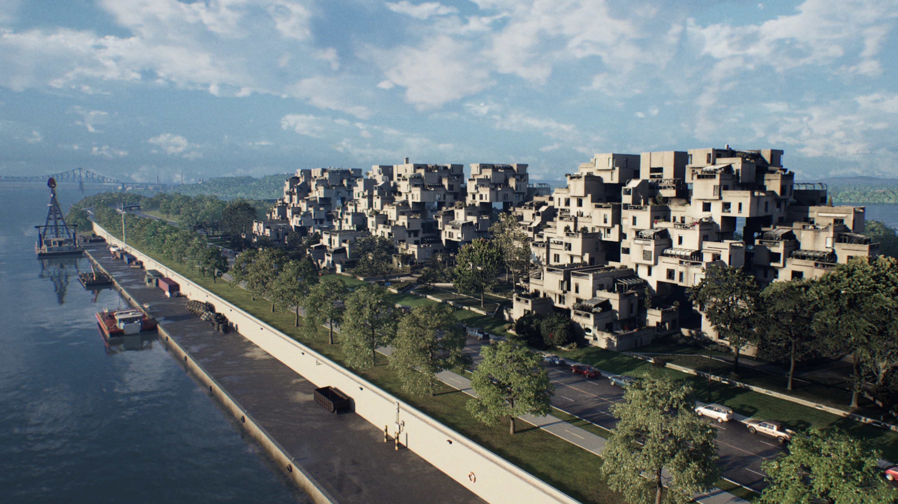
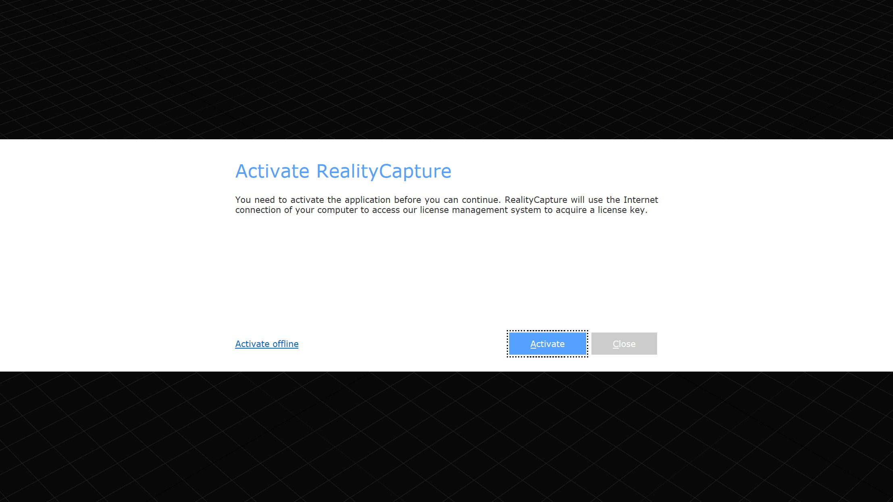
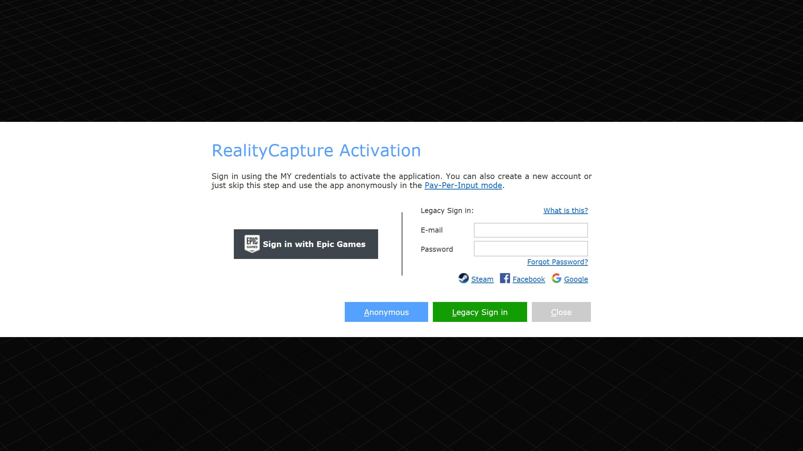
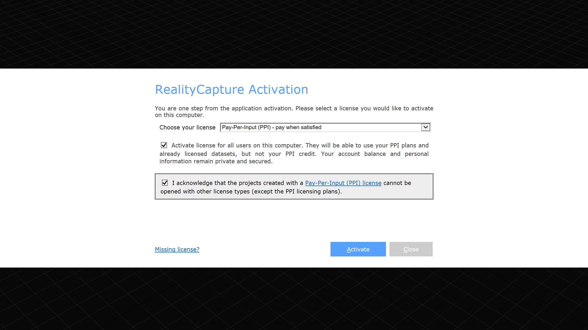
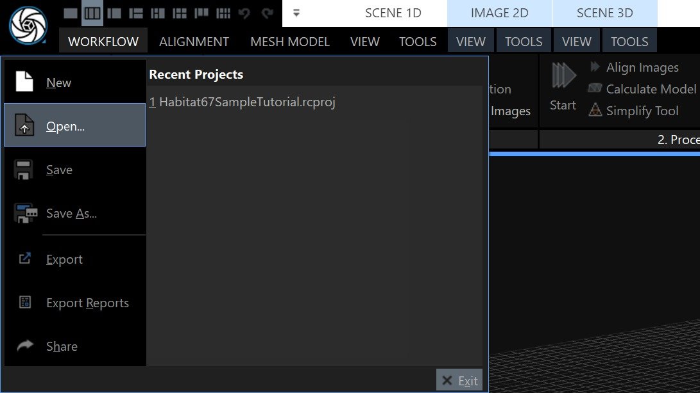
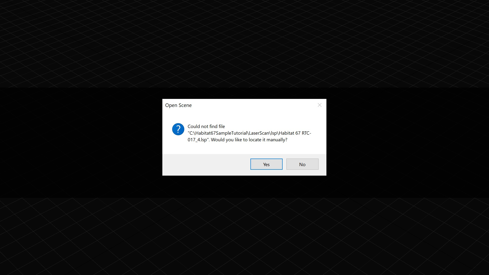
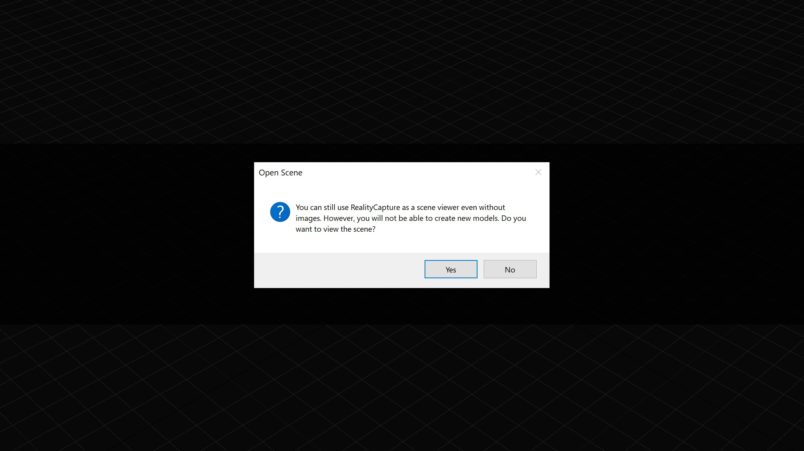
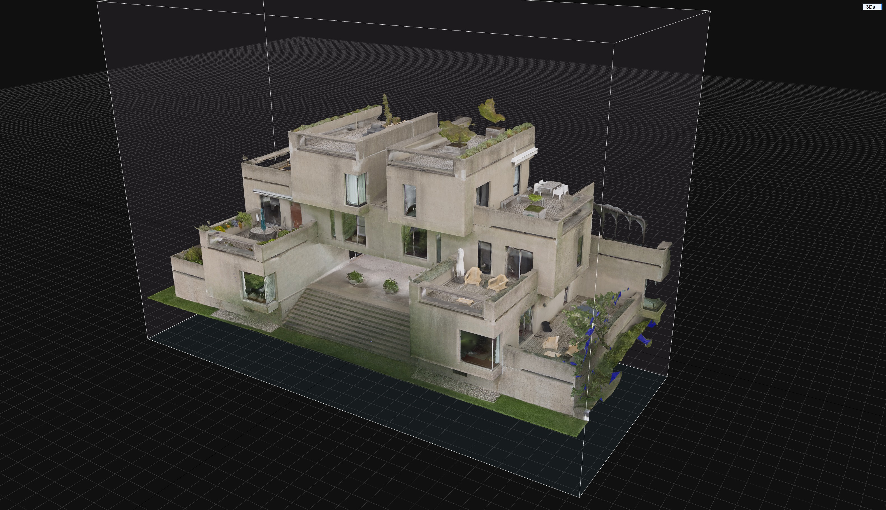
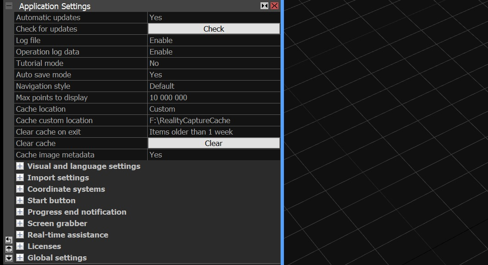

# 在 RealityCapture 中处理 Habitat 67 样本

## 来源与状态

- 原始 URL：https://dev.epicgames.com/community/learning/tutorials/yXdn/unreal-engine-realityscan-processing-of-the-habitat-67-sample-in-realitycapture

## 运行时分类

- 类型：图文教程
- 判断：API 未识别到核心视频信号，可整理正文约 20589 字符。

## 摘要

在本教程中，我们将逐步完成处理 Habitat 67 扫描的小样本的步骤，该扫描是 Hillside Unreal Engine 示例项目的一部分。使用地面激光扫描以及航空和地面摄影测量技术对栖息地 67 进行了扫描。 RealityCapture 支持处理所有这些不同的数据源。如果正确捕获数据，则激光扫描与摄影测量的对齐可以全自动进行，无需用户手动输入，这就是我们将在本教程中展示的内容。

## 中文整理

### 概览

要了解有关 Habitat 67 和 Hillside 示例项目的更多信息，请访问 Hillside 登录页面或在 Google Cloud Pixel Streaming Platform 上探索 Hillside。 - [Hillside 登陆页面](https://unrealengine.com/en-US/hillside) - [Google Cloud Pixel Streaming Platform 上的 Hillside](https://experience.hillside.gorillastreaming.com)

### 内容：

1. RealityCapture 和示例下载 2. 示例项目和数据描述 3. 示例项目和数据文件结构 4. RealityCapture 激活 5. 打开 Habitat67SampleTutorial.rcproj（可选） 6. 导入许可证（RealityCapture PPI 许可证可选） 7. RealityCapture 逐步处理 1. 设置专用资源缓存 2. 导入激光扫描 3. 导入图像 4. 对齐 5. 设置重建区域 6. 网格重建 7. 简化 8. 纹理 9. 进一步简化和纹理重投影 8. 导出

### RealityCapture 和示例下载

如果您是 RealityCapture 的新手，可以免费下载该软件： - [下载 RealityCapture](https://capturingreality.com/DownloadNow) 示例输入数据和 RealityCapture 项目可以从以下链接下载： - [Habitat67SampleTutorial.zip](https://capturingreality.com/download/files/Habitat67SampleTutorial) 由 R-E-A-L.iT 扫描， Leo Films、Drone Services Canada Inc. 由 Capturing Reality 团队制作数字化并由 Epic Games 提供仅供教育用途 - 此内容仅授权用于教育目的，包括用于自学和学术环境中的教育。

### 示例项目和数据说明

示例 zip 包含输入数据和完成的 RealtyCapture 项目。输入数据包含无人机从空中获取的 297 张 jpg 图像、使用无反光镜相机从地面获取的 161 张 jpg 图像以及 12 个 e57 地面彩色激光扫描。 RealityCapture 项目可通过企业 RealityCapture 许可证 (ENT) 和按输入付费许可证 (PPI) 开放。 ENT 用户将能够开箱即用地进行导出。 PPI 用户需要在导出之前导入 PPI 许可证。本教程将进一步描述该过程。这些图像最初以相机制造商原生的 RAW 格式捕获，然后使用图像处理软件将其开发为 jpg 图像。激光扫描是用地面激光扫描仪采集的，并在激光扫描处理软件中预先注册。除了 12 个原始 e57 激光扫描之外，我们还包含了已转换为原生 RealityCapture lsp 文件格式的激光扫描。在导入 e57 激光扫描的过程中，RealityCapture 立方体地图会映射到每个扫描站。对于完整的 360° 扫描 RealityCapture 将生成 6 个 lsp 文件。因此，对于 12 个扫描站，RealityCparture 生成了 72 个 lsp 文件。在本教程中，我们将描述如何自行生成 lsp 文件。

### 示例项目和数据文件结构

Habitat67SampleTutorial.zip 文件大小为 15.3 GB（解压后为 22.6 GB），包含所有输入、完成的 RealityCapture 项目以及用于使用 PPI 许可证导出的输入 PPI 许可证。 zip 文件的内容和文件结构： - 导出 - Habitat67SampleTutorial.fbx - 导出的 fbx 模型 - Habitat67SampleTutorial_u1_v1_diffuse.png - 8k 漫反射纹理 - Habitat67SampleTutorial_u1_v1_normal.png = 8k 法线贴图 - Habitat67SampleTutorial_pointcloud.las = las 格式的彩色点云 - Images - FromAir -使用无人机从空中获取的 297 x 45 兆像素 jpg 图像 - FromGround - 使用无反光镜相机从地面获取的 161 x 45 兆像素 jpg 图像 - LaserScans - e57 - 12 e57 地面激光扫描 - lsp - 72 转换后的 RealityCapture 激光扫描文件 - 许可证 - 输入 PPI 许可证 - 项目 - Habitat67SampleTutorial.rcproj 我们建议将文件解压到您的驱动器之一的根目录。

### 现实捕捉激活

启动 RealityCapture 并按照激活过程进行操作。

如果您尚未迁移到 Epic Games，请使用您的 Epic Games 帐户或旧登录选项之一登录。

如果您拥有 ENT 许可证，请选择它进行激活。否则，继续 PPI。请注意，使用 PPI 许可证创建的项目无法使用 ENT 许可证打开。提供的项目是使用 ENT 许可证创建和保存的。因此它也可以用PPI许可证打开，但是一旦用PPI重新保存，就不能用ENT打开。

激活后，您将看到欢迎屏幕。请随意继续分步教程来熟悉该软件的基础知识，或继续本教程。要关闭欢迎屏幕，请将屏幕左上角的布局切换为 1 + 1 或使用快捷键 Alt + 3。

### 打开 Habitat67SampleTutorial.rcproj（可选）

如果您不想自己处理数据，您可以检查已经完成的项目。单击左上角的 RealityCapture 图标，然后从菜单中选择“**打开**”。键盘快捷键是 Ctrl + O。

在资源管理器窗口中，导航到该项目，选择它，然后单击“**打开**”。如果您没有将 zip 解压缩到 C:\Habitat67SampleTutorial，您将收到以下通知。

您将有机会手动找到输入。如果您拒绝并选择**否**，您将可以选择使用 RealityCapture 作为查看器。如果您拒绝，RealityCapture 将关闭。

无论是否有输入，加载项目后，您都将看到计算出的 Habitat 67 小样本，但提供的项目仅包含简化版本，包含大约 1 000 000 个多边形、1 个 8k 漫反射纹理和 1 个 8k 法线纹理。

在 **SCENE 3D VIEW** 选项卡中，您可以在不同的渲染模式之间切换。 **顶点**模式将仅渲染网格的顶点。 **Solid** 模式将仅显示没有纹理的网格，而 **Sweet** 渲染模式将显示带有纹理的网格。

### 导入许可证（PPI 许可证可选）

如果您使用 ENT 许可证，则可以完全跳过此步骤并继续**导出**。对于PPI用户，为了最后导出结果，您需要导入提供的PPI许可证。所有来自空中、地面和 lsp 激光扫描的输入图像均已获得 Capturing Reality 团队的预先许可。要导入许可证，请单击**工作流程**选项卡中的**输入许可证**。使用资源管理器窗口在 **Licenses** 文件夹中找到 RealityCapture.rclicense 文件。进口后，您还可以凭PPI许可证进行出口。请注意，如果您以任何方式修改源输入，许可证将不起作用，并且系统将提示您使用自己的 PPI 积分自行许可输入。如果您想进行导出，请跳至本教程末尾处的**导出**。

### RealityCapture 逐步处理

如果您想从头开始自己处理项目，请按照以下步骤操作： 1. **设置专用资源缓存** 2. **导入激光扫描** 3. **导入图像** 4. **对齐** 5. **设置重建区域** 6. **网格重建** 7. **简化** 8. **纹理化** 9. **进一步简化和纹理化重投影**

### 设置专用资源缓存

我们建议将 RealityCapture 缓存设置为专用的快速 NVMe 固态驱动器。在处理的每个步骤中，RealityCapture 都会将文件保存到缓存中。对于 Habitat 67 数据集，我们使用了 4TB 容量的专用 SSD。可以在**应用程序设置**中更改缓存路径，**可从**工作流程**选项卡访问。设置将显示在屏幕左侧的面板中。如果您的计算机中没有额外的驱动器，请将缓存位置设置为**系统温度**。要更改**缓存位置，**首先将其从**系统温度**更改为**自定义**，然后输入缓存位置的新路径。在我们的例子中，它是： **“F:\RealityCaptureCache” **输入自定义路径后，您将需要重新启动 RealityCapture。

