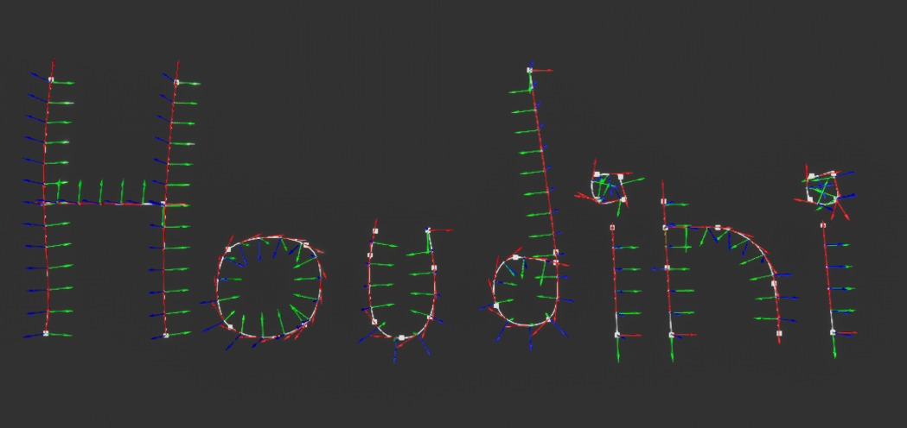

# 样条曲线示例
```
Begin Object Class=/Script/UnrealEd.MaterialGraphNode_Root Name="MaterialGraphNode_Root_0" ExportPath="/Script/UnrealEd.MaterialGraphNode_Root'/Engine/Transient.M_SplineRoad:MaterialGraph_0.MaterialGraphNode_Root_0'"
   Material="/Script/UnrealEd.PreviewMaterial'/Engine/Transient.M_SplineRoad'"
   NodeGuid=D0EB7BC14FA1E8FE6FCAD0A74C6F5B7F
   CustomProperties Pin (PinId=1E7749764684EC0F4B075EB29CFDC947,PinName="Base Color",PinType.PinCategory="materialinput",PinType.PinSubCategory="rgba",PinType.PinSubCategoryObject=None,PinType.PinSubCategoryMemberReference=(),PinType.PinValueType=(),PinType.ContainerType=None,PinType.bIsReference=False,PinType.bIsConst=False,PinType.bIsWeakPointer=False,PinType.bIsUObjectWrapper=False,PinType.bSerializeAsSinglePrecisionFloat=False,DefaultValue="(R=0.501961,G=0.501961,B=0.501961,A=1.000000)",LinkedTo=(MaterialGraphNode_0 B4B65529490470CC0135D49A5C9CBD5A,),PersistentGuid=00000000000000000000000000000000,bHidden=False,bNotConnectable=False,bDefaultValueIsReadOnly=False,bDefaultValueIsIgnored=False,bAdvancedView=False,bOrphanedPin=False,)
   CustomProperties Pin (PinId=47B2E8C94465B329673255B21D688221,PinName="Metallic",PinType.PinCategory="materialinput",PinType.PinSubCategory="red",PinType.PinSubCategoryObject=None,PinType.PinSubCategoryMemberReference=(),PinType.PinValueType=(),PinType.ContainerType=None,PinType.bIsReference=False,PinType.bIsConst=False,PinType.bIsWeakPointer=False,PinType.bIsUObjectWrapper=False,PinType.bSerializeAsSinglePrecisionFloat=False,DefaultValue="0.0",PersistentGuid=00000000000000000000000000000000,bHidden=False,bNotConnectable=False,bDefaultValueIsReadOnly=False,bDefaultValueIsIgnored=False,bAdvancedView=False,bOrphanedPin=False,)
   CustomProperties Pin (PinId=00A6D2D9462DD77BE6407FB3FE0913A9,PinName="Specular",PinType.PinCategory="materialinput",PinType.PinSubCategory="red",PinType.PinSubCategoryObject=None,PinType.PinSubCategoryMemberReference=(),PinType.PinValueType=(),PinType.ContainerType=None,PinType.bIsReference=False,PinType.bIsConst=False,PinType.bIsWeakPointer=False,PinType.bIsUObjectWrapper=False,PinType.bSerializeAsSinglePrecisionFloat=False,DefaultValue="0.5",PersistentGuid=00000000000000000000000000000000,bHidden=False,bNotConnectable=False,bDefaultValueIsReadOnly=False,bDefaultValueIsIgnored=False,bAdvancedView=False,bOrphanedPin=False,)
   CustomProperties Pin (PinId=0326EB4E4335464CC52B98A580225111,PinName="Roughness",PinType.PinCategory="materialinput",PinType.PinSubCategory="red",PinType.PinSubCategoryObject=None,PinType.PinSubCategoryMemberReference=(),PinType.PinValueType=(),PinType.ContainerType=None,PinType.bIsReference=False,PinType.bIsConst=False,PinType.bIsWeakPointer=False,PinType.bIsUObjectWrapper=False,PinType.bSerializeAsSinglePrecisionFloat=False,DefaultValue="0.5",PersistentGuid=00000000000000000000000000000000,bHidden=False,bNotConnectable=False,bDefaultValueIsReadOnly=False,bDefaultValueIsIgnored=False,bAdvancedView=False,bOrphanedPin=False,)
   CustomProperties Pin (PinId=964C16AC4EA33E66729A03B768714077,PinName="Anisotropy",PinType.PinCategory="materialinput",PinType.PinSubCategory="red",PinType.PinSubCategoryObject=None,PinType.PinSubCategoryMemberReference=(),PinType.PinValueType=(),PinType.ContainerType=None,PinType.bIsReference=False,PinType.bIsConst=False,PinType.bIsWeakPointer=False,PinType.bIsUObjectWrapper=False,PinType.bSerializeAsSinglePrecisionFloat=False,DefaultValue="0.0",PersistentGuid=00000000000000000000000000000000,bHidden=False,bNotConnectable=False,bDefaultValueIsReadOnly=False,bDefaultValueIsIgnored=False,bAdvancedView=False,bOrphanedPin=False,)
   CustomProperties Pin (PinId=407D7BCA4AFD5AAC88049C83FA7B0283,PinName="Emissive Color",PinType.PinCategory="materialinput",PinType.PinSubCategory="rgba",PinType.PinSubCategoryObject=None,PinType.PinSubCategoryMemberReference=(),PinType.PinValueType=(),PinType.ContainerType=None,PinType.bIsReference=False,PinType.bIsConst=False,PinType.bIsWeakPointer=False,PinType.bIsUObjectWrapper=False,PinType.bSerializeAsSinglePrecisionFloat=False,DefaultValue="(R=0.000000,G=0.000000,B=0.000000,A=0.000000)",PersistentGuid=00000000000000000000000000000000,bHidden=False,bNotConnectable=False,bDefaultValueIsReadOnly=False,bDefaultValueIsIgnored=False,bAdvancedView=False,bOrphanedPin=False,)
   CustomProperties Pin (PinId=374D00BF48BCF66D80CD0A8F443AE6D0,PinName="Opacity",PinType.PinCategory="materialinput",PinType.PinSubCategory="red",PinType.PinSubCategoryObject=None,PinType.PinSubCategoryMemberReference=(),PinType.PinValueType=(),PinType.ContainerType=None,PinType.bIsReference=False,PinType.bIsConst=False,PinType.bIsWeakPointer=False,PinType.bIsUObjectW
```

***2.蓝图样条网格实例*** 复制并粘贴到蓝图 Actor 的构造脚本中。确保至少添加一个 **Spline ** 组件和一个 **InstancedStaticMesh ** 组件。要公开的参数：（网格、偏移、比例）您可以从细节面板更改网格。



**样条网格实例**
