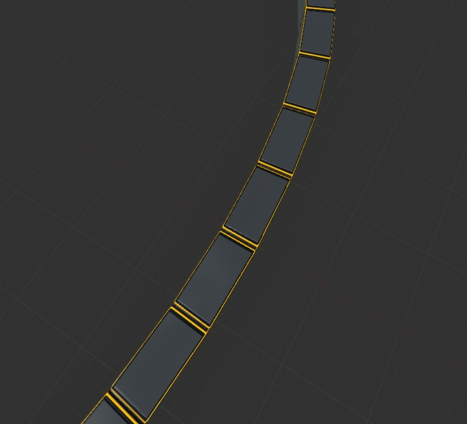

# 样条曲线示例
```
Begin Object Class=/Script/BlueprintGraph.K2Node_FunctionEntry Name="K2Node_FunctionEntry_0" ExportPath="/Script/BlueprintGraph.K2Node_FunctionEntry'/Game/PyTest/BP_SplineInstances.BP_SplineInstances:UserConstructionScript.K2Node_FunctionEntry_0'"
   LocalVariables(0)=(VarName="NbOfInstances",VarGuid=4BD9709F4B89B54BDFEA68A3B0C5FCF6,VarType=(PinCategory="int"),FriendlyName="Nb Of Instances",Category=NSLOCTEXT("KismetSchema", "Default", "Default"),PropertyFlags=5,DefaultValue="0")
   LocalVariables(1)=(VarName="currentSpline",VarGuid=0109FFD14F1BE8B98EAB7A9C32451577,VarType=(PinCategory="object",PinSubCategoryObject="/Script/CoreUObject.Class'/Script/Engine.SplineComponent'"),FriendlyName="Current Spline",Category=NSLOCTEXT("KismetSchema", "Default", "Default"),PropertyFlags=5)
   FunctionReference=(MemberParent="/Script/CoreUObject.Class'/Script/Engine.Actor'",MemberName="UserConstructionScript")
   NodePosX=-704
   NodePosY=16
   NodeGuid=BE9FE6E64ED5C3F45D599F9587AE5118
   CustomProperties Pin (PinId=114C7CFC4DC479E0A34361AA2716193E,PinName="then",Direction="EGPD_Output",PinType.PinCategory="exec",PinType.PinSubCategory="",PinType.PinSubCategoryObject=None,PinType.PinSubCategoryMemberReference=(),PinType.PinValueType=(),PinType.ContainerType=None,PinType.bIsReference=False,PinType.bIsConst=False,PinType.bIsWeakPointer=False,PinType.bIsUObjectWrapper=False,PinType.bSerializeAsSinglePrecisionFloat=False,LinkedTo=(K2Node_MacroInstance_1 37919C364B493AD19012E485E5BF8289,),PersistentGuid=00000000000000000000000000000000,bHidden=False,bNotConnectable=False,bDefaultValueIsReadOnly=False,bDefaultValueIsIgnored=False,bAdvancedView=False,bOrphanedPin=False,)
End Object
Begin Object Class=/Script/BlueprintGraph.K2Node_VariableGet Name="K2Node_VariableGet_0" ExportPath="/Script/BlueprintGraph.K2Node_VariableGet'/Game/PyTest/BP_SplineInstances.BP_SplineInstances:UserConstructionScript.K2Node_VariableGet_0'"
```

3. ***样条线网格组件蓝图Actor*** 这与几何脚本样条线网格类似，但不使用几何脚本插件（这性能较差，如果可以的话，我建议您使用几何脚本）。复制并粘贴到蓝图 Actor 构造脚本中。至少添加一个样条组件。然后选择“添加样条线网格组件”蓝图节点并将所需的网格分配给它。



**样条线网格组件蓝图 Actor**

```
Begin Object Class=/Script/BlueprintGraph.K2Node_FunctionEntry Name="K2Node_FunctionEntry_0" ExportPath="/Script/BlueprintGraph.K2Node_FunctionEntry'/Game/PyTest/BP_SplineMesh.BP_SplineMesh:UserConstructionScript.K2Node_FunctionEntry_0'"
   LocalVariables(0)=(VarName="NbOfInstances",VarGuid=4BD9709F4B89B54BDFEA68A3B0C5FCF6,VarType=(PinCategory="int"),FriendlyName="Nb Of Instances",Category=NSLOCTEXT("KismetSchema", "Default", "Default"),PropertyFlags=5,DefaultValue="0")
   LocalVariables(1)=(VarName="currentSpline",VarGuid=0109FFD14F1BE8B98EAB7A9C32451577,VarType=(PinCategory="object",PinSubCategoryObject="/Script/CoreUObject.Class'/Script/Engine.SplineComponent'"),FriendlyName="Current Spline",Category=NSLOCTEXT("KismetSchema", "Default", "Default"),PropertyFlags=5)
   FunctionReference=(MemberParent="/Script/CoreUObject.Class'/Script/Engine.Actor'",MemberName="UserConstructionScript")
   NodePosX=-1472
   NodePosY=16
   NodeGuid=B32C655B4E1A7353558E2FB904FA4307
   CustomProperties Pin (PinId=114C7CFC4DC479E0A34361AA2716193E,PinName="then",Direction="EGPD_Output",PinType.PinCategory="exec",PinType.PinSubCategory="",PinType.PinSubCategoryObject=None,PinType.PinSubCategoryMemberReference=(),PinType.PinValueType=(),PinType.ContainerType=None,PinType.bIsReference=False,PinType.bIsConst=False,PinType.bIsWeakPointer=False,PinType.bIsUObjectWrapper=False,PinType.bSerializeAsSinglePrecisionFloat=False,LinkedTo=(K2Node_VariableSet_0 94D1892B4F2F6FA198B93691745B90C7,),PersistentGuid=00000000000000000000000000000000,bHidden=False,bNotConnectable=False,bDefaultValueIsReadOnly=False,bDefaultValueIsIgnored=False,bAdvancedView=False,bOrphanedPin=False,)
End Object
Begin Object Class=/Script/BlueprintGraph.K2Node_CallFunction Name="K2Node_CallFunction_10" ExportPath="/Script/BlueprintGraph.K2Node_CallFunction'/Game/PyTest/BP_SplineMesh.BP_SplineMesh:UserConstructionScript.K2Node_CallFunction_10'"
```

4. Niagara Spline 添加至少一个样条组件。无法从此处复制和粘贴 Niagara 系统。我在下面的链接中提供了 Uassets。


**尼亚加拉蓝图样条线**
