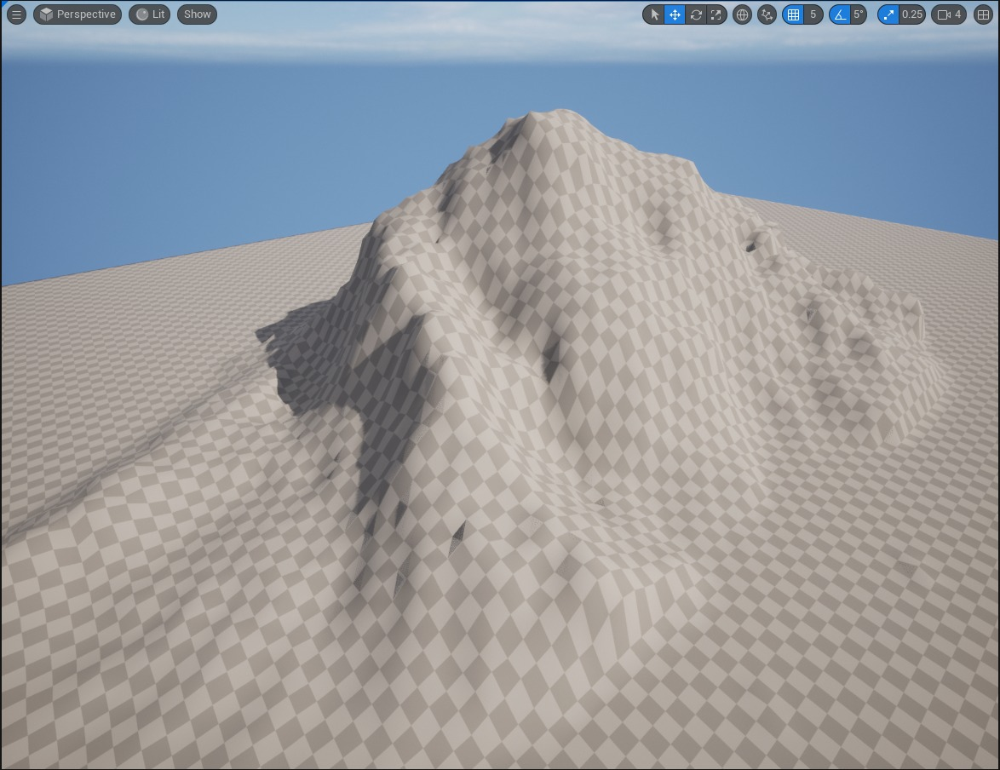
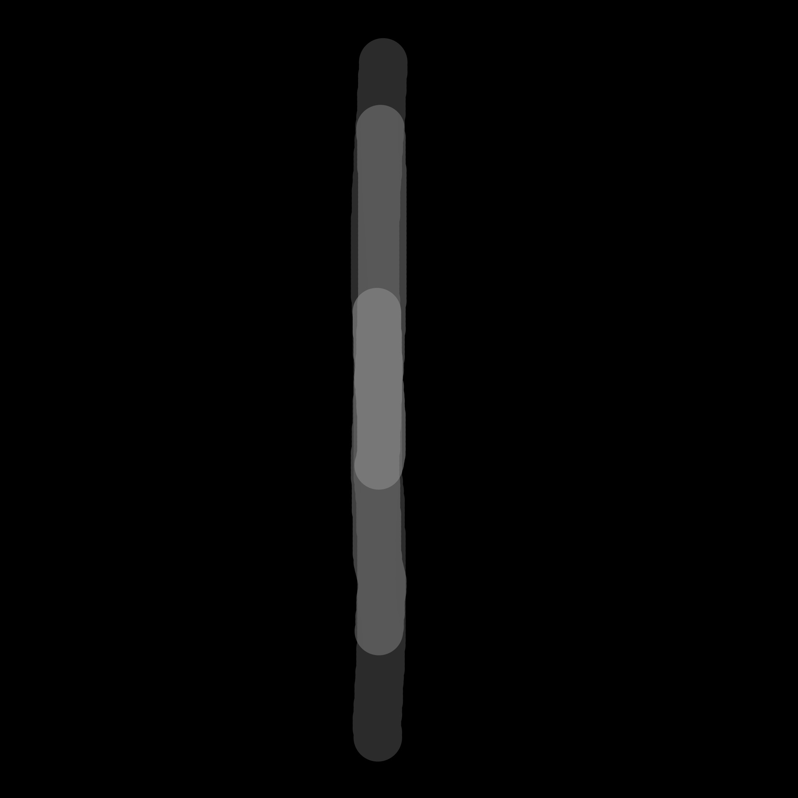
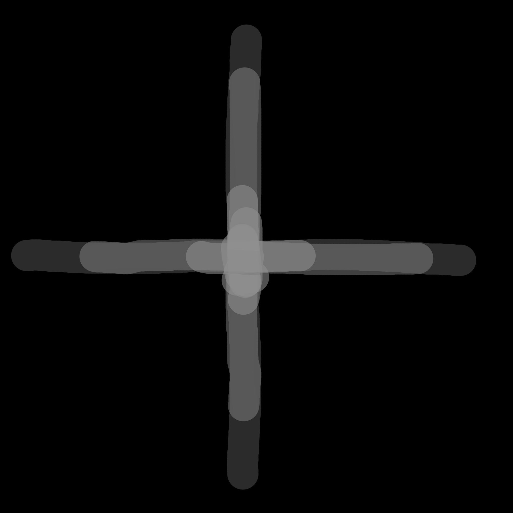
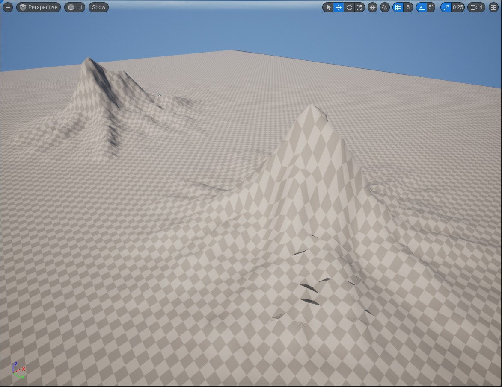
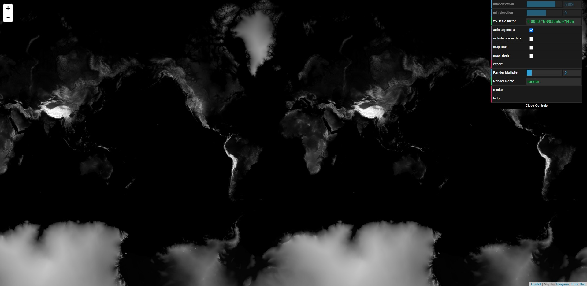
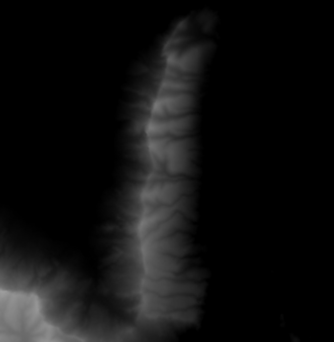
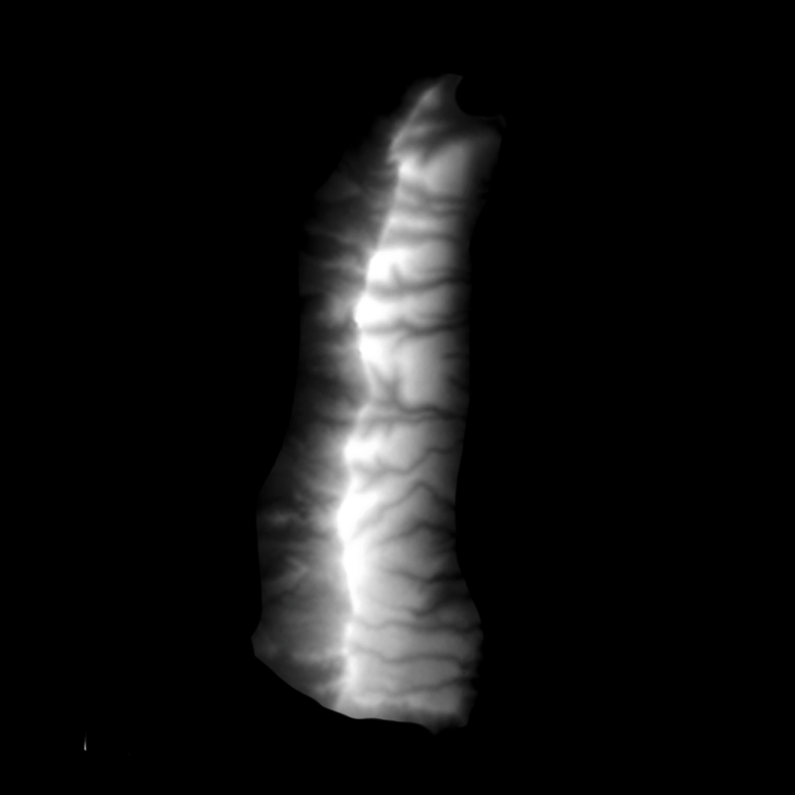
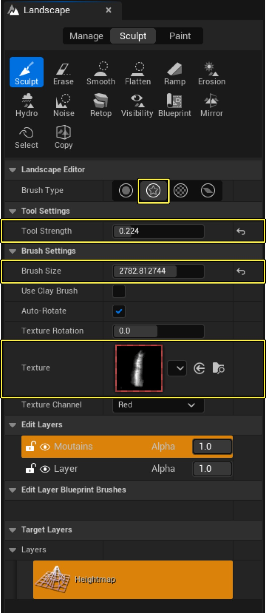
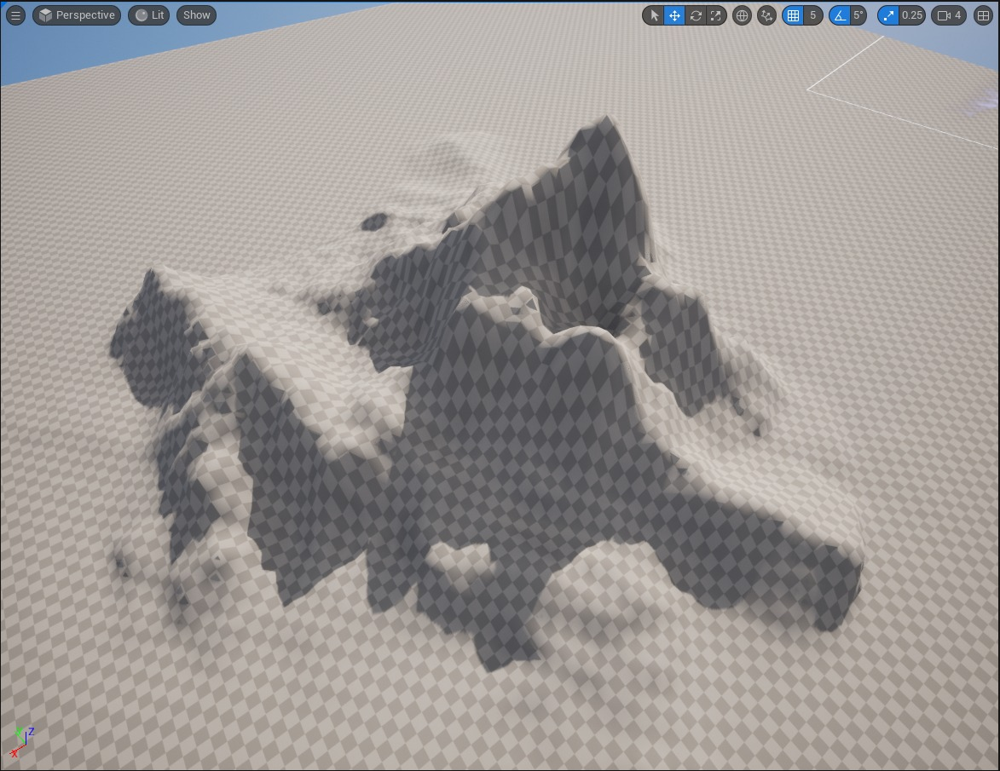

# 使用 Alpha 画笔来塑造你的风景

## 来源与状态

- 原始 URL：https://dev.epicgames.com/community/learning/tutorials/m27q/unreal-engine-using-alpha-brushes-to-sculpt-your-landscape

## 运行时分类

- 类型：图文教程
- 判断：API 未识别到核心视频信号，可整理正文约 4298 字符。

## 摘要

如何根据现实世界的高度数据创建自定义 Alpha 笔刷并使用它们在您的景观上雕刻自然的丘陵和山脉。

## 中文整理

### 概览

Alpha 画笔是在表面上数字雕刻细节的绝佳方式，可用于各种雕刻程序，例如 ZBrush 和 Blender。在本教程中，您将学习使用真实世界的高度数据创建各种用于 UE5 横向模式的 alpha 画笔。然后，这些画笔可用于根据现实世界的场景雕刻自然的丘陵和山脉。 **先决条件**：本教程需要虚幻引擎和图像编辑软件的基础知识。使用虚幻引擎 5 和 Krita 创建示例。 **版本**：本教程是使用虚幻引擎 5.0.3 创建的。

Alpha 画笔是黑白图像，在雕刻程序中用作画笔，代表特定的图案，例如地形、衣服上的螺纹或角色上的疤痕。像素越接近纯白色，该点对表面的拉力就越大。在下面的示例中，您可以看到使用 Krita（免费的 Photoshop 替代品）创建的两个非常基本的画笔。每个画笔的尺寸为 2048 x 2048，是通过使用灰色在黑色背景上绘制线条而创建的。画笔设置为 100% 流量和约 30% 不透明度。使用多次笔画来构建线条，使中心的“峰”最接近白色，并且会变得更加升高。图像以 8 位 PNG 格式保存。

像这样的画笔可以是雕刻自然景观或向使用世界机器或盖亚等生成器创建的地形添加额外山脉的绝佳捷径。

要根据现实世界地形创建您自己的高质量 Alpha 笔刷，您需要高度数据源。我推荐一个名为 Tangram Heightmapper 的在线工具。该工具使您可以访问全球各地的高分辨率高度图数据。

使用鼠标滚轮或屏幕控件放大您最喜欢的位置。对于 alpha 笔刷来说，合适的地形可以找一小片山脉，这些山脉的距离不是太近，而且形状很有趣。非洲或南美洲可以找到很好的例子，但任何山脉都可以。较小的、孤立的山脉使接下来的步骤变得更容易。找到一个合适的区域并捕获屏幕截图。此示例是使用 Windows 附带的 Snip and Sketch 工具捕获的。

接下来，打开照片编辑程序并创建一个 2048x2048 300ppi 的黑色背景文档。导入您的屏幕截图并开始清理它。任何有灰色或白色的地方都会塑造你的地形，所以删除你不想要的任何颜色。调整对比度，使峰非常白。例如，右下角多余的高度数据被删除，对比度增加以更好地突出峰值。

将图像保存为 8 位 PNG 并打开虚幻引擎。创建一个新关卡并切换到横向模式。创建高分辨率的景观，因此有很多顶点可供使用。请参阅虚幻引擎文档中的景观技术指南，了解建议的景观尺寸。还可以启用编辑图层以进行非破坏性编辑。单击“创建”按钮来创建您的景观。通过将保存的 Alpha 画笔拖到内容浏览器中来导入它。返回工具选项板，将画笔类型更改为 Alpha 画笔。从“纹理”下拉列表中选择新导入的画笔并调整设置，以便获得较低的工具强度和较大的画笔尺寸。

雕刻您的风景并让自动旋转功能旋转画笔。初始结果一开始可能看起来参差不齐，但可以通过使用 Hydro Erosion se 降低工具强度来平滑。使用该工具单击一下即可避免破坏您的细节。继续使用大刷子尺寸和低工具强度进行雕刻。您创建的功能需要更大吗？切换回圆形雕刻刷并轻轻拉动细节。

- [景观技术指南](https://docs.unrealengine.com/5.0/en-US/landscape-technical-guide-in-unreal-engine) - [景观文档](https://docs.unrealengine.com/5.0/en-US/landscape-outdoor-terrain-in-unreal-engine) - [Krita 数字绘画软件](https://krita.org/en) - [Tangram高度映射器](https://tangrams.github.io/heightmapper)

## 相关链接

- [Landscape Technical Guide](https://docs.unrealengine.com/5.0/en-US/landscape-technical-guide-in-unreal-engine)
- [Landscape Documentation](https://docs.unrealengine.com/5.0/en-US/landscape-outdoor-terrain-in-unreal-engine)
- [Krita Digital Painting Software](https://krita.org/en)
- [Tangram Heightmapper](https://tangrams.github.io/heightmapper)

