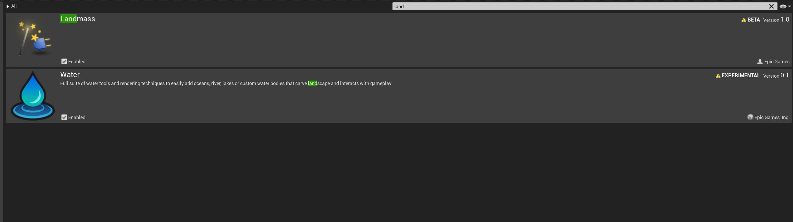
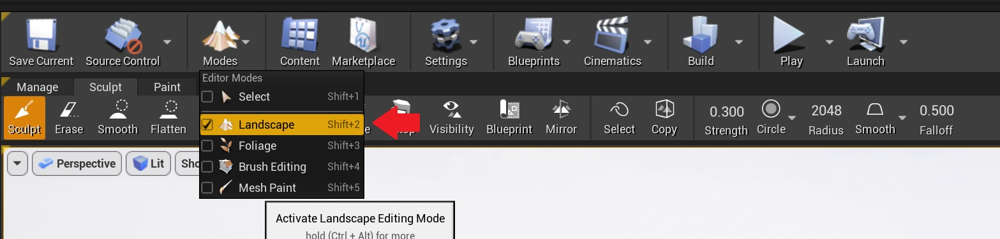
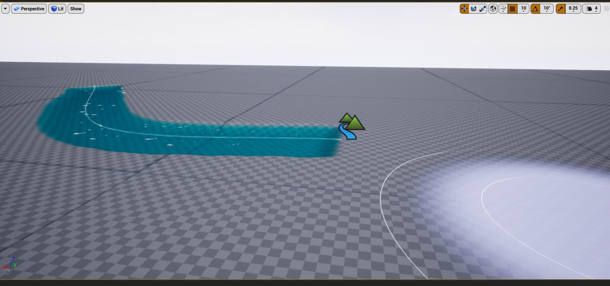

# 为什么水系统中不出现水？

## 来源与状态

- 原始 URL：https://dev.epicgames.com/community/learning/knowledge-base/Oav2/unreal-engine-why-doesn-t-water-show-up-with-the-water-system

## 运行时分类

- 类型：图文教程
- 判断：API 未识别到核心视频信号，可整理正文约 1370 字符。

## 摘要

为什么我的水没有出现在供水系统中？文章由 Dan H 撰写。水生成器仅适用于可编辑的几何体，这意味着您只能将其放置在景观上。为此，您首先要……

## 中文整理

### 为什么我的水没有出现在供水系统中？

文章作者：[Dan H.](https://dev.epicgames.com/community/profile/5laA/DanielXAU) 水生成器仅适用于可编辑几何体，这意味着您只能将其放置在景观上。为此，您首先需要确保启用 Water 和 Landmass 插件。

从那里开始，创造一个风景。确保编辑图层复选框已启用。

根据所需的尺寸和分层创建景观后，返回“地点 Actor”选项卡并搜索要添加的水景类型（河流、海洋等）。将水体放置在自定义几何体上。就像这样：

这也会自动添加渲染水所需的演员。根据需要雕刻或调整水周围的景观。您还可以更改代表每个水域的演员的设置，以改变它们周围的景观。有关更多信息，请查看[供水系统文档页面](https://docs.unrealengine.com/4.27/en-US/BuildingWorlds/Water/)。或者这个[虚幻深度探索](https://youtu.be/7y-ITjcttW8) (*双关语!*) 进入水系统

