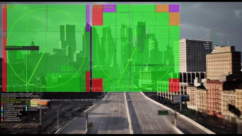
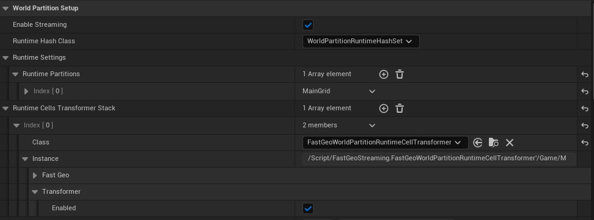
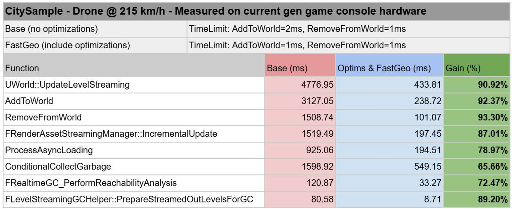
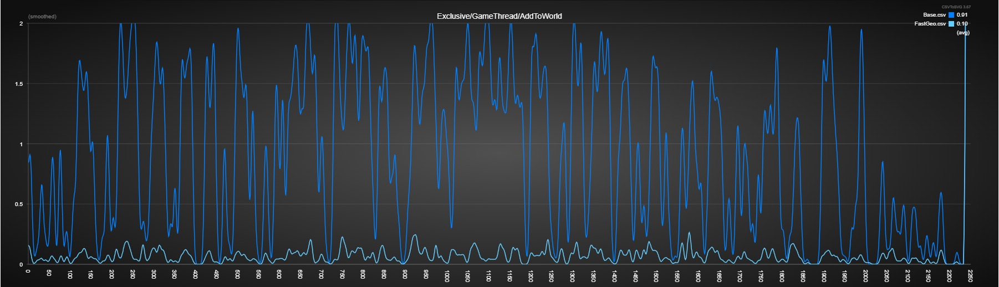
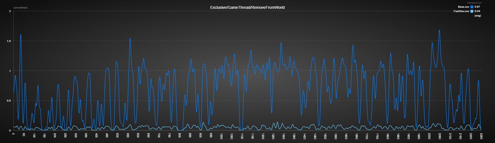
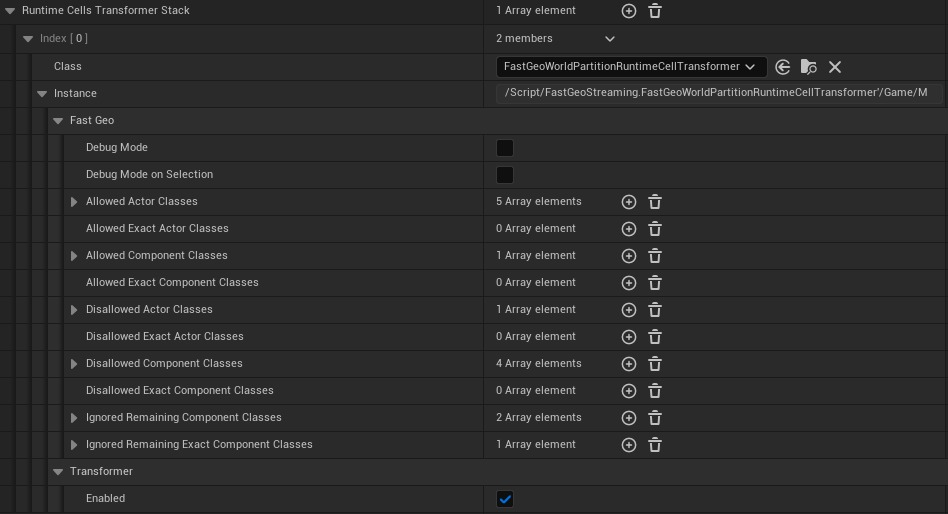
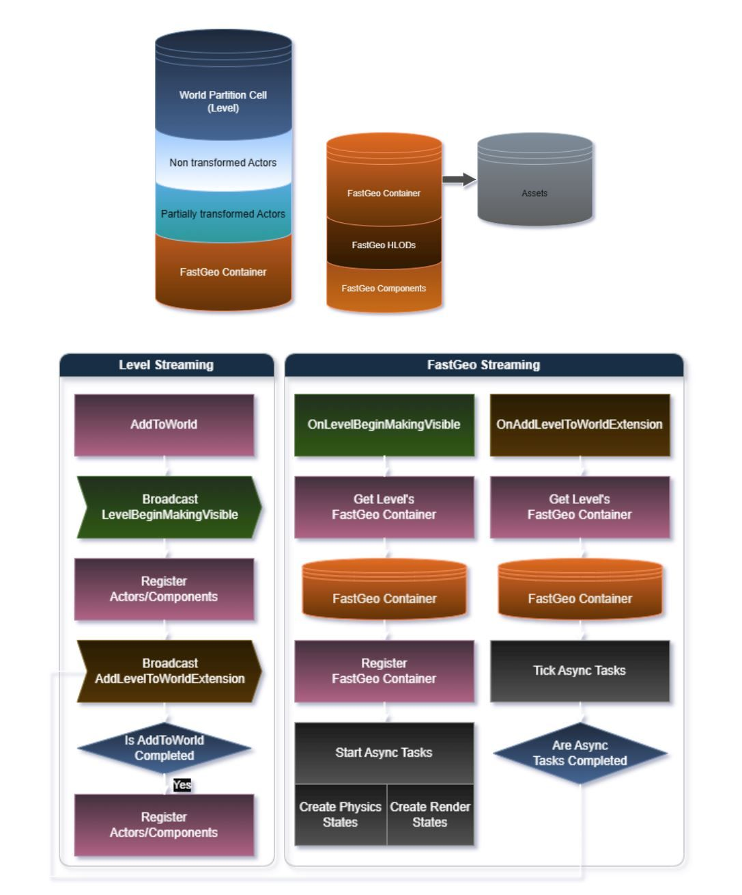
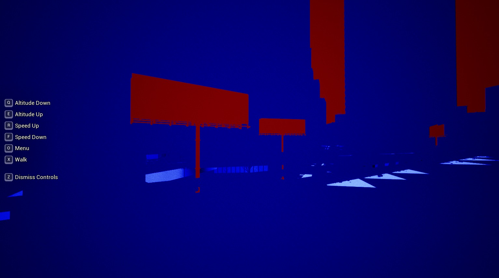

# 世界建设指南

### WP - 5.6 中的重要变化

- **流性能改进** - 在运行时流输入/输出世界内容时改进了整体引擎性能，以解决物理状态创建/销毁、添加到世界/从世界中删除等长期存在的问题（见下文）。

- 下面的核心改进列表适用于每个项目，并且可以与解决不可变静态几何体的 FastGeo Streaming 插件结合使用。

由于这些在 5.6 中被认为是实验性的，因此大多数需要在每个项目中启用和彻底测试。

- **UpdateStreamingState** - 异步 UWorldPartitionStreamingPolicy::UpdateStreamingState - wp.runtime.UpdateStreaming.EnableAsyncUpdate = true - UWorld::InternalUpdateStreamingState 优化，删除不必要的调用 - **异步物理状态创建/销毁** - 异步物理状态创建 (InitBody) 和销毁 - p.Chaos.EnableAsyncInitBody = true - LevelStreaming.AllowIncrementalPreRegisterComponents = true - LevelStreaming.AllowIncrementalPreUnregisterComponents = true - 异步景观高度场碰撞组件物理状态创建 - 异步物理状态创建和销毁改进，包括支持使用 p.Chaos.AsyncPhysicsStateTask.TimeBudgetMS 设置异步任务每帧的最大时间预算（默认情况下无限制）。

- 后者允许平衡和限制混沌的异步物理状态创建/销毁，以跟上一切 - 多个AddToWorld/RemoveFromWorld，用于在使用异步物理状态创建和销毁时最大化AddToWorld 和RemoveFromWorld 允许的时间限制。

- 需要：p.Chaos.EnableAsyncInitBody = true - AND/OR LevelStreaming.AllowIncrementalPreUnregisterComponents = true - 要在关卡流中启用： - LevelStreaming.MaximumMakingVisibleLevels = <value> - LevelStreaming.MaximumMakingInvisibleLevels = <value> - **InstancedStaticMeshComponent CalcBounds** - 缓存边界以消除大部分时间重建边界对于不更改的 InstanceStaticMeshes - **PrecachePSOs** - UPrimitiveComponent::SetupPrecachePSOParams，实现了一个新的专用函数来获取 bUsesWorldPositionOffset - UStaticMeshComponent::OnRegister，检测组件世界变换是否更改以及 PrecachePSOs 是否已被调用 - **DoesPackageExist** - FPackageName::DoesPackageExistEx，用于关卡流式传输，而不是在之前进行测试请求包，让请求执行并处理完成回调中的错误 EAsyncLoadingResult::Failed ULevelStreaming::AsyncLevelLoadComplete - **AddPrimitive** - Async AddToWorld/AddPrimitive 要启用：= true - 要启用：LevelStreaming.AsyncRegisterLevelContext.Enabled - 要设置：LevelStreaming.AsyncRegisterLevelContext.PrimitiveBatchSize = <value> - s.LevelStreamingAddPrimitiveGranularity = <值> - **RemoveFromWorld 增量 EndPlay** - 改进了 UWorld::RemoveFromWorld 的时间切片 - 启用：s.LevelStreamingRouteActorEndPlayForRemoveFromWorldGranularity = <值>（0 = 禁用） - **渲染资源流（纹理/网格流）** - FRenderAssetStreamingManager::IncrementalUpdate - 并行处理- r.Streaming.AllowParallelRenderAssetStreamingManagerIncrementalUpdate = true - 缓存 - r.Streaming.EnableTexturesSamplingStreamingCache = true - 其他优化 - 使用：r.Streaming.WorkerCountForParallelRenderAssetStreamingManagerIncrementalUpdate <value> 控制使用 r.Streaming.AllowParallelRenderAssetStreamingManagerIncrementalUpdate 时要使用的最大工作线程数 - **统一/共享ProcessAsyncLoading 和 UpdateLevelStreaming 的时间预算** - ProcessAsyncLoading 和 UpdateLevelStreaming 的时间预算，在帧末尾从 HandleUnifiedStreaming 运行异步资源和关卡流，HandleUnifiedStreaming 还处理高优先级流。

如果 ProcessAsyncLoading 出现故障，UpdateLevelStreaming 的时间将会减少，UpdateLevelStreaming 未使用的时间将用于处理更多加载的资源。

这还包括对诸如RemoveFromWorld之类的函数的性能和计时修复，这些函数在某些情况下无法正确计算经过的时间。

- 启用：s.UseUnifiedTimeBudgetForStreaming 1 - 启用此统一预算时需要考虑以下预算： - s.AsyncLoadingTimeLimit - s.LevelStreamingActorsUpdateTimeLimit - s.PriorityAsyncLoadingExtraTime - s.PriorityLevelStreamingActorsUpdateExtraTime - **快速几何流 ** - FastGeo 流插件旨在实现更快的流式传输演员是不可变的静态几何体，不会影响游戏玩法。

它使用更快、更轻量级的方法在图形和物理场景中注册和取消注册静态几何体，而不会牺牲运行时数据层和 HLOD 等现有的世界分区功能。

- 它利用世界分区 - [运行时单元变压器](https://dev.epicgames.com/community/learning/knowledge-base/r6wl/unreal-engine-world-building-guide#wp-importantchangesin55) 功能来定义在每次进入编辑器中播放 (PIE) 和 Cook 时间时发生的流生成阶段中可以考虑进行快速几何流的内容。

这使得该过程无缝且非破坏性。

它还可以与多个 Cell Transformer 分层以进一步改进。

- **要使用 FastGeo Streaming：** 1. 在项目中启用 FastGeo Streaming 插件

2. 在关卡的世界设置 - 世界分区设置中添加 FastGeoWorldPartitionRuntimeCellTransformer 世界分区运行时单元转换器。

3. 需要在项目中设置 p.Chaos.EnableAsyncInitBody = true 4. PIE 或 Cook - **强烈建议根据项目分析和所需结果调整 AddToWorld / RemoveFromWorld 和 FastGeo Streaming 允许的时间预算。** - 即在当前一代游戏机硬件上使用 City Sample 进行的内部性能测试中，我们使用了以下 cvar 和值以及结果： - s.LevelStreamingActorsUpdateTimeLimit 设置为 1ms - s.UnregisterComponentsTimeLimit 设置为 1ms - LevelStreaming.MaximumMakingVisibleLevels 设置为 2 以允许在等待异步任务时处理另一个关卡 - FastGeo.AsyncRenderStateTask.TimeBudgetMS 设置为至 1ms - FastGeo.AsyncRenderStateTask.ParallelWorkerCount 设置为 4，以避免慢速流警告出现任何阻塞 - FastGeo.AsyncRenderStateTask.MaxNumComponentsToProcess 保持为 0（无限制）

- **控制台变量：** - FastGeo.AsyncRenderStateTask.ParallelWorkerCount - 设置创建 FastGeo 渲染状态时要使用的最大工作线程数 - 仅当值大于 1 时才考虑 - FastGeo.AsyncRenderStateTask.TimeBudgetMS - 异步渲染状态任务的最大时间预算（以毫秒为单位）（0 = 无时间限制） - FastGeo.AsyncRenderStateTask.MaxNumComponentsToProcess - 最大数量要处理的组件数量（0 = 无组件限制） - FastGeo.Enable 0 - 也可以使用此控制台变量禁用 FastGeo Streaming。 - PIE：运行 PIE 时将立即考虑此标志。 - Cook：更改此变量将需要重新烹饪地图/项目。 - **转换过程：** - FastGeo 运行时流式传输需要启用异步物理状态创建/销毁 (p.Chaos.EnableAsyncInitBody = true)。 - 部分/完全转换 - FastGeo 转换器支持 actor 的部分转换：仅转换 actor 的受支持组件。 - 如果认为演员已完全变换，则将其从其关卡（从世界分区单元格）中删除。为此，以下任何一个条件都必须为真： - 所有组件均已变换 - 其余组件可以忽略（请参阅变换设置中的 IgnoredRemainingComponentClasses 和 IgnoredRemainingExactComponentClasses） - 唯一剩余的组件是根组件，并且是 SceneComponent - **IsFullyTransformedActorDeletable**：用户可以实现自己的组件CellTransformer 派生自此，并重写 IsFullyTransformedActorDeletable 方法以防止删除 Actor。 - Actor 限制 - **不允许的 Actor 类：**不允许的 Actor 类可以阻止 Actor 被转换。 - **Actor 标签：**如果 Actor 标签包含“CellTransformer_IgnoreActor”或“NoFastGeo”，则该 Actor 会被排除。 - **非空间加载：** 由于变压器仅应用于生成的世界分区单元，因此无法转换非空间加载的角色（它们将成为持久关卡的一部分）。 - **复制：** 复制的参与者不会被转换，因为 FastGeo 没有任何自定义复制机制。 - **非静态根组件移动性：** 不支持根组件的 Actor，其移动性未设置为静态。 - **仅编辑器：** 不支持仅编辑器演员。 - **儿童演员：**不支持儿童演员和有儿童演员的演员。 - **具有逻辑的蓝图：** 不支持具有逻辑的蓝图参与者。那些只有构建脚本的就可以了。 - **未完全转换的蓝图：** 不支持部分转换的蓝图参与者。 - **Actor 引用：**如果一个 Actor 被另一个未转换或部分转换的 Actor 引用，则该 Actor 会被排除。 - **IsActorTransformable:** 用户可以实现...

