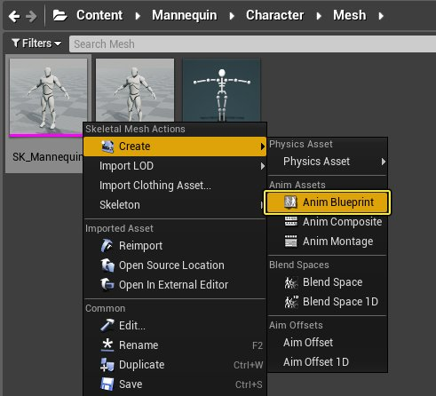
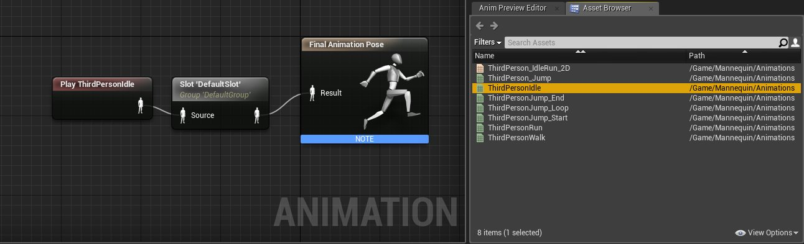
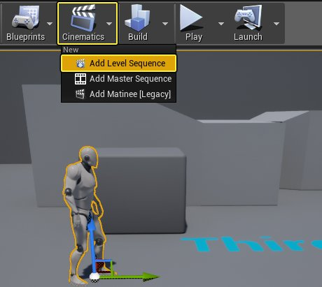
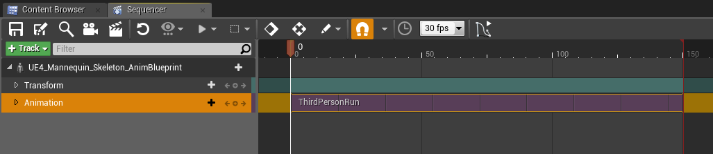
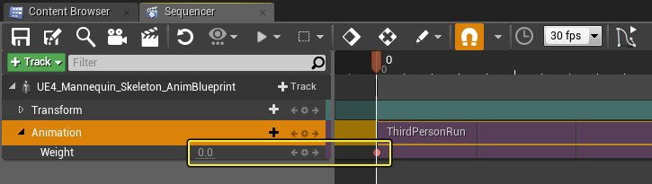
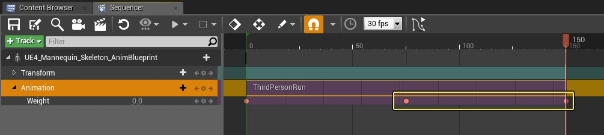
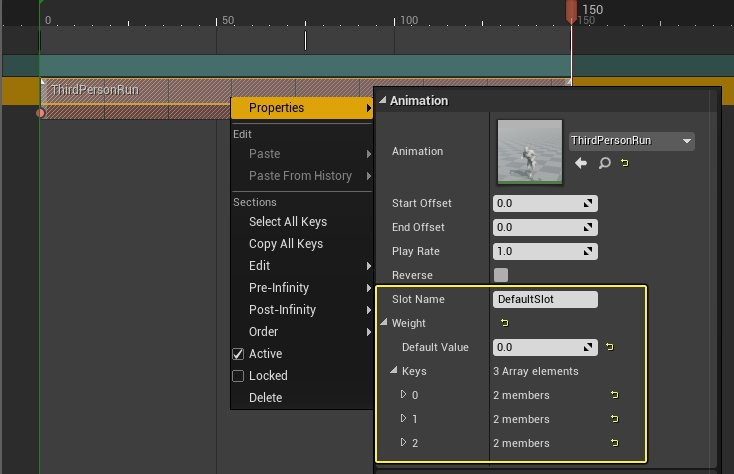
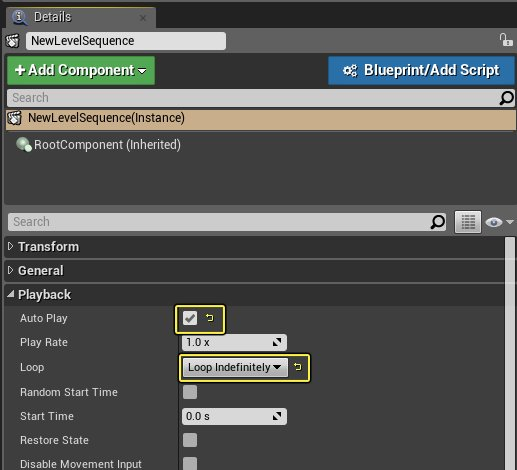

# 通过Sequencer混合动画蓝图

> 路径：虚幻引擎5.7文档 / 为角色和对象制作动画 / 过场动画和Sequencer / 过场动画流程指南和示例 / 通过Sequencer混合动画蓝图

> 原始页面：https://dev.epicgames.com/documentation/unreal-engine/blending-animation-blueprints-with-sequencer-in-unreal-engine

如果你想要将Sequencer中指定的动画与角色动画蓝图中定义的动画相混合，可以使用Sequencer中的动画轨道的 **插槽（Slot）** 节点和 **权重（Weight）** 属性来完成。

在本示例中，我们从动画蓝图获取闲散姿势，并将它混合到Sequencer中定义的奔跑动画中。

## 步骤

> [!NOTE]
> 在本操作指南中，我们现在使用 **蓝图第三人称模板** 项目。

1. 在 **Content/Mannequin/Character/Mesh** 文件夹中，右键单击 **SK_Mannequin**，然后在 **创建（Create）** 下面，选择 **动画蓝图（Anim Blueprint）**。

   

   为动画蓝图指定任意名称和保存位置。
2. 在 **动画蓝图（Anim Blueprint）** 中，拖入 **ThirdPersonIdle**，并连接到 **插槽（Slot）**节点，然后连接到 **最终动画姿势（Final Animation Pose）** 节点。

   

   请注意，插槽（Slot）的默认名称是 **DefaultSlot**，这是我们将在本指南中在关卡序列中引用的名称。
3. 将 **动画蓝图（Anim Blueprint）** 拖到关卡，然后从主工具栏中，选择 **过场动画（Cinematics）** 并选择 **添加关卡序列（Add Level Sequence）**。

   

   给关卡序列指定任意名称和保存位置。
4. 向序列添加 **动画蓝图（Anim Blueprint）** 角色，然后添加/循环 **ThirdPersonRun** 动画来填充序列。

   
5. 展开动画轨道，然后将 **权重（Weight）** 值更改为 **0.0** 并向序列添加一个键。

   

   通过将权重设置为0.0，我们表示在增大权重值之前不使用该动画的任何部分。
6. 为 **权重（Weight）** 添加一个键，值为 **1.0**，位于帧 **75** 处，再添加另一个键，值为 **0.0**，位于帧 **150** 处。

   

   这将从0.0混合到1.0（动画的完整效果），然后再回到0.0。
7. 右键单击 **ThirdPersonRun** 轨道，然后在 **属性（Properties）** 下面，注意 **插槽名称（Slot Name）** 和我们添加的三个 **键（Keys）**。

   

   插槽名称是指代动画蓝图中添加的插槽节点的名称。这些名称必须相匹配，这样Sequencer才能知道你所指代的是哪个插槽，并传递权重值。
8. 选择关卡序列，然后在 **细节（Details）** 面板中，启用 **自动播放（Auto Play）** 并将 **循环（Loop）** 设置为 **无限循环（Loop Indefinitely）**。

   
9. 从主工具栏，选择"在编辑器中运行"（Play in the Editor）。

## 最终结果

在编辑器中运行时，角色首先为闲散姿态（这是动画蓝图中的状态），然后将混合到我们在关卡序列中指定的动画（奔跑），最后恢复为闲散姿态。

虽然我们的示例使用闲散动画作为最终动画姿势，但使用这种方法可以生成整个状态机，以根据任意数量的系数在动画蓝图中产生最终动画姿势，然后混入关卡序列中定义动画。

举例而言，NPC可以定义一些逻辑来控制它们所处的姿势，玩家可以接近该NPC，从而触发一个剧情画面，你可以用Sequencer中定义的动画来覆盖动画逻辑。
