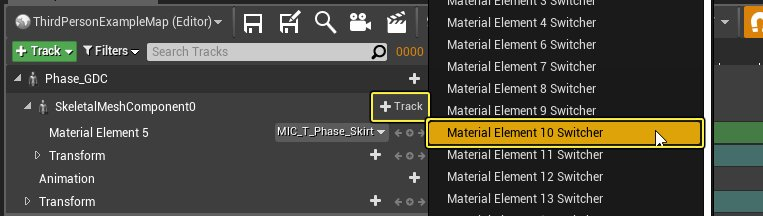
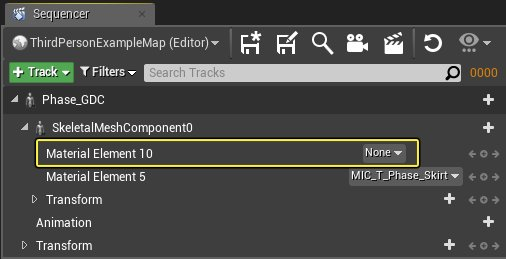
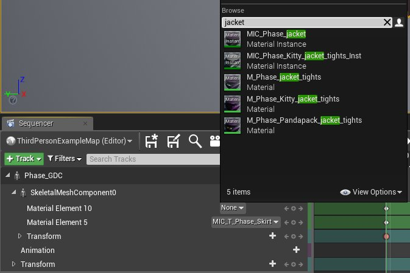
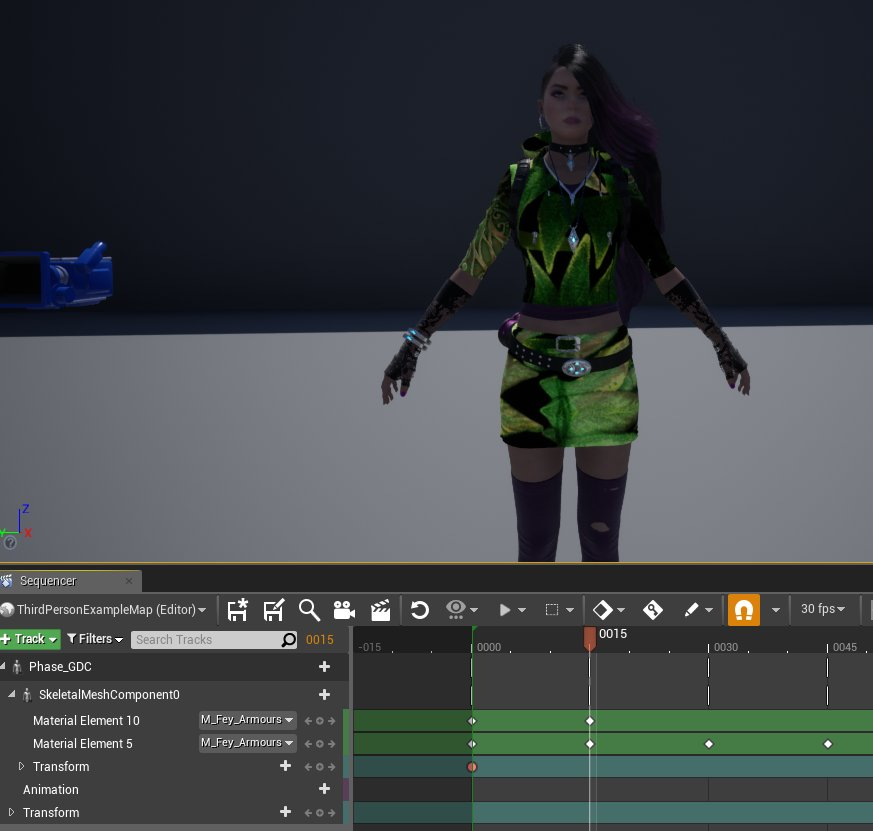
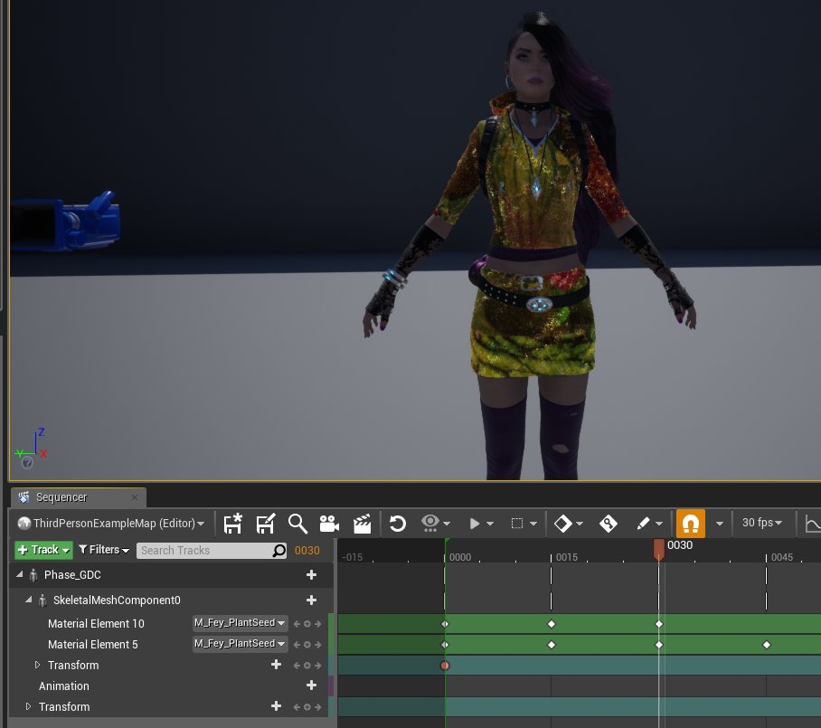

# 切换Sequencer中的Actor材质

> 路径：虚幻引擎5.7文档 / 为角色和对象制作动画 / 过场动画和Sequencer / 过场动画流程指南和示例 / 切换Sequencer中的Actor材质

> 原始页面：https://dev.epicgames.com/documentation/unreal-engine/change-material-in-unreal-engine-cinematic-movie

**材质元素切换器（Material Element Switcher）** 轨迹是可用于对Actor上的材质设置动画的Sequencer轨迹。利用此轨迹可通过在此轨迹上添加特定材质的关键帧来改变Actor上的材质。

本指南中可使用Epic商城中的Paragon Phase和Fey材质。可以看到，Phase的裙子已拥有材质元素切换器。这样便可轻松查看材质与夹克对比的变化。

1. 前往 **过场动画（Cinematics）** > **添加关卡序列（Add Level Sequence）**。命名并保存序列，例如"MaterialAnim"，然后在 **内容浏览器** 中打开。
2. 将Actor的骨架网格体添加到视口。然后，将此网格体作为轨迹添加到序列中。
3. 在 **骨架网格体（Skeletal Mesh）** 组件下，添加新 **轨迹** 并选择 **材质元素切换器**。在骨架网格体动画蓝图中，可找到actor上要变更元素对应的材质编号。

   

本范例中将更改夹克材质，其为材质元素10。

1. 在标记为 **无（None）** 的下拉菜单中，选择序列的首个材质。然后，在序列中向此元素添加关键帧。

   

   

本范例将以 **MIC_Phase_jacket** 开始，其为Phase的夹克材质。

1. 沿 **时间轴** 将滑块移到要变更的材质处。利用下拉菜单，选择新材质并将新建添加到序列。

   

本范例将此材质变更为 **M_Fey_Armours** 材质。

1. 重复上一步添加第三个材质。

   

本范例将此材质变更为 **M_Fey_Plantseed** 材质。

1. 最后一次变更为返回Phase的初始夹克材质：MIC_Phase_jacket。移动滑块并再次将键添加到此材质。本范例中，在裙子材质在序列结束处改变之前变更夹克材质。

现在可播放序列观看材质变化。

## 最终结果
