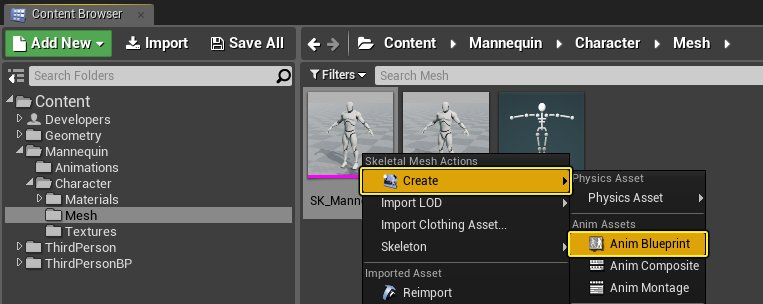
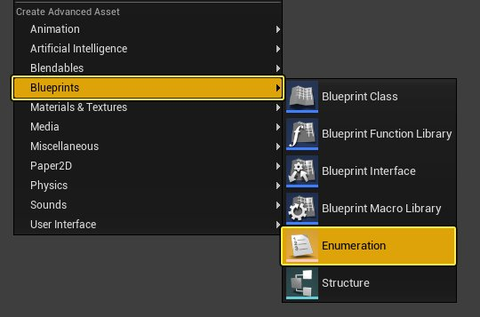
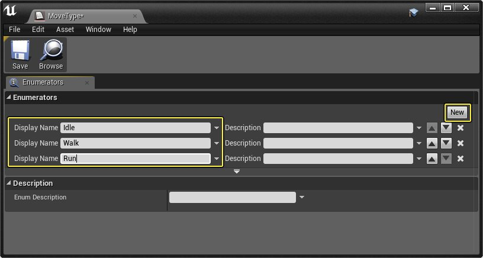
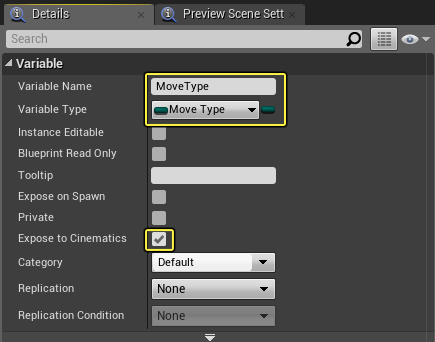
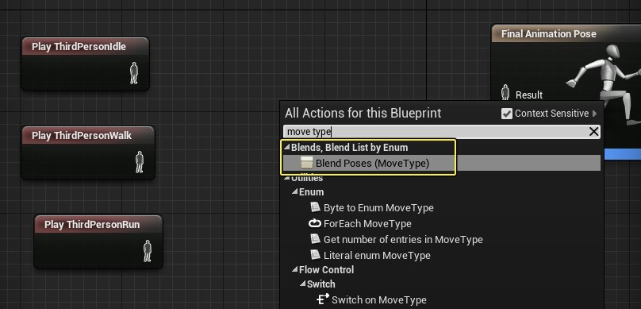
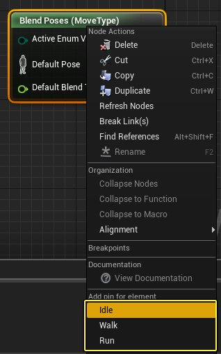
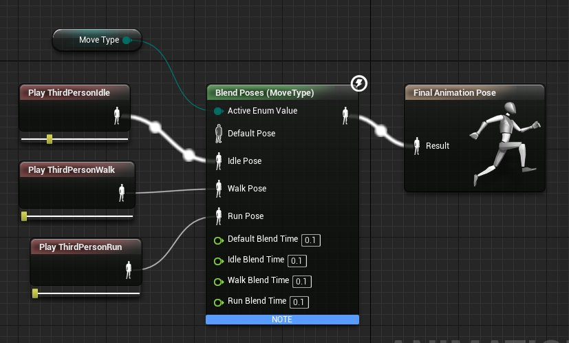
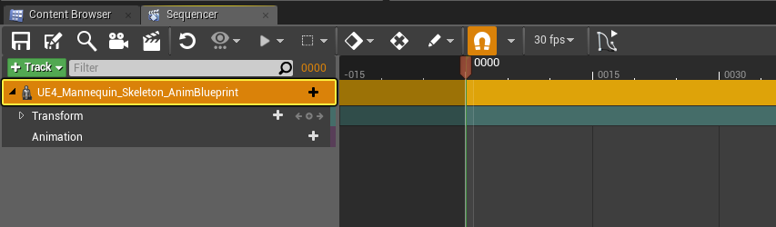

# 使用Sequencer控制动画实例

> 路径：虚幻引擎5.7文档 / 为角色和对象制作动画 / 过场动画和Sequencer / 过场动画流程指南和示例 / 使用Sequencer控制动画实例

> 原始页面：https://dev.epicgames.com/documentation/unreal-engine/control-animation-blueprint-parameters-from-sequencer-in-unreal-engine

在Sequencer中可以通过可占据项（Possessable）为动画实例上的变量设置动画，让你直接控制动画蓝图变量、函数和其他内容。你可以通过添加骨架网格体组件轨迹来获取动画实例轨迹，其中任何公开给过场动画的变量都将显示并可用于设置关键帧。

在本操作指南中，我们通过为Sequencer中的属性更改设置关键帧，将动画蓝图中定义的多个动画动作混合。

## 步骤

> [!NOTE]
> 此指南使用新增的 **蓝图第三人称（Blueprint Third Person@@@）** 模板项目。

1. 在

   Content/Mannequin/Character/Mesh

   文件夹中，右键单击

   SK_Mannequin

   ，然后选择

   创建（Create）

   下的

   动画蓝图（Anim Blueprint）

   ，并以任意名称为其命名。

1. 在

   内容浏览器（Content Browser）

   中单击鼠标右键，然后在

   蓝图（Blueprints）

   下选择

   列举（Enumeration）

   ，再将其命名为

   MoveType

   。

1. 创建三个名为

   Idle、Walk

   和

   Run

   的列举项，只需单击

   新建（New）

   按钮即可。

1. 打开第1步中创建的

   动画蓝图

   ，创建

   MoveType

   类型变量，将其命名为

   MoveType

   并启用

   公开给过场动画（Expose to Cinematics）

   。

1. 在

   动画图表

   中，添加

   ThirdPersonIdle、ThirdPersonWalk

   和

   ThirdPersonRun

   动画以及

   按运动类型混合动作（Blend Poses by Move Type）

   节点。

1. 右键单击

   混合动作（Blend Poses）

   节点，然后为

   Idle、Walk

   和

   Run

   添加引脚。

1. 将

   Move Type

   变量添加到图表中，然后将各个节点连接到

   最终动画动作（Final Animation Pose）

   ，如下图所示。

1. 将

   动画蓝图

   拖动到关卡中，然后创建新的

   关卡序列

   （以任意名称为其命名）并将动画蓝图添加到序列中。

1. 单击动画蓝图上的

   + 轨迹（Track）

   按钮，添加

   SkeletalMeshComponent0

   轨迹。

> 图片已省略：image alt text

1. 单击SkeletalMeshComponent上的

   + 轨迹（Track）

   按钮，添加

   动画实例（Anim Instance）

   轨迹。

> 图片已省略：image alt text

1. 单击动画实例上的 **+ 轨迹（Track）** 按钮，添加 **Move Type** 属性。

   > 图片已省略：image alt text
2. 把时间轴拉到第 **45** 帧，将 **Move Type** 下拉菜单更改为 **Walk**，添加一个关键帧。

   > 图片已省略：image alt text
3. 把时间轴拉到第 **90** 帧，将 **Move Type** 下拉菜单更改为 **Run**，添加另一个关键帧。

   > 图片已省略：image alt text
4. 在第 **120** 帧处为 **Move Type** 添加设置为 **Walk** 的关键帧，并在第 **150** 帧处添加另一个关键帧，设置为 **Idle。**

   > 图片已省略：image alt text
5. 在 **细节（Details）** 面板中将关卡序列设置为 **自动播放（Auto Play）**，然后单击 **播放（Play）** 或 **模拟（Simulate）** 按钮，以在编辑器中播放/模拟。

## 最终结果

在播放或模拟时，关卡序列将播放角色状态，并按照序列中定义的 **Move Type** 关键帧属性更改角色的状态。当角色的动作逻辑是由动画蓝图驱动时，无论想要控制角色通过序列进入何种动作，为变量属性设置动画都会非常有用。
