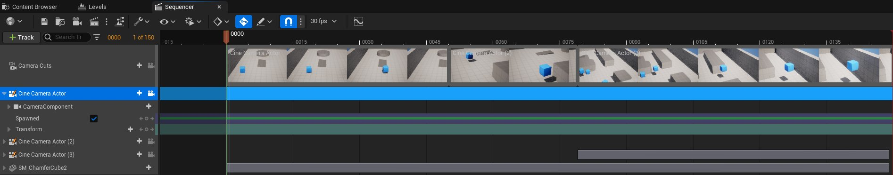
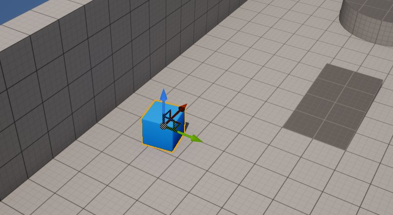
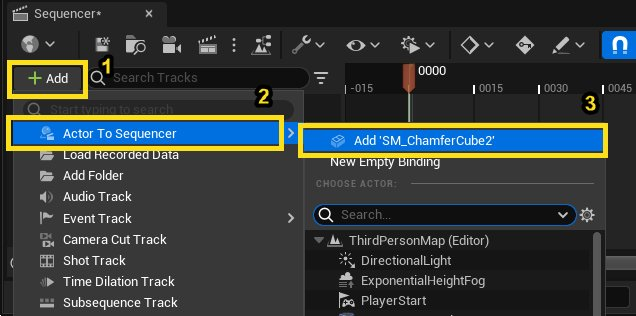
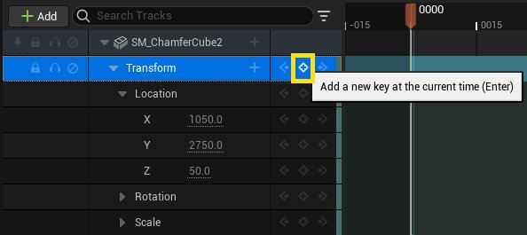
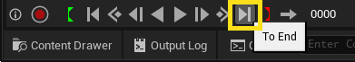
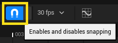
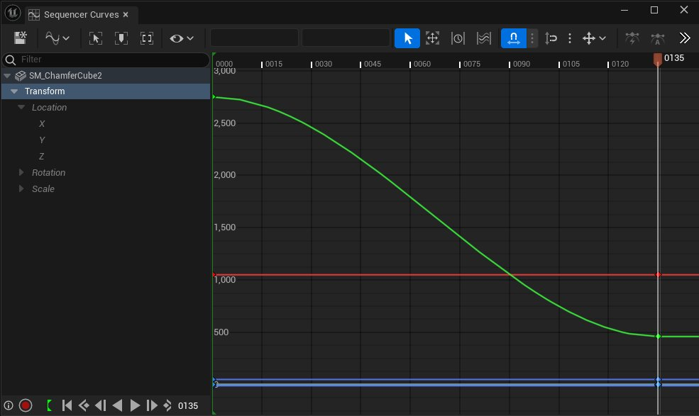
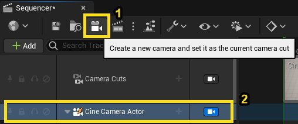

# 使用Sequencer创建镜头切换

> 路径：虚幻引擎5.7文档 / 为角色和对象制作动画 / 过场动画和Sequencer / 过场动画流程指南和示例 / 使用Sequencer创建镜头切换

> 原始页面：https://dev.epicgames.com/documentation/unreal-engine/creating-camera-cuts-using-sequencer-in-unreal-engine

## 什么是Sequencer？

[**Sequencer**](https://dev.epicgames.com/documentation/404)是一种强大的过场动画工具，可用于在不离开虚幻引擎（UE）的情况下创建动画和过场动画序列。Sequencer是一个非线性的编辑套件。非线性编辑是针对各种UE资产的离线编辑形式。在离线编辑中，不会修改原始内容。

### Sequencer的常见用例

Sequencer可以创建关卡飞行漫游视图，对光源、材质、对象和角色等资产制作动画，并渲染序列。这些是Sequencer的一些更常见的用例。

> 动图已省略：完成的镜头切换

Sequencer为你提供了相应的工具和直观的UI，以便在同一个平台中使用关卡序列、[轨道](../../unreal-engine-sequencer-movie-tool-overview/sequencer-track-list/index.md)和[设为关键帧的资产](../../how-to-make-movies/how-to-animate-cinematic-cameras/index.md#%E5%88%9B%E5%BB%BA%E5%8F%98%E6%8D%A2%E5%85%B3%E9%94%AE%E5%B8%A7)创建过场动画。

### 你将学习的内容

本教程旨在向UE新用户展示如何获取经验，简要介绍资产的动画制作，设置静态和动画镜头，了解Sequencer的UI，并学习如何在Sequencer中创建镜头切换。

## 设置项目

1. 使用

   第三人称模板（Third Person template）

   创建新的虚幻引擎项目。你不需要修改默认项目设置。
2. 在

   内容浏览器（Content Browser）

   中，在内容浏览器中右键点击空白处，创建文件夹，并将其命名为

   Sequences

   。确保在

   Content

   文件夹下创建此文件夹。
3. 在Sequences文件夹中，右键点击并从

   过场动画（Cinematics）

   菜单添加

   关卡序列（Level Sequence）

   。
4. 双击此序列，在Sequencer中将其打开。此时，你有一个空白关卡序列。

## 为立方体制作动画

设置好关卡序列后，你需要考虑镜头切换的焦点。就本教程而言，你将为在整个场景中移动的立方体制作动画，并创建三个镜头切换来跟踪其移动情况。

1. 从[**大纲视图（Outliner）**](../../../../building-virtual-worlds/level-editor/outliner/index.md)或[**视口（Viewport）**](../../../../building-virtual-worlds/level-editor/editor-viewports/index.md)中，选择 **SM_ChamferCube2** 。此立方体是离模板随附的三个立方体最远的一个。

   
2. 在Sequencer中，点击 **添加（+ Add）** 按钮，并选择 **Actor到Sequencer（Actor to Sequencer）> 添加"SM_ChamferCube2"（Add 'SM_ChamferCube2'）** 。这会创建一个具有变换属性的轨道，供你在Sequencer中制作动画。

   
3. 展开[**变换属性（Transform property）**](../../unreal-engine-sequencer-fa6b165a/sequencer-track-list/cinematic-transform-and-property-tracks/index.md)，并在帧0000处针对变换的 **位置（Location）** 属性点击 **添加关键帧（Add keyframe）** 按钮。这会将关键帧添加到位置的X、Y、Z属性。如果你没有移动此立方体，位置关键帧应该设置为X上的1050、Y上的320和Z上的50。

   
4. 点击 **至末尾（To End）** 按钮，将播放头移至镜头末尾。

   
5. 启用工具栏中的[**自动关键帧（Auto-Key）**](../../unreal-engine-sequencer-movie-tool-overview/creating-animation-keyframes/index.md)按钮，切换自动关键帧创建功能。

   

   > [!NOTE]
   > 启用后，磁铁图标将变为蓝色。
6. 将立方体移至场景另一端的以下位置坐标：X：1050、Y：3200、Z：280。此时，你可以前后推移播放头，查看立方体在镜头中从开始点移至结束点。

   > 动图已省略：完成的立方体动画
7. 如果你需要调整动画，可以在启用了 **自动关键帧（Auto-Key）** 的情况下在结束帧上四处移动所选立方体。这会自动更新立方体的位置关键帧。你也可以点击[**曲线编辑器（Curve Editor）**](../../unreal-engine-sequencer-movie-tool-overview/animation-curve-editor/index.md)，然后根据需要调整关键帧值，方法是选择相应关键帧并上下拖动以调整其值，或左右拖动以更改开始帧或结束帧。

   

## 添加摄像机

现在你需要创建一些摄像机，聚焦立方体的操作。

1. 在Sequencer中，点击 **创建摄像机（Create Camera）** 按钮(1)以创建摄像机。此操作将创建名为[**Cine Camera Actor**](../../../../understanding-the-basics/actors-and-geometry/index.md)的摄像机，创建此资产并将其分配给其自己的Sequencer轨道，创建[**镜头切换（Camera Cuts）**](../../unreal-engine-sequencer-movie-tool-overview/sequencer-track-list/cinematic-camera-cut-track/index.md)(2)轨道（稍后详细介绍），并将你的视口更改为通过这个新创建的摄像机浏览。

   

   > [!NOTE]
   > 如果你想更改回视口中的场景视图，可以在其Sequencer轨道中启用 **过场动画摄像机Actor** 图标。

   > 图片已省略：切换镜头切换视图
2. 摄像机锁定到视口时，你可以

   导航

   摄像机。确保你的帧设置为0000，然后展开

   位置（Location）

   和

   旋转（Rotation）

   的轨道（位于过场动画摄像机Actor轨道的"变换（Transform）"下），并将摄像机定位到这些变换值：

   - 位置（Location）

     ：

     - X：-520
     - Y：740
     - Z：890
   - 旋转（Rotation）

     ：

     - 翻滚角：0
     - 俯仰角：-25
     - 偏航角：355
3. 将播放头刚好移至立方体离开摄像机视图前的位置（帧0050）。 现在你可以开始创建第一个镜头切换。[**修剪**](../../unreal-engine-sequencer-movie-tool-overview/sequencer-track-list/cinematic-animation-track/index.md#%E4%BF%AE%E5%89%AA%E3%80%81%E5%BE%AA%E7%8E%AF%E5%92%8C%E6%92%AD%E6%94%BE%E9%80%9F%E7%8E%87)摄像机镜头的时长，方法是抓拉轨道右侧，直至它到达帧0050。将鼠标悬停在轨道末端，直至你看到边缘变为蓝色且光标变为左右箭头。

   > 动图已省略：修剪镜头切换
4. 再稍微练习一下，点击

   Sequencer

   中的

   创建摄像机（Ceate Camera）

   按钮，创建名为Cine Camera Actor (2)的第二个摄像机。在视口中，什么也没有改变，但一个新的摄像机资产和轨道已添加到Sequencer。新摄像机的位置与第一个摄像机相同。 记住，创建新摄像机会自动使你进入摄像机导航模式，可移动新摄像机以在即将发生的镜头中查看立方体。将你的摄像机定位到以下值：

   - 位置（Location）

     ：

     - X：685
     - Y：2600
     - Z：640
   - 旋转（Rotation）

     ：

     - 翻滚角：0
     - 俯仰角：-25
     - 偏航角：-70

   > 图片已省略：Cine Camera Actor (2)位置
5. 在 **镜头切换（Camera Cuts）** 轨道中，点击加号并选择 **新绑定（New Binding）> Cine Camera Actor (2)** 。这会将第二个摄像机轨道添加到镜头切换轨道。

   > 图片已省略：绑定Cine Camera Actor (2)
6. 如果你四处滑动播放头，你会看到立方体移动，但摄像机之间的镜头切换不会更改。请记住哪个摄像机处于活动状态。此时，第二个摄像机处于活动状态。要查看镜头切换，你需要禁用 **锁定视口（Lock Viewport）** 。

   > 图片已省略：禁用摄像机视图回到镜头切换
7. 作为第三个也是最后一个摄像机，创建跟踪立方体到其最终位置的摄像机。将播放头移至帧0079（立方体应该几乎接触到视口的右下边缘）。裁剪Cine Camera Actor (2)的镜头切换，使其位于此帧上。完成此步骤后，摄像机看似跳出其位置。这是正常的，因为镜头切换在此帧结束，播放头在这个相同的位置。如果你双击此摄像机，镜头切换会填充Sequencer的轨道视图（放大并聚焦镜头切换）。如果你将鼠标悬停在镜头切换上片刻，UE会显示摄像机的名称（Cine Camera Actor (2)）、开始和结束帧（50-79）以及帧时长（29帧）。

   > 图片已省略：镜头切换时长
8. 双击Sequencer滑块，放大查看你到目前为止创建的所有镜头切换和剩余帧。

   > 图片已省略：Sequencer滑块
9. 点击

   创建摄像机（Create Camera）

   添加第三个摄像机。此摄像机的目的是跟踪立方体，直至它到达最终静止位置。
10. 将摄像机定位为聚焦立方体动画的结束点。使用这些

    变换（Transform）

    值并在帧0079上为其设置关键帧：

    - 位置（Location）

      ：

      - X：-920
      - Y：1835
      - Z：1410
    - 旋转（Rotation）

      ：

      - 翻滚角：0
      - 俯仰角：-30
      - 偏航角：21

    > 图片已省略：Cine Camera Actor (3)第一个位置
11. 将播放头移至帧0149，并将Cine Camera Actor (3)的

    变换（Transform）

    值设置为以下值：

    - 位置（Location）

      ：

      - X：157
      - Y：2733
      - Z：585
    - 旋转（Rotation）

      ：

      - 翻滚角：0
      - 俯仰角：-22
      - 偏航角：25 如果自动关键帧仍启用，这些关键帧会在你更改摄像机的位置时自动设置。
12. 将播放头移至帧0079，并启用镜头切换锁定视口。 在Sequencer中选择 **镜头切换（Camera Cuts）** 轨道，并将第三个摄像机添加到此轨道：点击 **加号** 图标，然后选择 **新绑定（New Binding）> Cine Camera (3)** 。这会自动在帧0079处添加最终的镜头切换，并结束于0149。 1.将播放头移回帧0000，并点击 **播放（Play）** 。你的动画和镜头切换现在已完成。

    > 动图已省略：完成的镜头切换
