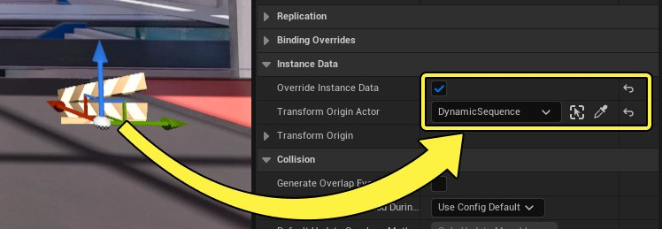

# 使用动态变换创建关卡序列

> 路径：虚幻引擎5.7文档 / 为角色和对象制作动画 / 过场动画和Sequencer / 过场动画流程指南和示例 / 使用动态变换创建关卡序列

> 原始页面：https://dev.epicgames.com/documentation/unreal-engine/creating-level-sequences-with-dynamic-transforms-in-unreal-engine

如果你的项目需要过场动画，或其他在多个位置发生的 **关卡序列（Level Sequence）** 内容，使用Sequencer的 **变换原点（Transform Origin）** 功能在运行时动态更改动画的位置或许比较合适。默认情况下，所有Sequencer变换都相对于世界原点(0, 0, 0)发生。但是，通过使用变换原点，你可以相对于任何变换进行变换，甚至相对于Actor的变换进行变换。

本文档说明了如何将变换原点绑定到Actor以更改Sequencer内容位置。

#### 先决条件

- 你需要熟悉如何使用Sequencer创建内容。请参阅以下页面，了解更多信息：

  - 创建摄像机动画
  - 将动画应用到角色

## 关卡Sequencer设置

首先在关卡中创建[关卡序列Actor](../../unreal-engine-sequencer-movie-tool-overview/index.md)。将其选中，然后在 **细节（Details）** 面板中执行以下操作：

1. 启用

   重载实例数据（Override Instance Data）

   。
2. 将

   关卡序列Actor（Level Sequence Actor）

   指定为

   变换原点Actor（Transform Origin Actor）

   。

> [!TIP]
> 你可以根据场景的情况将任意的Actor指定为变换原点Actor。例如，如果你的场景是角色要与桌子之类的对象交互，那么最好将桌子指定为变换原点Actor。

> [!NOTE]
> 根据你的用例，你可能需要先指定变换原点Actor，然后再在虚幻引擎中创建Sequencer内容。如果你先创建内容，然后指定了一个具有非零位置的变换原点Actor，你的内容将相对于该Actor移动。换言之，在指定变换原点Actor时，你的当前Sequencer变换不会进行补偿。

## 内容设置

接下来，[在序列中创建内容](#%E5%85%88%E5%86%B3%E6%9D%A1%E4%BB%B6)，将你的Sequencer内容与变换原点Actor对齐。在此示例中，Mannequin角色走向了关卡序列Actor的位置。

> 动图已省略：创建与变换原点Actor对齐的过场动画内容

现在你可以移动变换原点Actor，并看到你的动画在播放时同样更改了位置。

> 动图已省略：移动变换原点Actor

## 结果

更改变换原点Actor的位置会影响序列中的所有变换和动画。这样就可以动态更改场景的发生位置。

> 动图已省略：动态场景位置

> [!NOTE]
> [根序列](../../unreal-engine-sequencer-movie-tool-overview/sequences-shots-and-takes/index.md)中的所有对象还会收到变换原点偏移。

## 带动画的变换原点

如果原点Actor带动画，变换原点还会正确地调整Sequencer内容。在此示例中，船舶Actor呗设置为变换原点Actor，导致序列中的角色和其他所有变换的Actor在运行时期间跟随船舶的动画移动。

> 动图已省略：带动画的变换原点Actor
