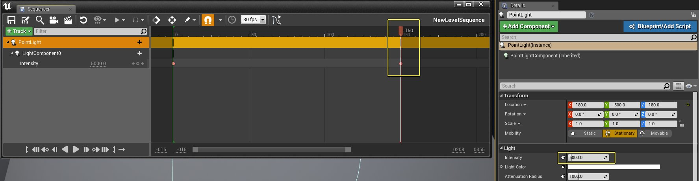
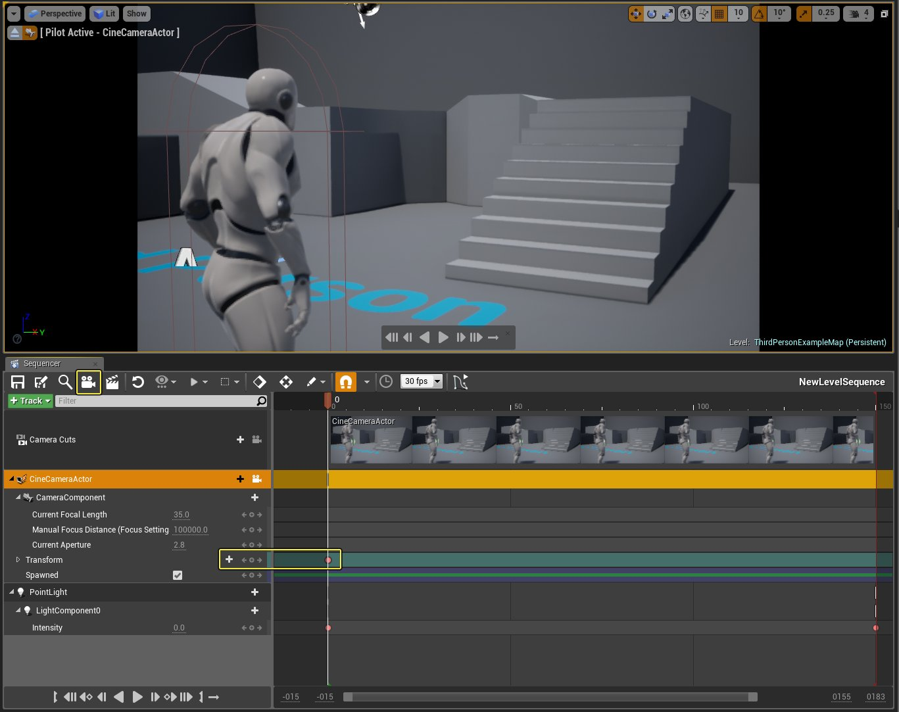
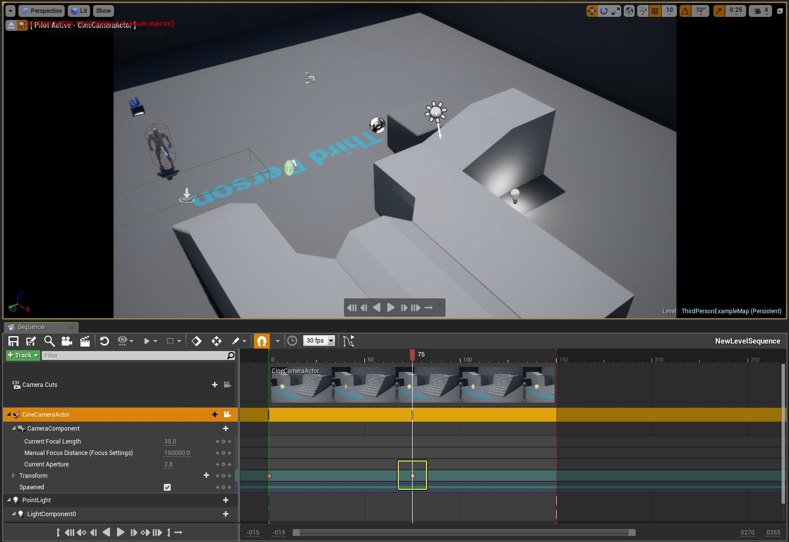
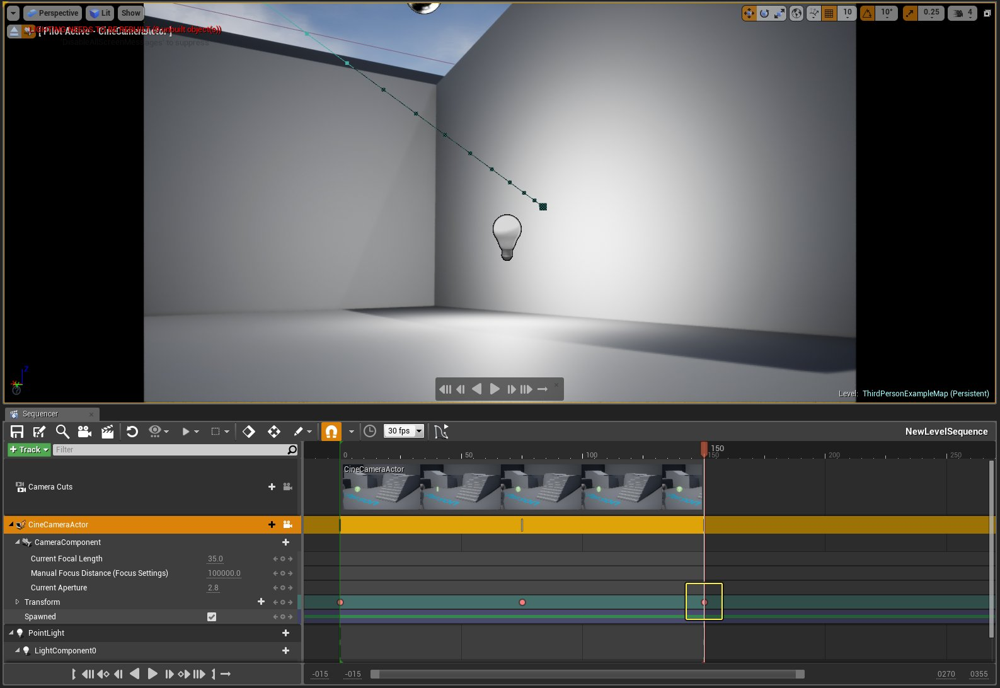

# 在Gameplay中触发序列

> 路径：虚幻引擎5.7文档 / 为角色和对象制作动画 / 过场动画和Sequencer / 过场动画流程指南和示例 / 在Gameplay中触发序列

> 原始页面：https://dev.epicgames.com/documentation/unreal-engine/play-cinematics-from-blueprints-in-unreal-engine

创建过场序列后，需要在游戏过程中将其作为剧情动画的一部分调用并播放。 举例而言，可能需要在玩家进入房间时让摄像机对准某个物体。 或者在玩家击杀敌人后触发结束过场动画。 获取对关卡序列的引用后，即可使用[蓝图](../../../../blueprints-visual-scripting/index.md)或C++代码来告知序列开始播放。

在此指南中，我们将创建一个过场动画范例，在玩家进入触发框后打开一盏灯。 过场动画播放结束后，我们将指示Sequencer将修改应用到关卡中的灯，使其在过场动画播放完毕后仍然存在。 我们还将允许播放器在播放时跳过过场动画，但指示Sequencer在跳过过场后将灯保持为开启状态。

## 步骤

> [!NOTE]
> 此指南中使用的是 **蓝图第三人称模板** 项目。

1. 在 **放置Actor（Place Actors）** 面板的 **基本（Basic）** 选项卡中，将一个 **盒体触发器** 拖入关卡并调整为理想的大小和位置。

   玩家进入触发器后，我们便会指示过场动画通过蓝图开始播放。
2. 在主工具栏中点击 **过场动画（Cinematics）** 按钮，然后选择 **添加关卡序列（Add Level Sequence）**，为过场动画命名。
3. 在 **放置Actor（Place Actors）** 面板的 **基本（Basic）** 选项卡中，将一个 **点光源** 拖入关卡，并放置在下图显示的位置处。
4. 选中 **点光源**，在 **细节** 面板中将 **强度（Intensity）** 值改为 **0.0**，然后点击 **关键帧（Keyframe）** 按钮。

   此操作将把点光源添加到Sequencer，并对序列开始处的初值设置关键帧。
5. 在Sequencer中将时间轴移动至第 **150** 帧，然后将灯光的 **强度（Intensity）** 值设为 **5000**，并设置关键帧。

   

   点击图片查看全图。

   点光源将出现在初始位置中，并随着序列播放完毕而开始变亮。
6. 点击 **添加相机（Add Camera）** 按钮，然后将相机移动到关卡中角色附近的一个位置，并设置关键帧。

   

   点击图片查看全图。
7. 将时间轴移动到第 **75** 帧，然后在关卡中将相机移动到一个俯视角色和灯光的新位置，然后设置关键帧。

   

   点击图片查看全图。
8. 将时间轴移动到第 **150** 帧，然后在关卡中将相机移动到一个聚焦于灯的位置，然后设置关键帧。

   

   点击图片查看全图。

   现在过场动画中将包含相机漫游动画，为玩家显示关卡中的灯光位置。
9. 选择关卡中的 **触发框**，然后在主工具栏中点击 **蓝图** 按钮并选择 **打开关卡蓝图**。
10. 在图表中点击右键，然后为 **触发框** 选择 **添加在actor上开始重叠（Add On Actor Begin Overlap）**。
11. 返回关卡并选择关卡序列，然后返回 **关卡蓝图** 中，点击右键并 **创建** 对关卡序列的引用。
12. 从关卡序列引用连出引线，选择 **播放（序列播放器）**。
13. 将 **OnActorBeginOverlap** 节点连接到 **Play** 节点。

    进入触发框时将执行 **Play** 节点，播放关卡序列。

    在编辑器中运行时您将注意到，进入触发框后序列将开始播放，然而其只会播放一次。 如果希望再次播放序列，需要在告知序列进行播放之前使用 **Set Playback Position** 节点让序列从头开始播放，"播放位置"设为 **0** 或序列的开头。
14. 在 **关卡蓝图** 中，从 **Sequence Player** 节点连出引线，使用 **Set Playback Position** 节点。
15. 在 **OnActorBeginOverlap** 和 **Play** 节点之间连接 **Set Playback Position** 节点。

    此操作将把关卡序列在播放之前重设到开头。
16. 在 **Sequencer** 中右键点击 **强度（Intensity）** 轨迹，然后在 **属性（Properties）** 下将 **完成时（When Finished）** 设为 **保持状态（Keep State）**。

    使用 **保持状态（Keep State）** 选项，使灯光强度设置在序列播放完毕后得到保留。 如果需要使Sequencer中设置的效果或设置在序列播放完毕后仍然保留，此操作将十分实用。 举例而言，在过场动画中有一扇门被打开，而您希望过场动画播放完毕时门保持打开状态。
17. 在 **关卡蓝图** 中添加一个 **F** 键盘事件，连接到一个 **Branch** 节点（条件为 **Is Playing**），此节点连接到 **Go to End and Stop** 节点。

    按下 **F** 键时，如果关卡序列当前正在播放，其将直接跳至结尾并停止播放。 需要播放器跳过过场动画，但如果序列继续播放，则继续沿用Sequencer已应用的修改。在此情形下，**Go to End and Stop** 节点十分实用。

    举例而言，在我们的过场动画中，Sequencer开启了关卡中的一盏灯。如果玩家跳过灯光开启的过场动画，我们仍然希望跳过过场动画后灯光仍然为开启状态。 如果单纯只是使用 **Stop** 节点来停止播放过场动画，过场动画的播放则不会完成，其将停在我们选择停止的点上（这意味着灯光可能不会完全开启，甚至不会开启，具体取决于停止的点）。
18. 返回主编辑器，然后在主工具栏中点击 **运行（Play）** 按钮在编辑器中运行。

## 最终结果

在编辑器中运行时，您将注意到灯光并非默认开启。 进入触发框时将开始播放过场动画，灯光将开启，在过场动画播放完毕后仍将保持开启状态。 再次进入触发框将再次触发过场动画，从开头播放序列。 进入触发框后按下 **F** 键即可跳过过场动画，此操作将使灯光自动开启。
