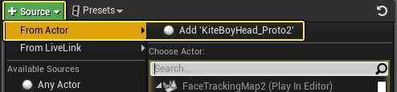
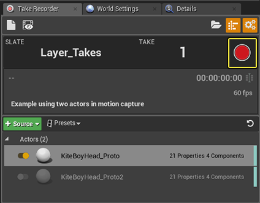
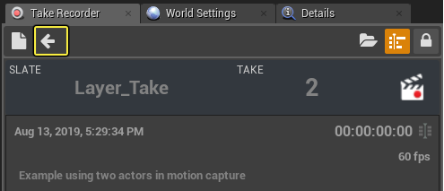
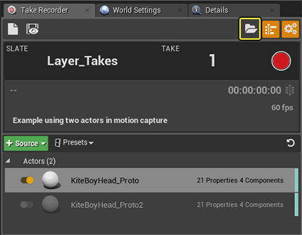
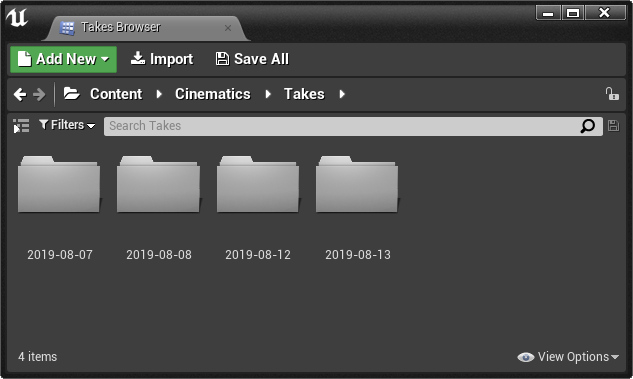
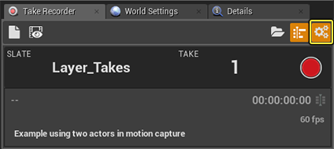
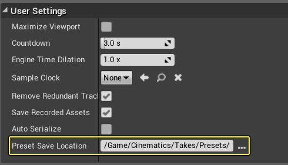
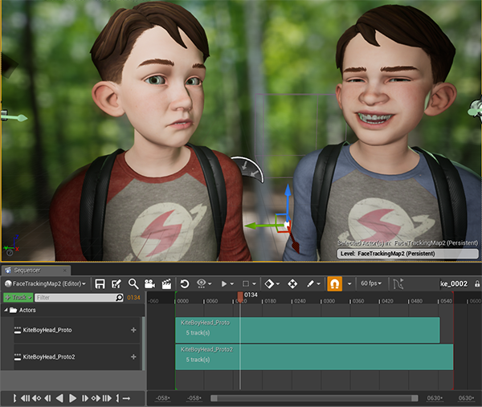

# 使用镜头试拍录制器

> 路径：虚幻引擎5.7文档 / 为角色和对象制作动画 / 过场动画和Sequencer / 过场动画流程指南和示例 / 使用镜头试拍录制器

> 原始页面：https://dev.epicgames.com/documentation/unreal-engine/record-gameplay-in-unreal-engine

使用镜头试拍录制器，能快速迭代录制性能并快速查看之前虚拟制造工作流的镜头。 可轻松录制与关卡角色关联的动作捕捉中的动画及未来播放的Live Link实际数据。通过录制镜头并将其添加到Sequencer中，可轻松适应各种大小和数量的镜头制作。

镜头试拍录制器的常见用法是与[Live Link](../../../skeletal-mesh-animation-system/live-link/index.md)一起在项目中使用。利用镜头试拍录制器可快速录制性能，因此更新并迭代之前镜头的简单方法便是使用Live Link。

本教程将使用Live Link和面部AR采样。若想学习本教程，参阅[面部AR采样文档](../../../../sharing-and-releasing-projects/developing-for-xr-experiences/developing-for-handheld-augmented-reality-experiences/face-ar-sample/index.md)，了解设置编辑器和Live Link的方法。

## 使用镜头试拍录制器

连接建立后，即可使用镜头试拍录制器捕捉序列。

> [!NOTE]
> 确保启用镜头试拍录制器插件。导航到"编辑（Edit）> 插件（Plugins）"并搜索镜头试拍录制器即可完成操作。

1. 在虚幻引擎项目中,导航到 **窗口（Window）** > **镜头试拍录制器（Take Recorder）**。
2. 在世界大纲视图中选择Actor。在镜头试拍录制器中，选择 **+源（+ Source）> 来自Actor（From Actor）> 添加"Actor名称"（Add 'Actor Name'）**。

   
3. 在列表中选择Actor。在Actor设置下，将 **录制类型（Record Type）** 改为适当设置。
4. 选择 **播放（Play）**，然后选择镜头试拍录制器中的红色录制按钮。录制将在Sequencer中显示实时数据，可在视口中查看实时动作捕捉。

   
5. 完成录制后，点击镜头试拍录制器中的停止按钮。

重复此过程即可按需录制镜头。

## 组织和查看镜头试拍

完成录制后，可通过两种方式查看Sequencer中的镜头。首先，可选择 **查看上一录制（Review the Last Recording）** 图标（带眼睛的软盘）查看刚刚录制的镜头。 利用此操作可在Sequencer中查看录制的轨迹。若镜头不合需重新录制，可选择 **返回至待定镜头（Return Back to the Pending Take）** 箭头图标切回录制模式。

要查看镜头，在镜头试拍录制器中选择 **镜头浏览器（Take Browser）** 图标。之后会单独弹出窗口标签，其中包含内容浏览器中所有镜头的文件夹。镜头浏览器使用镜头试拍录制器用户设置中保存的位置。

默认保存位置位于 **动画（Cinematics）> 镜头（Takes）** 下。要更改内容浏览器中的默认保存位置，选择镜头试拍录制器的 **设置（Settings）** 图标。在 **用户设置（User Settings）** 下，将 **预设保存位置（Preset Save Location）** 改为新位置。

要查看序列，在内容浏览器中双击文件。可以其他序列的相同方式播放该序列。

同时具有各序列的指定元数据，将鼠标悬停在内容浏览器中的序列上，即可查看。同时可使用列视图类型查看元数据。

> 图片已省略：Example_of_take_metadata

## 使用分层镜头试拍录制

利用分层镜头试拍录制，可向现有序列添加额外录制轨迹。此操作在序列中使用多个actor的动作捕捉时尤为有效。

1. 使用"Actor A"，按需录制首个镜头。然后，选择上一或最佳镜头，并选择 **查看上个录制（Review the Last Recording）** 切换到查看模式。
2. 在查看模式下，选择隔板图标 **以此镜头为基础开始新录制（Start a new recording using this Take as base）**。

   > 图片已省略：Clapboard_icon_callout

   将切回录制模式，可在Sequencer中查看来自Actor A的镜头。
3. 添加第二个Actor即"Actor B"的新 **源**。点击开关按钮禁用"Actor A"。

   > 图片已省略：disable_actor
4. 使用Actor B录制镜头。录制完成后，选择 **查看上个录制（Review the Last Recording）** 以同时播放录制并预览镜头。 本例将Actor A在视口中隐藏以录制Actor B。可根据录制内容选择是否进行隐藏。

可按需录制镜头，并将其堆叠为单个序列。完成后，整个序列将保存为单个文件，各镜头将保存在子文件夹中。
