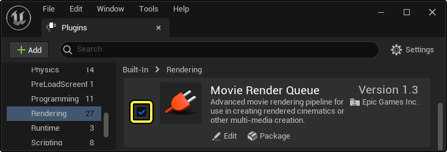
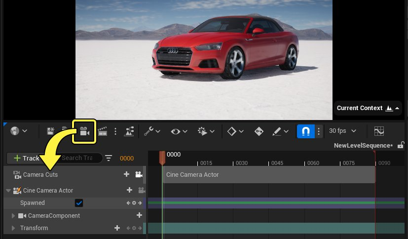
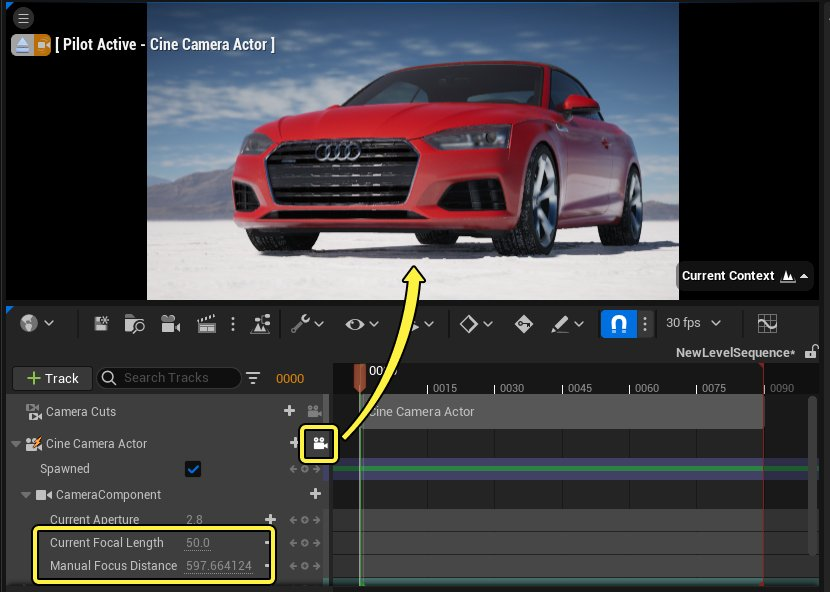
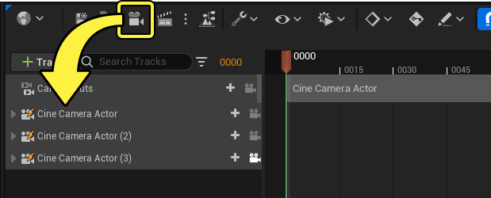
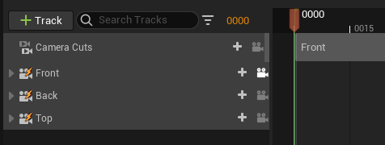
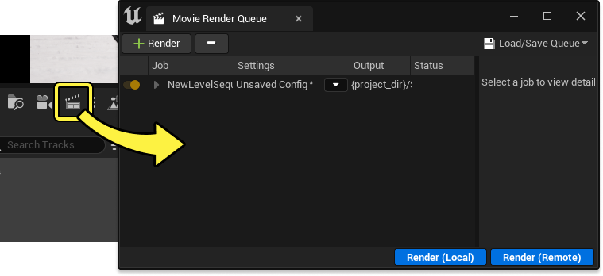
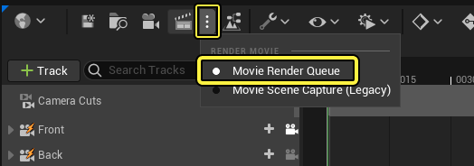
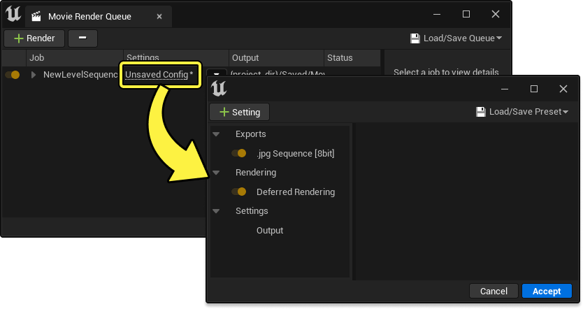

# 从多个摄像机角度渲染

> 路径：虚幻引擎5.7文档 / 为角色和对象制作动画 / 过场动画和Sequencer / 过场动画流程指南和示例 / 从多个摄像机角度渲染

> 原始页面：https://dev.epicgames.com/documentation/unreal-engine/rendering-from-multiple-camera-angles-in-unreal-engine

使用[影片渲染队列]animating-characters-and-objects/Sequencer/movie-render-pipeline#影片渲染队列)渲染时，可能需要在单个序列或[镜头](../../unreal-engine-sequencer-movie-tool-overview/sequences-shots-and-takes/index.md#%E9%95%9C%E5%A4%B4)中从多台过场动画摄像机渲染。例如，你可能正在渲染产品演示视频或培训材料，而这种渲染可能需要多个角度。若在单个镜头内从多个角度渲染，可能比使用[镜头试拍](../../unreal-engine-sequencer-movie-tool-overview/sequences-shots-and-takes/index.md#%E9%95%9C%E5%A4%B4%E8%AF%95%E6%8B%8D)更理想，因为镜头试拍会造成系统创建新的关卡序列资产，令你的内容分散。

本文档概要介绍如何利用影片渲染队列在单个镜头中渲染多个摄像机角度。

#### 先决条件

- 你具备创建和打开

  关卡序列

  的基础知识
- 影片渲染队列（Movie Render Queue）是一个[插件](../../../../understanding-the-basics/foundational-knowledge-in/working-with-plugins/index.md)，你必须先将它启用才能使用。在虚幻引擎的主菜单中，转至 **编辑（Edit）> 插件（Plugins）** ，在 **渲染（Rendering）** 分段找到 **影片渲染队列（Movie Render Queue）** ，然后点击复选框将其启用。然后，重新启动虚幻引擎。

  

## 第一台摄像机设置

假设Sequencer已在你要渲染的关卡内打开，第一步是开始创建你的[过场动画摄像机](../../movie-and-cinematic-cameras/cinematic-cameras/index.md)。

1. 点击 **Sequencer工具栏（Sequencer Toolbar）** 中的 **摄像机（Camera）** 。这会创建一个[可生成](https://dev.epicgames.com/documentation/404)过场动画摄像机Actor（Cine Camera Actor）、[镜头切换轨道](../../unreal-engine-sequencer-movie-tool-overview/sequencer-track-list/cinematic-camera-cut-track/index.md)，然后将过场动画摄像机Actor（Cine Camera Actor）绑定到镜头切换（Camera Cuts）分段。

   
2. 接下来，根据在这个镜头中你想要的取景和动画对摄像机进行[移动和设置关键帧](../../how-to-make-movies/how-to-animate-cinematic-cameras/index.md)。

   1. 启用过场动画摄像机Actor轨道上的 **摄像机** 图标，对摄像机进行导航。
   2. 你还可以调整摄像机专用属性，如 **光圈（Aperture）** 、 **焦距（Focal Length）** 和 **对焦距离（Focus Distance）** ，以帮助你进行镜头构图。

## 其他摄像机设置

现在你可以开始在序列中添加新的摄像机。按照你添加第一台摄像机时的方法操作，即点击Sequencer工具栏（Sequencer Toolbar）中的 **摄像机（Camera）** 。每点击一次就会新增一个摄像机，因此请酌情添加。尽管镜头切换轨道仍绑定在第一台摄像机上（看似这个镜头只包含一台摄像机），但在本指南的最后步骤中，这些其他摄像机将通过影片渲染队列得到正确渲染。

与设置第一台摄像机时执行的步骤类似，在每个新的摄像机轨道上启用 **摄像机** 图标，对其进行导航，并设置你的构图。

> 动图已省略：设置所有摄像机

> [!NOTE]
> 虽然并非强制性步骤，但我们建议你重命名摄像机轨道，以更准确地反映其内容或用法。右键点击一个轨道，然后选择 **重命名（Rename）** ，或按 **F2** 。如果两台摄像机同名，影片渲染队列会自动将它们重命名，以避免发生文件名冲突。
>
> 

## 打开影片渲染队列

在该序列内完成你的所有摄像机的构图和动画处理后，现在可以使用影片渲染队列（MRQ）进行渲染。要打开MRQ，请点击Sequencer工具栏中的 **渲染（Render）** 。

> [!NOTE]
> 如果使用此按钮不能正常打开MRQ，请检查 **渲染（Render）** 旁的下拉菜单，确保它设置为 **影片渲染队列（Movie Render Queue）** 。
>
> 

## 渲染设置

在MRQ窗口打开的情况下，点击 **设置（Settings）** 条目，打开[渲染设置（Render Settings）](../../movie-render-pipeline/cinematic-render-settings-and-formats/index.md)窗口。

点击 **添加设置(+)（Add Setting [+]）** 并选择 **摄像机（Camera）** ，然后选择新添加的摄像机条目并启用 **渲染所有摄像机（Render All Cameras）** 。

> 图片已省略：添加摄像机渲染设置

> [!NOTE]
> 虽然是可选步骤，但你最好在输出（Output）设置中通过 `{camera_name}` [格式字符串](../../movie-render-pipeline/cinematic-render-settings-and-formats/cinematic-rendering-image-bb951eea/index.md#%E6%A0%BC%E5%BC%8F%E5%AD%97%E7%AC%A6%E4%B8%B2%E4%BF%A1%E6%81%AF)编辑 **输出目录（Output Directory）** 或 **文件名格式（File Name Format）** 。使用该字符串可以对你的输出渲染的命名或分类方式进行额外的控制。例如，如果将 **输出目录（Output Directory）** 设置为 `{project_dir}/Saved/MovieRenders/{camera_name}/` ，可以将每个摄像机角度输出到不同的文件夹。
>
> > 图片已省略：设置输出目录
>
> 如果你不使用 `{camera_name}` ，当启用 **渲染所有摄像机（Render All Cameras）** 时，MRQ会自动将摄像机名称作为后缀添加到文件名中，以防止发生文件名冲突。

## 渲染和结果

你的渲染设置完成设置后，点击 **渲染（本地）（Render [Local]）** ，开始MRQ渲染过程。

> 图片已省略：开始渲染

渲染完成时，点击 **输出（Output）** 条目，打开一个文件资源管理器窗口，进入输出目录。你应该会看到你的多个角度在此处得到渲染。在本例中，已按上面详述的步骤将不同的角度按文件夹分开。

> 图片已省略：渲染结果
