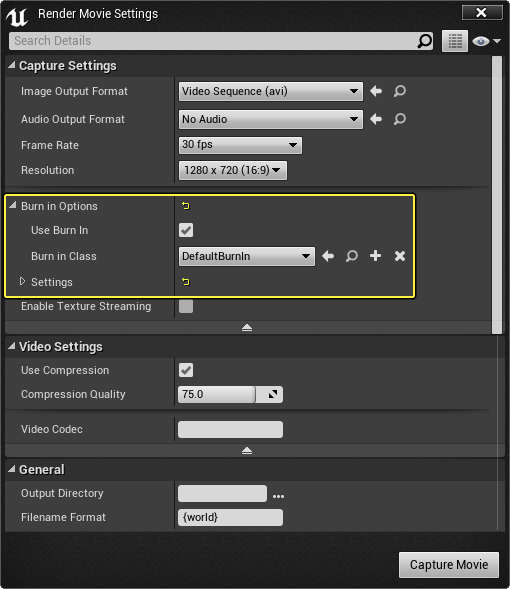

# 渲染过场动画

> 路径：虚幻引擎5.7文档 / 为角色和对象制作动画 / 过场动画和Sequencer / 过场动画流程指南和示例 / 渲染过场动画

> 原始页面：https://dev.epicgames.com/documentation/unreal-engine/rendering-out-cinematic-movies-in-unreal-engine

> [!WARNING]
> 从虚幻引擎5.0开始，Renderer Movie已被废弃。相反，请使用 。

在创建好过场动画之后，甚或在制作过程中作为日常审核工作的一部分，你可能想要将其渲染成可与其他人共享的电影文件。Sequencer中的 **渲染影片（Render Movie）** 选项使你能够通过可用大部分媒体播放器播放的AVI文件与其他人共享电影。

除渲染为电影文件以外，还可以将过场动画渲染为图像序列或渲染可在外部应用程序中使用的 [自定义渲染通道](https://dev.epicgames.com/documentation/404) 来完成场景。选择渲染电影按钮将显示[渲染电影设置](https://dev.epicgames.com/documentation/404)窗口，你可以用它定义如何渲染场景。

在以下示例中，我们将渲染一个样本场景并展示渲染过程中涉及到的部分选项。

## 步骤

> [!NOTE]
> 在本指南中，我们将使用 **蓝图第三人称模板（Blueprint Third Person Template）**，并且会用到 **初学者内容包（Starter Content）**。

1. 在项目中，从 **主工具栏** 单击 **过场动画（Cinematics）** 按钮，然后选择 **添加关卡序列（Add Level Sequence）**。
2. 在 **资产另存为（Save Asset As）** 窗口中，为序列输入名称，然后单击 **保存（Save）**。
3. 在 **Sequencer编辑器** 中，单击 **添加摄像机（Add Camera）** 按钮。
4. 在视口中，将摄像机面向角色放置在关卡中的任意位置，然后按 **S** 键来添加关键帧。 我们将拍摄一个样本场景，其中，我们将把摄像机向关卡中的角色推进，拍摄特写镜头。
5. 在 **Sequencer**中，移动到帧 **150**，然后将关卡中的摄像机移动到新位置并按 **S** 键来添加关键帧。 摄像机现在将从第一个关键帧移动到第二个关键帧，向角色推进。
6. 在 **Sequencer** 中，单击 **渲染电影（Render Movie）** 按钮。 此时 **渲染电影设置（Render Movie Settings）**窗口将打开。 RenderMovieSettings.png 在 **捕捉设置（Capture Settings）** 下，单击 **输出格式（Output Format）** 选项来查看可用选项，然后选择 **视频序列（Video Sequence）**。 RenderMovieSettings_Options.png 除了将序列渲染为电影以外，还可以将它渲染为图像序列或使用[自定义渲染通道](https://dev.epicgames.com/documentation/404)。
7. 在 **常规（General）** 下，选择保存过场动画的 **输出目录（Output Directory）**，然后单击 **捕捉电影（Capture Movie）**。 RenderMovieSettings_Output-1.png 在渲染过程进行时，将显示预览窗口。

   > [!NOTE]
   > 如果弹出 **保存** 提示，请单击 **保存（Save）** 或 **不保存（Don't Save）** 以继续，因为选择 **取消（Cancel）** 将使渲染过程异常中止。

## 最终结果

在捕捉过程完成之后，你将得到过场动画序列的视频文件（下面是我们渲染的过场动画）。

在渲染出视频序列时，还有其他选项可供使用。在制作过程中，有一个选项可能非常有用，那就是给视频添加[烧入](../applying-burn-ins-to-your-movie/index.md)的功能。**烧入** 是视频中嵌入的叠加内容，通常用于提供有关显示的帧的内部信息。

你可以向视频中添加默认烧入，或自己创建的 [自定义烧入](../applying-burn-ins-to-your-movie/index.md)，方法是启用 **使用烧入（Use Burn In）** 选项。

在进行过场动画审核时，该功能非常有用，因为它将显示时间码信息、镜头名称和希望提供的任何其他自定义信息。
