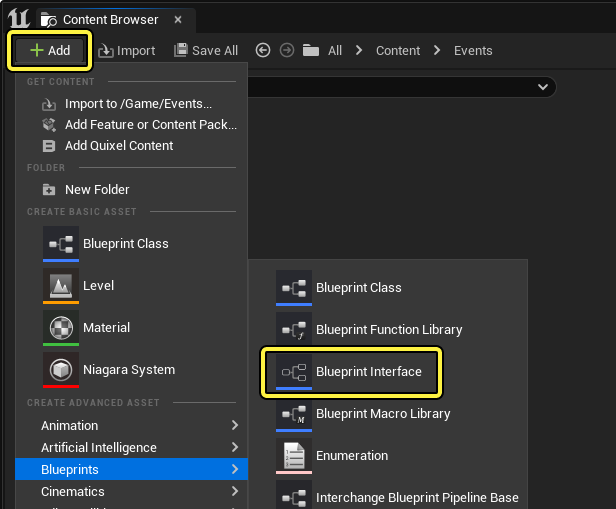
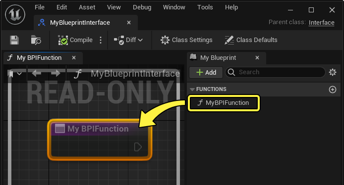
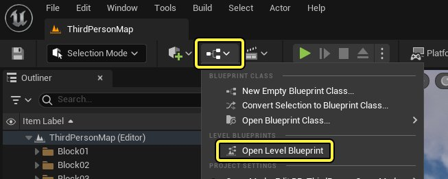
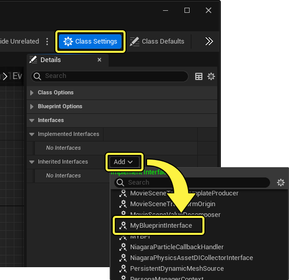
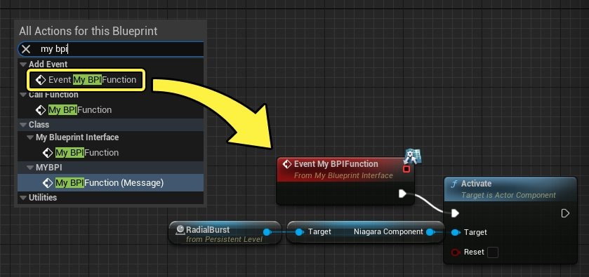
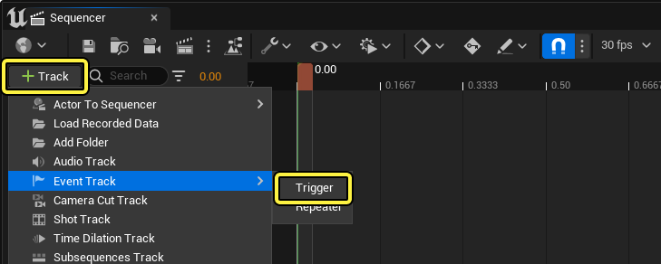
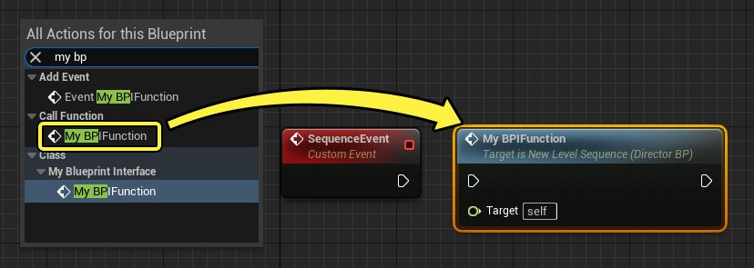

# 从Sequencer触发关卡蓝图事件

> 路径：虚幻引擎5.7文档 / 为角色和对象制作动画 / 过场动画和Sequencer / 过场动画流程指南和示例 / 从Sequencer触发关卡蓝图事件

> 原始页面：https://dev.epicgames.com/documentation/unreal-engine/trigger-level-blueprint-events-from-sequencer-in-unreal-engine

[事件轨道](../../unreal-engine-sequencer-movie-tool-overview/sequencer-track-list/cinematic-event-track/index.md)主要用于在Sequencer的 **导演蓝图（Director Blueprint）** 中触发[蓝图脚本](../../../../blueprints-visual-scripting/index.md)。在你的项目中，可能在一些情况下，你需要Sequencer中的事件在其他蓝图中触发，例如 **关卡蓝图（Level Blueprint）** 。你可以使用[蓝图接口](../../../../blueprints-visual-scripting/specialized-blueprint-visual-scripting-node-groups/types-of-blueprints/blueprint-interface/index.md)执行此操作，并在导演蓝图中执行额外的设置步骤。

本文档介绍如何从Sequencer的事件轨道触发关卡蓝图事件。

#### 先决条件

- 你已经基本理解如何创建和打开

  关卡序列

  。
- 你已经理解如何创建和使用

  事件轨道

  。
- 你已经基本理解

  蓝图

  。

## 创建蓝图接口

首先，创建蓝图接口。在 **内容浏览器（Content Browser）** 中，点击 **添加（Add (+)）** ，然后选择 **蓝图（Blueprints）> 蓝图接口（Blueprint Interface）** 。命名你的资产，并将其打开。

在 **蓝图接口编辑器（Blueprint Interface Editor）** 中，为默认函数提供唯一名称，方便稍后在本指南中查找。

蓝图接口的用途是提供Sequencer导演蓝图和关卡蓝图之间的通信。

## 在关卡中实现接口

接下来，在 **关卡工具栏（Level Toolbar）** 中点击 **关卡蓝图（Level Blueprint）** 并选择 **打开关卡蓝图（Open Level Blueprint）** 以打开关卡蓝图。

启用 **类设置（Class Settings）** ，并在 **细节（Details）** 面板中点击 **继承的接口（Inherited Interfaces）** 的 **添加（Add）** 下拉菜单。找到并选择你的蓝图接口，将其添加到关卡蓝图。

右键点击 **事件图表（Event Graph）** 并从蓝图接口添加 **事件（Event）** 。事件名称与你之前在本指南中命名的函数名称匹配。添加该事件，并将其连接到你想触发的关卡蓝图逻辑。由于蓝图具有任意性，本指南将假定你的关卡蓝图逻辑已经创建。在本示例中，该逻辑会激活[Niagara系统](../../../../visual-effects/index.md)。

## 设置事件轨道

现在逻辑的关卡蓝图端已设置好，你可以在Sequencer的事件轨道中实现逻辑的其余部分。

打开 **关卡序列（Level Sequence）** ，然后创建 **事件轨道（Event Track）** ，方法是点击 **添加轨道（Add Track (+)）> 事件轨道（Event Track）> 触发器（Trigger）** 。

选择 **事件轨道（Event Track）** 并按 **Enter** 键在播放头创建 **事件关键帧（Event keyframe）** 。双击此关键帧，打开 **导演蓝图（Director Blueprint）** 并将该关键帧绑定到新的 **事件（Event）** 。

> 动图已省略：创建事件关键帧

### 实现接口

按照你之前在关卡蓝图中的操作，在 **导演蓝图（Director Blueprint）** 中启用 **类设置（Class Settings）** ，然后在 **细节（Details）** 面板中点击 **继承的接口（Inherited Interfaces）** 的 **添加（Add）** 下拉菜单。找到并选择你的 **蓝图接口（Blueprint Interface）** ，将其添加到关卡蓝图。

### 创建逻辑

右键点击 **导演蓝图图表（Director Blueprint Graph）** ，在 **调用函数（Call Function）** 类别下，从你的蓝图接口添加 **函数（Function）** 。函数名称与你之前在本指南中命名的函数名称匹配。

> [!WARNING]
> 确保你使用的是以你的序列导演蓝图为目标的蓝图接口函数。其他函数目标将不起作用。
>
> > 图片已省略：确保函数以序列导演为目标

将 **执行（execution）** 和 **目标（target）** 引脚连接到 **事件（Event）** 。

> 动图已省略：将函数连接到事件

### 将关键帧绑定到目标

最后，返回到 **事件轨道（Event Track）** 并右键点击 **关键帧（keyframe）** 。在 **属性（Properties）** 菜单下，将 **将边界对象传递到（Pass Bound Object To）** 设置为 **目标（Target）** 。

> 图片已省略：将

> [!NOTE]
> 尽管没有实际目标，但连接和绑定 **目标（Target）** 是必要步骤。这是因为，没有指定目标时，蓝图接口系统会回退到关卡蓝图，然后正确地链接到其中的接口。

## 结果

完成上述步骤后，现在你可以运行或模拟你的关卡。运行序列时，关卡事件应该会触发。

> 动图已省略：sequencer事件触发关卡事件
