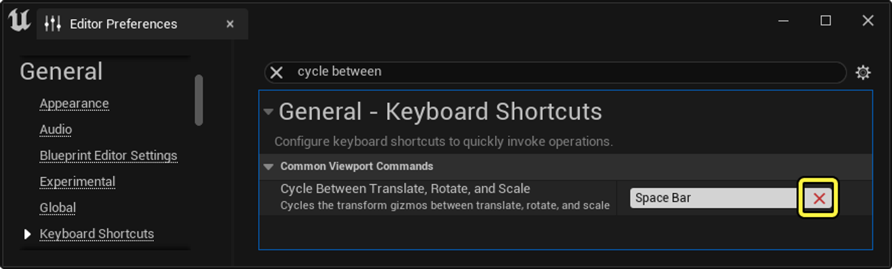
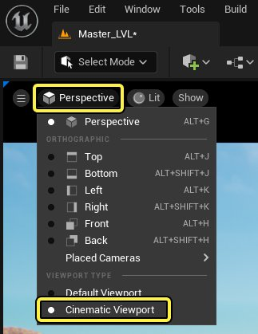
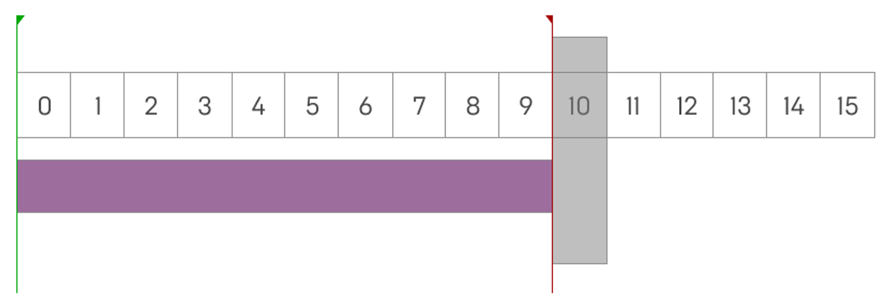
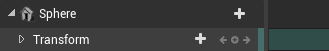
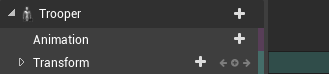
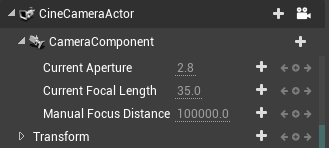
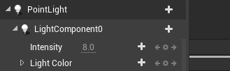
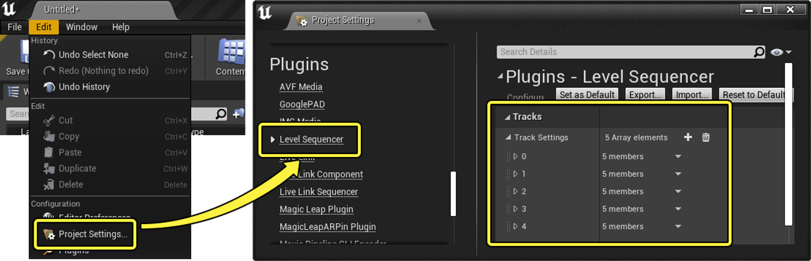

# 过场动画快捷方式和提示

> 路径：虚幻引擎5.7文档 / 为角色和对象制作动画 / 过场动画和Sequencer / 过场动画快捷方式和提示

> 原始页面：https://dev.epicgames.com/documentation/unreal-engine/cinematic-workflow-tips-for-sequencer-in-unreal-engine

为了提高你的过场动画工作效率，Sequencer编辑器中内置了若干快捷方式。 本文档将介绍Sequencer的常见工作流程、如何克服问题及其他实用功能。

## 播放

### 空格键播放切换

默认情况下，仅当窗口焦点位于Sequencer上时，方可使用**空格键**作为热键来切换序列的播放。 如果焦点在视口上，按空格键将循环切换各变换操控模式。

若要无视窗口焦点的位置用空格键切换Sequencer的播放，请执行以下步骤：

1. 打开[编辑器偏好设置（Editor Preferences）](../../../understanding-the-basics/foundational-knowledge-in/unreal-editor-preferences/index.md)窗口，在**通用（General） > 键盘快捷键（Keyboard Shortcuts）**下找到**在平移、旋转和缩放之间循环切换（Cycle Between Translate, Rotate, and Scale）**。 点击**移除此绑定（X）（Remove this binding (X)）**即可将此快捷方式取消绑定。

   

   > [!NOTE]
   > 你仍然可以按下**Q**、**W**、**E**和**R**以分别启用**选择**、**平移**、**旋转**和**缩放**，以使用热键切换这些变换模式。
2. 转到视口的**视角（Perspective）**菜单，启用[过场动画视口（Cinematic Viewport）](../movie-and-cinematic-cameras/cinematic-viewport-controls/index.md)。

   
3. 现在，你可以在焦点位于Sequencer或过场动画视口上时按下**空格键**，而播放将会正确切换。

   > 动图已省略：空格键播放切换

### 非独占帧和独占帧

虚幻引擎内的动画使用"非独占"帧和"独占"帧的概念，这两个概念将确定是否对完整帧进行完全包含或求值。 通常而言，在序列中定义**开始帧**和**结束帧**时，比如为[动画](../unreal-engine-sequencer-movie-tool-overview/sequencer-track-list/cinematic-animation-track/index.md)、[镜头](../unreal-engine-sequencer-movie-tool-overview/sequences-shots-and-takes/index.md)或整个Sequencer播放时间定义这些帧时，这一点有重要意义。

对于Sequencer，开始帧为非独占帧，结束帧为独占帧，这会导致对直至结束帧的所有帧数据进行求值。 在本例中，开始时间被设为**0**，结束时间被设为**10**，这意味着实际耗时为**9.999**（重复）帧。 换言之，它的求值一直持续到结束时间，但并未持续到底。 这模仿了Adobe Premiere等大多数非线性编辑软件中常见的行为。

预计可以利用此功能实现以下行为：

- 如果启用[推移时保持光标在播放范围内（Keep Cursor in Playback Range While Scrubbing）](../unreal-engine-sequencer-movie-tool-overview/sequencer-editor/sequencer-cinematic-toolbar/index.md)，那么你应该无法推移或查看序列中的确切结束帧。 虽然该帧上可能存在数据，但Sequencer永远不会到达它。 在本例中，结束时间为**0346**帧，但播放仅会到达**0345***帧。
- 如果播放头位于两个分段接触的同一点（如镜头），则将显示下一个镜头而不是上一个镜头的数据。
- 使用[影片渲染队列](https://dev.epicgames.com/documentation/assets/animating-characters-and-objects/Sequencer/movie-render-pipeline#movierenderqueue)渲染图像序列时，结束帧将被排除在外。 这意味着，如果序列包含帧**0 - 50**，那么图像序列将输出帧**0 - 49**。

> [!NOTE]
> Sequencer对非独占帧和独占帧的处理方式与[动画序列](../../skeletal-mesh-animation-system/animation-assets-and-features/animation-sequences/index.md)不同，后者同时包括开始帧和结束帧。 导入动画FBX时，虚幻引擎将包括最终帧以外的少量数据，这会导致最终帧完全包括在内。 如果对未编辑的动画分段末端的放大足够大的倍率，可以在Sequencer中观察到这一点。
>
> 但对动画执行修剪以及其他[分段编辑](../unreal-engine-sequencer-movie-tool-overview/creating-animation-keyframes/index.md)操作将恢复Sequencer的结束帧独占行为。

## 工作流程快捷方式

### 鼠标中键擦除

与Autodesk Maya类似，你可以在时间轴中点击并拖动**鼠标中键**，从而更改当前时间，但不触发更新或求值。 当你想将其他包围关键帧设置为相同的值但不同的时间时，此快捷方式可能会有帮助。 以这种方式操控播放头时，它的颜色将变为**黄色**，表示序列未求值。

> 动图已省略：鼠标中键推移

### 将Actor添加到Sequencer

从[内容浏览器](../../../understanding-the-basics/content-browser/index.md)或通过[放置Actor](../../../understanding-the-basics/actors-and-geometry/placing-actors/index.md)将新Actor拖入关卡时，按下某些键也会将其添加到Sequencer。 根据按下的键，你会将Actor添加为[可生成对象或可持有对象](../unreal-engine-sequencer-movie-tool-overview/spawn-temporary-actors-in-unreal-engine-cinematics/index.md)。

- 按住**Ctrl**即可将新Actor作为可持有对象添加到Sequencer。
- 按住**Shift**即可将新Actor作为可生成对象添加到Sequencer。

### 默认轨道

向Sequencer添加某些Actor时，你可能会注意到轨道是自动创建的。 例如：

- **[静态网格体Actor](../../../understanding-the-basics/actors-and-geometry/unreal-engine-actors-reference/static-mesh-actors/index.md)**会自动创建一条[变换（Transform）轨道](../unreal-engine-sequencer-fa6b165a/sequencer-track-list/cinematic-transform-and-property-tracks/index.md)。

  
- **[骨架网格体Actor](../../../understanding-the-basics/actors-and-geometry/unreal-engine-actors-reference/skeletal-mesh-actors/index.md)**会自动创建一条[变换（Transform）轨道](../unreal-engine-sequencer-fa6b165a/sequencer-track-list/cinematic-transform-and-property-tracks/index.md)和一条**[动画（Animation）轨道](../unreal-engine-sequencer-movie-tool-overview/sequencer-track-list/cinematic-animation-track/index.md)**。

  
- **[电影摄像机Actor](../movie-and-cinematic-cameras/cinematic-cameras/index.md)**会自动创建一条[变换（Transform）轨道](../unreal-engine-sequencer-fa6b165a/sequencer-track-list/cinematic-transform-and-property-tracks/index.md)和一个**摄像机（Camera）组件**（带**光圈（Aperture）**、**焦距（Focal Length）**和**对焦距离（Focus Distance）**属性轨道）。

  
- **[光源Actor](../../../building-virtual-worlds/lighting-the-environment/light-types-and-their-mobility/index.md)**会自动创建**光源（Light）组件**，带**强度（Intensity）**和**光源颜色（Light Color）**属性轨道。

  

出现这种情况的原因是[Sequencer插件项目设置](../unreal-engine-sequencer-movie-tool-overview/cinematic-editor-and-project-settings/index.md)中的**轨道设置**。 你可以打开**项目设置（Project Settings）**窗口，在**插件（Plugins）**类别中的**关卡Sequencer（Level Sequencer）**中找到这些设置。

默认情况下，系统会使用前面提到的轨道设置来填充**轨道设置（Track Settings）**数组。 你可以点击**添加（+）**按钮来添加新的数组项目。各数组的类别如下：

> 图片已省略：添加轨道设置

| 名称 | 说明 |
| --- | --- |
| **匹配Actor类（Matching Actor Class）** | 你可以在此指定Actor类，以在将其添加到Sequencer时自动为其创建轨道。[匹配Actor类](https://dev.epicgames.com/community/api/documentation/image/7b4876d9-805e-4902-ac66-164bd13a5d8d?resizing_type=fit) |
| **默认轨道（Default Tracks）** | 你需要使用此数组指定将**匹配Actor类**添加到Sequencer时所添加的轨道。 点击**添加（+）**按钮，然后点击下拉菜单即可浏览**Sequencer**的轨道类型。[默认轨道](https://dev.epicgames.com/community/api/documentation/image/0d3feff3-d0c8-4384-83fe-67a42c4b3210?resizing_type=fit) |
| **排除默认轨道（Exclude Default Tracks）** | 此数组用于指定不希望添加到此Actor类的轨道。 如果指定其他轨道进行添加，如当你的类从父类继承时（该父类也在此指定了默认轨道），则可能需要使用此选项。 |
| **默认属性轨道（Default Property Tracks）** | 此数组用于指定将Actor添加到Sequencer时添加的属性轨道。 点击**添加（+）**按钮即可将新属性项添加到数组中。[默认属性轨道](https://dev.epicgames.com/community/api/documentation/image/2d535551-3bef-4602-ba31-bc05e44a4a46?resizing_type=fit)请使用**组件路径（Component Path）**指定要用于添加属性的Actor组件。请使用**属性路径（Property Path）**指定要自动添加的属性名称。 |
| **排除默认属性轨道（Exclude Default Property Tracks）** | 此数组用于指定不希望添加到此Actor类的属性轨道。 如果指定其他轨道进行添加，如当你的类从父类继承时（该父类也在此指定了默认属性轨道），则可能需要使用此选项。 |

### 自动调整镜头大小

在内部调整镜头的开始和结束时间时，你可以使用**自动调整大小（Auto Size）**命令自动让父镜头分段匹配这些编辑。 要执行此操作，请右键点击镜头并选择**编辑（Edit） > 自动调整大小（Auto Size）**。 如果你要对镜头重新定时，并希望镜头分段自动匹配而不需要手动重新修剪，可能适合使用此命令。

### Shift键对齐和对准

将分段资产拖动到Sequencer轨道上时（如[音频](../unreal-engine-sequencer-movie-tool-overview/sequencer-track-list/cinematic-audio-track/index.md)、[子序列](../unreal-engine-sequencer-movie-tool-overview/sequencer-track-list/cinematic-subscequences-track/index.md)或[动画](../unreal-engine-sequencer-movie-tool-overview/sequencer-track-list/cinematic-animation-track/index.md)轨道），按住**Shift**即可将放下的分段对齐到播放头位置。

> 动图已省略：shift键拖动

禁用**对齐到按下的关键帧（Snap to the Pressed Key）**后，你仍然可以按住**Shift**并点击关键帧来对齐播放头与关键帧。 这样可以轻松执行后续操作，如更改此关键帧的数值或将其他关键帧与其对齐。

## 工作流程提示

### 超宽显示器框架

使用不受约束的宽高比制作过场动画时，如果显示器的宽高比与最初预期的宽高比有很大不同，则可能会遇到镜头构图发生变化的情况。 例如，如果在过场动画中创建了以下镜头：

然后，如果在超宽显示器上播放此镜头，宽高比的剧烈变化可能会严重破坏原始框架。

在这种情况下，维持垂直框架设置很重要，所以要解决此问题，你可以导航到**关卡序列Actor**的"细节（Details）"面板并执行以下操作：

- 启用**重载高宽比轴约束（Override Aspect Ratio Axis Constraint）**。
- 将**高宽比轴约束（Aspect Ratio Axis Constraint）**设置为**维持Y轴视野（Maintain Y-Axis FOV）**。

完成后，垂直框架空间将受到限制，无论宽高比如何，都可以保持这些角色的框架。

## 预热渲染

使用[影片渲染队列](https://dev.epicgames.com/documentation/assets/animating-characters-and-objects/Sequencer/movie-render-pipeline#movierenderqueue)（MRQ）创建预渲染序列时，你可能需要"预热"所有镜头，才能正确渲染场景的各个方面。 例如，一些常见问题可能包括：

- 粒子效果和其他效果将在镜头开始时激活，而不是已处于激活状态。
- 布料和其他符合物理特性的实体会镜头开始时显示出明显的"停顿"。
- 镜头的第一个渲染帧可能会表现出明显的锯齿或其他时间瑕疵（噪点）。

你可以使用影片渲染队列内[抗锯齿渲染设置](../movie-render-pipeline/cinematic-render-settings-and-formats/cinematic-rendering-image-bb951eea/index.md)中的各种预热属性来解决这些问题。 根据具体情况，还可能需要考虑其他注意事项来确定最适合使用的设置。

### 粒子

在某些情况下，你可能希望粒子和其他效果在镜头开始之前已激活一段时间。 虽然实时预览可能会显示正确的行为，但使用MRQ渲染可能会导致粒子系统在镜头开始时激活，而这是不希望发生的情况。

|  |  |
| --- | --- |
|  |  |
| 未预热的粒子 | 预热的粒子 |

对于这种粒子情况，你可以通过以下任一方式加以解决：

- 在镜头的开始时间创建粒子的激活（Activate）关键帧，然后根据**引擎预热计数（Engine Warm Up Count）**设置帧的数值。 该数值可以是任意值，具体取决于粒子预热所需的帧数。
- 你也可以创建粒子的激活（Activate）关键帧，或将其连同[镜头切换（Camera Cut）](../unreal-engine-sequencer-movie-tool-overview/sequencer-track-list/cinematic-camera-cut-track/index.md)分段一并移动到序列的**预开始**分段。 然后，启用**使用镜头切换进行预热（Use Camera Cut for Warm Up）**。 这将导致预热时间由镜头切换（Camera Cut）轨道分段占据的预开始区域定义。

> [!NOTE]
> 如果你的粒子**基于GPU**，那么你还需要启用**渲染预热帧（Render Warm Up Frames）**。
>
> > 图片已省略：渲染预热帧

### 布料和物理效果

对于布料和其他物理对象，在渲染时它们往往会在镜头开始时有明显的停顿。 这是由于要等到渲染开始时游戏模拟才会开始，因此物理效果需要时间来稳定地呈现真实的模拟状态。

|  |  |
| --- | --- |
|  |  |
| 布料在开始时停顿（无预热） | 布料不停顿（有预热） |

#### 开始时不运动

若镜头开始时，角色或物理对象无运动（如处于空闲姿势），那么你可以为**引擎预热计数**（Engine Warm Up Count）设置帧数值以修复此问题。 该数值可以是任意值，具体取决于物理效果稳定下来所需的帧数。 通常应使用大于30的数值。

> 图片已省略：引擎预热计数

#### 开始时运动

若在镜头开始时物理对象处于运动状态（如奔跑或跳跃），**引擎预热计数（Engine Warm Up Count**）将不会产生准确的结果。 这是因为它只"预热"起始帧，并未考虑可能已预先发生的运动。 在下图中你可以观察到，左侧示例中的布料从不自然的静止位置开始，然后随着模拟对运动的反应进行校正。

|  |  |
| --- | --- |
|  |  |
| 布料从静止位置开始（预热设置不正确） | 布料正确地从后面开始（使用正确的预热设置） |

为了解决此问题，你必须执行以下操作：

1. 确保你的物理角色或对象在Sequencer的预开始区域（包括**镜头切换（Camera Cuts）**分段）中包含动画数据。 这可能需要你更改动画和变换轨道关键帧，以将其扩展到预开始区域内。

   > 动图已省略：布料预开始动画

   > [!NOTE]
   > 如果你要在[上下文](../unreal-engine-sequencer-movie-tool-overview/sequences-shots-and-takes/index.md)中预览镜头，那么最好在Sequencer的[播放选项（Playback Options）](../unreal-engine-sequencer-movie-tool-overview/sequencer-editor/sequencer-cinematic-toolbar/index.md)菜单中启用**对子序列单独求值（Evaluate Sub Sequences In Isolation）**。 否则，如果在擦除时进入负时间轴区域，将预览上一个镜头，而不是当前镜头的预开始区域。
2. 在抗锯齿（Anti-Aliasing）图像设置中，启用**使用镜头切换进行预热（Use Camera Cut for Warm Up）**。 这将导致预热时间由镜头切换（Camera Cut）轨道分段占据的预开始区域定义。 这会造成序列累积预开始运动，从而使物理效果在镜头开始时处于准确状态。 **引擎预热计数（Engine Warm Up Count）**会对第一帧求值并保留第一帧，**使用镜头切换进行预热（Use Camera Cut for Warm Up）**则会对起始帧之前的序列求值。

   > 图片已省略：布料使用镜头切换作为预热

> [!NOTE]
> 此技巧还可用于为其他东西（如尾迹粒子）构建移动历史。

### 时间瑕疵

在镜头的前几帧，也可能出现由时间抗锯齿（TAA）、时间超级分辨率（TSR）或光线跟踪降噪器等具有时间组件的渲染功能引起的锯齿以及其他瑕疵。 通常，此问题在反光的表面上表现为明显的硬边或颗粒状闪光。 这是由于在渲染开始时累积的时间历史不足所致。

|  |  |
| --- | --- |
|  |  |
| 闪光和锯齿状边缘（无预热） | 平滑边缘和高光（有预热） |

要解决此问题，你可以执行以下任一操作：

- 设置**渲染预热计数（Render Warm Up Count）**的帧数值。 该数值将是为构建第一帧的时间历史而预先渲染的帧数。

  > 图片已省略：时间预热设置
- 若增加**渲染预热计数（Render Warm Up Count）**不能解决问题，你可以改为增加**引擎预热计数（Engine Warm Up Count）**的值，并启用**渲染预热帧（Render Warm Up Frames）**。 这将对序列的第一帧求值，然后持续更新引擎和渲染器，直到已经过**引擎预热计数（Engine Warm Up Count）**的帧数。

  > 图片已省略：时间预热设置
