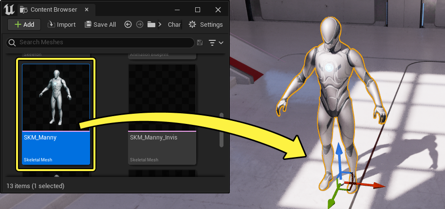
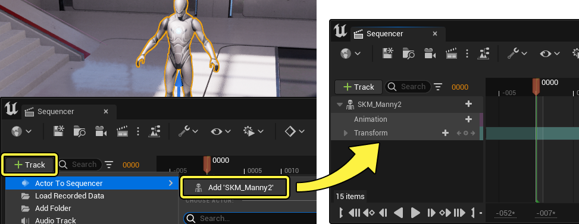
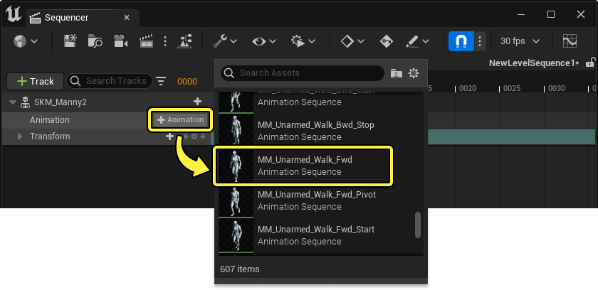

# 将动画应用到角色

> 路径：虚幻引擎5.7文档 / 为角色和对象制作动画 / 过场动画和Sequencer / Sequencer基础 / 将动画应用到角色

> 原始页面：https://dev.epicgames.com/documentation/unreal-engine/how-to-add-cinematic-animation-to-a-character-in-unreal-engine

本文从初学者角度介绍了如何在Sequencer中制作骨骼网格体动画，适合刚接触Sequencer和虚幻引擎的新手。

#### 先决条件

- 你已通读

  Sequencer基础

  页面，并且已经在关卡中创建和打开

  关卡序列

  。
- 你的项目包含一个

  骨骼网格体

  和

  动画序列

  。如果没有，你可以使用

  第三人称模板

  模板创建一个项目，其中已经包含了骨骼网格体和动画。

## 添加角色到Sequencer

首先，为你的关卡添加一个角色。在[内容浏览器](../../../../understanding-the-basics/content-browser/index.md)中找到资产并将其拖到你的关卡中。

然后，打开序列并选择角色，点击 **添加轨道+（Add Track+）** 按钮并选择 **Actor到Sequencer（Actor to Sequencer）>添加'SKM_Manny2'（Add 'SK_Mannequin'）**。这样会将引用该角色的轨道添加到你的序列中。

> [!NOTE]
> 当骨骼网格体轨道添加到序列时，系统会[自动](../../unreal-engine-sequencer-movie-tool-overview/sequencer-track-list/cinematic-actor-tracks/index.md#automatictrackcreation)为此Actor添加合适的轨道。在此示例中，[动画](../../unreal-engine-sequencer-movie-tool-overview/sequencer-track-list/cinematic-animation-track/index.md)和[变换](../../unreal-engine-sequencer-fa6b165a/sequencer-track-list/cinematic-transform-and-property-tracks/index.md)轨道就是自动创建的。

## 将动画应用到角色

点击动画轨道上的 **添加动画+（Add Animation+）** 按钮。这将列出与你的角色骨架兼容的所有可用动画。选择其中一个动画，将其添加到你的序列中。

添加动画后，点击 **播放** 可预览序列。如果动画需要继续超过当前端点，可以拖动剪辑片段的边缘来扩展它。

> 动图已省略：播放角色动画Sequencer
