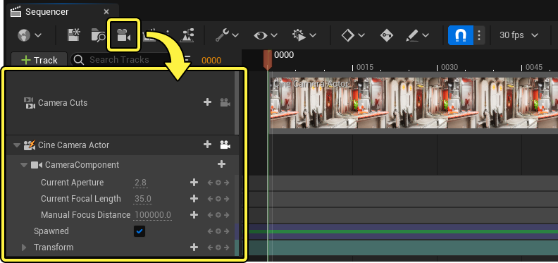
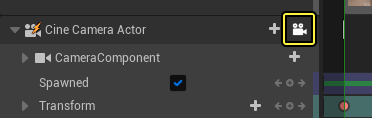
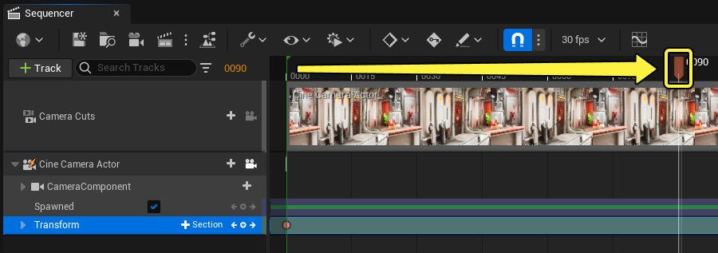

# 创建摄像机动画

> 路径：虚幻引擎5.7文档 / 为角色和对象制作动画 / 过场动画和Sequencer / Sequencer基础 / 创建摄像机动画

> 原始页面：https://dev.epicgames.com/documentation/unreal-engine/how-to-animate-cinematic-cameras-in-unreal-engine

本页面将提供在Sequencer中创建摄像机动画的入门概述，适合刚接触过场动画和虚幻引擎的新手。

#### 先决条件

- 你已通读 **[Sequencer基础](../index.md)** 页面，并且已经在关卡中创建和打开 **关卡序列**。
- 你对 [视口导航和功能按钮](../../../../get-started/unreal-engine-for-new-users/viewport-controls/index.md)有了基本的了解。

## 创建摄像机

首先在你的序列中创建一个 [Cine Camera Actor](../../movie-and-cinematic-cameras/cinematic-cameras/index.md)。 执行此操作的最快方法是，点击Sequencer工具栏中的 **创建新摄像机（Create New Camera）** 按钮。这将为此序列创建一个摄像机Actor作为[可生成物](https://dev.epicgames.com/documentation/404)，并自动将视口的视角更新为摄像机Actor的视角（称为 **导航**)。

> [!NOTE]
> 为确保你可以正确导航摄像机，请确保勾选摄像机上的 **锁定Cine Camera（Lock Cine Camera）** 选项。
>
> 

## 创建变换关键帧

然后，你可以开始设置摄像机动画。 从视口中，将你的摄像机与初始位置和你要使用的框架对齐。然后，找到摄像机的 [变换轨道（Transform track）](../../unreal-engine-sequencer-fa6b165a/sequencer-track-list/cinematic-transform-and-property-tracks/index.md#transformtrack)，选择它，然后按 **Enter** 键。这将设置摄像机的初始变换[关键帧](../../unreal-engine-sequencer-movie-tool-overview/creating-animation-keyframes/index.md)。

> 动图已省略：创建摄像机关键帧

接下来，沿着时间轴拖动播放头标识，移到序列中靠后的某个位置。

最后，在视口中将摄像机移动到新位置。完成后，返回 **变换轨道（Transform track）**，选择它，然后按 **Enter** 键放置另一个变换关键帧。

> 动图已省略：创建摄像机关键帧

## 预览成果

你现在可以点击Sequencer中的 **播放（Play）** 按钮预览摄像机动画。你还可以通过向序列添加更多关键帧来进一步优化摄像机动画。

> 动图已省略：运行Sequencer摄像机
