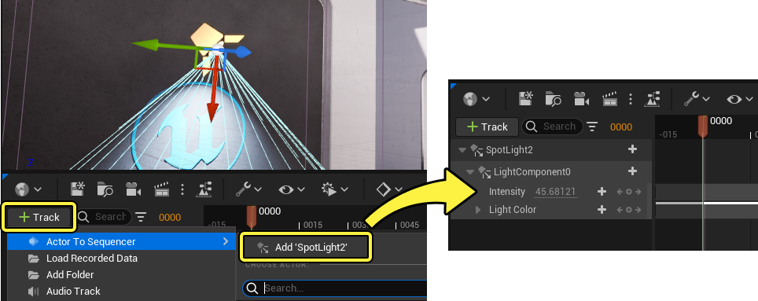

# 制作光源动画

> 路径：虚幻引擎5.7文档 / 为角色和对象制作动画 / 过场动画和Sequencer / Sequencer基础 / 制作光源动画

> 原始页面：https://dev.epicgames.com/documentation/unreal-engine/how-to-animate-lights-in-unreal-engine

本文介绍了如何在Sequencer中制作光源动画，旨在面向刚接触过场动画和虚幻引擎的用户。

#### 先决条件

- 你已通读

  Sequencer基础

  页面，并且已经在关卡中创建和打开

  关卡序列（Level Sequence）

  。
- 光源

  已放入你的关卡。

## 将光源添加到Sequencer

首先将光源添加到你的序列。为此，请点击 **添加轨道（Add Track (+)）** 按钮，并选择 **Actor到Sequencer（Actor to Sequencer） > 添加"光源"（Add 'Light'）**。任意类型的光源Actor都可以添加为Sequencer中的轨道

> [!NOTE]
> 每次将光源添加到Sequencer时，系统会将其中一些常用轨道[自动添加](../../unreal-engine-sequencer-movie-tool-overview/sequencer-track-list/cinematic-actor-tracks/index.md#automatictrackcreation)到序列中。在此示例中，**强度（Intensity）** 和 **光源颜色（Light Color）** 轨道已自动添加到序列中。

## 制作强度动画

要制作光源强度动画，请选择光源的 **强度（Intensity）** 轨道并按 **Enter** 键。这将使用当前强度值设置关键帧。

> 动图已省略：制作光源强度动画

接下来，拖动播放头，移到序列中靠后的某个位置。

最后，调整 **强度（Intensity）** 轨道，设置新的光照强度值。具体做法可以是，拖动该轨道来更新值，或者选择文本框后直接输入值。采用上述任一方法，都会按播放头的当前时间创建新的关键帧。此时，可以沿序列拖动播放头或者播放序列以预览动画。

> 动图已省略：制作光源强度动画

## 制作颜色动画

要更改光源的颜色，请选择 **光源颜色（Light Color）** 轨道并按 **Enter** 键。这将按当前颜色值设置关键帧。双击关键帧打开取色器工具，然后选择颜色值，并点击 **确定（OK）** 以确认更改。

> 动图已省略：制作光源颜色动画

接下来，拖动播放头标识，移到序列中靠后的某个位置。

选择 **光源颜色（Light Color）** 轨道并按 **Enter** 以放置另一个关键帧，从而设置新的颜色关键帧。双击该关键帧，从取色器工具选择颜色。此时，可以沿序列拖动播放头或者播放序列以预览颜色动画。

> 动图已省略：制作光源颜色动画
