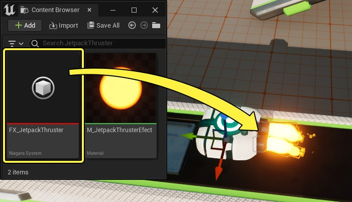
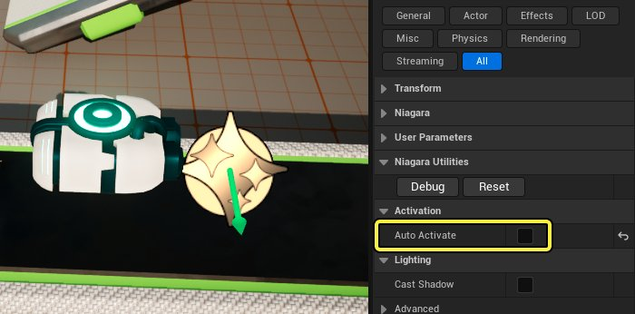
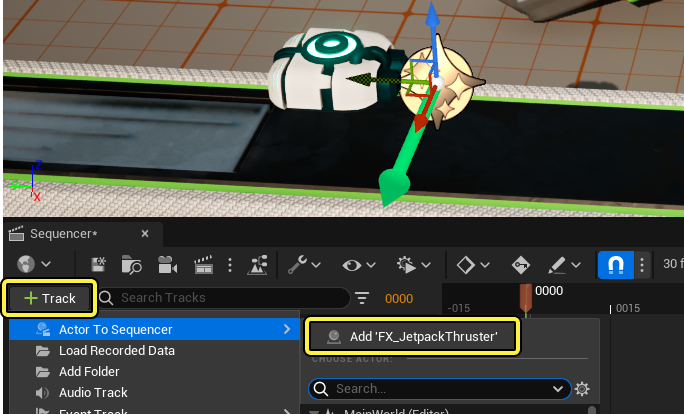
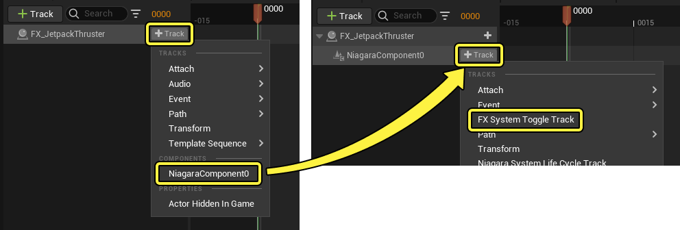
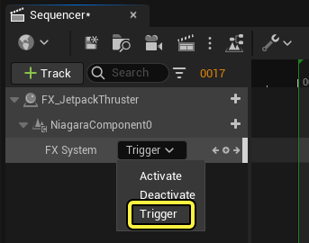
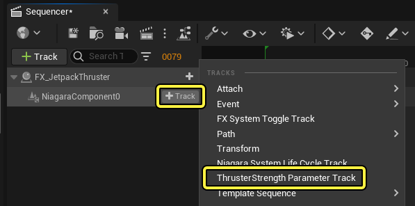

# 启用粒子

> 路径：虚幻引擎5.7文档 / 为角色和对象制作动画 / 过场动画和Sequencer / Sequencer基础 / 启用粒子

> 原始页面：https://dev.epicgames.com/documentation/unreal-engine/how-to-trigger-cinematic-particle-effects-in-unreal-engine

本页面提供在Sequencer中触发效果的入门概述，适合刚接触过场动画和虚幻的新手。

#### 先决条件

- 你已通读

  Sequencer基础

  页面，并且已经在关卡中创建和打开

  关卡序列

  。
- 你的项目包含

  Niagara系统

  。下方示例使用的效果来自

  Stack O Bot项目

  。

## 将效果添加到Sequencer

首先将效果添加到你的关卡。为此，请打开[内容浏览器](../../../../understanding-the-basics/content-browser/index.md)，找到 **Niagara系统（Niagara System）** 资产，将其拖入你的关卡。

> [!NOTE]
> 你最好在粒子的 **细节（Details）面板** 中禁用 **自动激活（Auto Activate）** 属性，以防止干扰你在Sequencer中想要采用的粒子控制方式。
>
> 

接下来，在打开你的序列并选择了Niagara系统的情况下，点击 **添加轨道（+）（Add Track (+)）** 按钮，然后选择 **Actor到Sequencer（Actor to Sequencer）> 添加"Niagara系统"（Add 'Niagara System'）** 。这会将引用该效果的轨道添加到你的序列中。

添加轨道后，请执行以下操作：

1. 在Niagara轨道上，点击

   添加轨道（+）（Add Track (+)）

   并选择

   NiagaraComponent0

   。
2. 在NiagaraComponent0轨道上，点击

   添加轨道（+）（Add Track (+)）

   并选择

   FX系统开关轨道（FX System Toggle Track）

   。

## 激活效果

现在，你的效果已添加到Sequencer，根据效果是旨在[持续存在](#%E6%8C%81%E7%BB%AD%E6%95%88%E6%9E%9C)还是特别[触发](#%E8%A7%A6%E5%8F%91%E6%95%88%E6%9E%9C)，有两种主要的触发方式。

### 持续效果

对于无限循环的效果，你需要创建 **激活（Activate）** 和 **停用（Deactivate）** 关键帧。

首先，选择FX系统轨道，确保下拉菜单设置为 **激活（Activate）** ，然后按下 **Enter** 。这会在粒子系统轨道上设置一个 **激活（Activate）** 关键帧，用于在此时启用该效果。

> 动图已省略：创建激活关键帧

接下来，拖动播放头，将其移到序列中靠后的某个位置。然后，点击FX系统轨道上的下拉菜单并选择 **停用（Deactivate）** 。这会设置 **停用（Deactivate）** 关键帧，用于在此时禁用该效果。

> 动图已省略：创建停用关键帧

现在，当你播放序列时，应该会看到粒子在对应的关键帧激活与停用。

> 动图已省略：播放效果

### 触发效果

若效果仅需播放一次，不需无限循环，你可以使用 **触发（Trigger）** 关键帧。

首先，点击FX系统轨道上的下拉菜单，选择 **触发（Trigger）** 。这会将关键帧的类型更改为触发（Trigger），它没有启用/禁用状态。

接下来，选择 **FX系统（FX System）** 轨道并按下 **Enter** 以放置关键帧。现在你应该会看到效果播放。

> 动图已省略：创建触发关键帧

你可以酌情为粒子系统设置任意数量的 **触发（Trigger）** 关键帧。它们都将在播放序列时通过对应的关键帧触发。

> 动图已省略：多个触发关键帧

## 为参数制作动画

如果你的Niagara系统包含[用户公开的参数](../../../../visual-effects/getting-started-in-niagara-effects/overview-of-niagara-effects/index.md#%E5%8F%82%E6%95%B0%E5%92%8C%E5%8F%82%E6%95%B0%E7%B1%BB%E5%9E%8B)，你也可以在Sequencer中为它们制作动画。

要访问参数，请点击NiagaraComponent0上的 **添加轨道（+）（Add Track (+)）** ，然后选择 **参数轨道（Parameter Track）** 。这会为参数添加兼容的[属性轨道](../../unreal-engine-sequencer-fa6b165a/sequencer-track-list/cinematic-transform-and-property-tracks/index.md)。

接下来，选择参数轨道（Parameter Track）并按下Enter以创建关键帧，然后将播放头移动到其他位置并更改轨道上的属性数值，以便为该数值设置新的关键帧。你现在可以播放该序列以查看参数动画。

> 动图已省略：为niagara参数制作动画
