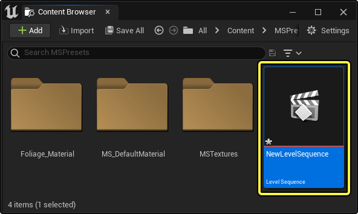
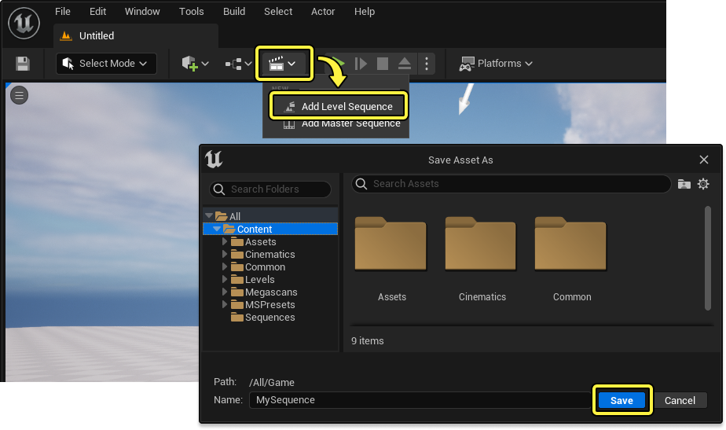
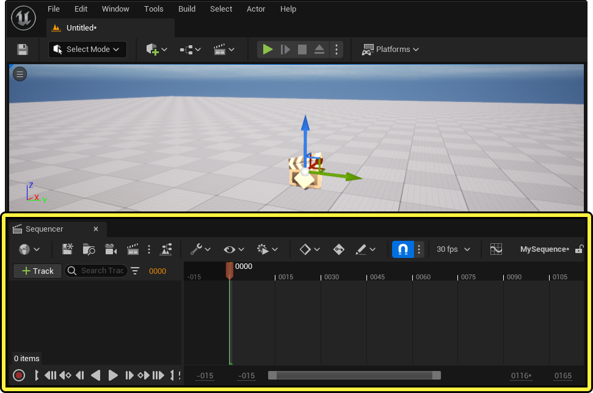

# Sequencer基础

> 路径：虚幻引擎5.7文档 / 为角色和对象制作动画 / 过场动画和Sequencer / Sequencer基础

> 原始页面：https://dev.epicgames.com/documentation/unreal-engine/how-to-make-movies-in-unreal-engine

本文介绍了在虚幻引擎中用 **Sequencer** 创建过场动画和时间触发器的基础知识。

## 什么是Sequencer?

Sequencer是虚幻引擎的过场动画编辑器，允许用户为动画角色、摄像机、各种属性以及其他Actor制作动画。它提供了一个非线性的编辑环境，允许你按时间轴创建、修改轨道和关键帧。

关于Sequencer的概述及其主要功能，请参阅[Sequencer概述](../unreal-engine-sequencer-movie-tool-overview/index.md)。

> 动图已省略：What is Sequencer

## 如何创建序列和打开Sequencer

使用Sequencer时，需要你先创建 **关卡序列资产（Level Sequence Asset）**。这些资产保存在[内容浏览器](../../../understanding-the-basics/content-browser/index.md)中，供 **关卡序列Actor（level sequence actor）** 引用，从而将Sequencer的数据绑定到关卡中。

你可以使用以下任一方法创建关卡序列T：

- 点击

  主工具栏

  中的过场动画图表，选择

  添加关卡序列（Add Level Sequence）

  。
- 在内容浏览器中点击右键空白区域，选择

  过场动画（Cinematics） > 关卡序列（Level Sequence）

  .

点击项目中的任意关卡序列即可打开Sequencer。**Sequencer编辑器** 会在虚幻编辑器窗口底部打开。

## 如何用Sequencer创建内容？

以下指南将介绍Sequencer中的常见操作。

- [创建摄像机动画](how-to-animate-cinematic-cameras/index.md) - 关于如何在Sequencer中创建摄像机动画的入门探索。

- [将动画应用到角色](how-to-add-cinematic-animation-to-a-character/index.md) - 关于如何在Sequencer中添加角色动画的入门探索。

- [制作光源动画](how-to-animate-lights/index.md) - 关于如何在Sequencer中制作光源动画的入门探索。

- [启用粒子](how-to-trigger-cinematic-particle-effects/index.md) - 关于如何在Sequencer中启用不同类型的粒子的入门探索。
