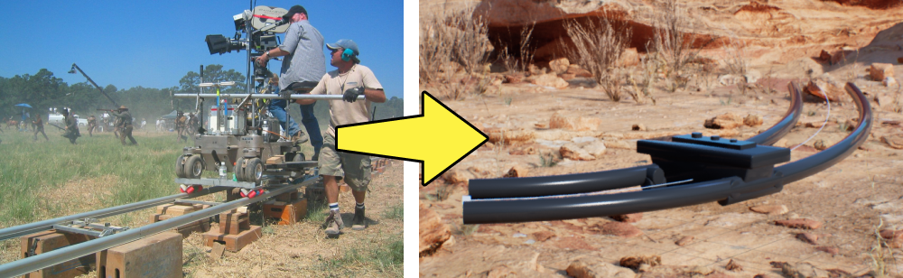
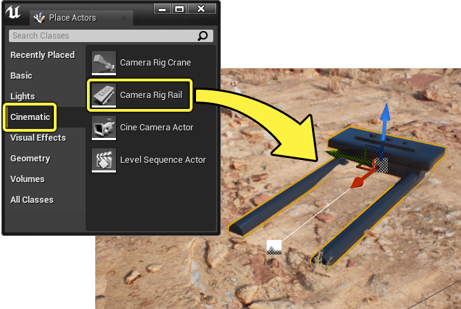
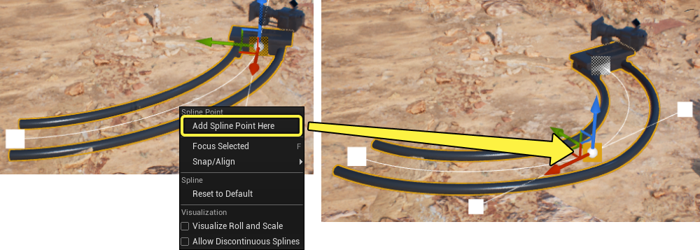
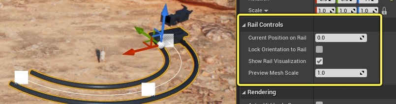
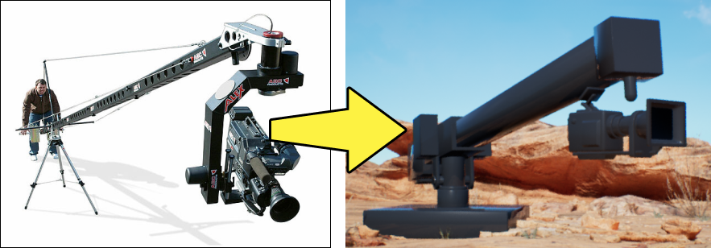
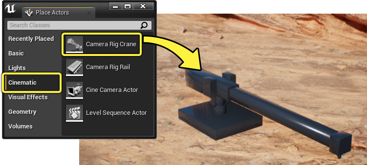
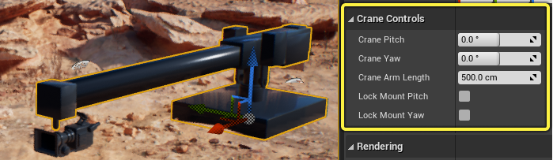
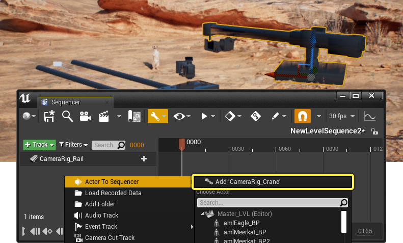

# 摄像机绑定

> 路径：虚幻引擎5.7文档 / 为角色和对象制作动画 / 过场动画和Sequencer / Sequencer中的摄像机 / 摄像机绑定

> 原始页面：https://dev.epicgames.com/documentation/unreal-engine/camera-jibs-and-dollies-in-unreal-engine

现实中，电影制作人用于创造平滑的横扫镜头的方式之一是使用 **摄像机绑定（Camera Rigs）**，摄像机可以附着到绑定器材上。在虚幻引擎中，你可以使用 **导轨（Rail）** 和 **升降机（Crane）** 绑定创建真实的摄像机运动。

#### 先决条件

- 你先需要了解 **[过场动画摄像机Actor](../cinematic-cameras/index.md)**，并已经将一个电影摄像机Actor添加到关卡中。
- 你需要知道如何在 **[Sequencer](../../how-to-make-movies/index.md)** 中 **[创建摄像机动画](../../how-to-make-movies/how-to-animate-cinematic-cameras/index.md)**。

## 摄像机绑定导轨

摄像机绑定导轨用于模仿 **[摄像机推车（Camera Dolly）](https://en.wikipedia.org/wiki/Camera_dolly)** 系统，用于创建 **[跟随镜头（Tracking Shots）](https://en.wikipedia.org/wiki/Tracking_shot)**。你可以根据镜头需要调整导轨的轨道长度和弧度。

### 创建

要将导轨绑定添加至关卡，可以在 **[放置Actors（Place Actors）](../../../../understanding-the-basics/actors-and-geometry/placing-actors/index.md)** 面板的 **过场动画（Cinematic）** 选项卡中找到 **摄像机绑定导轨（Camera Rig Rail）**，将它从面板上拖拽到视口中。

接下来，将摄像机移动到你选择好的位置，和推车相关联，将 **[世界大纲视图](../../../../building-virtual-worlds/level-editor/outliner/index.md)** 中的摄像机Actor拖拽到绑定导轨上，以便将摄像机固定至导轨。

> 动图已省略：attach camera rig rail

> [!NOTE]
> 将摄像机固定至推车后，还可以继续移动，以便对最终位置进行微调。

### 轨道长度和形状

摄像机绑定导轨使用虚幻引擎的 **[蓝图样条](../../../../building-virtual-worlds/blueprint-splines/index.md)** 来确定轨道长度和形状。默认情况下，导轨在轨道头尾使用线性样条线点。可以选择并移动这些点，以便调整轨道的长度和方向。

> 动图已省略：camera rig rail length

选择并移动样条线切线点会基于切线角度向轨道添加弧度。

> 动图已省略：camera rig rail curve

可以向轨道样条线添加额外的点，以便微调轨道的形状。选择绑定导轨，右击样条线并选择 **在此处添加样条线点（Add Spline Point Here）** 在你的光标位置处添加一个新的点。

### 导轨功能选项

选择 **摄像机绑定导轨Actor（Camera Rig Rail Actor）** 时，会显示以下属性，以便控制其行为和运动。

| 名称 | 描述 |
| --- | --- |
| **当前在导轨上位置（Current Position on Rail）** | 此属性控制推车沿着轨道运动。值的范围必须在 **0** 和 **1** 之间，其中 **0** 表示轨道 **起点**，**1** 表示 **终点**。 current position on rail |
| **将朝向锁定至导轨（Lock Orientation to Rail）** | 默认情况下，摄像机朝向和推车朝向单独进行设置。启用 **将朝向锁定至导轨（Lock Orientation to Rail）** 会将摄像机旋转设为和推车旋转相关联。 lock orientation to rail |
| **显示导轨可视化（Show Rail Visualization）** | 禁用 **显示导轨可视化（Show Rail Visualization）** 可以隐藏推车和轨道网格体，仅样条线可见。 show rail visualization |
| **预览网格体缩放（Preview Mesh Scale）** | 此属性控制轨道和推车预览几何体尺寸。 preview mesh scale |

## 摄像机绑定升降机

**摄像机绑定升降机Actor（Camera Rig Crane Actor）** 用于模仿吊臂或 **[摄像机吊臂（Camera Jib）](https://en.wikipedia.org/wiki/Jib_%28camera%29)** 系统，用于创建 **[升降镜头（Crane Shots）](https://en.wikipedia.org/wiki/Crane_shot)**。升降机沿着水平和垂直轴旋转，并可按需延长。

### 创建

要将升降机绑定添加到关卡中，在 **[放置Actors（Place Actors）](../../../../understanding-the-basics/actors-and-geometry/placing-actors/index.md)** 面板的 **过场动画（Cinematic）** 选项卡中找到 **摄像机绑定升降机（Camera Rig Crane）**，将其从面板上拖拽至你的视口中。

接下来。将摄像机移动到你选定的位置，和升降机锚点相关，通过将 **[世界大纲视图](../../../../building-virtual-worlds/level-editor/outliner/index.md)** 中的摄像机拖拽至绑定升降机来固定摄像机。

> 动图已省略：attach camera crane

### 升降机功能选项

选择 **摄像机绑定升降机Actor（Camera Rig Crane Actor）** 时，会显示以下属性，以便控制其行为和运动。

| 名称 | 描述 |
| --- | --- |
| **升降机俯仰（Crane Pitch）** | 控制升降机装置的俯仰运动。 crane pitch |
| **升降机偏转（Crane Yaw）** | 控制升降机装置的偏转运动。 crane yaw |
| **升降机臂长（Crane Arm Length）** | 控制升降机臂长（以厘米为单位）。这是一个类型感知域，代表着如果你以其他单位输入，比如 **2m**，就会自动转换为 **200cm**。 crane arm length |
| **锁定挂载俯仰/偏转（Lock Mount Pitch / Yaw）** | 默认情况下，摄像机方向和升降机俯仰及偏转运动各自独立。启用 **锁定挂载俯仰（Lock Mount Pitch）** 或 **锁定挂载偏转（Lock Mount Yaw）** 其一会将摄像机旋转设为与升降机俯仰或偏转旋转相关。 crane lock axis |

## Sequencer中的摄像机绑定

操纵摄像机绑定的主要方式之一是在 **Sequencer** 中为它们添加动画。摄像机绑定导轨（Camera Rig Rail）和摄像机绑定升降机Actor（Camera Rig Crane Actor）轨道可以被[**添加至你的序列**](../../unreal-engine-sequencer-movie-tool-overview/sequencer-track-list/index.md#%E6%B7%BB%E5%8A%A0actor)

你还需要将已固定的摄像机Actor作为Sequencer中的轨道添加，以便和绑定的运动一起设置动画。

> 图片已省略：add camera rig sequencer

### 导轨

可以点击轨道上的 **+ 轨道（+ Track）** 按钮，在 **属性（Properties）** 类目中选择，将摄像机导轨属性轨道添加到Sequencer中。

> 图片已省略：camera rail tracks

添加轨道后，你可以在导轨上 **[设置关键帧](../../unreal-engine-sequencer-movie-tool-overview/creating-animation-keyframes/index.md)** 和摄像机属性轨道，以便创建跟踪镜头。

> 动图已省略：camera rig rail example

### 升降机

可以点击轨道上的 **+ 轨道（+ Track）** 按钮，在 **属性（Properties）** 类目中选择，添加摄像机升降机绑定属性轨道。

> 图片已省略：camera crane tracks

添加轨道后，你可以在升降机上 **[设置关键帧](../../unreal-engine-sequencer-movie-tool-overview/creating-animation-keyframes/index.md)** 和摄像机属性轨道，以便创建升降镜头。

> 动图已省略：camera rig crane example

### 结合升降机和导轨

你也可以使用上述的摄像机固定步骤，将导轨固定到升降机，以便创建 **推车和升降机** 系统。升降机和导轨属性可一同添加动画，为你的镜头创作增添更多自由度与真实感。

> 动图已省略：crane and rail example
