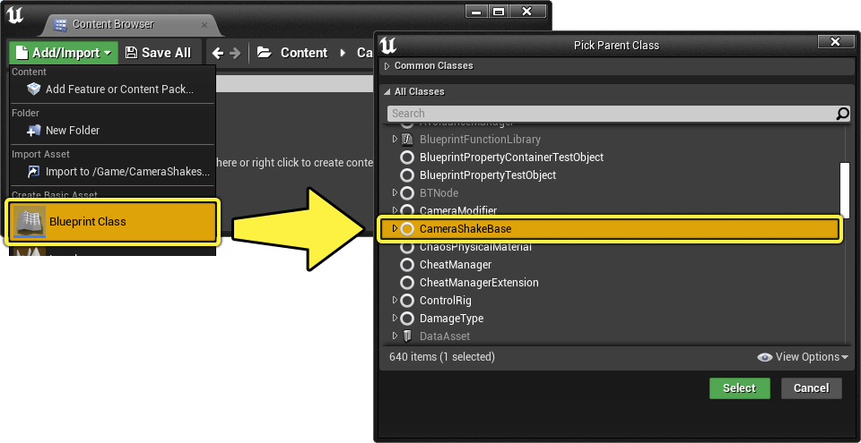
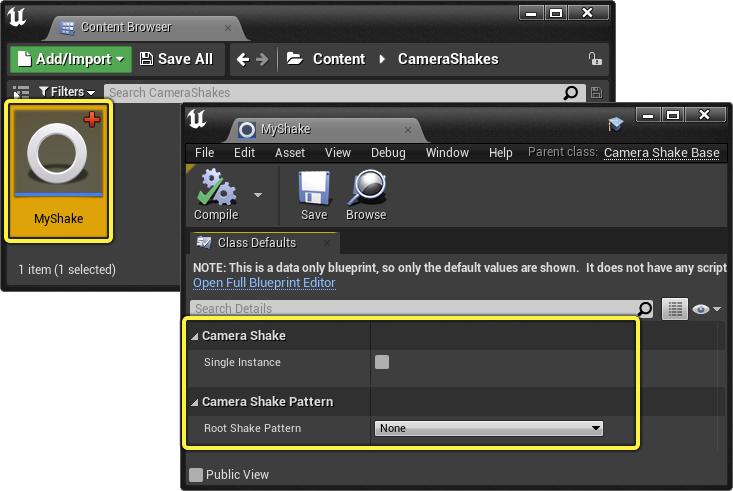
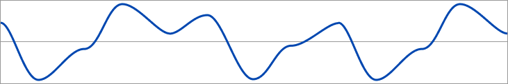
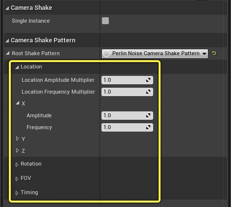
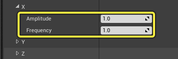
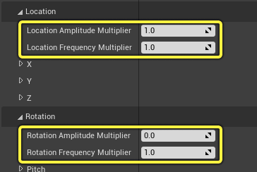
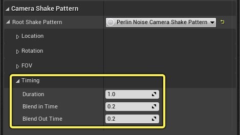
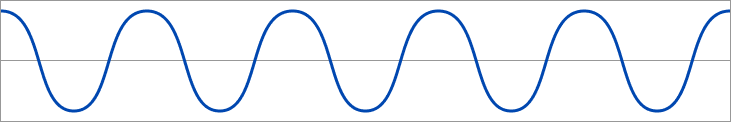

# 摄像机晃动

> 路径：虚幻引擎5.7文档 / 为角色和对象制作动画 / 过场动画和Sequencer / Sequencer中的摄像机 / 摄像机晃动

> 原始页面：https://dev.epicgames.com/documentation/unreal-engine/camera-shakes-in-unreal-engine

你可以使用虚幻引擎的摄像机晃动蓝图向摄像机添加摄像机晃动效果。本指南概述了如何创建 **CameraShakeBase** 蓝图、可用晃动类型以及如何在Sequencer、蓝图和摄像机晃动源中播放它们。

#### 准备工作

- 你已了解 **[Sequencer](../../how-to-make-movies/index.md)** 并知道如何 **[创建摄像机动画](../../how-to-make-movies/how-to-animate-cinematic-cameras/index.md)**。
- 你已了解 **[蓝图可视化脚本](../../../../blueprints-visual-scripting/index.md)**。
- 如果使用的是基于序列的自定义晃动，则必须了解 **[使用模板序列](../../unreal-engine-sequencer-movie-tool-overview/template-sequences/index.md)**。
- 如果希望在游戏中测试摄像机晃动，则可以使用 **[第三人称模板](https://dev.epicgames.com/documentation/404)** 创建一个项目。

## 摄像机晃动创建

要创建晃动资产，点击 **[内容浏览器](../../../../understanding-the-basics/content-browser/index.md)** 中的 **添加/导入**，然后选择 **蓝图类**。在下一个窗口中，找到或搜索 **CameraShakeBase** 类，然后点击 **选择**。

创建资产后，命名并打开它以查看摄像机晃动细节。

### 细节

摄像机晃动资产拥有以下基本细节：

| 名称 | 说明 |
| --- | --- |
| **单个实例（Single Instance）** | 启用此选项仅允许播放此晃动的单个实例一次。随后尝试播放此晃动将重新启动它，而不是额外分层。 |
| **根晃动模式（Root Shake Pattern）** | 要使用的[**晃动类型**](#%E6%A0%B9%E6%99%83%E5%8A%A8%E6%A8%A1%E5%BC%8F%E7%B1%BB%E5%9E%8B)。 |

## 根晃动模式类型

晃动模式控制摄像机晃动的形状和行为。你可以从以下模式中选择，从而创建摄像机晃动。

### Perlin噪声

通过基于指定的振幅和频率对随机点进行采样，可以生成随时间变化的Perlin噪声。使用 **[Smoothstep](https://en.wikipedia.org/wiki/Smoothstep)** 将这些点混合到缓动函数。通常，Perlin噪声对于高强度摄像机晃动（如隆隆声或附近的爆炸）会非常有用。

> 动图已省略：perlin camera shake example

当你把 **根晃动模式** 设置成 **Perlin噪声摄像机晃动模式** 时，将显示可用于控制Perlin噪声晃动行为的其他细节。可以为摄像机的位置、旋转和视野（FOV）属性创建晃动效果。

**位置** 和 **旋转** 属性类别都会显示各自的轴，你可以展开它们来显示 **振幅** 和 **频率** 属性。

- **振幅** 控制晃动模式的大小。增加该值将导致该轴上的晃动从中心移动更大的距离。
- **频率** 控制晃动的速度。增加该值将使晃动的移动速度加快。

此外，你可以使用 **振幅** 和 **倍频器** 属性，将位置和旋转轴上的组合振幅和频率结果相乘。如果希望对晃动进行全局更改而无需更改每个轴，这些属性会非常有用。

展开 **定时** 类别可以控制晃动的定时。

- **时长** 控制晃动的长度。如果为0或小于0，则晃动将无限播放。
- **混合输入/输出时间** 控制晃动开始和结束时的线性混合长度。0值表示不会发生混合。

### 正弦波

正弦波使用拥有平滑周期振荡的连续波生成随时间变化的噪声。通常，波噪声对于较低强度的晃动非常有用，如摇摆的船或梦幻般的漂流效果。

> 动图已省略：sine wave camera shake example

当你为 **根晃动模式** 选择 **波形振荡器摄像机晃动模式** 时，将显示额外的细节，这可用于控制波的晃动行为。与Perlin噪声类似，可在摄像机的位置、旋转和视野（FOV）属性上创建波晃动效果。

> 图片已省略：wave oscillator camera shake pattern details

正弦波噪声的 **位置**、**旋转**、**视野** 和 **定时** 的属性与[**Perlin噪声**](#perlin%E5%99%AA%E5%A3%B0) 相同。但在展开轴时，还有一个名为 **初始偏移类型** 的额外属性，如果希望你的波形从 **零** 或曲线上的 **随机** 点开始，则可指定该属性。

> 图片已省略：sine wave initial offset

### 序列晃动

序列晃动使用[**摄像机动画序列**](../../unreal-engine-sequencer-movie-tool-overview/template-sequences/index.md#cameraanimationsequence)中包含的摄像机动画生成晃动。如果希望完全控制摄像机晃动的样式和行为，序列噪声会非常实用。

> 图片已省略：sequence shake graph

为**根晃动模式** 选择 **序列摄像机晃动模式** 时，将显示其他细节，可以用其来选择摄像机动画序列资产并控制其行为。晃动的时长基于摄像机动画序列的长度。

> 图片已省略：sequence camera shake pattern details

| 名称 | 说明 |
| --- | --- |
| **序列** | 指定[**摄像机动画序列资产**](../../unreal-engine-sequencer-movie-tool-overview/template-sequences/index.md#cameraanimationsequence)。 |
| **播放速率** | 晃动效果的速度。值为1表示正常速度，小于1的值将使晃动播放速度变慢，大于1的值将使晃动播放速度变快。 |
| **比例** | 应用于晃动强度的乘数。值为1表示正常强度，小于1的值表示强度更低，大于1的值表示强度更高。 |
| **混合输入/输出时间** | **混合输入/输出时间** 控制晃动开始和结束时的线性混合长度。0值表示不会发生混合。 |
| **随机片段时长** | 启用 **随机片段** 时使用的随机片段时长。 |
| **随机片段** | 启用此选项将开始播放摄像机动画序列中的随机点的晃动。你还必须在 **随机片段时长** 属性中设置一个值，以定义晃动的新长度。如果拥有的摄像机晃动动画较长，并且希望从中随机播放较小的片段，此选项会非常实用。 |

> [!NOTE]
> 与典型 **模板序列** 工作流不同的是，当创建用作摄像机晃动模式的摄像机动画序列时，无需将该小节设为附加。

### 合成

合成晃动可将 **Perlin**、**波** 和 **序列** 晃动组合到一个层系统中。使用合成晃动可以创建包含来自每种晃动类型的元素的更多元的晃动。

> 动图已省略：composite shake example

当你为 **根晃动模式** 选择 **合成** **摄像机晃动模式** 时将显示更多细节，可以用其来添加子模式并将不同的晃动类型分层在一起。

> 图片已省略：composite camera shake pattern details

点击 **子模式** 旁边的 **+** 按钮将向数组添加新的晃动模式。你可以添加任意数量的晃动模式。每个元素都包含与该模式相关的细节。

> 图片已省略：composite shake array

## 播放晃动

创建摄像机晃动后，有几种方法可以播放。

### 从Sequencer播放

点击 **电影摄像机Actor** 轨道上的 **+ 轨道** 按钮，并在 **摄像机晃动** 菜单中选择摄像机晃动资产，可将晃动添加到Sequencer中的摄像机。

> 图片已省略：sequencer camera shake

你还可以将晃动添加到 **摄像机组件** 轨道，从而产生相同的结果。

> 图片已省略：sequencer camera component shake

添加后，你可以播放序列以查看晃动效果。

> 动图已省略：sequencer camera shake example

摄像机晃动小节包含由蓝图细节确定的时长和混合输入/输出时间的可视化。更改这些属性将更新小节显示。

> 动图已省略：sequencer shake section visualize

右键点击"晃动"小节并导航到 **属性** 菜单将在Sequencer中显示晃动属性。

> 图片已省略：sequencer shake section details

| 名称 | 说明 |
| --- | --- |
| **晃动类** | 指定要使用的晃动蓝图类。如果其他资产可用，可以将此晃动更改为其他资产。 |
| **播放比例** | 晃动强度的全局乘数。值为1表示正常强度，小于1的值表示强度更低，大于1的值表示强度更高。 |
| **播放空间** | 指定晃动应处于的坐标空间。 **本地摄像机** 将导致相对于摄像机位置进行晃动，使其成为附加晃动。 **世界** 将使晃动坐标相对于关卡的坐标。 **用户定义** 将使晃动旋转坐标相对于 **用户定义的游戏空间** 中指定的坐标。 |
| **用户定义的播放空间** | 将 **播放空间** 设为 **用户定义** 时，你可以在此处输入旋转坐标，该坐标相对于 **世界旋转** 坐标，但拥有指定的偏移量。 |

### 从蓝图播放

你还可以使用 **Start Camera Shake** 节点，从蓝图播放晃动。该节点包含用于指定 **晃动**、**比例** 和 **播放空间** 的参数。

> 图片已省略：start camera shake blueprint node

> [!NOTE]
> "Start Camera Shake"函数需要 **玩家控制器** 或 **摄像机晃动源组件** 作为目标。

## 摄像机晃动源

**摄像机晃动源** 会基于摄像机与某个位置的接近程度来触发摄像机晃动。它还包含控制晃动影响的大小和半径。你可以在你的关卡中将其添加为 **Actor**，或在蓝图中添加为 **组件**。

要将 **摄像机晃动源Actor** 添加到你的关卡，请将其从 **[放置Actor](../../../../understanding-the-basics/actors-and-geometry/placing-actors/index.md)** 面板拖到关卡中。

> 图片已省略：camera shake source actor

选择Actor或组件将显示以下细节：

> 图片已省略：camera shake source actor details

| 名称 | 说明 |
| --- | --- |
| **衰减** | 摄像机离源越来越近或越来越远时的衰减曲线类型。这可以是 **二次**（提供一个简单的输入和输出混合），也可以是 **线性**（提供一个线性混合）。 |
| **内衰减半径** | 晃动将在其中以最大强度播放的源的半径。 |
| **外衰减半径** | 晃动不再可见的源的半径。当摄像机在外内半径之间移动时，晃动将在其间混合其强度。 |
| **摄像机晃动** | 要使用的晃动蓝图类。 |
| **自动启动** | 启用此选项将导致在玩游戏时自动启动晃动。 |

### 循环晃动示例

通过执行以下操作，可以快速创建源晃动效果：

1. 在

   摄像机晃动蓝图

   中，将所有

   定时

   属性设为0。这将使晃动循环无限进行，无混合。此外，这还可确保为轴设置了适当的振幅和频率，以便晃动可见。
2. 将蓝图指定给摄像机晃动源

   摄像机晃动

   属性，并启用

   自动开始

   。

> 图片已省略：source shake setup

现在，只要玩游戏并接近源点，你就会看到，随着摄像机进入摄像机晃动源的影响，晃动混合打开和关闭。

> 动图已省略：distance shake example

### 摄像机晃动预览器

摄像机晃动预览器可用于预览编辑器中的[**摄像机晃动源**](#camerashakesource) 而无需开始游戏或模拟。

要打开预览器，导航到"虚幻编辑器"主菜单，然后选择 **窗口 > 摄像机晃动预览器**。

> 图片已省略：camera shake previewer

要在编辑器中播放摄像机晃动，你需要启用"视口选项"菜单中的 **允许摄像机晃动**。

> 图片已省略：allow camera shakes

接下来，选择要预览的晃动源条目，然后点击 **播放/停止选定项** 以启用晃动预览。如果要同时预览多个源，也可以点击 **播放/停止全部**。一旦播放，你可以将编辑器的摄像机移向源，并查看晃动效果。

> 动图已省略：camera shake previewer example
