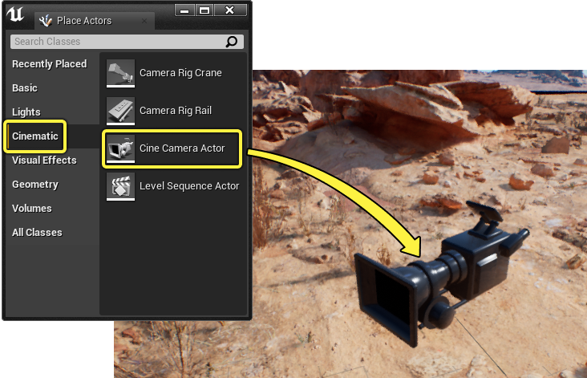
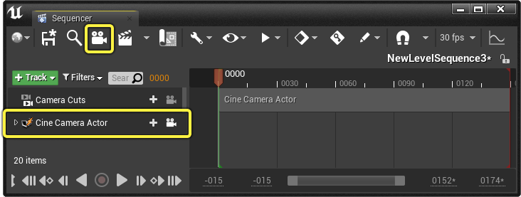
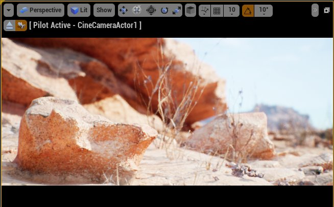
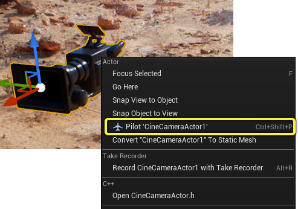
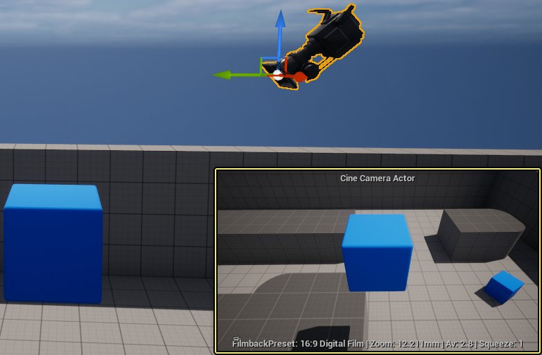
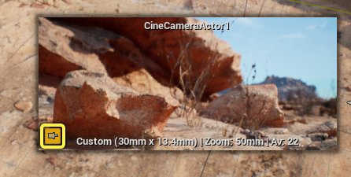
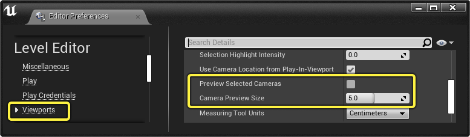
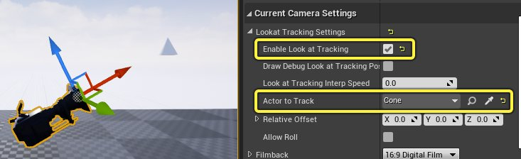

# 过场动画摄像机Actor

> 路径：虚幻引擎5.7文档 / 为角色和对象制作动画 / 过场动画和Sequencer / Sequencer中的摄像机 / 过场动画摄像机Actor

> 原始页面：https://dev.epicgames.com/documentation/unreal-engine/cinematic-cameras-in-unreal-engine

过场动画摄影机Actor（Cine Camera Actor）是一种特殊的 **[摄像机Actor](../../../../understanding-the-basics/actors-and-geometry/unreal-engine-actors-reference/camera-actors/index.md)** ，它拥有一些额外的设置，可以复制出真实相机的效果。你可以调整 **胶片背板（Filmback）** 、 **镜头（Lens）** 和 **对焦（Focus）** 参数，利用它们拍摄出逼真的场景画面，同时遵守行业标准。

## 创建

在 **[放置Actor](../../../../understanding-the-basics/actors-and-geometry/placing-actors/index.md)（Place Actors）** 面板中，找到 **过场动画（Cinematic）** 选项卡，然后找到 **过场动画摄像机Actor（Cine Camera Actor）** 。将其从面板拖到视口中，将过场动画摄像机Actor添加到场景中。

如果你使用的是Sequencer，点击Sequencer工具栏中的 **摄像机（Camera）** 按钮，你还可以创建过场动画摄像机Actor。这样做将为你当前的序列创建临时的 **[可生成](https://dev.epicgames.com/documentation/404)** 过场动画摄像机Actor轨道。

> [!NOTE]
> 你可以使用 **创建可生成摄像机（Create Spawnable Cameras）** 首选项在Sequencer的 **[编辑器偏好设置](../../unreal-engine-sequencer-movie-tool-overview/cinematic-editor-and-project-settings/index.md)** 中指定是否将摄像机创建为可生成对象。

## 用法

过场动画摄像机Actor有一些主要功能可以帮助你获得视口拍摄体验。

### 导航

与大多数其他Actor类似，你可以 **导航** 过场动画Actor，从视口预览摄像机的外观和行为。

要导航过场动画摄像机Actor，请在视口中右键点击它并选择 **导航"CineCameraActor"（Pilot 'CineCameraActor'）** 或按 **Ctrl + Shift + P** 切换导航模式。

### 画中画显示

选择过场动画摄像机Actor时，视口的右下角会显示 **画中画** 窗口。此窗口将显示摄像机视图的预览，并列出有关摄像机名称、胶片背板和其他属性的信息。

> [!NOTE]
> 选择多个过场动画摄像机Actor将在视口中显示多个画中画窗口及其各自的视图。

此窗口可以固定，以便在未选择摄像机时它仍然可见。点击画中画窗口左下角的 **固定（Pin）** 按钮将其固定。

你也可以在虚幻引擎的 **[编辑器偏好设置](../../../../understanding-the-basics/foundational-knowledge-in/unreal-editor-preferences/index.md)** 中自定义或禁用该窗口。在虚幻引擎的顶部菜单中，选择 **编辑（Edit）> 编辑器偏好设置（Editor Preferences）** ，然后点击 **关卡编辑器（Level Editor）** 类别中的 **视口（Viewports）** 菜单并找到以下属性：

| 名称 | 说明 |
| --- | --- |
| **预览所选摄像机（Preview Selected Cameras）** | 启用画中画显示。 |
| **摄像机预览尺寸（Camera Preview Size）** | 控制画中画显示的尺寸。 |

### 查看跟踪

你可以使用过场动画摄影机Actor的 **查看跟踪（Look at Tracking）** 设置来跟踪其他Actor。启用此功能将覆盖摄像机的旋转，并将其修改为瞄准指定对象。

> 动图已省略：摄像机查看跟踪

要启用摄像机跟踪，请在 **当前摄像机设置（Current Camera Settings）** 类别下的摄像机细节中找到 **查看跟踪（Look at Tracking）** 设置。然后，选择 **启用查看跟踪（Enable Look at Tracking）** ，并将 **要跟踪的Actor（Actor to Track）** 属性设置为你希望摄像机查看的Actor。

查看跟踪（Look at Tracking）功能还包含以下属性，可供进一步自定义：

| 名称 | 说明 |
| --- | --- |
| **启用查看跟踪（Enable Look at Tracking）** | 在此摄像机上启用查看跟踪功能。 |
| **绘制调试查看跟踪位置（Draw Debug Look at Tracking Position）** | 启用调试定位器立方体，显示摄像机正在跟踪的内容。如果你将它与 **相对偏移（Relative Offset）** 结合使用，这将非常有用。 查看跟踪调试 |
| **查看跟踪插值速度（Look at Tracking Interp Speed）** | 摄像机更新对象跟踪情况的速度。默认值为0，摄像机立即跟踪，值大于0时，摄像机跟踪的延迟会越来越大。 查看跟踪速度 |
| **要跟踪的Actor（Actor to Track）** | 指定摄像机正在跟踪的Actor。该属性可以在Sequencer中设置关键帧，允许摄像机随时间改变其跟踪目标。如果没有指定Actor，摄像机将改为跟踪世界原点（0, 0, 0）。 |
| **相对偏移（Relative Offset）** | 指定相对于其本地空间应用到被跟踪Actor的位置偏移。这对于控制被跟踪Actor的特定取景很有用。 查看跟踪偏移 |
| **允许滚动（Allow Roll）** | 启用此功能将允许摄像机在其X轴上滚动。如果禁用，摄像机跟踪将覆盖X轴上的所有数据。 |

### 后期处理

所有过场动画摄影机Actor都有自己的 **[后期处理](../../../../designing-visuals-rendering-and-graphics/post-process-effects/index.md)** 层，这些层会在 **导航** Actor时启用。后期处理允许显示和调整更多摄像机效果，例如 **[泛光](../../../../designing-visuals-rendering-and-graphics/post-process-effects/bloom/index.md)**、**[曝光](../../../../designing-visuals-rendering-and-graphics/post-process-effects/auto-exposure/index.md)**、**[渐晕](../../../../designing-visuals-rendering-and-graphics/post-process-effects/index.md)**、**[颜色分级](../../../../designing-visuals-rendering-and-graphics/post-process-effects/color-grading-and-the-filmic-tonemapper/index.md)** 等。

> 图片已省略：过场动画后期处理

访问 **[后期处理](../../../../designing-visuals-rendering-and-graphics/post-process-effects/index.md)** 页面，了解有关虚幻引擎中可用后期处理效果的更多信息。

- [后期处理效果](../../../../designing-visuals-rendering-and-graphics/post-process-effects/index.md)

## 属性

选择过场动画摄像机Actor将显示以下细节：

> 图片已省略：过场动画摄像机细节

| 名称 | 说明 |
| --- | --- |
| 胶片背板 |  |
| **胶片背板（Filmback）** | 胶片背板（Filmback）属性包含可供选择的真实预设 **[摄像机机身](https://en.wikipedia.org/wiki/Camera)** 列表。这些预设会影响 **传感器宽度（Sensor Width）和高度（Height）** 属性，以便模拟选定的摄像机机身。摄像机的基本视野和纵横比也会受到这些设置的影响。 摄像机胶片背板预设 |
| **传感器宽度/高度（Sensor Width/Height）** | 传感器宽度和高度属性可模拟胶片或 **[数字传感器](https://en.wikipedia.org/wiki/Image_sensor_format)** 的尺寸（以毫米为单位）。只要选择了新的 **胶片背板（Filmback）** 预设，这些值就会自动更改。 |
| **传感器纵横比（Sensor Aspect Ratio）** | 此属性显示根据所选传感器尺寸计算的当前纵横比。此值无法手动更改，因为它仅供只读参考。 |
| 镜头设置 |  |
| **镜头设置（Lens Settings）** | **镜头设置（Lens Settings）** 属性包含可供选择的真实预设 **[摄像机镜头](https://en.wikipedia.org/wiki/Camera_lens)** 列表。这些预设会影响模拟所选镜头的 **焦距（Focal Length）**、**光圈系数（FStop）** 和 **光圈（Diaphragm）** 属性。 摄像机镜头预设 |
| **最小/最大焦距（Min/Max Focal Length）** | 摄像机的最小和最大 **焦距（Focal Length）** 范围。设置这些值将影响摄像机 **当前焦距（Current Focal Range）** 属性的值范围，该属性用于模拟 **[变焦镜头](https://en.wikipedia.org/wiki/Zoom_lens)**。将这两个属性设置为相同的值将模拟 **[定焦镜头](https://en.wikipedia.org/wiki/Prime_lens)**，它们并非设计为可变焦。 |
| **最小/最大光圈系数（Min/Max FStop）** | 此摄像机的最小和最大 **[光圈](https://en.wikipedia.org/wiki/Aperture)** 范围。 |
| **光圈叶片数（Diaphragm Blade Count）** | 这可以控制摄像机镜头上的 **[光圈](https://en.wikipedia.org/wiki/Diaphragm_%28optics%29)** （刀片）计数。镜头上的光圈值与 **散景（Bokeh）** 效果的形状相关。值越低，散景看起来更方正，而值越高，散景看起来更圆润。 摄像机光圈 |
| 对焦设置 |  |
| **对焦方式** | 对焦方式可控制景深和对焦设置。它包含以下选项： **不覆盖（Do Not Override）** ，它会禁用影响摄像机的景深。这仍然允许来自其他来源的景深，例如来自后期处理体积的景深。 **手动（Manual）** ，它使用 **手动对焦距离（Manual Focus Distance）** 属性启用景深并控制相对于摄像机位置的焦点。 **跟踪（Tracking）** ，它通过使用 **跟踪对焦设置（Tracking Focus Settings）** 属性跟踪Actor来启用景深并控制对焦。 **禁用（Disable）** ，完全禁用景深，并且不允许来自其他来源的景深影响。 |
| **手动对焦距离（Manual Focus Distance）** | 控制相对于摄像机位置的对焦距离（以厘米为单位）。这是类型感知字段，因此你可以输入 **5m**，它会将值转换为 **500cm**。此外还有一个滴管，可以直接从视口选择对象，并将摄像机的焦点与它对齐。要使用它，请点击按钮，然后左键点击视口中的对象。此属性仅在 **对焦方式（Focus Method）** 设置为 **手动（Manual）** 时出现。 |
| **要跟踪的Actor（Actor to Track）** | 用作摄像机景深焦点的Actor。仅当 **对焦方式（Focus Method）** 设置为 **跟踪（Tracking）** 时才启用此功能。 |
| **相对偏移（Relative Offset）** | 指定相对于其本地空间应用到被跟踪Actor的位置偏移。仅当 **对焦方式（Focus Method）** 设置为 **跟踪（Tracking）** 时才启用，并且对于微调被跟踪Actor上的焦点很有用。 |
| **绘制调试跟踪焦点（Draw Debug Tracking Focus）** | 如果对焦方式（Focus Method）设置为"跟踪（Tracking）"，则启用调试定位器立方体，显示景深对焦位置。如果你将它与相对偏移（Relative Offset）结合使用，这将非常有用。 摄像机调试跟踪对焦 |
| **绘制调试焦点平面（Draw Debug Focus Plane）** | 启用面向摄像机的透明平面以预览焦点。 摄像机对焦平面 |
| **调试焦点平面颜色（Debug Focus Plane Color）** | 指定 **调试焦点平面（Debug Focus Plane）** 的颜色。 |
| **平滑对焦变化（Smooth Focus Changes）** | 使对焦距离变化随时间自动插值，而不是瞬时插值。 |
| **焦点平滑插值速度（Focus Smoothing Interp Speed）** | 启用 **平滑焦点变化（Smooth Focus Changes）** 时的焦点变化插值速度。数字越小越慢，数字越大越快。 |
| **焦点偏移（Focus Offset）** | 如果正在使用 **跟踪（Tracking）** 焦点，则相对于被跟踪Actor的位置偏移焦点。如果启用了 **手动（Manual）** 对焦，焦点将改为使用 **手动对焦距离（Manual Focus Distance）** 。正数会增加与摄像机的距离，负数会减少距离。 |
| **当前焦距（Current Focal Length）** | 摄像机的焦距属性，受 **镜头设置（Lens Settings）** 中 **最小/最大焦距（Min/Max Focal Length）** 属性定义的焦距范围限制。 |
| **当前光圈（Current Aperture）** | 摄像机的光圈或 **光圈系数（FStop）** 属性，受 **镜头设置（Lens Settings）** 中的 **最小/最大光圈系数（Min/Max FStop）** 属性定义的光圈系数范围限制。 |
| **当前对焦距离（Current Focus Distance）** | 只读属性，显示基于 **手动（Manual）** 或 **跟踪（Tracking）** 焦点的最终对焦距离输出，包括应用于它们的所有其他偏移。 |
| **当前水平视野（Current Horizontal FOV）** | 只读属性，根据摄像机的 **焦距（Focal Length）** 和 **传感器尺寸（Sensor Dimensions）** 的组合显示最终的水平视野。 |
| 摄像机选项 |  |
| **约束纵横比（Constrain Aspect Ratio）** | 启用可预览 **传感器尺寸（Sensor Dimension）** 及其基本纵横比的黑条绘制。 摄像机约束纵横比 |
| **使用Pawn控制旋转（Use Pawn Control Rotation）** | 如果摄像机被用作Pawn上的组件，则启用此功能将导致Pawn的旋转影响摄像机组件。 |
| **后期处理混合权重（Post Process Blend Weight）** | 在完全打开和关闭之间混合摄像机的 **后期处理（Post Process）** 层的影响。权重为1将使其完全启用，而值为0将使其落入其他层。 |
| **锁定到Hmd（Lock to Hmd）** | 当VR耳机连接到 **[XR开发](../../../../sharing-and-releasing-projects/developing-for-xr-experiences/index.md)** 时，将摄像机的位置和方向锁定到连接的头戴式显示器。 |
| **使用LOD的视野（Use Field Of View for LOD）** | 启用后，摄像机的视野将影响对象应显示的细节级别，而不是仅依赖于摄像机距离。这样可解决从远处摄像机渲染且在拍摄对象上放大的低质量对象引起的问题。 |
