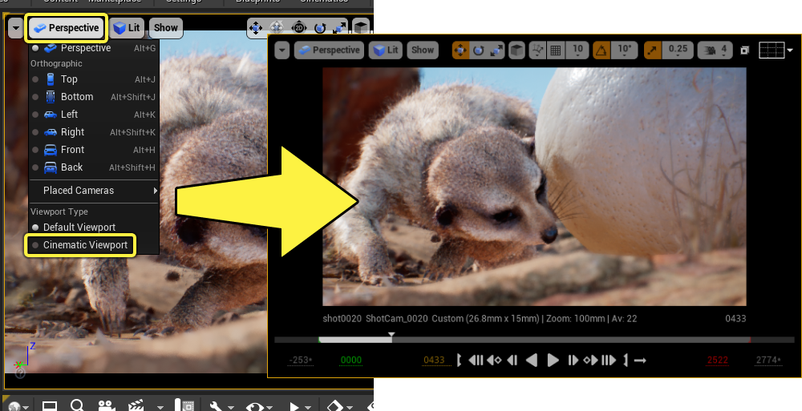
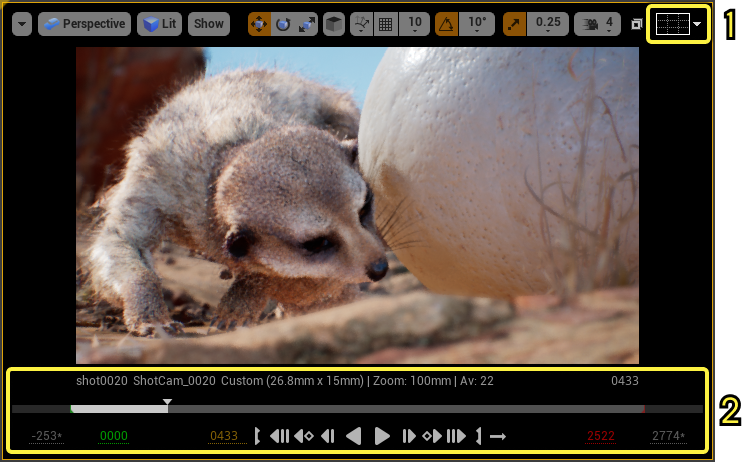
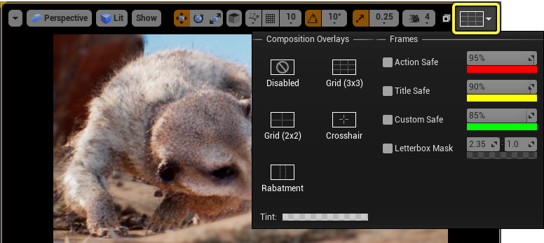
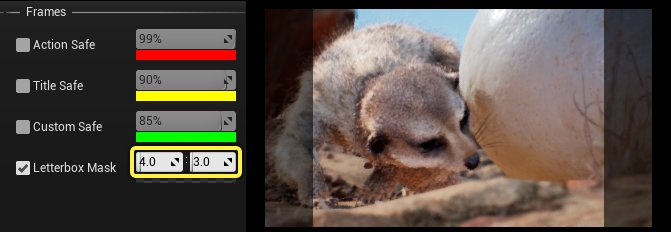
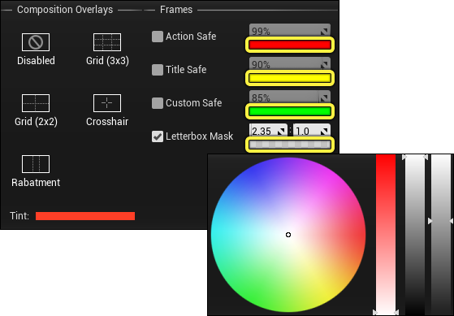
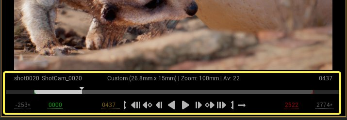
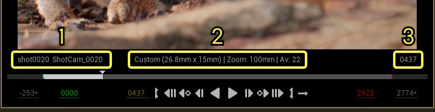
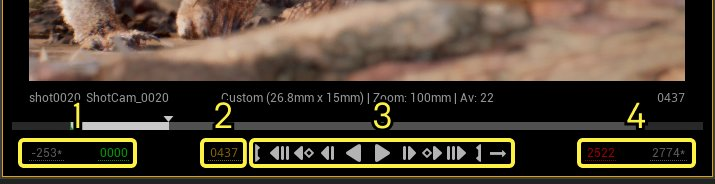

# 过场动画视口

> 路径：虚幻引擎5.7文档 / 为角色和对象制作动画 / 过场动画和Sequencer / Sequencer中的摄像机 / 过场动画视口

> 原始页面：https://dev.epicgames.com/documentation/unreal-engine/cinematic-viewport-controls-in-unreal-engine

在虚幻编辑器中，你可以将 **关卡视口（Level Viewport）** 更改为专用的 **过场动画视口（Cinematic Viewport）** 。过场动画视口支持附加功能、行为和显示模式，可帮助你创建过场动画内容。本指南概述了如何启用过场动画视口及其功能。

#### 先决条件

- 你有一个正在使用Sequencer的项目。如果没有，你可以使用提供的[**过场动画示例**](../../index.md#%E8%BF%87%E5%9C%BA%E5%8A%A8%E7%94%BB%E7%A4%BA%E4%BE%8B)之一。
- **[Sequencer](../../how-to-make-movies/index.md)** 当前在你的关卡中打开。

## 启用过场动画视口

要启用过场动画视口（Cinematic Viewport）模式，请选择 **视口视角（Viewport Perspective）** 菜单，并启用 **过场动画视口** 。

## 概述

启用过场动画视口（**Sequencer**）并打开 **Sequencer** 后，你的视口现在应该显示新的过场动画元素。

1. [**电影覆层**](#%E7%94%B5%E5%BD%B1%E8%A6%86%E5%B1%82)
2. [**播放预览和功能按钮**](#%E6%92%AD%E6%94%BE%E9%A2%84%E8%A7%88%E5%92%8C%E5%8A%9F%E8%83%BD%E6%8C%89%E9%92%AE)

### 电影覆层

**电影覆层（Film Overlays）** 菜单包含视口的视觉效果导线，你可以启用这些导线帮助你取景和构图。覆层类别主要有两种，即 **构图（Composition）** 和 **帧（Frame）** 覆层。

#### 构图覆层

| 名称 | 说明 |
| --- | --- |
| **禁用（Disabled）** | 默认视图模式，不显示覆层。 |
| **网格（Grid）（3x3）** | 在视口上显示3x3网格，允许基于 **[三分法则](https://en.wikipedia.org/wiki/Rule_of_thirds)** 取景。 3x3网格 |
| **网格（Grid）（2x2）** | 在视口上显示2x2网格。 2x2网格 |
| **十字准线（Crosshair）** | 显示中央标线，可用于模拟摄影标线。 十字准线 |
| **栅格化（Rabatment）** | 在视口上显示栅格化覆层，允许基于 **[矩形栅格化](https://en.wikipedia.org/wiki/Rabatment_of_the_rectangle)** 取景。 栅格化 |

构图覆层线也可以着色为你想要的颜色或阿尔法值。点击 **色调（Tint）** 旁边的颜色条，将打开 **取色器（Color Picker）** ，你可以在其中选择线条的颜色和透明度。

> 动图已省略：构图线条颜色

#### 帧覆层

**帧覆层（Frame Overlays）** 是用于在给图片组帧时模拟 **[安全区域](https://en.wikipedia.org/wiki/Safe_area_%28television%29)** 或 **[黑边](https://en.wikipedia.org/wiki/Letterboxing_%28filming%29)** 的准线。

| 名称 | 说明 |
| --- | --- |
| **操作安全（Action Safe）** | 显示"操作"安全准线。默认情况下，它位于屏幕空间边距的 **95%** 处，颜色为 **红色**。 操作安全准线 |
| **标题安全（Title Safe）** | 显示"标题"安全准线。默认情况下，它位于屏幕空间边距的 **90%** 处，颜色为 **黄色** 。 标题安全准线 |
| **自定义安全（Custom Safe）** | 显示自定义安全准线。默认情况下，它位于屏幕空间边距的 **85%** 处，颜色为 **绿色** 。 自定义安全准线 |
| **黑边遮罩（Letterbox Mask）** | 显示黑边覆层，显示目标纵横比将从原始图像中裁剪的比例。默认情况下，黑边纵横比为 **2.35:1** 。 黑边覆层 你需要确保在你的[**摄像机属性**](../cinematic-cameras/index.md#%E5%B1%9E%E6%80%A7)上启用了 **约束纵横比（Constrain Aspect Ratio）** 属性，以便黑边适用于你的摄像机传感器尺寸。 |

每个安全区域条目旁边都有百分比字段，对应于准线的屏幕大小。值为100%时，准线到达屏幕的外边缘，而为0%时，准线到达屏幕的中心点。准线范围限制在1%到99%之间，以保持完全可见。

> 动图已省略：安全区域大小

你可以在 **黑边遮罩（Letterbox Mask）** 条目旁边输入不同的黑边纵横比。这样做会改变黑边的形状，以符合输入的纵横比。

单击其属性下的颜色栏，可以将安全和黑边准线染成任何颜色。此操作将打开 **取色器（Color Picker）** ，你可以在其中选择准线的颜色和透明度。

### 播放预览和功能按钮

启用过场动画视口后，新的功能按钮和显示将出现在视口底部。

该区域的上部区域显示有关当前拍摄、摄像机和时间的信息。

1. 当前

   序列（Sequence）

   和当前

   摄像机

   的名称。
2. 当前摄像机的

   胶片背板属性

   。
3. 序列或

   主序列

   的当前

   时间

   。

界面上还会显示时间条，你可以使用来自Sequencer的类似[**播放头**](https://dev.epicgames.com/documentation/404)交互功能与之交互。显示的时间条与Sequencer中的时间条同步。

> 动图已省略：过场动画视口时间条

底部区域显示时间和播放功能按钮。

1. 工作范围（Working Range）

   和

   播放范围（Playback Range）

   的开始时间。
2. 激活序列的当前时间。
3. 播放功能按钮

   。单击这些功能按钮，可以播放、暂停和执行其他播放功能。
4. 播放范围（Playback Range）

   和

   工作范围（Working Range）

   的结束时间。

在底部区域，你可与时间显示进行交互，单击时间显示可输入不同的值，或者单击后左右拖动可擦除值。

> 动图已省略：过场动画视口时间交互

## 允许过场动画控制

在虚幻引擎中处理过场动画内容时，你可能需要使用 [多个视口（Multiple Viewports）](https://dev.epicgames.com/documentation/unreal-engine/using-editor-viewports-in-unreal-engine#viewportlayout)，以便结合主过场动画视图从不同视角预览场景。使用 **允许过场动画控制（Allow Cinematic Control）** 选项，你可以选择当 **Sequencer** 具有摄影机控制时应显示过场动画的哪个视口。

> 图片已省略：过场动画控制视口

> [!NOTE]
> **允许过场动画控制（Allow Cinematic Control）** 只能在使用 **视角（Perspective）** 视图模式的视口上启用或禁用。

默认情况下，虚幻引擎的主视口启用了 **允许过场动画控制（Allow Cinematic Control）** 。

> 图片已省略：允许过场动画控制

在将多个视口设置为视角（Perspective）视口的情况下，通过在视口选项菜单中启用或禁用 **允许过场动画控制（Allow Cinematic Control）**，你可以选择哪些视口将具有全面的过场动画控制。在大多数情况下，你需要为至少一个视口启用 **允许过场动画控制（Allow Cinematic Control）** ，而对所有其他视口保持禁用状态。

> 图片已省略：允许过场动画控制比较
