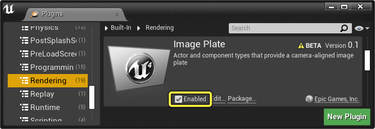
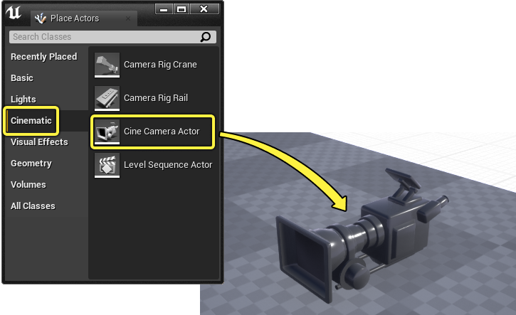
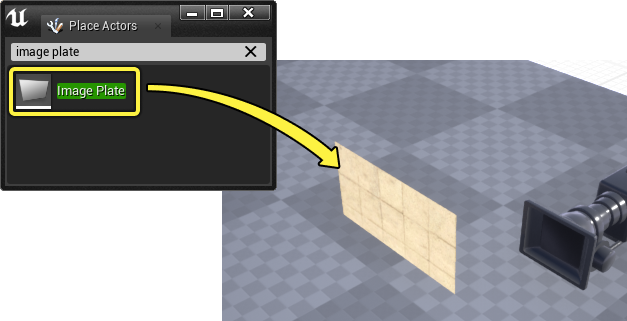
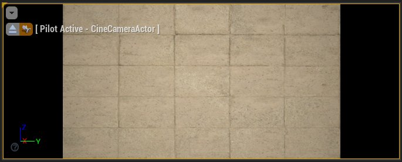
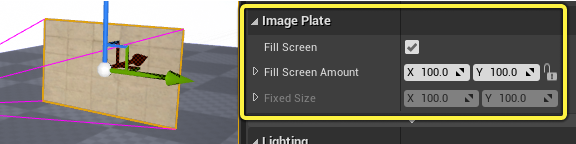
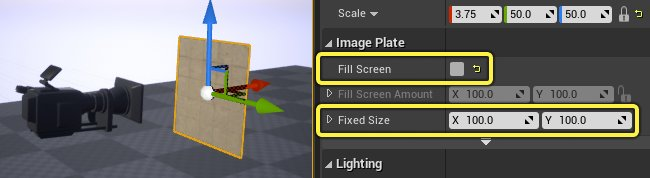
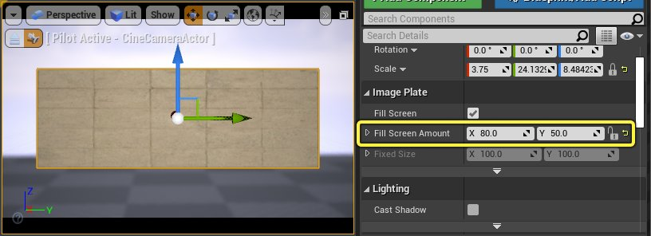
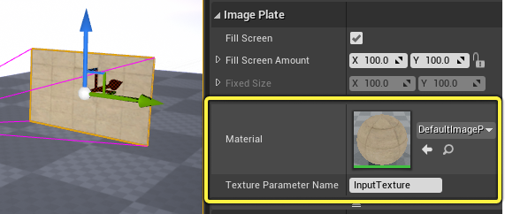

# 图像板

> 路径：虚幻引擎5.7文档 / 为角色和对象制作动画 / 过场动画和Sequencer / Sequencer中的摄像机 / 图像板

> 原始页面：https://dev.epicgames.com/documentation/unreal-engine/full-screen-movies-in-unreal-engine

**图像板Actor（Image Plate Actor）** 支持从连接到 **[过场动画摄像机Actor](../cinematic-cameras/index.md)** 视锥体的板播放电影和图像序列。你可以使用这些图像板播放全屏视频和图像序列，还可以将前景元素包含在摄像机的视角中。

#### 先决条件

- 使用前，必须启用图像板。在虚幻引擎菜单中，找到 **编辑（Edit）> 插件（Plugins）**，在 **渲染（Rendering）** 分段中找到 **图像板（Image Plate）** ，并启用它。你可能需要重启编辑器，此更改才能生效。

  
- 你熟悉

  如何设置用于播放的视频资产

  ，或

  如何设置用于播放的图像序列

  。
- 你熟悉

  媒体轨道

  的用法。
- 你熟悉

  的基本知识。
- 你已了解

  Sequencer

  及其

  界面

  。

## 创建

要完全设置图像板Actor，你需要将 **[过场动画摄像机Actor](../cinematic-cameras/index.md)** 和 **图像板Actor** 添加到关卡，然后将板附加到过场动画摄像机Actor。

首先，找到 **[放置Actor](../../../../understanding-the-basics/actors-and-geometry/placing-actors/index.md)** 面板中的 **过场动画（Cinematic）** 选项卡，将过场动画摄像机Actor添加到你的关卡，然后找到 **过场动画摄像机Actor（Cine Camera Actor）** 。将其从面板拖到你的视口中。

然后，从 **放置Actor（Place Actors）** 面板拖动 **图像板（Image Plate）** ，将其添加到你的关卡。

将两个Actor添加到你的关卡后，将板拖到 **[大纲视图](../../../../building-virtual-worlds/level-editor/outliner/index.md)** 面板中的摄像机上，即可将其附加到摄像机。完成后，图像板将对齐到摄像机的正面，并调整大小以拟合其视锥体。

> 动图已省略：将图像板附加到摄像机

## 行为

默认情况下，图像板会自动调整其大小以拟合过场动画摄影机Actor的[**传感器维度**](../cinematic-cameras/index.md#%E5%B1%9E%E6%80%A7)，确保它始终完全在摄影机的视野中。

> 动图已省略：图像板传感器尺寸

你还可以将板向靠近和远离摄像机的方向移动，以便控制板和摄像机之间的间距。此间距将使更多的前景元素包含在摄像机的视野中。该板还将动态调整其比例，确保其在视野中完全可见。

> 动图已省略：移动图像板前景

**导航** 摄像机时，图像板将填满屏幕并拉伸，以便符合摄像机的纵横比。你还需要调整摄像机的对焦距离以匹配板距离，从而确保其保持对焦。

### 属性

选择图像板Actor将在细节（Details）面板中显示其细节。

**填充屏幕（Fill Screen）** 属性支持自动调整板尺寸以拟合摄像机的全视图。禁用此功能后，你可以改为使用 **固定尺寸（Fixed Size）** 属性，以手动设置板的尺寸。

如果启用了 **填充屏幕（Fill Screen）**，那么你可以使用 **填充屏幕量（Fill Screen Amount）** 属性，将板的尺寸以屏幕的百分比偏移。**X** 控制屏幕 **宽度** 的百分比，**Y** 控制 **高度** 。

### 材质

展开 **图像板细节（Image Plate Details）** 的高级分段，将显示其 **[材质](https://dev.epicgames.com/documentation/404)** 属性。你可以在此处调整默认材质或纹理。

## 材质设置

无论你是在板上显示图像序列还是视频，都需要创建引用了 **媒体纹理（Media Texture）** 的新 **材质（Material）** 。媒体纹理还必须引用 **媒体播放器（Media Player）** 。

### 媒体纹理和播放器

首先，单击 **[内容浏览器](../../../../understanding-the-basics/content-browser/index.md)** 中的 **添加/导出（Add/Import）**，找到 **媒体（Media）** 类别，然后选择 **媒体播放器（Media Player）** 资产，创建 **媒体播放器（Media Player）**。选择后，将出现一个对话窗口。确保启用了 **视频输出MediaTexture资产（Video output MediaTexture asset）**，然后单击 **确定（OK）**。

> 图片已省略：创建媒体播放器

此操作将确保创建并链接 **媒体纹理（Media Texture）** 和 **媒体播放器（Media Player）** 。

> 图片已省略：媒体纹理链接

### 材质图表

在内容浏览器中单击添加/导入（Add/Import）并选择 **材质（Material）** ，创建新的 **材质（Material）** 资产。创建并打开资产后，将 **着色模型（Shading Model）** 设置为 **无光照（Unlit）**，并在其细节中启用 **双面（Two Sided）** 属性。此操作是为了使图像板不受关卡中光照的影响。

> 图片已省略：图像板材质无光照

将 **媒体纹理（Media Texture）** 资产拖到材质图表中，并将其 **RGB** 引脚连接到材质的 **自发光颜色（Emissive Color）** 输入引脚。

> 图片已省略：图像板媒体纹理材质

最后，你需要将媒体材质指定给图像板Actor的 **材质（Material）** 属性。

> 图片已省略：图像板指定材质

## 播放

视频和图像序列可以通过Sequencer的 **[媒体轨道](../../unreal-engine-sequencer-movie-tool-overview/sequencer-track-list/cinematic-movie-media-track/index.md)** 在图像板上播放。

### 媒体轨道设置

首先创建新的关卡序列，然后单击 **+轨道（+ Track）** 并选择 **媒体轨道（Media Track）** 。

> 图片已省略：图像板媒体轨道

然后，单击 **+媒体（+ Media）** 并选择源，选择要播放的 **文件媒体源（File Media Source）**（用于视频）或 **图像媒体源**（用于图像序列）资产。如果你没有这些资产之一，请参阅 **[视频](../../../../working-with-media/integrating-media/media-framework/media-framework-unreal-engine-tutorials/play-a-video-file/index.md)** 或 **[图像](../../../../working-with-media/integrating-media/media-framework/media-framework-unreal-engine-tutorials/play-an-image-sequence/index.md)** 播放文档中的设置说明。

> 图片已省略：媒体轨道和媒体

右键点击媒体分段，找到其属性类别，然后将你的媒体纹理指定到 **媒体纹理（Media Texture）** 属性。

> 图片已省略：指定媒体纹理

### 示例

完成后，你将能够播放序列并预览图像板上显示的视频或图像序列。

> 动图已省略：图像板视频

视频示例

> 动图已省略：图像板图像序列

图像序列示例
