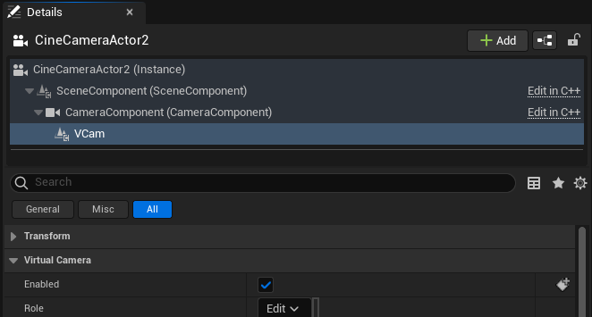
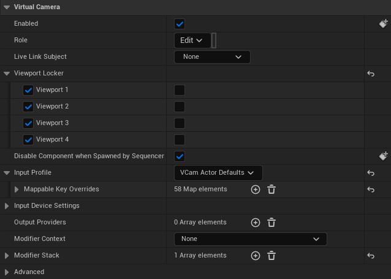
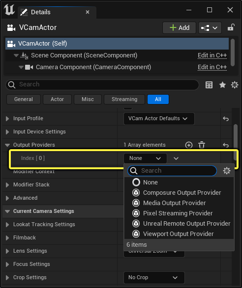
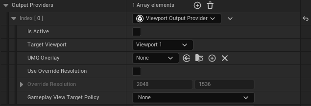
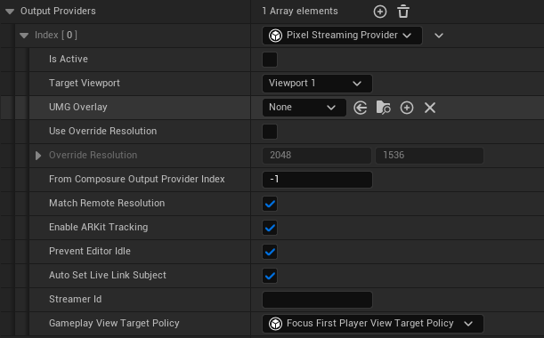
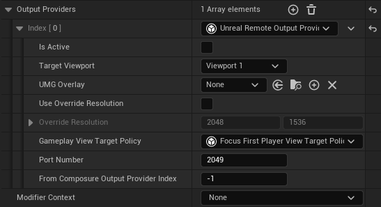
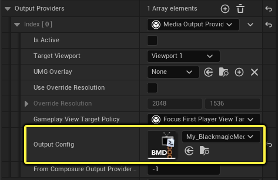
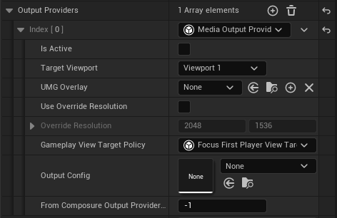

# 配置虚拟摄像机组件

> 路径：虚幻引擎5.7文档 / 为角色和对象制作动画 / 过场动画和Sequencer / Sequencer中的摄像机 / Virtual Cameras / 配置虚拟摄像机组件

> 原始页面：https://dev.epicgames.com/documentation/unreal-engine/configuring-a-virtual-camera-component-in-unreal-engine

**虚拟摄像机（Virtual Camera）** （简称 **VCam** ）组件提供了一个模块化系统，用于使用[UMG控件](../../../../../user-interfaces/umg-editor-reference/index.md)编辑[过场动画摄像机](../../cinematic-cameras/index.md)组件。VCam组件是用于在虚幻引擎中构建类似[VCam Actor](https://dev.epicgames.com/documentation/404)这样的自定义虚拟摄像机的基本组件。构建你自己的VCam的优势在于，你可以通过蓝图使用修饰符和输出提供程序实现自定义功能。

## 虚拟摄像机架构

VCam组件的架构分三个方面：模型、视图和控制器。

- 修饰符

  表示模型。它们实现的逻辑用于更改过场动画摄像机组件上的属性。修饰符包含连接点，并且它们可以选择公开输入操作（增强输入），后者可以由UMG控件调用。

  - 输出提供程序

    是视图。它们创建并渲染控件（可能是流送它们）。通常，输出提供程序创建UVCamWidget，这些是可以连接到修饰符连接点的特殊控件。控件通过两种方式与修饰符交互：

    - 简单 - 触发修饰符订阅的输入操作，并通过连接公开。
    - 高级 - 查询修饰符是否实现特定自定义接口。
- 只要启用了UVCamComponent，

  UVCameraSubSystems

  就存在。这相当于LocalPlayerSubSystem。

  - 一个重要的此类系统是InputVCamSubsystem，它允许UVCamComponents绑定到输入设备，类似于发行的游戏中玩家控制器的作用。

## 要求和先决条件

要继续本指南，你必须首先：

- 按照

  使用Live Link控制虚拟摄像机Actor

  的"必需设置"小节操作。

  - 在你的项目中启用所有必要插件。
  - [可选] 使用支持的iOS设备。
  - [可选] 从iOS应用商店下载并安装Live Link VCAM应用。
  - [可选] 你的虚幻引擎项目和运行Live Link VCAM应用的iOS设备共享的网络连接。

> [!NOTE]
> 一些输出提供程序需要使用iOS设备。如需关于其用法的更多信息，请参阅此页面的[VCam输出提供程序](#vcam%E8%BE%93%E5%87%BA%E6%8F%90%E4%BE%9B%E7%A8%8B%E5%BA%8F)小节。

## 设置自定义虚拟摄像机工作流程

虚拟摄像机由两个组件构成： **过场动画摄像机（Cine Camera）** 和 **VCam** 。这两个组件是构建可用的自定义虚拟摄像机的基础。

要构建自定义虚拟摄像机，请执行以下操作：

1. 使用关卡编辑器中的

   放置Actor（Place Actors）

   面板将

   过场动画摄像机（Cine Camera）

   添加到场景。
2. 选中过场动画摄像机，转至细节面板，点击

   添加（Add）

   （+）组件菜单，并从列表选择

   VCam

   组件。
3. 点击

   VCam

   组件并将其拖曳到

   CameraComponent

   上，使其成为过场动画摄像机的子项。

> [!NOTE]
> 如果VCam组件不是Camera、Component的直接子项，你的虚拟摄像机将无法生效。

你的组件层级应该如下图所示：

VCam组件有以下属性：

| 属性 | 说明 |
| --- | --- |
| **启用（Enabled）** | 此开关启用和禁用整个VCam组件。 |
| **角色（Role）** | 指定在虚拟制片环境中要分配给此虚拟摄像机的角色类型。 |
| **Live Link主体（Live Link Subject）** | 这是在整个Live Link插件中使用的主体。该组件使用主体的摄像机信息从连接Live Link的设备驱动场景中的摄像机。 |
| **视口锁定器（Viewport Locker）** | 从虚拟摄像机视角渲染的视口。 |
| **由Sequencer生成时禁用组件（Disable Component when Spawned by Sequencer）** | 由序列生成时禁用VCam组件。这可防止在播放的序列包含的VCam组件被设置为可生成对象时，两个VCam组件可能同时处于激活状态的情况。 |
| **输入配置文件（Input Profile）** | 指定要使用的配置文件，其已映射虚拟摄像机的输入。如需详细了解输入配置文件，请参阅[控制虚拟摄像机功能按钮的输入](../controlling-inputs-to-virtual-camera-controls/index.md)。 |
| **输入设备设置（Input Device Settings）** | 启用和禁用哪些可以用作输入设备（键盘、游戏手柄和鼠标）。你还可以为输入选择日志记录类型。 |
| **输出提供程序（Output Providers）** | 包含所有输出设备目标的列表。如需更多详细信息，请参阅此页面的[输出提供程序](#vcam%E8%BE%93%E5%87%BA%E6%8F%90%E4%BE%9B%E7%A8%8B%E5%BA%8F)小节。 |
| **修饰符上下文（Modifier Context）** | 一个可选对象，包含在所有修饰符之间共享的任意数据。 |
| **修饰符堆栈（Modifier Stack）** | 包含添加到组件的所有修饰符的列表。如需更多详细信息，请参阅此页面的[修饰符](#vcam%E4%BF%AE%E9%A5%B0%E7%AC%A6)小节。 |
| 高级设置 |  |
| **禁用多用户接收器上的输出（Disable Output on Multi User Receiver）** | 如果虚拟摄像机在多用户会话中并且摄像机是来自会话的接收器，则禁用输出。 |
| **更新频率（Update Frequency）** | 指示在多用户模式下发送摄像机更新的频率。最小值为11毫秒。不推荐使用低于30毫秒的值。需要更高的刷新率时，考虑改用Live Link重播来流送摄像机数据。 |

## VCam修饰符

虚拟摄像机 **修饰符** 是特殊的蓝图资产。它们包含构建自定义功能的逻辑和 **输入操作（Input Actions）** 。你可以使用它们创建独特的效果和行为（在蓝图或C++中），例如摄像机晃动、调整焦点，以及限制摄像机沿轴移动。

虚拟摄像机可以应用任意数量的修饰符，创建应用不同行为和效果的修饰符堆栈。堆栈中的每个修饰符会按自上而下的顺序应用和渲染。

> [!TIP]
> 虚幻引擎包含一组用于标准VCam Actor的默认修饰符。你可以探索其中的每个修饰符及其逻辑。你可以在 **引擎（Engine）> 插件（Plugins）> 虚拟摄像机内容（VirtualCamera Content）> 修饰符（Modifiers）** 文件夹中找到它们。

## VCam输出提供程序

虚拟摄像机 **输出提供程序（Output Provider）** 系统会将虚拟摄像机的输出重路由到各种提供程序，例如视口和使用远程会话协议的设备。

以下输出提供程序可供选择：

- 视口
- 像素流送
- 虚幻远程
- 媒体
- Composure

要将输出提供程序添加到你的虚拟摄像机，请执行以下操作：

1. 选择虚拟摄像机的

   VCam

   组件。
2. 在

   细节（Details）

   面板中，找到

   输出提供程序（Output Providers）

   分段，并点击

   添加（+）

   图标将新提供程序添加到堆栈。
3. 使用添加的 **索引（Index [0]）** 元素旁边的下拉菜单选择列表中的某个 **输出提供程序（Output Providers）** 。

   

   > [!NOTE]
   > 堆栈中的每个输出提供程序按自上向下的顺序应用和渲染。

### 视口输出提供程序

**视口（Viewport）** 输出提供程序接受场景中虚拟摄像机的视图，并直接将其输出到关卡编辑器的视口。

视口输出提供程序包括以下属性：

| 属性 | 说明 |
| --- | --- |
| **处于激活状态（Is Active）** | 如果设置此项，此输出提供程序会对每个帧执行。 |
| **目标视口（Target Viewport）** | 选择要用于此虚拟摄像机的视口。 |
| **UMG覆层（UMG Overlay）** | 要由此输出提供程序渲染的UMG类。 |
| **使用重载分辨率（Use Override Resolution）** | 使用自定义值重载默认输出分辨率。 要使其生效，你必须将 **处于激活状态（Is Active）** 关闭，然后再打开。 |
| **重载分辨率（Override Resolution）** | 在设置了 **使用重载分辨率（Use Override Resolution）** 时应用自定义分辨率。 |
| **Gameplay视图目标策略（Gameplay View Target Policy）** | 在游戏世界中，例如在编辑器中运行（PIE）或发行游戏中，这会确定应该将哪个玩家控制器的视图目标设置为拥有过场动画摄像机Actor。 多个输出提供程序可能有策略集，并且策略可能选择相同的玩家控制器来设置其视图目标。解决这一冲突的方法是，检查玩家控制器是否已经有过场动画摄像机Actor作为视图目标，如果有，则不会使用该策略。这意味着，你可以根据需要对VCam组件中的输出提供程序数组排序，最前面的策略将获得更高的优先级。 |

### 像素流送输出提供程序

**像素流送（Pixel Streaming）** 输出提供程序将编辑器视口输出到使用WebRTC连接的远程设备，这包括用于iOS的Live Link VCam应用。此方法适用于可以接收流送数据的兼容设备，包括Web浏览器。它是虚拟摄像机的主要输出提供程序。

> [!NOTE]
> [像素流送](../../../../../sharing-and-releasing-projects/pixel-streaming/index.md)在像素流送输出提供程序的实例上配置，不需要额外设置。VCam组件仅支持单个流。

像素流送输出提供程序包括以下属性：

| 属性 | 说明 |
| --- | --- |
| **处于激活状态（Is Active）** | 如果设置此项，此输出提供程序会对每个帧执行。 |
| **目标视口（Target Viewport）** | 设置要用于此虚拟摄像机的视口。 |
| **UMG覆层（UMG Overlay）** | 要由此输出提供程序渲染的UMG类。 |
| **使用重载分辨率（Use Override Resolution）** | 使用自定义值重载默认输出分辨率。 要使其生效，你必须将 **处于激活状态（Is Active）** 关闭，然后再打开。 |
| **重载分辨率（Override Resolution）** | 在设置了 **使用重载分辨率（Use Override Resolution）** 时应用自定义分辨率。 |
| **来自Composure输出提供程序索引（From Composure Output Provider Index）** | 如果你使用[Composure输出提供程序](#composure%E8%BE%93%E5%87%BA%E6%8F%90%E4%BE%9B%E7%A8%8B%E5%BA%8F)中的输出，请在此处指定。 |
| **匹配远程分辨率（Match Remote Resolution）** | 启用后，流送的虚幻引擎视口将匹配远程设备的分辨率。 |
| **启用ARKit跟踪（Enable ARKit Tracking）** | 使用来自iOS设备上的Live Link VCAM应用的变换数据，控制对应的过场动画摄像机Actor。 |
| **防止编辑器待机（Prevent Editor Idle）** | 在编辑器不是前台应用程序时，防止它移至后台。当编辑器被最小化，或在使用另一个应用程序时，这可能会使编辑器无响应或运行缓慢。 |
| **自动设置Live Link主体（Auto Set Live Link Subject）** | 启用后，所属VCam组件的Live Link主体会被设置为此输出提供程序创建的主体。该提供程序也必须启用。 |
| **流送器ID（Streamer Id）** | 设置此流的名称以报告给信令服务器。如果未提供值，将使用默认值。我们推荐你为每个流提供唯一名称，因为如果流送器ID与其他VCam的流送器ID相同，你可能会遇到问题。 |
| **Gameplay视图目标策略（Gameplay View Target Policy）** | 在游戏世界中，例如在编辑器中运行（PIE）或发行游戏中，这会确定应该将哪个玩家控制器的视图目标设置为拥有过场动画摄像机Actor。 多个输出提供程序可能有策略集，并且策略可能选择相同的玩家控制器来设置其视图目标。解决这一冲突的方法是，检查玩家控制器是否已经有过场动画摄像机Actor作为视图目标，如果有，则不会使用该策略。这意味着，你可以根据需要对VCam组件中的输出提供程序数组排序，最前面的策略将获得更高的优先级。 |

### 虚幻远程输出提供程序

**虚幻远程（Unreal Remote）** 输出提供程序会将主视口输出到使用 **远程会话协议（Remote Session Protocol）** 连接的远程设备，例如iOS设备上的Live Link VCAM应用。

> [!WARNING]
> [虚幻远程](../../../../../production-pipeline/scripting-and-automating-the-unreal-editor/remote-control/index.md)需要对你的项目进行额外配置，才能连接到使用远程会话的外部设备。如需更多信息，请参阅此页面的[设置虚幻远程输出提供程序](#%E8%AE%BE%E7%BD%AE%E8%99%9A%E5%B9%BB%E8%BF%9C%E7%A8%8B%E8%BE%93%E5%87%BA%E6%8F%90%E4%BE%9B%E7%A8%8B%E5%BA%8F)小节。

虚幻远程输出提供程序包括以下属性：

| 属性 | 说明 |
| --- | --- |
| **处于激活状态（Is Active）** | 启用后，此输出提供程序会对每个帧执行。 |
| **目标视口（Target Viewport）** | 选择要用于此虚拟摄像机的视口。 |
| **UMG覆层（UMG Overlay）** | 选择要由此输出提供程序渲染的UMG类。 |
| **使用重载分辨率（Use Override Resolution）** | 使用自定义值重载默认输出分辨率。 要使其生效，你必须将 **处于激活状态（Is Active）** 关闭，然后再打开。 |
| **重载分辨率（Override Resolution）** | 在设置了 **使用重载分辨率（Use Override Resolution）** 时应用自定义分辨率。 |
| **Gameplay视图目标策略（Gameplay View Target Policy）** | 在游戏世界中，例如在编辑器中运行（PIE）或发行游戏中，这会确定应该将哪个玩家控制器的视图目标设置为拥有过场动画摄像机Actor。 多个输出提供程序可能有策略集，并且策略可能选择相同的玩家控制器来设置其视图目标。解决这一冲突的方法是，检查玩家控制器是否已经有过场动画摄像机Actor作为视图目标，如果有，则不会使用该策略。这意味着，你可以根据需要对VCam组件中的输出提供程序数组排序，最前面的策略将获得更高的优先级。 |
| **端口号（Port Number）** | 网络端口号。只有在要将多个远程会话设备连接到同一台PC时，才需要更改此项。 |
| **来自Composure输出提供程序索引（From Composure Output Provider Index）** | 如果你使用Composure输出提供程序中的此输出，请在此处指定。 |

### 媒体输出提供程序

**媒体（Media）** 输出提供程序会将虚拟摄像机的输出发送到虚幻媒体框架支持的设备，例如Black Magic和AJA的视频捕获卡。

**输出配置（Output Config）** 资产用于指定要输出的媒体源类型及其需要输出到源的参数。如需详细了解这些类型的资产、其用法以及支持哪些源，请参阅[媒体框架(working-with-media\integrating-media\MediaFramework)。

媒体输出提供程序包括以下属性：

| 属性 | 说明 |
| --- | --- |
| **处于激活状态（Is Active）** | 如果设置此项，此输出提供程序会对每个帧执行。 |
| **目标视口（Target Viewport）** | 选择要用于此虚拟摄像机的视口。 |
| **UMG覆层（UMG Overlay）** | 要由此输出提供程序渲染的UMG类。 |
| **使用重载分辨率（Use Override Resolution）** | 使用自定义值重载默认输出分辨率。 要使其生效，你必须将 **处于激活状态（Is Active）** 关闭，然后再打开。 |
| **重载分辨率（Override Resolution）** | 在设置了 **使用重载分辨率（Use Override Resolution）** 时应用自定义分辨率。 |
| **Gameplay视图目标策略（Gameplay View Target Policy）** | 在游戏世界中，例如在编辑器中运行（PIE）或发行游戏中，这会确定应该将哪个玩家控制器的视图目标设置为拥有过场动画摄像机Actor。 多个输出提供程序可能有策略集，并且策略可能选择相同的玩家控制器来设置其视图目标。解决这一冲突的方法是，检查玩家控制器是否已经有过场动画摄像机Actor作为视图目标，如果有，则不会使用该策略。这意味着，你可以根据需要对VCam组件中的输出提供程序数组排序，最前面的策略将获得更高的优先级。 |
| **输出配置（Output Config）** | 使用媒体框架支持的某个输出源分配媒体输出配置资产。 |
| **来自Composure输出提供程序索引（From Composure Output Provider Index）** | 如果使用[Composure](#composure%E8%BE%93%E5%87%BA%E6%8F%90%E4%BE%9B%E7%A8%8B%E5%BA%8F)输出提供程序中的此输出，请在此处指定。 |

### Composure输出提供程序

**Composure** 输出提供程序会将虚拟摄像机的输出发送到渲染目标。你可以将渲染目标与[Composure](https://dev.epicgames.com/documentation/404)一起使用进行合成。你可以使用 **层目标（Layer Targets）** 属性指定要用于合成的元素堆栈。这些元素支持渲染UMG控件。

Composure输出提供程序包括以下属性：

> 图片已省略：Composure输出提供程序属性。

| 属性 | 说明 |
| --- | --- |
| **处于激活状态（Is Active）** | 如果设置此项，此输出提供程序会对每个帧执行。 |
| **目标视口（Target Viewport）** | 选择要用于此虚拟摄像机的视口。 |
| **UMG覆层（UMG Overlay）** | 要由此输出提供程序渲染的UMG类。 |
| **使用重载分辨率（Use Override Resolution）** | 使用自定义值重载默认输出分辨率。 要使其生效，你必须将 **处于激活状态（Is Active）** 关闭，然后再打开。 |
| **重载分辨率（Override Resolution）** | 在设置了 **使用重载分辨率（Use Override Resolution）** 时应用自定义分辨率。 |
| **Gameplay视图目标策略（Gameplay View Target Policy）** | 在游戏世界中，例如在编辑器中运行（PIE）或发行游戏中，这会确定应该将哪个玩家控制器的视图目标设置为拥有过场动画摄像机Actor。 多个输出提供程序可能有策略集，并且策略可能选择相同的玩家控制器来设置其视图目标。解决这一冲突的方法是，检查玩家控制器是否已经有过场动画摄像机Actor作为视图目标，如果有，则不会使用该策略。这意味着，你可以根据需要对VCam组件中的输出提供程序数组排序，最前面的策略将获得更高的优先级。 |
| **层目标（Layer Targets）** | 要将请求的UMG渲染到的Composure堆栈合成元素列表。 |
| **最终输出渲染目标（Final Output Render Target）** | 分配包含最终输出的纹理渲染目标2D资产。 |

## VCam输入操作

> [!WARNING]
> 修饰符连接点是试验性的功能。

输入操作是可从[修饰符蓝图](#vcam%E4%BF%AE%E9%A5%B0%E7%AC%A6)映射到硬件输入的输入。[增强输入](../../../../../gameplay-systems/input/enhanced-input/index.md)是围绕将此硬件输入映射到虚拟摄像机以及通过使用注入和连接点来重新映射UMG输入的想法开发的。你可以像Live Link VCAM应用那样使用VCam控件（类似于UMG控件）控制虚幻引擎中的虚拟摄像机Actor。它们可重新映射到修饰符，无需硬引用或转型。**连接点（Connection Points）** 可桥接要重新映射的元素并复用VCam控件。

## 配置自定义虚拟摄像机的示例

指南的此部分通过示例演示了如何使用带有过场动画摄像机Actor的VCam组件设置和配置自定义虚拟摄像机。此过程将使用本页面前面介绍过的所有元素来构建简单的示例，以显示这些部分如何彼此交互和连接。

在此配置指南中，你会创建以下功能并将其应用到自定义虚拟摄像机：

- 使用过场动画摄像机和VCam组件创建自定义虚拟摄像机。
- 设置使用虚拟摄像机追踪场景中指定对象的蓝图和逻辑。
- 扩展蓝图逻辑以打开和关闭虚拟摄像机追踪对象的能力。
- 设置VCam控件以使用脚本蓝图逻辑。
- 进一步扩展蓝图逻辑，根据其状态（开/关）更改按钮的颜色。

按照本指南操作之后，你应该会更清晰地理解如何使用修饰符、输出提供程序和带连接点的输入操作，构建不同的效果和行为以用于虚拟摄像机。

### 创建自定义虚拟摄像机

要构建自定义虚拟摄像机，请执行以下操作：

1. 使用关卡编辑器中的

   放置Actor（Place Actors）

   面板将

   过场动画摄像机（Cine Camera）

   Actor添加到场景。
2. 选择过场动画摄像机后，点击 **细节（Details）** 面板中的 **添加（Add (+)）** 组件菜单并从列表选择 **VCam** 组件。

   > 图片已省略：构建自定义虚拟摄像机Actor。
3. 点击

   VCam

   组件并将其拖曳到

   CameraComponent

   上，使其成为过场动画摄像机的子项。

你的组件层级应该如下图所示：

> 图片已省略：过场动画摄像机层级中的VCam组件。

### 创建自定义修饰符

在此小节中，你将创建修饰符蓝图。你可以将此蓝图包含的行为和逻辑应用到虚拟摄像机，创建某种效果。在此示例中，你将创建的蓝图会被用于使用虚拟摄像机追踪场景中的指定对象。

指南的此部分已分解为多个较小步骤来构建VCam修饰符，请按照此工作流程实现结果：

- 创建VCam修饰符蓝图资产。
- 设置修饰符蓝图。
- 为你想实现的摄像机行为或效果创建逻辑。
- 指定要使用虚拟摄像机追踪的主体。
- 将修饰符添加到虚拟摄像机的修饰符堆栈。

#### 创建修饰符蓝图

要创建VCam修饰符蓝图，请执行以下操作：

1. 在内容浏览器中，点击 **添加（Add (+)）> VCam** 并添加 **VCam修饰符（VCam Modifier）** 蓝图资产。将其命名为 **VCM_LookAt** 。

   > 图片已省略：将VCam修饰符资产添加到内容浏览器
2. 弹窗将提出你 **选择输入映射上下文（Select Input Mapping Context）**。你可以选择 **跳过（Skip）** 。

   > [!NOTE]
   > 请参阅[增强输入](../../../../../gameplay-systems/input/enhanced-input/index.md)，详细了解输入映射资产及其用法。

你现在创建了修饰符蓝图，这将在本指南其余部分中使用。

#### 设置Actor引用变量

在此步骤中，你将设置修饰符蓝图的图表中要使用的变量。这些变量会指定关卡中虚拟摄像机将追踪的对象。

> [!NOTE]
> 设置此类型的事项时，对场景中Actor的所有引用都必须在修饰符蓝图中定义。

要使用Actor引用变量设置你的修饰符，请执行以下操作：

1. 打开

   VCM_LookAt

   修饰符蓝图。
2. 在 **我的蓝图（My Blueprint）** 面板中，找到 **变量（Variables）** 类别，并点击 **添加（+）** 图标添加新变量。

   > 图片已省略：将变量添加到你的修饰符蓝图
3. 点击变量的文本字段，并将其名称设置为“TargetActor”。
4. 点击 **布尔（Boolean）** 类型，将其类型更改为 **对象类型（Object Types）> Actor** ，并选择 **对象引用（Object Reference）** 。

   > 图片已省略：将TargetActor变量设置为Actor对象引用。
5. 在 **我的蓝图（My Blueprint）** 面板中选择 **TargetActor** 变量后，使用 **细节（Details）** 面板勾选 **变量（Variables）** 类别下 **实例可编辑（Instance Editable）** 的复选框。

   > 图片已省略：将TargetActor变量设置为可编辑。

   > [!TIP]
   > 点击变量名称旁边的 **眼睛** 图标相当于在 **细节（Details）** 面板中设置 **实例可编辑（Instance Editable）** 。

你在此步骤中设置的引用变量会在稍后将修饰符添加到虚拟摄像机的修饰符堆栈时用到。在关卡中工作时，设置为 **实例可编辑（Instance Editable）** 的变量在VCam组件的属性中可见。你可以直接在此处设置虚拟摄像机将追踪的Actor。

#### 创建修饰符蓝图逻辑

在此步骤中，你将在VCM_LookAt修饰符蓝图的图表中创建一些初始逻辑。此逻辑被用于追踪世界中的对象，方法是使用 **TargetActor** 变量将其位置提供给虚拟摄像机。虚幻引擎使用此信息旋转虚拟摄像机，让该对象保持在视图中。

要将逻辑添加到你的修饰符蓝图，请执行以下操作：

1. 打开

   VCM_LookAt

   修饰符蓝图。
2. 在

   我的蓝图（My Blueprint）

   面板中，找到变量类别，点击

   TargetActor

   变量并将其拖曳到

   事件图表（Event Graph）

   中。选择

   获取TargetActor（Get TargetActor）

   。
3. 拖出

   TargetActor

   节点的输出引脚，并添加

   Is Valid

   节点。
4. 将

   Event On Apply

   节点连接到

   Is Valid

   节点。
5. 拖出

   Event On Apply

   节点的

   摄像机组件（Camera Component）

   的输出引脚，并添加

   Get World Location

   节点。 1.拖出

   Get World Location

   节点的

   返回值（Return Value）

   引脚，并添加

   Find Look at Rotation

   节点。
6. 拖出

   Event On Apply

   节点的

   摄像机组件（Camera Component）

   引脚，并添加

   Set World Rotation

   节点。
7. 将

   Is Valid

   节点的

   有效（Is Valid）

   引脚连接到

   Set World Rotation

   节点。
8. 从

   TargetActor

   节点拖出引脚，并添加

   Get Actor Location

   节点。
9. 拖出

   Get Actor Location

   节点的

   返回值（Return Value）

   引脚，并将其连接到

   Find Look at Rotation

   节点的

   目标（Target）

   引脚。
10. 拖出

    Find Look At Rotation

    节点的

    返回值（Return Value）

    引脚，并将其连接到

    Set World Rotation

    节点的

    新旋转（New Rotation）

    引脚。
11. 编译（Compile）

    并

    保存（Save）

    。

你的修饰符蓝图现在已设置完毕，你的图表应该如下图所示：

复制以上蓝图代码，直接将其粘贴到你的VCM_LookAt修饰符中，就能在你自己的项目中重现以上图表。

> [!TIP]
> 你可以使用 **重路由（Reroute）** 节点清理图表，以便更容易看清连线的走向。如果一些引脚有多条连线从中进出，这尤其有用。双击一条连线，添加重路由节点。你可以选中它，像关卡中其他节点那样四处拖动，调整连线的方向。

#### 将修饰符添加到VCam组件堆栈

完成修饰符蓝图后，你现在可以将其应用到场景中虚拟摄像机的 **修饰符堆栈（Modifier Stack）** 。

要将修饰符添加到VCam组件，请执行以下操作：

1. 在关卡中，选择你创建的

   虚拟摄像机（Virtual Camera）

   Actor。
2. 在

   细节（Details）

   面板中，选择层级窗口中的

   VCam

   组件。
3. 在 **虚拟摄像机（Virtual Camera）** 属性下，找到 **修饰符堆栈（Modifier Stack）** ，并点击 **添加（+）** 图标将元素添加到堆栈。

   > 图片已省略：将修饰符添加到VCam组件修饰符堆栈。
4. 展开添加的名为 **索引（Index [0]）** 的 **修饰符堆栈（Modifier Stack）** 元素下的属性，使用 **名称（Name）** 文本字段将此修饰符命名为“LookAt”。

   > 图片已省略：为修饰符元素命名。
5. 使用 **生成的修饰符（Generated Modifier）** 的下拉列表选择[本指南前面部分创建的](#%E5%88%9B%E5%BB%BA%E4%BF%AE%E9%A5%B0%E7%AC%A6%E8%93%9D%E5%9B%BE%E9%80%BB%E8%BE%91) **VCM_LookAt** 修饰符蓝图。

   > 图片已省略：设置生成的修饰符属性。
6. 展开

   生成的修饰符（Generated Modifier）> 默认值（Default）

   显示其属性。
7. 使用 **目标Actor（Target Actor）** 的下拉选择列表，在关卡中选择一个Actor，让虚拟摄像机追踪它。

   > 图片已省略：使用公开的TargetActor属性选取关卡中的Actor。

   > [!TIP]
   > 如果你需要Actor进行测试，你可以使用 **放置Actor（Place Actors）** 面板中可用的 **形状（Shapes）** Actor。这些是简单的形状，例如立方体、圆柱体、球体和椎体。

现在你设置了分配给虚拟摄像机的修饰符蓝图，无论对象在场景中如何移动，虚拟摄像机都能够追踪该对象了。

#### 修改修饰符的行为

分配给你的虚拟摄像机的VCM_LookAt修饰符蓝图将追踪关卡中指定对象的位置。在此小节中，你将扩展脚本蓝图行为，添加打开和关闭虚拟摄像机追踪能力的逻辑。

要将额外行为添加到你的修饰符，请执行以下操作：

1. 打开

   VCM_LookAt

   修饰符蓝图。
2. 在事件图表中，点击

   Event On Apply

   节点并向左拖曳，在

   Is Valid

   节点前面为额外逻辑腾出空间。
3. 在

   Event On Apply

   节点上，右键点击

   摄像机组件（Camera Component）

   引脚，并从列表选择

   提升到变量（Promote to Variable）

   。
4. 在

   我的蓝图（My Blueprint）

   面板的

   变量（Variables）

   类别下，选择

   摄像机组件（Camera Component）

   变量。
5. 在

   细节（Details）

   面板中，展开

   高级（Advanced）

   类别，并勾选

   瞬时（Transient）

   旁边的复选框。
6. 将

   Event On Apply

   节点连接到

   Set Camera Component

   节点。
7. 在

   我的蓝图（My Blueprint）

   面板的

   变量（Variables）

   类别下，点击

   添加（+）

   图标添加

   布尔（Boolean）

   变量。将其命名为“ShouldLookAt”。
8. 点击

   ShouldLookAt

   变量并将其拖入事件图表中，然后选择

   Get ShouldLookAt

   。
9. 从

   ShouldLookAt

   节点拖出引脚，并添加

   Branch

   节点。
10. 将

    Set Camera Component

    节点连接到

    Branch

    节点。
11. 将

    Branch

    节点的

    True

    执行引脚连接到

    Is Valid

    节点。
12. 从

    我的蓝图（My Blueprint）

    面板的

    变量（Variables）

    类别下，将

    摄像机组件（Camera Component）

    变量拖入图表中，并选择

    Get Camera Component

    。
13. 拖出

    Camera Component

    节点的输出引脚，并添加

    Set World Rotation

    节点。
14. 拖出

    Camera Component

    节点的输出引脚，并添加

    Get World Rotation

    节点。
15. 拖出

    Get World Rotation

    节点的

    返回值（Return Value）

    引脚，并将其连接到

    Set World Rotation

    节点上的

    新旋转（New Rotation）

    引脚。
16. 拖出

    Branch

    节点的

    False

    执行引脚，并将其连接到

    Set World Rotation

    节点。
17. 编译（Compile）

    并

    保存（Save）

    。

添加的逻辑（下图中高亮显示的部分）使用Branch节点打开和关闭使用虚拟摄像机追踪对象的能力。采用 **True** 路径时，摄像机将追踪关卡中的指定对象。使用 **False** 路径时，摄像机将停止追踪。此扩展逻辑仅设置执行此行为所需的内容。本指南的下面小节将使用此逻辑追踪 **Should Look At** 状态，并对屏幕上的按钮使用VCam控件以开启/关闭此行为。

VCM_LookAt修饰符蓝图的图表现在如下图所示：

复制以上蓝图代码，直接将其粘贴到你的VCM_LookAt修饰符中，就能在你自己的项目中重现以上图表。

### 使用增强输入

虚拟摄像机的修饰符可以使用[增强输入操作](../../../../../gameplay-systems/input/enhanced-input/index.md)为VCam操作员提供额外控制手段。在指南的此小节中，你将使用这些增强输入操作来控制VCM_LookAt修饰符蓝图中设置的按键逻辑，打开和关闭你的虚拟摄像机的对象追踪。这意味着，舞台操作员可以通过在键盘上按键来使用该功能。

#### 创建输入操作

使用增强输入操作需要两个资产： **输入操作（Input Action）** 和 **输入映射上下文（Input Mapping Context）** 。这些资产用于将所按的键与VCM_LookAt修饰符蓝图中设置的逻辑关联起来。

要创建输入操作和输入映射上下文，请执行以下操作：

1. 在内容浏览器中，点击 **添加（Add (+)）> 输入（Input）** 并添加两项：

   > 图片已省略：将输入操作和输入映射上下文资产添加到内容浏览器。

   - 输入操作（Input Action）

     ，并将其命名为

     IA_ToggleActivation

     。
   - 输入映射上下文（Input Mapping Context）

     ，并将其并命名为

     IMC_LookAt

     。
2. 打开 **IMC_LookAt** 输入映射上下文资产。

   > 图片已省略：打开输入映射上下文资产。
3. 在 **细节（Details）** 面板中，点击 **映射（Mappings）** 旁边的 **添加（+）** 图标，将新的 **输入操作（Input Action）** 元素添加到数组。展开其属性并选择此小节的第一步中创建的 **IA_ToggleActivation** 输入操作。

   > 图片已省略：将输入操作分配给输入映射上下文资产。
4. 在 **IA_ToggleActivation** 元素下，使用 **键盘（Keyboard）** 图标旁边的下拉菜单，将按键 **S** 分配为此输入操作的默认键。

   > 图片已省略：设置用于此输入操作的默认键。
5. 展开按键分配下的属性，并勾选

   玩家可映射（Is Player Mappable）

   旁边的复选框。
6. 展开 **玩家可映射选项（Player Mappable Options）** 下的属性，并在 **名称（Name）** 文本字段中将其命名为“IA_ToggleActivation”。

   > 图片已省略：将输入操作设置为“玩家可映射”并进行命名。

> [!NOTE]
> 如需详细了解如何配置输入映射上下文资产，请参阅[增强输入](../../../../../gameplay-systems/input/enhanced-input/index.md#%E8%BE%93%E5%85%A5%E6%93%8D%E4%BD%9C)文档。

#### 将输入操作分配给修饰符蓝图

在指南的此部分中，你将使用在之前小节中随VCM_LookAt修饰符蓝图创建的输入映射上下文。你要将其分配给VCM_LookAt并设置一些额外逻辑来处理对象追踪处于哪个状态。

要将输入操作分配给修饰符蓝图，请执行以下操作：

1. 打开之前在此页面的

   创建修饰符蓝图

   小节中创建的

   VCM_LookAt

   修饰符蓝图。
2. 在蓝图工具栏上选择 **类默认值（Class Defaults）** 。

   > 图片已省略：点击VCM_Lookat修饰符蓝图中的类默认值选项。
3. 在 **细节（Details）** 面板的 **VCam输入（VCam Input）** 类别下，将你的 **IMC_LookAt** 资产分配给 **输入映射上下文（Input Mapping Context）** 分配插槽。

   > 图片已省略：将输入映射上下文分配给VCM_Lookat修饰符蓝图。
4. 在

   事件图表（Event Graph）

   中右键点击，搜索并添加

   增强操作输入（Enhanced Action Input）

   下的

   IA_ToggleActivation

   节点。此事件以你创建的IA_ToggleActivation输入操作命名。
5. 在

   我的蓝图（My Blueprint）

   面板的

   变量（Variables）

   类别下，将

   ShouldLookAt

   变量拖入图表中，并从列表选择

   Get ShouldLookAt

   。
6. 拖出

   ShouldLookAt

   布尔值引脚，并添加

   Branch

   节点。
7. 拖出

   Enhanced Action Events IA_ToggleActivation

   事件节点的

   触发（Triggered）

   引脚并将其连接到

   Branch

   节点。
8. 从

   我的蓝图（My Blueprint）

   面板的

   变量（Variables）

   类别下，将

   ShouldLookAt

   变量拖入图表中，并选择

   Set ShouldLookAt

   。
9. 在

   Set ShouldLookAt

   节点上，取消勾选

   ShouldLookAt

   布尔值旁边的复选框。执行此操作两次，创建两个Set ShouldLookAt节点。
10. 拖出

    Branch

    节点的

    True

    引脚，并将其连接到某个

    Set ShouldLookAt

    节点的输入。
11. 拖出

    Branch

    节点的

    False

    引脚，并将其连接到另一个

    Set ShouldLookAt

    节点的输入。
12. 在连接到 **Branch** 节点的 **True** 路径的 **Set ShouldLook** 节点上，勾选输入引脚 **应该查看（Should Look At）** 的复选框。

    > 图片已省略：设置一个分支，用于切换VCam是否应该查看关卡中选择的对象。
13. 编译（Compile）

    并

    保存（Save）

    。

完成这些步骤后，你就将IMC_LookAt输入映射上下文资产分配给了VCM_LookAt。你已添加额外逻辑，用于确定IA_ToggleActivation输入操作的状态是True还是False。

你的图表现在应该如下图所示：

> 图片已省略：带有针对VCam是否应该查看对象的分支选项的图表。

新的事件和逻辑应该如下所示：

复制以上蓝图代码，直接将其粘贴到你的VCM_LookAt修饰符中，即可在你自己的项目中重现以上图表。

> [!WARNING]
> 请注意，若使用此特定设置，每次按“S”键时，即使焦点不在视口上，输入系统也会执行。当有人出于其他目的按下该键时，这可能会导致冲突。例如，如果有人在内容浏览器中使用字母"s"重命名资产，事件也被会执行。

### 将输出提供程序添加到虚拟摄像机

输出提供程序系统会将VCam组件的输出重路由到各种提供程序，例如视口和使用远程会话协议的设备。你可以让每个虚拟摄像机使用多个输出提供程序，每个摄像机都将按堆栈中列出的顺序执行它们。

在指南的此部分中，你将执行初始设置，并选择你想使用的输出提供程序类型。

#### 输出提供程序的初始设置

要将输出提供程序添加到虚拟摄像机，请执行以下操作：

1. 在关卡中，选择你的

   虚拟摄像机（Virtual Camera）

   Actor。
2. 在 **细节（Details）** 窗格中，找到 **组件（Components）** 层级，并选择 **VCam** 组件。

   > 图片已省略：点击层级中的VCam组件。
3. 找到 **输出提供程序（Output Providers）** 数组，点击 **添加（+）** 图标添加新元素，并从 **输出提供程序（Output Providers）** 列表选择提供程序。每种类型的输出提供程序在被添加到数组时，会在其对应元素下填充其设置。你可以从以下选项中选择：

   > 图片已省略：将输出提供程序元素添加到堆栈。

   - 视口
   - 像素流送
   - 虚幻远程
   - 媒体
   - Composure
4. 勾选 **输出（Output）** 属性 **处于激活状态（Is Active）** 旁边的复选框。

   > 图片已省略：将输出提供程序设置为处于激活状态。

各种输出提供程序的设置方法并不完全一样。如需了解它们的信息，以及将它们用于虚拟摄像机所需的额外设置，请参阅下面的小节。

> [!NOTE]
> 本指南使用像素流送输出提供程序作为示例，包括必需的iOS设备和Live Link VCam应用的使用。

#### 设置视口输出提供程序

**视口输出提供程序（Viewport Output Provider）** 属性列表如下所示：

> 图片已省略：视口输出提供程序

要阅读了解视口输出提供程序属性，请参阅此页面的[视口输出提供程序](#%E8%A7%86%E5%8F%A3%E8%BE%93%E5%87%BA%E6%8F%90%E4%BE%9B%E7%A8%8B%E5%BA%8F)小节。

此提供程序接受虚拟摄像机的当前视图，并将其直接输出到关卡编辑器的主视口。它还可以将UMG控件显示在屏幕上，如以下示例所示。使用 **UMG覆层（UMG Overlay）** 属性将控件添加到输出提供程序。你可以使用示例资产 **TestUMG** ，查看显示在屏幕上的初步示例。

> 图片已省略：视口输出提供程序的示例。

#### 设置像素流送输出提供程序

> [!WARNING]
> 此输出提供程序需要受支持的iOS设备来运行Live Link VCAM应用。

**像素流送输出提供程序（Pixel Streaming Output Provider）** 属性列表如下所示：

> 图片已省略：像素流送输出提供程序

要阅读了解其属性，请参阅此页面的[像素流送输出提供程序](#%E5%83%8F%E7%B4%A0%E6%B5%81%E9%80%81%E8%BE%93%E5%87%BA%E6%8F%90%E4%BE%9B%E7%A8%8B%E5%BA%8F)小节。

设置完像素流送输出提供程序后，你可以在共享网络上使用iOS设备上的Live Link VCAM应用连接到关卡编辑器视口并控制虚拟摄像机。关于设置并从iOS设备连接到编辑器的完整操作说明，请参阅[使用Live Link控制虚拟摄像机Actor](../controlling-inputs-to-virtual-camera-controls/index.md)。

#### 设置虚幻远程输出提供程序

> [!WARNING]
> 此输出提供程序需要受支持的iOS设备来运行Live Link VCAM应用。

**虚幻远程输出提供程序（Unreal Remote Output Provider）** 属性列表如下所示：

> 图片已省略：虚幻远程输出提供程序

要阅读了解其属性，请参阅此页面的[虚幻远程输出提供程序](#%E8%99%9A%E5%B9%BB%E8%BF%9C%E7%A8%8B%E8%BE%93%E5%87%BA%E6%8F%90%E4%BE%9B%E7%A8%8B%E5%BA%8F)小节。

此输出提供程序需要在虚幻引擎的项目设置中和Live Link VCAM应用上进行额外设置，才能建立连接。

**虚幻引擎设置：**

1. 在虚幻引擎中，打开

   项目设置（Project Settings）

   。
2. 在 **插件（Plugins）** 类别下，找到 **UDP消息（UDP Message）** 分段并将 **单播端点（Unicast Endpoint）** 设置为你的计算机的IP地址，用末尾的“:0”指示你的端口号。例如，格式为10.0.0.0:0。

   > 图片已省略：设置虚幻远程输出提供程序的IP地址。
3. 在项目设置的 **引擎（Engine）> 渲染（Rendering）** 类别下，找到 **默认设置（Default Settings）** ，并使用下拉选择将 **帧缓冲区像素格式（Frame Buffer Pixel Format）** 属性设置为 **8位RGBA（8bit RGBA）** 。

   > 图片已省略：在项目设置中将帧缓冲区像素格式设置为8位RBGA。
4. 重启编辑器，使这些更改生效。

**使用Live Link VCAM应用的iOS设备设置：**

1. 在你的iOS设备上打开

   Live Link VCAM

   应用。
2. 点击屏幕右下角的

   齿轮

   图标，打开

   设置（Settings）

   。
3. 更改 **连接类型为远程会话** 。

   > 图片已省略：更改连接类型为远程连接。
4. 输入你想在同一个共享网络上连接到的计算机的

   IP地址（IP Address）

   。
5. 按下

   连接（Connect）

   。

此时Live Link VCAM应用应该会连接到你的虚幻编辑器会话，并在你的iOS设备的屏幕上镜像显示编辑器视口。

> 图片已省略：在你的设备上查看主编辑器视口。

#### 设置媒体输出提供程序

> [!WARNING]
> 此输出提供程序需要输出到[虚幻媒体框架](../../../../../working-with-media/integrating-media/media-framework/index.md)支持的设备。

**媒体输出提供程序（Media Output Provider）** 属性列表如下所示：

> 图片已省略：媒体输出提供程序

要阅读了解其属性，请参阅此页面的[媒体输出提供程序](#%E5%AA%92%E4%BD%93%E8%BE%93%E5%87%BA%E6%8F%90%E4%BE%9B%E7%A8%8B%E5%BA%8F)小节。

要设置媒体输出提供程序，请使用 **输出配置（Output Config）** 分配插槽。

> 图片已省略：媒体输出提供程序输出配置分配插槽。

如需详细了解如何使用虚幻媒体框架，请参阅[媒体框架](../../../../../working-with-media/integrating-media/media-framework/index.md)。

#### 设置Composure输出提供程序

> [!WARNING]
> 需要启用[Composure](https://dev.epicgames.com/documentation/404)插件。

**Composure输出提供程序（Composure Output Provider）** 属性列表如下所示：

> 图片已省略：Composure输出提供程序

要阅读了解其属性，请参阅此页面的[Composure输出提供程序](#composure%E8%BE%93%E5%87%BA%E6%8F%90%E4%BE%9B%E7%A8%8B%E5%BA%8F)小节。

你可以使用 **层目标（Layer Targets）** 数组添加渲染目标，用于渲染虚拟摄像机的视图。如需详细了解如何使用Composure插件和层目标，请参阅[Composure插件](https://dev.epicgames.com/documentation/404)。

### 使用连接点传递输入操作

> [!WARNING]
> 修饰符连接点是试验性的功能。

在本指南的[使用增强输入](#%E4%BD%BF%E7%94%A8%E5%A2%9E%E5%BC%BA%E8%BE%93%E5%85%A5)小节中，你创建了可以通过修饰符传递到其他蓝图的输入操作（IA_ToggleActivation），例如VCam控件蓝图。你可以使用 **连接点（Connection Points）** 传递此输入。

在指南的此部分中，你将执行以下操作：

- 在修饰符蓝图中添加连接点。
- 创建带有按钮和逻辑的VCam控件。
- 创建HUD以管理连接点。

#### 将连接点添加到修饰符

要将连接点添加到修饰符蓝图，请执行以下操作：

1. 打开

   VCM_LookAt

   修饰符蓝图。
2. 点击蓝图工具栏上的 **类默认值（Class Defaults）** 。

   > 图片已省略：在蓝图工具栏中点击类默认值。
3. 在 **细节（Details）** 面板的 **VCam连接点（VCam Connection Points）** 类别下，展开 **连接点（Connection Points）** 并点击 **添加（+）** 图标添加新元素。将该元素命名为“ToggleActivation”。

   > 图片已省略：在连接点下添加切换激活元素。
4. 展开 **ToggleActivation** 元素的属性，并将 **IA_ToggleActivation** 输入操作资产分配给 **关联的操作（Associated Action）** 分配插槽。

   > 图片已省略：选择切换激活输入操作作为关联的操作。
5. 编译（Compile）

   并

   保存（Save）

   。

#### 创建VCam控件和初始设置

在此小节中，你将创建按钮，用于使用 **VCam控件（VCam Widget）** 资产打开和关闭虚拟摄像机的对象追踪。不同于UMG控件，VCam控件接受输入和定义与修饰符连接点的连接的能力有所不同。

如需创建VCam控件，请执行以下操作：

1. 在内容浏览器中，点击 **添加（Add (+)）> VCam** 并添加 **VCam控件（VCam Widget）** 资产。将控件命名为 **VCW_ConnectionButton** 。

   > 图片已省略：通过内容浏览器添加选项创建VCam控件。

   > [!NOTE]
   > 弹出窗口会提示你输入 **输入映射上下文（Input Mapping Context）** 。你可以点击 **跳过（Skip）** ，继续打开蓝图。
2. 打开

   VCW_ConnectionButton

   蓝图。
3. 选择 **库（Library）** 面板，在 **公共（Common）** 类别下，将 **按钮（Button）** 拖入设计师图表。

   > 图片已省略：从库添加按钮。
4. 在 **层级（Hierarchy）** 面板中，将按钮重命名为"Button"。

   > 图片已省略：重命名按钮。
5. 在VCam控件蓝图的右上角，点击 **图表（Graph）** 打开蓝图脚本的编辑模式。

   > 图片已省略：在VCam控件蓝图中转至图表模式。
6. 在蓝图工具栏中选择

   类默认值（Class Defaults）

   。
7. 在 **细节（Details）** 面板中，找到 **VCam连接（VCam Connection）** 类别，展开 **连接（Connection）** 并点击 **添加（+）** 图标添加新元素。将该元素命名为"Button"。

   > 图片已省略：将连接添加到VCam控件蓝图。
8. 展开 **按钮（Button）** 连接元素的属性，并设置以下属性：

   > 图片已省略：配置按钮连接设置。

   - 应该勾选

     需要输入操作（Requires Input Action）

     。
   - 操作类型（Action Type）

     应该设置为

     数字（布尔）（Digital (bool)）

     。
9. 编译（Compile）

   并

   保存（Save）

   。

现在你有了一个名为 **VCW_ConnectionButton** 并带有按钮控件的VCam控件。

#### 创建VCam控件蓝图逻辑

在之前小节中设置好VCam控件按钮之后，你可以将一些脚本逻辑添加到VCam控件蓝图，控制按钮控件与修饰符蓝图（VCM_LookAt）的交互方式。

要添加VCam控件的蓝图逻辑，请执行以下操作：

1. 在

   图表（Graph）

   模式下，转至

   我的蓝图（My Blueprint）> 变量（Variables）

   并选择

   按钮（Button）

   变量。
2. 在 **细节（Details）** 面板中，展开 **事件（Events）** 类别，并点击 **点击时（On Clicked）** 旁边的 **添加（Add (+)）** 按钮，将一个事件添加到图表。

   > 图片已省略：将点击时事件添加到蓝图图表。
3. 右键点击事件图表并从

   VCam连接（VCam Connections）

   类别添加

   获取连接（Get Connections）

   变量。
4. 从

   获取连接（Get Connections）

   变量拖出引脚，并添加

   Find

   节点。将

   键名称（Key Name）

   文本字段输入设置为"Button"，匹配你之前创建的连接的名称。
5. 拖出

   Find

   节点的

   蓝色

   引脚的输出引脚，并添加

   Get Connected Modifier

   节点。
6. 拖出

   Get Connected Modifier

   节点的

   返回值（Return Value）

   引脚，并添加

   Get Owning VCam Component

   节点。
7. 拖出

   Get Owning VCam Component

   节点的

   返回值（Return Value）

   引脚，并添加

   Inject Input for Action

   节点。
8. 在

   Inject Input for Action

   节点上，执行以下操作：

   - 右键点击

     原始值（Raw Value）

     输入并选择

     拆分结构体引脚（Split Struct Pin）

     ，显示X、Y和Z值的单独输入。
   - 将

     原始值X（Raw Value X）

     设置为

     1

     。这可以确保在按下按钮时，你的输入操作会收到匹配

     True

     的值，以模拟硬件按钮的按下状态。
   - 将

     原始值类型（Raw Value Type）

     的下拉选择设置为

     数字（布尔）（Digital (bool)）

     。
9. 拖出

   Find

   节点的

   蓝色

   引脚，并添加

   Get Connected Input Action

   节点。
10. 拖出

    Get Connected Input Action

    节点的

    返回值（Return Value）

    引脚，并将其连接到

    Inject Input for Action

    节点的

    操作（Action）

    输入。
11. 编译（Compile）

    并

    保存（Save）

    。

完成后，你的VCW_ConnectionButton VCam控件蓝图图表应该如下图所示：

复制以上蓝图代码，直接将其粘贴到你的VCM_LookAt修饰符中，即可在你自己的项目中重现以上图表。

#### 创建HUD以管理连接

在此小节中，你将创建新的VCam控件，它使用你在之前小节中创建的按钮VCam控件。你在本指南前面部分创建了修饰符蓝图，并在其中设置了虚拟摄像机对象追踪行为，而此控件将显示一个可点击的按钮，用于设置该行为的开关状态。

如需创建HUD，请执行以下操作：

1. 在内容浏览器中，点击 **添加（Add (+)）> VCam** 并添加 **VCam控件（VCam Widget）** 资产。将控件命名为 **VCW_ConnectionHUD** 。

   > 图片已省略：通过内容浏览器添加选项创建VCam控件。

   > [!NOTE]
   > 弹出窗口会提示你输入 **输入映射上下文（Input Mapping Context）** 。你可以点击 **跳过（Skip）** ，继续打开蓝图。
2. 打开

   VCW_ConnectionHUD

   。
3. 在 **库（Library）** 面板中的 **搜索框（Search Box）** 中输入“VCW_ConnectionButton”。你应该会看到你在[创建VCam控件](#%E5%88%9B%E5%BB%BAvcam%E6%8E%A7%E4%BB%B6%E5%92%8C%E5%88%9D%E5%A7%8B%E8%AE%BE%E7%BD%AE)小节中创建的同名VCam控件。

   > 图片已省略：搜索库以添加VCW_ConnectionButton蓝图。
4. 将

   VCW_ConnectionButton

   从

   库（Library）

   面板拖入

   层级（Hierarchy）

   面板中。
5. 右键点击 **层级（Hierarchy）** 面板中的 **VCW_ConnectionButton** 控件，转至 **封装方式（Wrap With）** 并从分组列表添加 **画布面板（Canvas Panel）** 。

   > 图片已省略：使用画布面板封装按钮。

   > [!TIP]
   > "使用画布面板封装"用于防止HUD变成占据整个屏幕的按钮。
6. 在 **细节（Details）** 面板的 **VCam连接（VCam Connections）** 类别中，展开 **连接点（Connection Points）> 按钮（Button）** 。

   > 图片已省略：展开按钮连接属性。
7. 勾选 **手动配置连接（Manually Configure Connection）** 旁边的复选框，出现名为 **连接目标设置（Connection Target Settings）** 的可展开的新类别。

   > 图片已省略：启用手动配置连接属性。
8. 展开 **连接目标设置（Connection Target Settings）** 并设置以下内容：

   > 图片已省略：设置连接目标设置。

   - 将

     目标修饰符名称（Target Modifier Name）

     设置为“LookAt”。
   - 将

     目标连接点（Target Connection Point）

     设置为“ToggleActivation”。
9. 保存（Save）

   并

   编译（Compile）

   。

现在你有一个VCam控件蓝图，可供HUD使用其逻辑显示你的按钮VCam控件，并设置其状态。

> 图片已省略：VCam连接HUD蓝图图表。

默认情况下，当你添加按钮并将使用画布面板封装它时，它会被放置在屏幕左上角。你可以选择在VCam控件的 **设计器（Designer）** 中移动此按钮，方法是点击它并拖动到画布的其他位置，以在屏幕的不同位置显示它。此外，如果你希望此按钮的功能更清晰，可以在层级面板中向其添加文本。

> 图片已省略：在游戏中时HUD的结果。

#### 在VCam组件上设置HUD蓝图

设置好HUD VCam控件蓝图后，下一步是将其应用到VCam组件，以便作为输出提供程序的一个元素出现在屏幕上。

要将HUD VCam控件应用到VCam组件，请执行以下操作：

1. 在关卡中选择你的

   虚拟摄像机Actor（Virtual Camera Actor）

   。
2. 在

   细节（Details）

   面板中，选择组件层级中的

   VCam组件（VCam Component）

   。
3. 在 **细节（Details）** 面板的 **输出提供程序（Output Provider）** 分段下，使用你在[输出提供程序的初始设置](#%E8%BE%93%E5%87%BA%E6%8F%90%E4%BE%9B%E7%A8%8B%E5%BA%8F%E7%9A%84%E5%88%9D%E5%A7%8B%E8%AE%BE%E7%BD%AE)小节中创建的输出提供程序元素，或立即添加一个。

   > 图片已省略：将输出提供程序用于你的VCam组件。

   > [!NOTE]
   > 此演示使用的是 **像素流送（Pixel Streaming）** 输出提供程序。
4. 展开 **输出提供程序（Output Provider）** 元素并设置以下内容：

   > 图片已省略：配置输出提供程序设置。

   - 使用

     UMG覆层（UMG Overlay）

     的下拉选择来分配你的

     VCW_ConnectionHUD

     VCam控件。
   - 勾选

     处于激活状态（Is Active）

     旁边的复选框。

   > [!NOTE]
   > 如果此项已经勾选，请取消勾选并再次选择，以手动刷新输出提供程序。

将HUD分配给VCam Actor后，你可以点击视口中的按钮，打开和关闭对象追踪。在此示例中，球体使用 **InterpToMovement** 设置，并在使用模拟或在编辑器中运行模式时来回移动。这样可以通过关闭和开启更轻松地测试虚拟摄像机的对象追踪。

### 通过连接和蓝图接口进行的虚拟摄像机自定义

> [!NOTE]
> 此小节为选读内容。

指南的此小节演示了如何使用连接和蓝图接口进一步自定义虚拟摄像机HUD，根据修饰符的状态更改按钮颜色。这很适合要将同一个按钮VCam控件复用于不同用途的功能，例如在本指南前面部分创建的VCW_ConnectionButton。

#### 创建蓝图接口资产

在此小节中，你将创建用于连接到你的修饰符蓝图的蓝图接口。

要创建蓝图接口，请执行以下操作：

1. 在内容浏览器中，点击

   添加（Add (+)）> 蓝图（Blueprint）

   并添加

   蓝图接口（Blueprint Interface）

   资产。将接口命名为

   BPI_ConnectionButton

   。
2. 打开

   BPI_ConnectionButton

   。
3. 在 **我的蓝图（My Blueprint）** 面板的 **函数（Functions）** 类别下，将 **NewFunction** 重命名为“GetButtonColor”。

   > 图片已省略：创建新函数。
4. 在 **细节（Details）** 面板中，找到 **输入（Inputs）** 类别，并点击 **添加（+）** 图标添加新参数。将其类型设置为 **名称（Name）** 并命名为"ConnectionPoint"。

   > 图片已省略：添加连接点。
5. 在 **输出（Outputs）** 类别中，点击 **添加（+）** 图标添加 **两个** 参数：

   > 图片已省略：添加参数。

   - 将第一个参数命名为"Color"，并将其

     类型（Type）

     设置为

     线性颜色（Linear Color）

     。
   - 将第二个参数命名为"Success"，并将其

     类型（Type）

     设置为

     布尔（Boolean）

     。
6. 编译（Compile）

   并

   保存（Save）

   蓝图。

#### 将修饰符蓝图连接到接口蓝图

在此小节中，你将设置VCM_LookAt修饰符蓝图以连接到在之前小节中创建的BPI_ConnectionButton蓝图接口。

要设置与蓝图接口的连接，请执行以下操作：

1. 在内容浏览器中，打开在此页面的

   创建修饰符蓝图

   小节中创建的

   VCM_LookAt

   修饰符蓝图。
2. 选择蓝图工具栏中的

   类设置（Class Settings）

   。
3. 在 **细节（Details）** 面板中，找到 **接口（Interfaces）** 类别，并使用 **实现的接口（Implemented Interfaces）** 的下拉选择来选择 **BPI_ConnectionButton** 蓝图接口。

   > 图片已省略：将蓝图接口添加到修饰符蓝图。
4. 编译（Compile）

   并

   保存（Save）

   。

#### 设置接口蓝图逻辑

使用VCam修饰符实现蓝图接口连接后，你可以向VCM_LookAt修饰符蓝图添加一些逻辑，定义按钮在打开和关闭时发出的颜色。

如需连接按钮，请执行以下操作：

1. 在 **VCM_LookAt** 蓝图中，转至 **我的蓝图（My Blueprint）** 面板。在 **接口（Interfaces）** 类别下，双击 **获取按钮颜色（Get Button Color）** 打开其自身的图表选项卡。

   > 图片已省略：打开“获取按钮颜色”事件图表。
2. 在

   获取按钮颜色（Get Button Color）

   图表中，拖出

   连接点（Connection Point）

   引脚，并添加

   Switch on Connection Points

   节点。
3. 断开

   Get Button Color

   节点和

   返回节点（Return Node）

   之间的连线，方法是按住

   ALT

   并

   鼠标左键点击

   连线。
4. 从

   Get Button Color

   节点拖出引脚并将其连接到

   Switch on Connection Points

   节点。
5. 拖出

   Switch on Connection Points

   的

   默认（Default）

   引脚，并将其连接到

   返回节点（Return Node）

   。将返回节点下移，以免阻碍下一步。
6. 拖出

   Switch on Connection Points

   节点的

   切换激活（Toggle Activation）

   执行引脚，并添加

   返回节点（Return Node）

   。
7. 勾选

   返回节点（Return Node）

   上

   成功（Success）

   旁边的复选框。
8. 在

   我的蓝图（My Blueprint）

   面板中，找到

   变量（Variables）

   类别，将

   ShouldLookAt

   变量拖入图表中，并从列表选择

   Get ShouldLookAt

   。
9. 从

   Get ShouldLookAt

   节点拖出引脚，并添加

   Select Color

   节点。
10. 拖出

    Select Color

    节点的

    返回值（Return Value）

    输出引脚，并将其连接到来自

    Switch on Connection Points

    的

    切换激活（Toggle Activation）

    执行的

    返回节点（Return Node）

    的

    颜色（Color）

    引脚。
11. 在 **Set Color** 节点上，点击 **A** 和 **B** 旁边的复选框，打开取色器并为它们分别设置颜色。
12. 编译（Compile）

    并

    保存（Save）

    。

你的"获取按钮颜色"图表应该如下图所示：

复制以上蓝图代码，直接将其粘贴到你的VCM_LookAt修饰符中，即可在你自己的项目中重现以上图表。

#### 设置修饰符蓝图逻辑

在此小节中，你将设置控件如何请求、解析和应用在之前小节中配置的信息。

如需定义规则，请执行以下操作：

1. 打开你在此页面的

   创建VCam控件和初始设置

   小节中创建的

   VCW_ConnectionButton

   VCam控件。
2. 点击 **图表（Graph）** 按钮，切换到图表编辑模式。

   > 图片已省略：在ConnectionButton蓝图中切换到图表模式。
3. 在蓝图工具栏中，点击

   类默认值（Class Defaults）

   。
4. 在

   细节（Details）

   面板中，找到

   VCam连接（VCam Connections）

   类别，展开

   连接（Connection）

   ，然后展开

   按钮（Button）

   。
5. 点击 **必需接口（Required Interfaces）** 旁边的 **添加（+）** 图标，并从列表选择 **BPI_ConnectionButton** 蓝图接口。

   > 图片已省略：添加必需接口。

   > [!NOTE]
   > 将蓝图接口分配给此VCam控件蓝图时，你可以使用 **必需接口（Required Interfaces）** 或 **可选接口（Optional Interfaces）** 。将其分配给必需接口后，你的修饰符蓝图就必须实现你的蓝图接口，连接才能成功。如果你选择可选接口，无论你的修饰符蓝图是否实现蓝图接口，连接都可以成功。
6. 右键点击事件图表并从

   VCam连接（VCam Connections）

   类别添加

   获取连接（Get Connections）

   变量。
7. 从

   Get Connections

   节点拖出引脚，并添加

   Find

   节点。
8. 拖出

   Find

   节点的蓝色引脚，并添加

   Get Connected Modifier

   节点。
9. 拖出

   Get Connected Modifier

   节点的

   返回值（Return Value）

   引脚，并添加

   Is Valid

   节点。
10. 拖出

    Get Connected Modifier

    节点的

    返回值（Return Value）

    引脚，并添加

    Get Button Color (Message)

    节点。
11. 拖出

    Find

    节点的蓝色引脚，并添加

    Get Connected Point Name

    节点。
12. 拖出

    Get Connected Point Name

    节点的

    返回值（Return Value）

    引脚，并将其连接到

    Get Button Color

    节点的

    连接点（Connection Point）

    输入。
13. 从

    Event Tick

    节点拖出引脚，并将其连接到

    Is Valid

    节点的

    执行（Exec）

    输入。
14. 拖出

    Is Valid

    节点的

    有效（Is Valid）

    执行引脚，并将其连接到

    Get Button Color

    节点。
15. 拖出

    获取按钮颜色（Get Button Color）

    执行引脚，并添加

    Branch

    节点。
16. 拖出

    Get Button Color

    节点的

    成功（Success）

    引脚，并将其连接到

    Branch

    节点的

    条件（Condition）

    引脚。
17. 在

    我的蓝图（My Blueprint）

    面板的

    变量（Variables）

    类别下，将

    按钮（Button）

    变量拖入图表中，并从列表选择

    Get Button

    。
18. 从

    Button

    节点拖出引脚，并添加

    Set Background Color

    节点。
19. 拖出

    Branch

    节点的

    True

    引脚，并将其连接到

    Set Background Color

    节点上的输入。
20. 拖出

    Get Button Color

    节点的

    颜色（Color）

    引脚，并将其连接到

    Set Background Color

    节点的

    背景颜色（Background Color）

    引脚。
21. 编译（Compile）

    并

    保存（Save）

    。

复制以上蓝图代码，直接将其粘贴到你的VCM_LookAt修饰符中，即可在你自己的项目中重现以上图表。

### 最终结果

完成本指南后，你将拥有一个自定义虚拟摄像机，它使用修饰符、连接点和VCam控件，通过视口中可开启/关闭的变色按钮来打开和关闭摄像机追踪。
