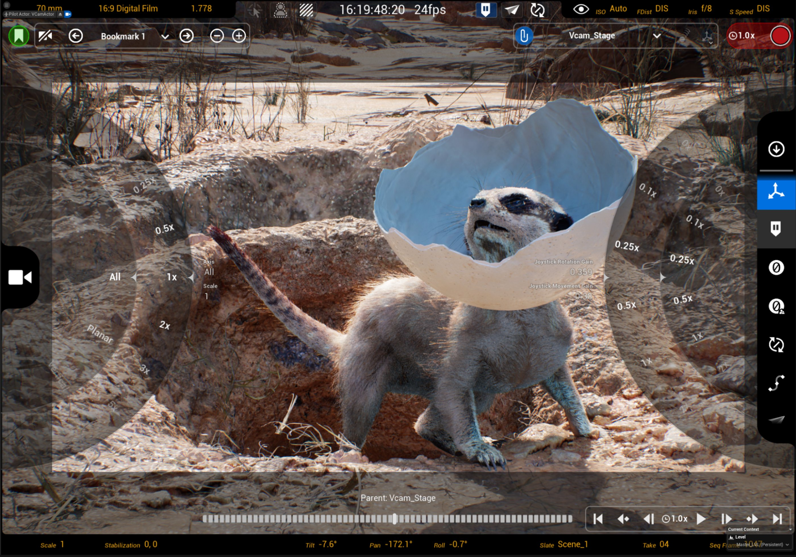
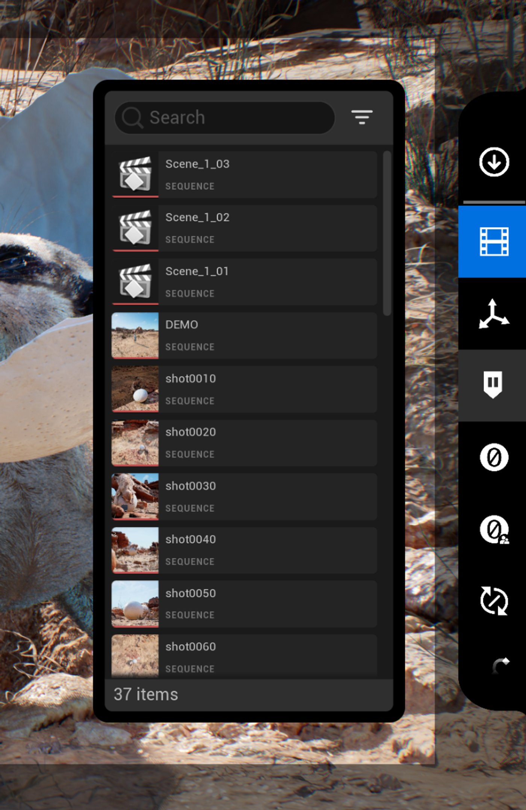
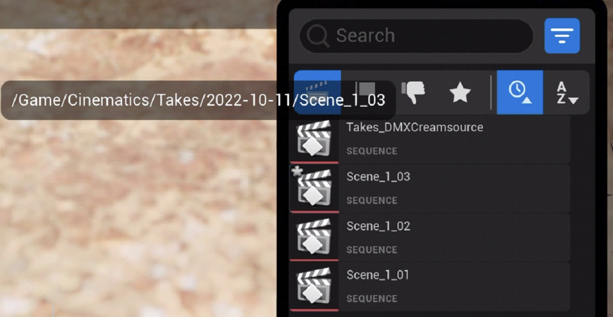
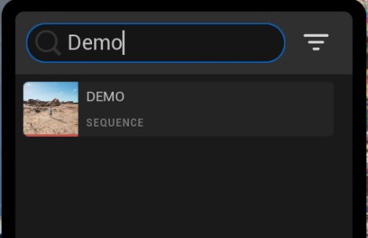
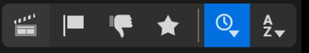
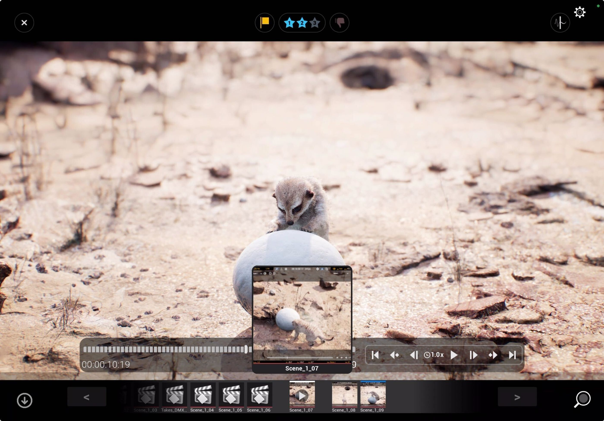
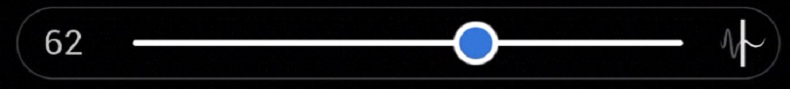

# 虚幻虚拟摄像机（VCam）工具和配置

> 路径：虚幻引擎5.7文档 / 为角色和对象制作动画 / 过场动画和Sequencer / Sequencer中的摄像机 / Virtual Cameras / 使用Live Link控制虚拟摄像机Actor / 虚幻虚拟摄像机（VCam）工具和配置

> 原始页面：https://dev.epicgames.com/documentation/unreal-engine/unreal-vcam-tools-and-configuration-in-unreal-engine

**工具（Tools）**菜单包括可配置的设置和开关，可用于调整你与虚幻引擎场景中启用了Live Link的设备和虚拟摄像机的交互方式。

要打开工具（Tools）菜单，请点击屏幕右侧的**扳手**图标。

该**工具（Tools）**菜单包括以下设置：

| 图标 | 调谐钮名称 / 操作 | 说明 |
| --- | --- | --- |
| [镜头试拍浏览器图标](https://dev.epicgames.com/community/api/documentation/image/52ec2973-f174-4c17-a610-ddc180a335cd?resizing_type=fit) | [镜头试拍浏览器（Takes Browser）](index.md) | 打开虚拟摄像机的镜头试拍浏览器（Takes Browser），你可以在其中搜索和打开关卡序列以进行审核或录制。 |
| [缩放和增益图标](https://dev.epicgames.com/community/api/documentation/image/51a5cdce-7002-4770-a4cf-50cdc7e6f4d4?resizing_type=fit) | [缩放和增益设置（Scale and Gain Settings）](index.md) | 包含的设置用于配置启用了Live Link的设备如何根据虚幻引擎场景进行移动。 这包括设备移动在物理空间中的灵敏度，以及摇杆移动的灵敏度。 |
| [保持图标](https://dev.epicgames.com/community/api/documentation/image/effe9937-4549-4632-b2b1-4eeb9b804d78?resizing_type=fit) | **保持（Hold）** | 切换虚拟摄像机的位置和旋转是否冻结。 这很适合用于重新定位启用了Live Link的物理设备，而不会丢失虚拟摄像机在场景中的位置。 |
| [阶段归零图标](https://dev.epicgames.com/community/api/documentation/image/965a72de-c58f-4eaa-ad17-cefe7f3ab13e?resizing_type=fit) | **阶段归零（Zero To Stage）** | 移除虚拟摄像机追踪位置的任何偏移。 这会将摄像机放回追踪空间。 |
| [父项归零图标](https://dev.epicgames.com/community/api/documentation/image/2f94916d-5b45-429b-9cb3-8c845343953d?resizing_type=fit) | **父项归零（Zero to Parent）** | 将虚拟摄像机吸附到其父项上，有效相对位置为（0,0,0）。 如果虚拟摄像机没有父项，则会对齐到世界原点。 |
| [本地空间飞行模式图标](https://dev.epicgames.com/community/api/documentation/image/1c1f18fb-c31f-404e-b10f-737d59d7d0cd?resizing_type=fit) | **本地空间飞行模式（Local Space Flight Mode）** | 启用此项可以使向前操纵杆移动跟随摄像机的前进方向，而非世界的前进方向。 处于本地空间飞行模式时，当你将摇杆向前推时，向上看或向下看会使摄像机沿该方向移动。 禁用时，摄像机可以在场景中四处自由转动，但在向前移动时不会沿摄像机所指的方向移动。 |
| [禁止翻滚图标](https://dev.epicgames.com/community/api/documentation/image/25f2a108-a481-468e-8950-c5c30f2768b6?resizing_type=fit) | **禁止翻滚（Kill Roll）** | 切换虚拟摄像机沿X轴的旋转是否禁用，当连接到Live Link的设备在物理空间中移动时，使摄像机在四处移动时保持水平。 |
| [样条模式图标](https://dev.epicgames.com/community/api/documentation/image/5647bae6-1543-475b-a3e3-9a3e1ed0ee74?resizing_type=fit) | [样条模式（Spline Mode）](index.md) | 启用时，允许你从Unreal VCam应用程序创建和编辑自己的绑定导轨。 |
| [倾斜偏移图标](https://dev.epicgames.com/community/api/documentation/image/a286e3e6-9bcc-41f4-b5d2-07f4a205217b?resizing_type=fit) | **倾斜偏移（Tilt Offset）** | 对虚拟摄像机的倾斜角度施加任意偏移量。 这样一来，在拍摄时就能更自如地控制拍摄角度了。 启用后，Tilt HUD值上将显示加号（+）。[已启用倾斜偏移的HUD显示](https://dev.epicgames.com/community/api/documentation/image/a38d0bd3-ec7a-43d9-bddb-944c937364cb?resizing_type=fit) |
| [书签浏览器图标](https://dev.epicgames.com/community/api/documentation/image/c68bbc9f-9d38-4b42-ac34-0239ff041ffb?resizing_type=fit) | **书签浏览器（Bookmark Browser）** | 打开虚拟摄像机书签浏览器。 |
| [多用户复制图标](https://dev.epicgames.com/community/api/documentation/image/03a0a7b7-843a-4632-a504-17c57446fee9?resizing_type=fit) | **多用户复制（Multi User Replication）** | 将当前客户端设置为多用户会话中虚拟摄像机的所有者。 此客户端做出的修改将被传播到其他客户端，而其他客户端的修改会被此客户端的重载。 |
| [GameView图标](https://dev.epicgames.com/community/api/documentation/image/6c70264a-3bd1-47f0-8118-f91f0187cd23?resizing_type=fit) | **游戏视图（Game View）** | 启用时，GameView将显示场景在游戏中的显示效果。 |

### 带有缩放和增益设置的虚拟摄像机移动

启用了Live Link的设备中的移动通过追踪设备中的位置数据和使用触摸屏摇杆来识别（包括倾斜、平移和滚动移动）。 触摸屏摇杆将定向和旋转移动叠加在ARKit动作之上。

启用了Live Link的设备中的虚拟摄像机移动通过以下方式控制：

- ARKit追踪的轴向和运动移动。
- 触摸屏摇杆
- **左**摇杆控制向前、向后、对角线和横向的定向移动。
- **右**摇杆包括两个单独的移动功能按钮:
- **旋转**移动通过在屏幕上左右拖动来实现。
- **垂直**移动通过在屏幕上上下拖动来实现。

你可以调整每种移动的灵敏度，使细微的移动产生较大的影响，或反过来使较大的移动产生较小的影响。 你可以在屏幕右侧的**缩放和增益（Scale and Gain）**设置菜单下找到这些功能按钮。

该菜单包括以下设置：

| 调谐钮名称 / 操作 | 说明 |
| --- | --- |
| 左调谐钮（Left Dials） |  |
| **轴** | 设置移动的轴约束：**全部（All）**允许沿所有轴移动。**平面（Planar）**仅允许沿要缩放的X轴和Y轴移动。 垂直移动不受影响。**垂直（Vertical）**允许沿要缩放的Z轴移动。 沿X轴和Y轴的平面移动不受影响。 |
| **缩放（Scale）** | 缩放物理空间中设备的ARKit追踪的移动。 缩放会调整移动如何通过Live Link从真实世界物理空间转换到虚拟摄像机数字空间。 缩放值较小时，会将较大的物理空间移动转换为较小的数字空间移动。 缩放值较大时，会将较小的物理空间移动转换为较大的数字空间移动。 |
| 右调谐钮（Right Dials） |  |
| **摇杆移动增益（Joystick Movement Gain）** | 控制左向摇杆和仅限垂直的右摇杆移动的速度。 |
| **摇杆旋转增益（Joystick Rotation Gain）** | 在左或右旋转移动中操纵右摇杆时控制旋转的速度。 |

将任何调谐钮设置为**锁定（Locked）**或**0**会禁止通过Live Link或操纵摇杆来追踪移动。 例如，将轴设置为垂直并将缩放设置为锁定，就意味着不能垂直移动。 另一个示例是，将摇杆旋转增益设置为0会禁止通过摇杆应用的旋转。

## 浏览序列并审核镜头试拍

### 镜头试拍浏览器

点击工具菜单中的**镜头试拍浏览器（Takes Browser）**按钮，即可打开镜头试拍浏览器。 镜头试拍浏览器将显示可以打开以供审核或录制的关卡序列的排序列表。

点击关卡序列会出现两个选项

| 图标 | 说明 |
| --- | --- |
| [镜头试拍重新加载图标](https://dev.epicgames.com/community/api/documentation/image/c74bb598-b1cb-4275-b097-6cbb6edef5c9?resizing_type=fit) | 点击此项可将选定序列加载到镜头试拍录制器中，使其成为下一次录制的基础。 使用此选项可选择要进行摄像机录制的动画。 |
| [镜头试拍浏览图标](https://dev.epicgames.com/community/api/documentation/image/52489d65-04f6-4d49-ad3e-3afe06bc84bf?resizing_type=fit) | 点击此项可打开序列进行审核。 这将引导序列的镜头切换轨道并提供简化的功能按钮以审核序列。 |

按住关卡序列将显示资产路径。 在关卡序列被修改时，这还会显示脏污状态。

#### 标记镜头

在镜头试拍浏览器中的序列上向左或向右滑动，可使用所选元数据标记该序列，这可用于筛选镜头试拍浏览器中的序列。

| 选项 | 说明 |
| --- | --- |
| [星标标签](https://dev.epicgames.com/community/api/documentation/image/df2b6e76-d6ae-4612-bf4c-024d0939991e?resizing_type=fit) | 向右滑动会点亮一颗、两颗或三颗星，具体取决于滑动的距离。 在一定数量的已点亮星处停下来，可用该星数标记试拍镜头。 |
| [标记镜头试拍](https://dev.epicgames.com/community/api/documentation/image/404d9cef-c77f-4f23-aaea-d064e0708124?resizing_type=fit) | 向左滑动会看到一面黄旗。 点击此项即可将该试拍镜头标记为已标记。 使用此标志来表示与你的工作流程相关的信息。 |
| [镜头试拍不通过](https://dev.epicgames.com/community/api/documentation/image/791c7e22-5709-488c-a81b-896cac41be86?resizing_type=fit) | 向左滑动将显示红色大拇指向下标志。 点击此项将把该试拍镜头标记为"欠佳"并将其从镜头浏览器中过滤掉。 点击后，你会看到一个简短的撤消提示。 若在到时间之前点击此按钮，将删除"欠佳"标签，并使试拍镜头回到浏览器中。此操作不会删除关卡序列，只是默认将其从镜头试拍头浏览器列表中隐藏。 |

#### 镜头试拍浏览器中的筛选和排序

镜头试拍浏览器的顶部有一个搜索栏和筛选器下拉菜单。 若在此搜索栏中输入含匹配字符串的内容，可按试拍镜头筛选列表。

点击筛选器下拉菜单，可以显示或隐藏镜头试拍浏览器的筛选器和排序选项。

可用筛选器如下：

| 图标 | 说明 |
| --- | --- |
| [仅显示镜头试拍图标](https://dev.epicgames.com/community/api/documentation/image/f1ffeb74-78a1-4f9b-b2ed-64eaf7ea07a2?resizing_type=fit) | 点击此项可仅显示镜头试拍录制器记录的序列并隐藏非记录序列。 |
| [显示已标记图标](https://dev.epicgames.com/community/api/documentation/image/44f72e77-b401-4d09-bdbe-c5f1c7a70539?resizing_type=fit) | 点击此项可仅显示带有标记标签的序列。 |
| [显示不通过图标](https://dev.epicgames.com/community/api/documentation/image/b6900463-4048-4619-9a6b-5ff066fe30e4?resizing_type=fit) | 点击此项可仅显示带有"欠佳"的序列。 如果需要恢复序列或者有序列被错误地标记为欠佳，请使用此选项。 |
| [显示星标图标](https://dev.epicgames.com/community/api/documentation/image/ab1e7354-fcdc-4309-9d63-704639bb56a2?resizing_type=fit) | 点击此项可循环显示标记星数大于所示数量的序列。 例如，点击直到星数显示数字2，则仅显示标记有2颗星或3颗星的序列。 |
| [按时间排序镜头试拍图标](https://dev.epicgames.com/community/api/documentation/image/03812b51-fb4f-458b-ad20-562f9d5fa319?resizing_type=fit) | 点击此项可循环使用从最新到最旧或从最旧到最新的镜头试拍浏览器排序。 没有子排序，因此列表只能按创建日期或字母顺序排列。 |
| [按字母顺序排序镜头试拍图标](https://dev.epicgames.com/community/api/documentation/image/3afd590d-be95-4605-87b2-ffca1c35b027?resizing_type=fit) | 点击此项可循环使用字母顺序或反字母顺序的镜头试拍浏览器排序。 没有子排序，因此列表只能按创建日期或字母顺序排列。 |

### 镜头试拍查看器

你可以使用镜头试拍查看器（Take Viewer）在各个镜头间切换，对其进行标记和平滑操作。

从镜头试拍浏览器加载镜头时，镜头试拍查看器窗口就会打开。 或者，你可以可以点击HUD左下角的镜头（Take）缩略图打开上一个镜头。

#### 标记镜头

你可以在当前镜头上添加星号、旗帜标记，或将其标记为"不佳"。

#### 平滑镜头

在浏览镜头时，你可以点击右上角的按钮，并使用出现的滑块对关卡序列中的摄像机关键帧进行平滑操作。

#### 使用轮播视图切换镜头

要打开轮播视图，请点击左下角的镜头（Take）缩略图。 轮播视图会按时间顺序列出所有镜头。

> 图片已省略：镜头试拍查看器轮播

在轮播视图中，你可以进行以下操作：

- 滑动缩略图以浏览镜头试拍。 位于中央的缩略图将成为当前项，其会以白色高亮显示，且其缩略图会在预览窗口中放大。
- 点击预览窗口，打开关卡序列进行浏览。 顶部的蓝色高亮表示当前正在浏览的关卡序列。
- 点击下方按钮中的向下箭头关闭轮播视图。
- 点击轮播旁的**<**和**>**按钮逐一切换镜头。

#### 打开镜头试拍浏览器

你可以点击右下角的放大器图标，打开镜头试拍浏览器，获取更多搜索和筛选选项。 关于镜头试拍浏览器的更多响起，请查看上文中"浏览序列并审核镜头试拍"一节下的"镜头试拍浏览器"小节。

> 图片已省略：打开镜头试拍浏览器图标

## 传送

用两根手指按下屏幕并拖动，可以实现VCam传送，从而更快地在场景中移动。 当按住两根手指时，你触摸的位置会显示蓝色着陆区指示器。 移动手指可使着陆区跟随你的手指移动。 松开手指后，虚拟摄像机就会传送到着陆区指示的位置。

> [!NOTE]
> 传送只能检测发生碰撞的表面。

### Sequencer和书签设置

虚拟摄像机Actor最底部的分段包含摄像机设置和Sequencer播放的快速参考。 最上面的分段包含摄像机书签和录制。

> 图片已省略：虚拟摄像机Actor顶部

> 图片已省略：虚拟摄像机Actor底部

| 图标 | 调谐钮名称 / 操作 | 说明 |
| --- | --- | --- |
| 分段1 |  |  |
| [创建书签图标](https://dev.epicgames.com/community/api/documentation/image/c763e1ca-34e6-4318-af53-94f49b2eeaaf?resizing_type=fit) | **创建书签（Create Bookmark）** | 点击此项可以为虚拟摄像机使用的当前位置、旋转以及摄像机设置创建书签。 如果你启用了照片保存模式（Photo Save Mode），会出现一个DSLR摄像机图标。 |
| [重新继承摄像机设置图标](https://dev.epicgames.com/community/api/documentation/image/590df798-8d1a-4a01-842f-31694a1c7c06?resizing_type=fit) | **重新继承摄像机设置（Re-inherit Camera Settings）** | 书签存储摄像机参数（包括光圈和焦距）。 此项控制跳转到书签时是否加载那些存储的摄像机参数。 |
| [书签导航图标](https://dev.epicgames.com/community/api/documentation/image/3a17cd38-7aa9-41a4-99b5-54295293c3c5?resizing_type=fit) | **书签导航（Bookmark Navigation）** | 用于在场景中通过虚拟摄像机书签前后循环的导航功能按钮。 |
| [移除书签图标](https://dev.epicgames.com/community/api/documentation/image/07175cb5-0f09-4a61-8b45-a34388d44e5d?resizing_type=fit) | **移除书签（Remove Bookmark）** | 点击此项可以从Unreal VCam应用程序中移除当前选定的书签。 此按钮将从你的虚幻引擎项目中移除书签场景Actor。 |
| [当前/选择书签按钮](https://dev.epicgames.com/community/api/documentation/image/607dc586-36e6-4006-90ec-0e7e95d86137?resizing_type=fit) | **当前/选择书签（Current/Select Bookmark）** | 显示最近加载的书签。 点击此按钮会打开书签浏览器。 |
| 第2节 |  |  |
| [缩放图标](https://dev.epicgames.com/community/api/documentation/image/ae207564-d943-4371-baff-05b9814daf7a?resizing_type=fit) | **缩放（Scale）** | 显示当前应用于设备移动的缩放比例。 更多信息请参阅[带有缩放和增益设置的虚拟摄像机移动（Virtual Camera Movement with Scale and Gain Settings）](../../controlling-a-virtual-camera-actor-using-live-link/index.md)。 |
| [稳定性图标](https://dev.epicgames.com/community/api/documentation/image/75909a73-6fd7-4ec3-b926-28d60888edc6?resizing_type=fit) | **稳定性（Stabilization）** | 显示应用于虚拟摄像机的旋转和位置移动的稳定值。 值越高，移动的稳定性就越高，而响应能力会变差，带来更流畅的摄像机移动。 值越低，稳定性越低，而响应能力越高，带来更不平滑的摄像机移动。 更多信息请参阅[虚拟摄像机稳定性（Virtual Camera Stabilization）](../../controlling-a-virtual-camera-actor-using-live-link/index.md)。 |
| [方向图标](https://dev.epicgames.com/community/api/documentation/image/0a1f56ec-b368-4f62-8d89-91c15d78d378?resizing_type=fit) | **倾斜、平移、滚动方向（Tilt, Pan, Roll Orientation）** | 显示虚拟摄像机的旋转位置。 更多信息请参阅[带有缩放和增益设置的虚拟摄像机移动（Virtual Camera Movement with Scale and Gain Settings）](../../controlling-a-virtual-camera-actor-using-live-link/index.md)。 |
| 第3节 |  |  |
| [时间轴图标](https://dev.epicgames.com/community/api/documentation/image/24331720-c017-48e6-8bb1-ccea9f496ef5?resizing_type=fit) | **时间轴（Timeline）** | 显示虚幻编辑器中当前加载的序列的时间轴。 要将滑块移至序列中的不同帧，请沿时间轴拖动你的手指。 |
| [Sequencer播放功能按钮图标](https://dev.epicgames.com/community/api/documentation/image/d1ab497b-a2a1-44fe-b3d1-d8caf194cce4?resizing_type=fit) | **Sequencer播放功能按钮（Sequencer Playback Controls）** | 播放功能按钮的功能类似于带有播放、跳过帧、跳至开始帧和结束帧等功能的标准媒体播放应用程序。 更多信息请参阅[Sequencer过场动画编辑器（Sequencer Cinematic Editor）](https://dev.epicgames.com/documentation/assets/animating-characters-and-objects/Sequencer)。 |
| [播放时标图标](https://dev.epicgames.com/community/api/documentation/image/492e7cbb-d0af-458a-b30c-65730c4da254?resizing_type=fit) | **播放时标（Playback TimeScale）** | 将其用于Sequencer的时标。 例如，设置0.5x的值会导致序列以半速播放。 |
| [场记板图标](https://dev.epicgames.com/community/api/documentation/image/b727505e-967b-4aef-b407-a162ae1a1ce6?resizing_type=fit) | **场记板（Slate）** | 显示下一次录制要使用的场记板名称。 点击此项即可调出屏幕键盘，可以编辑场记板名称 |
| [镜头试拍编号图标](https://dev.epicgames.com/community/api/documentation/image/c72880cf-d8ed-4eb0-a841-7ec24a4350ca?resizing_type=fit) | **镜头试拍（Take）** | 显示下一次录制的镜头试拍编号。 点击此项即可调出屏幕键盘，可以编辑镜头试拍编号。 |
| [Sequencer帧计数器图标](https://dev.epicgames.com/community/api/documentation/image/433f5797-0dff-4ae5-930b-e1228fd3a863?resizing_type=fit) | **Sequencer帧计数器（Sequencer Frame Counter）** | 显示时间轴正在读取的当前帧编号。 |
| [镜头试拍录制器图标](https://dev.epicgames.com/community/api/documentation/image/dc1bf161-7680-444b-a32f-05d8f60f8b68?resizing_type=fit) | **镜头试拍录制器（Take Recorder）** | 点击此项可打开镜头试拍录制器，并开始将Gameplay、现场表演和其他来源直接录制到虚幻引擎中。 更多详情请参阅[镜头试拍录制器（Take Recorder](../../../../unreal-engine-sequencer-movie-tool-overview/take-recorder/index.md)）和使用[镜头试拍录制器（Using Take Recorder）](../../../../cinematic-workflow-guides-and-examples/record-gameplay/index.md)。 |
| [录制时标图标](https://dev.epicgames.com/community/api/documentation/image/9a85f778-51d6-4d79-878d-f6c5ba1bf011?resizing_type=fit) | **录制时标（Recording Time Scale）** | 使用此项可设置录制的当前时标。 例如，以0.5倍速录制会以半速播放待录制的试拍镜头。 审核时，你的摄像机移动速度会加快到原来的2倍，以匹配序列的原始速度。 |
| [打开上一个镜头图标](https://dev.epicgames.com/community/api/documentation/image/a3abee32-d4a9-400b-84a3-4a9a634db13b?resizing_type=fit) | **打开上一个镜头（Open Last Take）** | 点击缩略图，在镜头试拍查看器中打开上一个录制的镜头。 |

### 虚拟摄像机稳定性

点击**稳定性（Stabilization）**文本，打开虚拟摄像机稳定性调谐钮。 这些调谐钮会影响摄像机在多大程度上防止或补偿意外的摄像机移动。 使用更高的稳定性值时，摄像机移动看起来更流畅，但响应能力更低。 使用更低的值时，响应能力更高，而摄像机移动中会出现大量摇晃和不稳定的情况。

**左**调谐钮可控制**旋转稳定性（Rotation Stabilization）**， **右**调谐钮可控制**位置稳定性（Location Stabilization）**。 在下面的视频中，你可以看到使用值0x、50x（默认值）和100x之间的差异。

## 父项关系和平台

当未处于样条线模式时，虚拟摄像机的右上角会显示父项关系和平台控制。

> 图片已省略：父项关系和平台控制

### 创建连接支架

虽然虚拟摄像机可以连接到台式机上的任何对象，但手持操作员的可用选项仅限于过场动画摄像机绑定导轨（Cine Camera RigRails）、过场动画摄像机Actor（Cine Camera Actor）和过场动画摄像机连接支架（Cine Camera Attach Mount）。 使用过场动画摄像机连接支架，你可以更好地控制虚拟摄像机如何连接到其父项，包括启用和禁用某些轴以及在跟随父项时引入延迟，以实现更自然的跟随行为。

要创建连接支架，请点击“放置Actor菜单（place actors menu）”并搜索“连接”。将**过场动画摄像机连接支架（Cine Camera Attach Mount）**拖放到世界中。

> 图片已省略：创建连接支架

要配置连接支架的父项，请在世界大纲视图中选择它，然后在**细节（Details）**面板中**，**将**目标Actor（Target Actor）**设置为所需的Actor。 如果目标Actor是骨骼，请指定**目标插槽（Target Socket）**以允许连接到特定骨骼或插槽。

> 图片已省略：配置连接支架

将连接支架命名为可指明其父项的名称，以便稍后使用。

### 选择并连接到父项

点击中央下拉菜单就会出现可用父项的列表。 虽然虚拟摄像机可以连接到场景中的任何对象，但手持操作员的可用选项仅限于过场动画摄像机绑定导轨（Cine Camera Rig Rail）、过场动画摄像机Actor（Cine Camera Actor）和过场动画摄像机连接支架（Cine Camera Attach Mount）。 从此下拉菜单中选择一个选项，会自动将虚拟摄像机对齐到其新的父项并启用连接。 可以使用**回形针**按钮打开和关闭连接。

> 图片已省略：选择并将摄像机连接到父项

### 继承特定轴和摄像机参数

默认情况下，虚拟摄像机将从父项继承所有轴，但它仍然可以在此平台顶部移动。 但是，选择最右边的轴按钮会展开轴和摄像机参数列表，可以选择性地禁用、继承（虚拟摄像机继承父项的轴值，但仍可以在顶部偏移）或锁定（虚拟摄像机继承父项的轴值，但不能在顶部偏移）。 这些选项仅当父项为过场动画摄像机绑定导轨（CineCamera Rig Rail）、过场动画摄像机Actor（Cine Camera Actor）或过场动画摄像机连接支架（Cine Camera Attach Mount）时才可用。

可用选项如下：

| 图标 | 调谐钮名称 / 操作 | 说明 |
| --- | --- | --- |
| [推轨图标](https://dev.epicgames.com/community/api/documentation/image/8682774d-004d-4e4c-a81f-01cc989df58a?resizing_type=fit) | **推轨（Dolly）** | 点击此项可在继承、锁定或忽略父项的前后移动之间循环。 |
| [横移图标](https://dev.epicgames.com/community/api/documentation/image/f565ffaf-dc88-44c0-b9b5-3844792d2607?resizing_type=fit) | **横移（Truck）** | 点击此项可在继承、锁定或忽略父项的左右移动之间循环。 |
| [升降图标](https://dev.epicgames.com/community/api/documentation/image/c84ddbde-3648-46ec-b394-cef7c63ea474?resizing_type=fit) | **升降（Crane）** | 点击此项可在继承、锁定或忽略父项的上下移动之间循环。 |
| [滚转图标](https://dev.epicgames.com/community/api/documentation/image/450a1af7-8574-4413-99d5-24f7b31905f0?resizing_type=fit) | **滚转（Roll）** | 点击此项可在继承、锁定或忽略父项的滚动旋转之间循环。 |
| [倾斜图标](https://dev.epicgames.com/community/api/documentation/image/165cf83d-5aef-4d43-aa03-413ac2df7e00?resizing_type=fit) | **倾斜（Tilt）** | 点击此项可在继承、锁定或忽略父项的倾斜旋转之间循环。 |
| [摇摄图标](https://dev.epicgames.com/community/api/documentation/image/1e6c0cbc-cb63-49e5-9599-b52fac89e48c?resizing_type=fit) | **摇摄（Pan）** | 点击此项可在继承、锁定或忽略父项的平移旋转之间循环。 |
| [光圈图标](https://dev.epicgames.com/community/api/documentation/image/b0bcc30d-25b9-4730-baf2-1643a4acca06?resizing_type=fit) | **光圈** | 点击此项可在继承、锁定或忽略父项的光圈摄像机参数之间循环。 摄像机参数只能从过场动画摄像机绑定导轨和过场动画摄像机Actor父项继承。 |
| [焦距图标](https://dev.epicgames.com/community/api/documentation/image/6ade8266-2591-4049-953b-452e567d8839?resizing_type=fit) | **焦距** | 点击此项可在继承、锁定或忽略父项的焦距摄像机参数之间循环。 摄像机参数只能从过场动画摄像机绑定导轨和过场动画摄像机Actor父项继承。 |
| [聚焦距离图标](https://dev.epicgames.com/community/api/documentation/image/846dfc18-1d95-486d-99f4-8f8a67751a49?resizing_type=fit) | **聚焦距离** | 点击此项可在继承、锁定或忽略父项的对焦距离摄像机参数之间循环。 摄像机参数只能从过场动画摄像机绑定导轨和过场动画摄像机Actor父项继承。 |

### 在连接中引入延迟

如果连接到CineCameraAttachMount，虚拟摄像机还具有启用和禁用跟随延迟的附加功能。 这使得在跟随汽车等物体时移动更加自然，实体摄像机不会立即跟随移动。 要打开或关闭延迟，请点击连接菜单中的延迟按钮。

> 图片已省略：切换延迟

可以从CineCameraAttachMount的细节面板控制此延迟的速度。 位置/旋转延迟速度的值越低，响应延迟越大，而值越高，响应越快。

> 图片已省略：在细节面板中设置延迟

## 创建和操作自定义绑定导轨

按下工具菜单中的样条线图标，可进入样条线模式。 在此模式下，右上角的连接功能按钮将更改为样条线功能按钮。 左下角现在还将出现关键帧功能按钮。

虚拟摄像机的移动车样条线由CineCameraRigRail Actor表示。 CineCameraRigRail允许创建样条线点，这些样条线点同时存储变换和摄像机参数（焦点、光圈和变焦），这些参数可以被虚拟摄像机继承并操作。

> 图片已省略：创建样条点

### 创建新的CineCameraRigRail

要创建新的CineCameraRigRail，请确保将功能按钮设置为样条线选择功能按钮（由样条线图标表示）。

> 图片已省略：选择样条控制

此模式提供以下功能按钮：

| 图标 | 调谐钮名称 / 操作 | 说明 |
| --- | --- | --- |
| [样条模式选择图标](https://dev.epicgames.com/community/api/documentation/image/0c2dd2bb-32c5-4a1b-9949-d4a11bc3e0fb?resizing_type=fit) | 模式 | 点击此分段式功能按钮中的选项可切换当前操作模式，即在**RigRail**选择模式、**编辑（Edit）**模式和**驱动（Drive）**模式之间选择。在**RigRail**选择模式下，蓝色样条线图标会突出显示。 |
| [激活的RigRail图标](https://dev.epicgames.com/community/api/documentation/image/6b195244-d13e-4cb2-9462-c8071511cce2?resizing_type=fit) | 激活RigRail（Active RigRail） | 此下拉菜单指示当前选定的RigRail。 所有其他编辑、连接和驱动工具都基于此RigRail进行操作。 要更改当前选择，请展开下拉菜单并选择新的RigRail。 |
| [新建RigRail图标](https://dev.epicgames.com/community/api/documentation/image/a452ae99-51ca-4968-b39f-e98807a9a9b1?resizing_type=fit) | 新建RigRail（New RigRail） | 点击此项可创建新的RigRail，并将其设置为当前选择。 |
| [删除RigRail图标](https://dev.epicgames.com/community/api/documentation/image/0c3b08f0-419b-4d8c-9ef1-cb89c91cc4e5?resizing_type=fit) | 删除RigRail（Delete RigRail） | 按下此按钮将删除当前选定的RigRail。 要确认删除，请按住按钮，直到红色时间指示器转完一整圈。 在此之前释放会取消该操作。这是一项破坏性操作，它会从场景中完全删除CineCameraRigRail。 |
| [连接图标](https://dev.epicgames.com/community/api/documentation/image/8145d932-444c-4ccf-82a2-d1e3b1d09c19?resizing_type=fit) | 连接（Attach） | 开关此项可使虚拟摄像机与当前选定的RigRail连接/分离。 |
| [连接轴图标](https://dev.epicgames.com/community/api/documentation/image/f3cd3a7f-c5bf-4102-a00c-cbd06b111d08?resizing_type=fit) | 连接轴（Attach Axes） | 此下拉菜单提供从RigRail到虚拟摄像机的轴继承功能按钮。 |

点击新建绑定导轨（New Rig Rail）按钮可创建新的CineCameraRigRail，并将其第一个点设置为虚拟摄像机的当前变换和摄像机参数。 功能按钮会立即切换到编辑模式。

### 编辑CineCameraRigRail

将模式分段功能按钮切换到铅笔图标，可将功能按钮切换为编辑模式。 此模式用于添加、删除和修改当前选定RigRail上的点。

> 图片已省略：选择编辑模式

此模式提供以下功能按钮：

| 图标 | 调谐钮名称 / 操作 | 说明 |
| --- | --- | --- |
| [编辑模式选择图标](https://dev.epicgames.com/community/api/documentation/image/8f74a841-1088-4bfe-9ae6-8dfcbc7ad48a?resizing_type=fit) | 模式 | 点击此分段式功能按钮中的选项可切换当前操作模式，即在**RigRail**选择模式、**编辑（Edit）**模式和**驱动（Drive）**模式之间选择。在**编辑（Edit）**模式下，蓝色铅笔图标会突出显示。 |
| [当前点图标](https://dev.epicgames.com/community/api/documentation/image/6e722aa4-8dbd-4a58-8c0e-e0b4ea40871d?resizing_type=fit) | 当前点（Current Point） | 该分节器将显示沿样条线和当前编辑点的当前支架位置。 点击前进和后退箭头将分别跳转到下一个点或上一个点。 以任何方式与分节器交互都会调出一个滑块，可用于沿着RigRail拖动。 |
| [删除当前点图标](https://dev.epicgames.com/community/api/documentation/image/dac32af1-8fc3-483c-8a47-fa76ec540086?resizing_type=fit) | 删除当前点（Delete Current Point） | 按此按钮可删除当前选定点。 要确认删除，请按住按钮，直到红色时间指示器转完一整圈。 在此之前释放会取消该操作。 如果图标呈灰色，则表示分节器的当前值介于两个点之间。这是一项破坏性操作，会完全删除该点。 |
| [添加点图标](https://dev.epicgames.com/community/api/documentation/image/d1f192ad-a5b7-4de4-9ec1-7f5441f67a7f?resizing_type=fit) | 添加点（Add Point） | 按下此按钮可使用虚拟摄像机的当前变换和摄像机参数向RigRail添加新点。 归于该点的沿样条线的位置值与你当前的位置值相关：如果分节器的当前值*n*位于RigRail的末端，则该值为*n+1*。如果当前值*n*在某个点而非在末端，则该值位于当前值和下一个点之间。 例如，当有点2时，如果你在点1上按下此按钮，则会创建一个位置为1.5的点。如果当前值*n*不在某个点，则位置值为*n*。 |
| [更新点图标](https://dev.epicgames.com/community/api/documentation/image/cabc2bf8-a924-4741-a3eb-3784bf8206fe?resizing_type=fit) | 更新点（Update Point） | 使用虚拟摄像机的当前变换和摄像机参数更新当前选择的点。 |
| [连接图标](https://dev.epicgames.com/community/api/documentation/image/51d318e4-1937-4c5b-a93b-36680acb4b05?resizing_type=fit) | 连接（Attach） | 开关此项可使虚拟摄像机与当前选定的RigRail连接/分离。 |
| [连接轴图标](https://dev.epicgames.com/community/api/documentation/image/7845b06f-91f7-4791-9c53-e95909d8e8b5?resizing_type=fit) | 连接轴（Attach Axes） | 此下拉菜单提供从RigRail到虚拟摄像机的轴继承功能按钮。 |

要创建RigRail，请将虚拟摄像机移动到某个位置，然后使用这些摄像机参数在该变换处向RigRail添加一个点。 对轨道上的每个点重复此过程。

完成RigRail后，点击汽车图标进入驱动模式。

### 搭乘和驱动CineCamera RigRail

将模式分段功能按钮切换到铅笔图标，可将功能按钮切换为编辑模式。 此模式用于驱动RigRail支架移动，与其他两种模式的不同之处在于，除了样条线功能按钮外，它还使用调谐钮。

> 图片已省略：创建自定义RigRail

驱动模式提供3种驱动模式来控制RigRail，通过右侧调谐钮选择：

- **手动（Manual）：**手动模式用于手动驱动RigRail。 在此模式下，拖动左侧调谐钮可以沿着导轨拖动位置。 如果位置由硬件输入或Sequencer驱动，也应使用手动模式。
- **时长（Duration）：**时长模式将自动驱动RigRail在设定的时间内完成完整路径。 在此模式下，会显示第二个右调谐钮。 使用此调谐钮设置完成一次完整路径所需的时间。
- **速度（Speed）**：速度模式将自动驱动RigRail以设定速度移动。 在此模式下，会显示第二个右调谐钮。 使用此调谐钮设置所需速度（以厘米/秒为单位）。 要加快或减慢RigRail的速度，请在运动时转动此调谐钮。

无论选择哪种模式，你都可以使用右上角的RigRail功能按钮管理连接，并为两种自动驱动模式提供运输功能按钮。

可用选项如下：

| 图标 | 调谐钮名称 / 操作 | 说明 |
| --- | --- | --- |
| [驱动模式选择图标](https://dev.epicgames.com/community/api/documentation/image/fd2d386b-d19a-445b-afc1-e2e1b32588ad?resizing_type=fit) | 模式 | 点击此分段式功能按钮中的选项可切换当前操作模式，即在**RigRail**选择模式、**编辑（Edit）**模式和**驱动（Drive）**模式之间选择。在**驱动（Drive）**模式下，蓝色汽车图标会突出显示。 |
| [回到起点图标](https://dev.epicgames.com/community/api/documentation/image/6253e983-544a-44bc-9e16-2705b7613c87?resizing_type=fit) | 回到起点（Back to Start） | 点击此项可沿RigRail将当前位置重置回第一个点。 |
| [播放和倒放图标](https://dev.epicgames.com/community/api/documentation/image/af21a51c-3d71-49b5-89f0-2ec118e8bef3?resizing_type=fit) | 播放和倒放（Play and Reverse Play） | 这些功能按钮仅在速度和时长模式下可用。 要使支架沿着RigRail向前移动，请点击前进箭头。 要使支架沿着RigRail向后移动，请点击向后箭头。 移动速度取决于你当前的驱动模式和设置。不论向哪个方向移动，对应的箭头都会变成暂停图标。 点击此项可将支架暂停在当前位置。 |
| [循环图标](https://dev.epicgames.com/community/api/documentation/image/d2836dbd-259a-43bc-b6b9-047eb83bed97?resizing_type=fit)[弹跳图标](https://dev.epicgames.com/community/api/documentation/image/07290e0d-2356-446b-973c-1b6e415464b9?resizing_type=fit) | 循环（Loop） | 点击此按钮可在循环、不循环和弹跳样条线之间切换。 循环时，样条线会在完成循环后会返回到其初始位置，并根据你的驱动模式继续移动。 弹跳时，样条向前播放到末端，反转方向向后播放，然后重复。 |
| [连接图标](https://dev.epicgames.com/community/api/documentation/image/cf7b0f7a-f4b1-45f0-85f1-faf37f107495?resizing_type=fit) | 连接（Attach） | 开关此项可使虚拟摄像机与当前选定的RigRail连接/分离。 |
| [连接轴图标](https://dev.epicgames.com/community/api/documentation/image/01d2209a-f8f0-409a-8075-db051b56fb54?resizing_type=fit) | 连接轴（Attach Axes） | 此下拉菜单提供从RigRail到虚拟摄像机的轴继承功能按钮。 |

### 将过场动画摄像机绑定导轨与Sequencer结合使用

处于样条线模式时，左下角会出现一组额外的功能按钮，可以用来在Sequencer中设置关键帧。 你可以手动或通过自动键为绑定导轨支架添加和删除关键帧。 若对绑定导轨支架位置进行关键帧设置，可将沿绑定导轨的特定位置与当前序列的帧绑定在一起。 播放带有绑定导轨关键帧的关卡序列会导致支架根据有关键帧的位置移动。 为了防止在驱动导轨时出现冲突，绑定导轨应处于手动模式或暂停速度/时长模式。

> 图片已省略：在Sequencer中使用RigRail

时间轴的颜色表示支架在该序列部分中移动的相对速度。 红色表示最快的片段，逐渐变为表示最慢片段的绿色。 蓝色表示支架静止

可用的关键帧命令如下：

| 图标 | 调谐钮名称 / 操作 | 说明 |
| --- | --- | --- |
| [自动关键帧图标](https://dev.epicgames.com/community/api/documentation/image/d0098255-1a63-4f75-b835-dedd77bab9d1?resizing_type=fit) | 自动关键帧（Autokey） | 点击此项可打开或关闭自动关键帧。启用自动关键帧后，一旦向Rig Rail添加新点，都会以当前帧的支架相应位置将关键帧添加到Sequencer中。 移除导轨上的一个点会移除其相应的关键帧。 |
| [移除关键帧图标](https://dev.epicgames.com/community/api/documentation/image/2e3e02d3-451f-4be4-9ca2-1639f5f0be91?resizing_type=fit) | 移除关键帧（Remove Keyframe） | 点击此项可删除当前播放头位置的关键帧。 要确认移除，请按住按钮，直到红色时间指示器转完一整圈。 在此之前释放会取消该操作。 如果图标变灰，则表示Sequencer播放头不在绑定导轨关键帧上。 |
| [添加关键帧图标](https://dev.epicgames.com/community/api/documentation/image/78ed6c4f-a64a-4e33-a6aa-2f0d64b53e25?resizing_type=fit) | 添加关键帧（Add Keyframe） | 点击此项可以为打开的关卡序列添加新的关键帧。 该关键帧位于播放头位置，并使用驱动模式调谐钮或绑定导轨功能按钮上指示的当前支架位置。 |

## 虚拟摄像机书签

要在场景中创建新的**VPBookmark** Actor，请按下启用了Live Link的设备屏幕左上角的绿色**书签**图标。 此Actor可存储有关虚拟摄像机的信息，包括其位置和旋转。 该书签还可存储已为摄像机调整的设置，例如曝光和镜头设置。

你可以通过向前和向后箭头，使用屏幕左下角的书签导航功能按钮，或点击书签下拉菜单并从列表中选择一个书签，重新加载放置的书签。 切换**摄像机**图标，可加载随此书签存储的摄像机参数，例如光圈、胶片背板和焦点设置。

使用**减号**(-)图标从启用了Live Link的设备中删除当前引用的书签。 因为书签作为Actor存在于虚幻引擎场景中，你还可以使用**大纲视图**面板从编辑器手动添加和删除书签。

### 书签浏览器

你也可以使用书签浏览器列出并管理场景中的VPBookmark Actor。 你可以从右耳菜单中的书签图标启动书签浏览器，或从视口左上方的书签选择器中的书签名称启动。

> 图片已省略：书签耳朵菜单图标

> 图片已省略：视口中的书签选择器

以图块视图排列的VPBookmark Actor：

> 图片已省略：书签浏览器

#### 加载书签

打开书签的方式是点击某个条目的缩略图并跳转到书签。 打开书签后，你将看到一些选项。

#### 标记书签

| 图标 | 说明 |
| --- | --- |
| [书签右滑选项](https://dev.epicgames.com/community/api/documentation/image/f8ae9e83-8eca-4758-b8eb-7d45063f1654?resizing_type=fit) | 向右滑动以添加星形标记。 |
| [书签左滑选项](https://dev.epicgames.com/community/api/documentation/image/1127b4a2-f1f8-4d38-aef8-d4364739079a?resizing_type=fit) | 向左滑动添加旗帜标记，或删除书签。 |

#### 重命名书签

若要重命名书签，则前往LiveLinkVCam应用，点击并按住条目以激活文本输入并输入新名称。

#### 书签的筛选与排序

筛选和排序选项位于书签浏览器的顶部。 展开筛选器按钮可显示更多选项。

> 图片已省略：书签浏览器筛选和排序

| 图标 | 说明 |
| --- | --- |
| [书签搜索筛选器](https://dev.epicgames.com/community/api/documentation/image/4223ece2-8352-43c1-982a-9fb057d7dcde?resizing_type=fit) | 在搜索栏中输入文本，通过匹配单词或字符串筛选书签。 |
| [书签标记筛选器](https://dev.epicgames.com/community/api/documentation/image/36649fb6-75b9-41ca-9d96-d4c9915b522e?resizing_type=fit) | 点击旗帜图标，只列出带旗帜标记的书签。 |
| [书签星标筛选器](https://dev.epicgames.com/community/api/documentation/image/faf4f30b-3659-4857-b68f-213e8fef00da?resizing_type=fit) | 点击星形图标，切换显示仅包含大于所显示数字数量的星形标记的书签。 例如，点击直至星形显示数字2时，仅会显示带有2或3颗星的书签。 |
| [书签时间筛选器](https://dev.epicgames.com/community/api/documentation/image/e8457389-10b4-4256-85bb-a0b52232973b?resizing_type=fit) | 点击此按钮可在将书签按最新到最旧或最旧到最新进行排序之间切换。 列表只能按创建时间或字母顺序排序。 |
| [书签字母顺序筛选器](https://dev.epicgames.com/community/api/documentation/image/3561c24f-620b-445d-95e6-c530b09cd45c?resizing_type=fit) | 点击此按钮可在将书签按最字母顺序或反向字母顺序进行排序之间切换。 列表只能按创建时间或字母顺序排序。 |

#### 其他选项

点击齿轮图标，打开书签的设置菜单，可查看以下选项：

> 图片已省略：书签浏览器设置

| 图标 | 说明 |
| --- | --- |
| [书签存储摄像机参数](https://dev.epicgames.com/community/api/documentation/image/f220708f-3f0e-4734-b34b-091b841d0596?resizing_type=fit) | 书签会存储摄像机参数，包括光圈和焦距。 你可以使用此设置来确定在跳转至书签时是否应恢复这些存储的摄像机参数。 |
| [书签刷新缩略图](https://dev.epicgames.com/community/api/documentation/image/2e7b7c15-4a94-4e2f-a8b7-410f3b97b38b?resizing_type=fit) | 点击刷新所有的缩略图。 |

### 控制序列

在虚幻编辑器中打开**序列**时，你可以在连接到Live Link的设备上使用**传输（Transport）**按钮控制其时间轴和播放。 你可以使用时间轴上**播放（Play）**、**暂停（Pause）**和**推移（Scrub）**标识的播放功能按钮，观察当前序列的数据。

### 将镜头试拍录制器用于Unreal VCam应用

你可以使用**镜头试拍录制器（Take Recorder）**，为虚幻引擎项目中的场景和角色录制你自己的序列（或镜头）。 这些可以在虚幻编辑器中播放，使用镜头试拍录制器和Sequencer进行审核。

要开始录制镜头，请点击Unreal VCam应用右上角的**录制（Record）**按钮。

将镜头试拍录制器用于Unreal VCam应用时，请注意以下事项：

- * 开始录制时，**镜头试拍录制器（Take Recorder）**窗口会自动在虚幻引擎中打开（如果尚未打开）。
- * 开始录制时，当前关卡序列会自动播放。
- * 录制镜头试拍后，你可以点击镜头试拍录制器窗口中的**审核上次录制（Review the last recording）**按钮，查看镜头。 此操作会播放镜头并隐藏虚拟摄像机HUD。 退出审核模式会取消隐藏虚拟摄像机HUD。
- 所有录制的镜头试拍会保存为**Sequencer剪辑片段**。 保存剪辑片段会将虚拟摄像机Actor替换为[过场动画摄影机Actor（Cine Camera actor）](../../../cinematic-cameras/index.md)，因为虚拟摄像机用于为摄像机制作动画并录制其设置和移动。

虚拟摄像机处于活动状态时，它会在HUD中显示当前**时间码（Timecode）**、**场记板（Slate）**和**序列帧（Sequence Frame）**。 此数据从镜头试拍录制器窗口获得，在虚幻编辑器和连接到Live Link的设备中显示相同的信息。

如需详细了解如何在项目中使用镜头试拍录制器，请参阅：

- [镜头试拍录制器（Take Recorder）](../../../../unreal-engine-sequencer-movie-tool-overview/take-recorder/index.md)
- [使用镜头试拍录制器](../../../../cinematic-workflow-guides-and-examples/record-gameplay/index.md)
- [多用户镜头录制器](../../../../../../production-pipeline/multi-user-editing/multi-user-take-recorder/index.md)

> [!NOTE]
> 在以前的版本中，VCam Actor使用单独的CineCameraActor进行录制，而不是在VCam Actor本身上录制。 如果你偏好使用录制摄像机的以前工作流程，可以在以下修饰符中启用**使用旧版录制摄像机工作流程（Use Legacy Record Camera Workflow）**，然后重新激活VCam。
>
> > 图片已省略：VCam Actor

## VCam照片

使用VCam时，你可以在创建书签的任何时候创建照片。

在项目设置中启用此模式时，书签图标会被替换为数码单反相机图标。

书签图标

DSLR相机图标

在**项目设置（Project Settings）**中，位于**插件（Plugins）** > **虚拟摄像机（Virtual Camera）**下，你可以设置**照片保存模式（Photo Save Mode）**来保存纹理资产、PNG文件或两者。 你也可以禁用此功能，以防止在创建书签时生成任何照片。 在同一窗口中，你可以设置资产的目标保存位置，或保留默认设置。

> 图片已省略：照片保存模式选项

你可以更改保存照片的尺寸。 在VCam组件的**细节（Details）**面板中，转到**照片修饰符（Photo Modifier）** > **照片设置（Photo Settings）**。 将**VCam照片尺寸设置（VcamPhoto Size Settings）**设为**1920**、**3840**、**匹配输出（Match Output）**或**自定义（Custom）**。 保存的照片将被裁剪以匹配VCam帧。

> 图片已省略：VCam照片尺寸设置选项

此设置表示图像的最高尺寸。 另一个尺寸由当前使用的胶片规格决定。 选择**自定义（Custom）**时，你可以将**自定义照片尺寸（Custom Photo Size）**设置为任何数值。 超过4000的自定义值可能需要更长的处理时间。

VCam照片保存到`Content/VCamPhotos`文件夹中。

> 图片已省略：VCamPhotos文件夹
