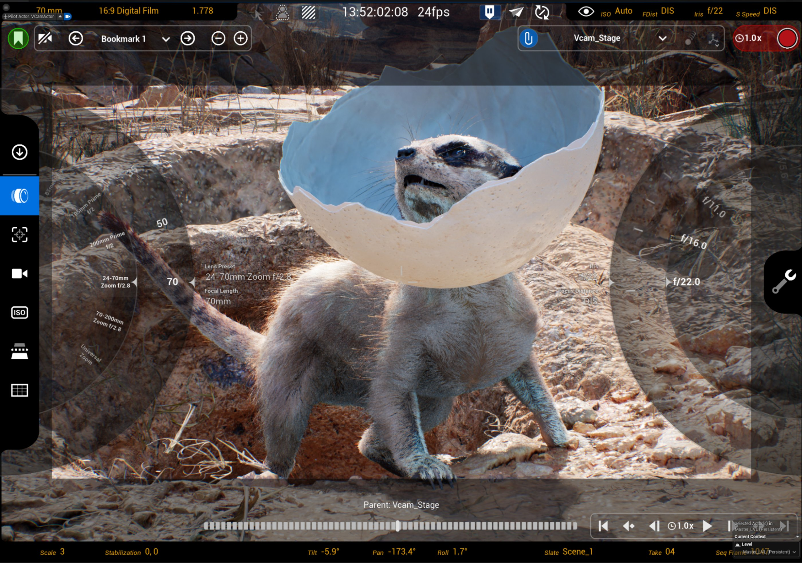
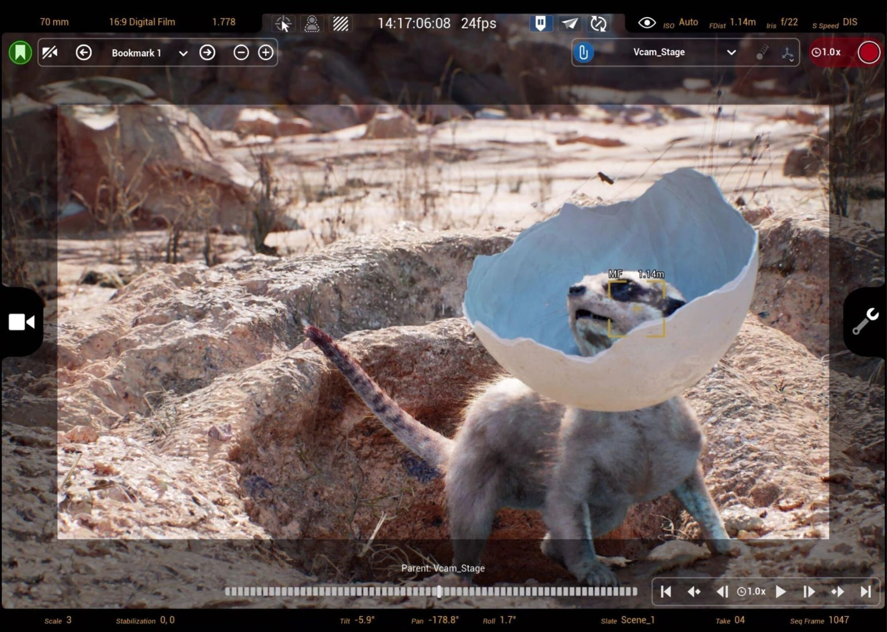
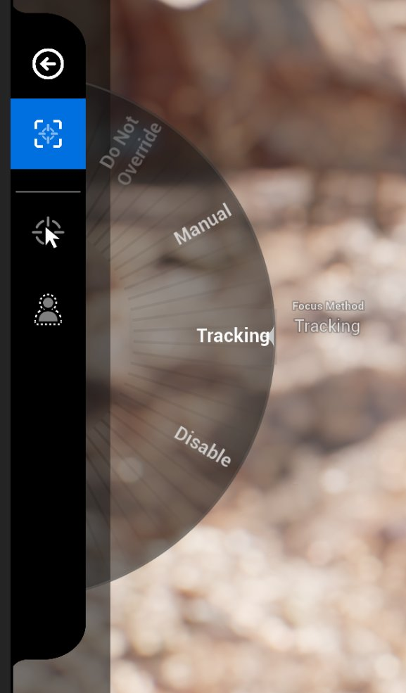
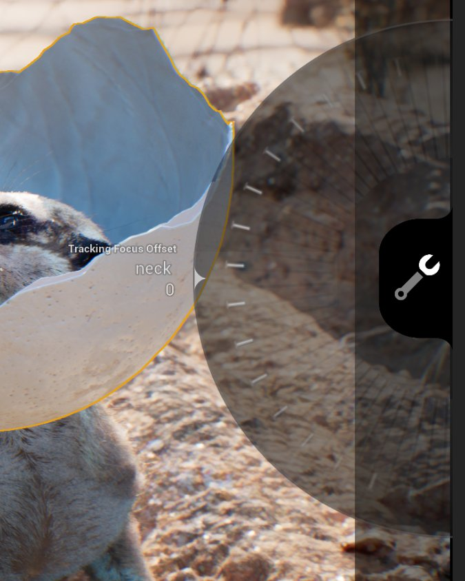
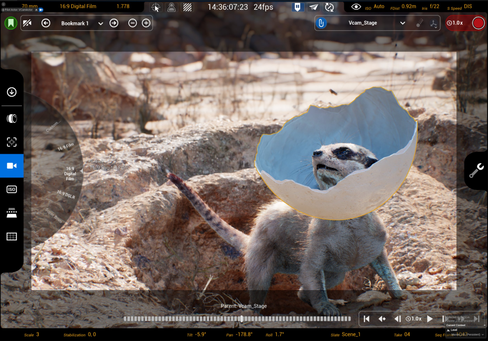
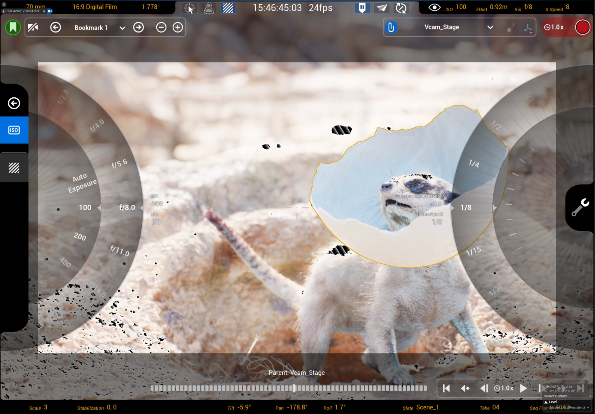
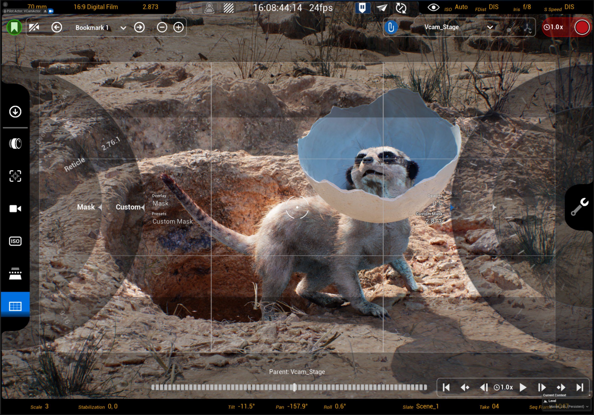

# 虚幻虚拟摄像机（VCam）虚拟摄像机设置

> 路径：虚幻引擎5.7文档 / 为角色和对象制作动画 / 过场动画和Sequencer / Sequencer中的摄像机 / Virtual Cameras / 使用Live Link控制虚拟摄像机Actor / 虚幻虚拟摄像机（VCam）虚拟摄像机设置

> 原始页面：https://dev.epicgames.com/documentation/unreal-engine/unreal-vcam-virtual-camera-settings

**虚拟摄像机（Virtual Camera）**设置位于Unreal VCam应用程序的左侧。 此菜单包括用于控制场景中虚拟摄像机的不同摄像机、镜头、曝光设置的选项。

> 图片已省略：image alt text

该菜单包括以下设置：

| 图标 | 调谐钮名称 / 操作 | 说明 |
| --- | --- | --- |
| [image alt text](https://dev.epicgames.com/community/api/documentation/image/01450f1e-d83b-4465-8bd1-13b7d14370cd?resizing_type=fit) | **镜头设置** | 设置虚拟摄像机参数，包括镜头尺寸、焦点、光圈等。 |
| [image alt text](https://dev.epicgames.com/community/api/documentation/image/c7b172b3-bb37-4876-baea-3002d5f1a692?resizing_type=fit) | **焦点设置** | 设置虚拟摄像机的对焦模式和对焦距离。 |
| [image alt text](https://dev.epicgames.com/community/api/documentation/image/5cdb895a-1bb2-470c-92ae-ad81ef45c3e2?resizing_type=fit) | **胶片背板设置** | 虚拟摄像机的图像传感器的可配置设置。 |
| [image alt text](https://dev.epicgames.com/community/api/documentation/image/1479d8f4-170b-4b82-8336-3f9045a722fa?resizing_type=fit) | **ISO和曝光补偿设置（ISO and Exposure Compensation Settings）** | 关于如何处理虚拟摄像机曝光的可配置设置。 |
| [image alt text](https://dev.epicgames.com/community/api/documentation/image/06db0fe0-a4e1-40ca-b66a-a48647f5d7c1?resizing_type=fit) | **近裁剪平面设置（Near Clip Plane Settings）** | 设置摄像机距离，在此距离之内的多边形将不再渲染。 |
| [image alt text](https://dev.epicgames.com/community/api/documentation/image/a20c1544-0a65-44e7-bad0-596ab449e0ec?resizing_type=fit) | **遮罩/覆层/准星设置（Mask / Overlay / Reticle Settings）** | 设置将哪种类型的纵横比遮罩、网格覆层和准星用于虚拟摄像机。 |

### 镜头设置

**镜头（Lens）**设置包括镜头、焦点、光圈设置的虚拟摄像机预设。

> 图片已省略：image alt text

#### 镜头预设和焦距

选择**镜头模式（Lens Mode）**后，你可以调整常见焦距和光圈的可配置预设。 你还可以手动在对焦距离中设置光圈和拨入。

> [!TIP]
> 你可以在**项目设置（Project Settings）**的**过场动画摄像机（Cinematic Camera） > 镜头预设（Lens Presets）**中配置镜头预设。 你可以在此添加自己的预设，也可以修改和移除现有的预设。

| 调谐钮名称 / 操作 | 说明 |
| --- | --- |
| **左调谐钮（Left Dials）** |  |
| **镜头预设** | 从焦距和光圈的预设列表中选择。 一些预设包括焦距调谐钮。 镜头预设包括：12mm定焦f/2.812mm定焦f/2.812mm定焦f/2.830mm定焦f/1.450mm定焦f/1.885mm定焦f/1.8105mm定焦f/2200mm定焦f/224-70mm变焦f/2.870-200mm变焦f/2.8通用变焦镜头预设在项目设置的**过场动画摄像机（Cinematic Camera）**类别中设置。 你可以添加新预设和编辑现有预设。 |
| **焦距** | 设置镜头的长度（以毫米为单位）。 长度越长，放大倍数越高，视角越窄。 长度越短，放大倍数越低，视角越广。 （仅在一些镜头预设上可用。） |
| **右调谐钮（Right Dials）** |  |
| **聚焦距离** | 设置距离虚拟摄像机多远之内（以米为单位）对象才会对焦。 |
| **光圈** | 通过使光圈变宽（低F值）或变窄（高F值）来控制光线量。 |

#### 使用捏合变焦

使用两根手指在虚拟摄像机屏幕的中心进行捏合，可以在当前选定的镜头范围内放大和缩小。 如果你的镜头是具有设定焦距且无法变焦的定焦镜头，则捏合变焦没有任何作用。

### 焦点设置

**焦点（Focus）**设置选项可以配置虚拟摄像机如何聚焦对象。

> 图片已省略：image alt text

| 图标 | 调谐钮名称 / 操作 | 说明 |
| --- | --- | --- |
| [image alt text](https://dev.epicgames.com/community/api/documentation/image/8142b8d8-a972-4655-ab3e-51ce89361289?resizing_type=fit) | **聚焦方法** | 选择你希望虚拟摄像机如何在场景中应用焦点：选择**不覆盖（Do Not Override）**，你就不能在任何菜单中更改对焦距离调谐钮，并且**后期处理体积（Post Process Volume）**设置可以持久保存选择**手动（Manual）**，就可以使用**对焦距离（Focus Distance）**调谐钮设置从摄像机到主体的距离来手动调整焦点选择**追踪（Tracking）**会将焦点锁定在镜头中的特定Actor上选择**禁用（Disable）**会阻止所有景深 |
| [image alt text](https://dev.epicgames.com/community/api/documentation/image/b98e9f25-9d79-4faf-a34c-7ca75fe7f56a?resizing_type=fit) | **聚焦距离** | 指定距离虚拟摄像机多远之内（以米为单位）对象才会对焦。 |
| [image alt text](https://dev.epicgames.com/community/api/documentation/image/4e2f4aed-cb6c-453f-8328-c4ace900660a?resizing_type=fit) | **选择要追踪的Actor（Pick Actor to Track）** | 使用此项选择场景中要聚焦的Actor。 在**追踪（Tracking）**模式下，选定的Actor始终保持聚焦，并且其与摄像机的距离决定了对焦距离。 当处于**手动（Manual）**模式时，手动对焦距离被设置为离该目标的距离，但如果摄像机或目标移动，不会追踪选定的Actor。 |
| [image alt text](https://dev.epicgames.com/community/api/documentation/image/dd5bdf5b-0108-4f09-8a32-57aa4e998677?resizing_type=fit) | **切换对焦峰值（Toggle Focus Peaking）** | 切换当前设置了对焦距离的场景中的视觉参考。 |

#### 使用点击对焦

双击场景中的Actor可以选择焦点目标。 界面上会出现黄色焦点指示器，用于确认你点击的位置。 即使你未处于**对焦模式（Focus Mode）**，也可以点击对焦。

基于当前模式，点击对焦的行为会有所不同：

- 在**手动对焦（Manual Focus）**中，点击一个Actor会将手动对焦距离设置为与被点击Actor的距离。 如果Actor或摄像机移动，此值不会更新。
- 在**追踪焦点（Tracking Focus）**中，点击Actor会设置追踪焦点目标，并将对焦距离锁定到所选Actor或骨骼网格体插槽上的点击点。 如果Actor/插槽或摄像机移动，焦点会调整以保持聚焦该点。

> [!NOTE]
> 只有具有碰撞的Actor（或骨骼Actor的物理资产）才可以通过点击对焦进行检测。

#### 使用追踪焦点

你可以使用HUD中的**选择要追踪的Actor（Pick Actor to Track）**选项，或使用**点击对焦（Tap to Focus）**，追踪场景中的Actor并维护虚拟摄像机在其中的焦点。

要使用追踪焦点，请执行以下操作：

1. 在**镜头设置（Lens settings）**菜单中，找到**焦点（Focus）**设置。 此处会默认选中**对焦方式（Focus Method）**，其可调整的调谐钮会显示在屏幕上。
2. 将**左调谐钮**拖动到**追踪（Tracking）**。

手持并看着你的设备，双击场景中的Actor。 或者，将虚拟摄像机**准星**对准你想保持聚焦的对象。 点击左菜单中的**选择要追踪的Actor**图标。 完成此操作后，查看**右**调谐钮，你会在下面看到**追踪偏移（Tracking Offset）**以及聚焦的资产/骨骼网格体插槽的**名称**。

使用追踪对焦方式时，使用**追踪焦点偏移（Tracking Focus Offset）**的右调谐钮拨入主体上的焦点。 追踪骨骼网格体Actor时，目标点会移至最接近的插槽进行聚焦，这可能并不总是为你想聚焦的确切点。

只要目标Actor保持在摄像机视野范围内，追踪焦点就是有效的。 当目标Actor移动到视野之外时，系统会自动切换到**手动Manual**对焦模式。 切换到手动（Manual）模式后，焦距就能保持稳定，并且不会受到摄像机中不再可见的对象的影响。

#### 使用对焦峰值

你可以使用**对焦峰值（Focus Peaking）**切换开关，查看场景中的确切对焦距离。 红色轮廓表示对焦距离。 **对焦峰值（Focus Peaking）**有助于快速查看场景中的对焦距离，以便进行调整。 轮廓区域会根据你当前的**光圈**扩大和缩小，以显示**景深**。 要调整焦点，请使用应用程序右侧的**对焦距离**调谐钮。

### 胶片背板设置

**胶片背板**描述了数字成像传感器的帧的尺寸。 此大小将确定摄像机通过Viewfinder能看到什么。 胶片背板将确定帧的大小、景深、分辨率等。

标准预设如下：

- 16:9电影
- 16:9数字电影
- 16:9数码单反相机
- 超级8毫米
- 超级16毫米
- 超级35毫米
- 35mm学院
- 35mm全光圈
- 35毫米VistaVision
- IMAX 70毫米
- APS-C（佳能）
- 全帧数码单反
- 微型三分之四

下面的示例使用**30mm定焦f/1.4**镜头预设。

|  |  |  |  |
| --- | --- | --- | --- |
| [image alt text](https://dev.epicgames.com/community/api/documentation/image/d6e11539-084c-4f65-8a2f-5151d14c41d4?resizing_type=fit) | [image alt text](https://dev.epicgames.com/community/api/documentation/image/18db9d7f-44e7-4f2c-8cd6-35f170370a19?resizing_type=fit) | [image alt text](https://dev.epicgames.com/community/api/documentation/image/595a05e9-c003-42e2-90f8-002cec96c502?resizing_type=fit) | [image alt text](https://dev.epicgames.com/community/api/documentation/image/d89cc4e2-30c8-4976-877a-acde943d9328?resizing_type=fit) |

> [!TIP]
> 你可以在项目设置的**过场动画摄像机（Cinematic Camera）> 胶片背板预设（Filmback Presets）**下配置胶片背板预设。 你可以在此添加自己的预设，也可以修改和移除现有的预设。

### ISO、光圈、快门速度和曝光补偿设置

**曝光（Exposure）**设置可控制图像的明暗程度。

> 图片已省略：image alt text

| 调谐钮名称 / 操作 | 说明 |  |
| --- | --- | --- |
| **左调谐钮（Left Dials）** |  |  |
| **ISO** | 设置摄像机的传感器的灵敏度。 数字越低，对光的敏感度就越低，图像越暗。 数字越高，对光的敏感度就越高，图像越亮。 未设置为**自动曝光（Auto Exposure）**时，ISO将取决于摄像机光圈设置的F值。 |  |
| **光圈** | 设置光圈开口的直径（以F值测量）。 这会控制允许通过摄像机镜头的光线量。 这还会影响景深。 更多详情，请参阅[电影级景深](../../../../../../designing-visuals-rendering-and-graphics/post-process-effects/depth-of-field/cinematic-depth-of-field/index.md)。 |  |
| **右调谐钮（Right Dials）** |  |  |
| **曝光补偿** | 应用补偿（以F值为单位）以覆盖曝光，使帧变亮或变暗。 数字越低，曝光度越高，成像越亮。 数字越高，曝光度越低，成像越暗。 |  |
| **快门速度** | 调整摄像机的"曝光时间"（以几分之一秒为单位）。 快门速度越慢，图像越亮。 快门速度越快，图像越暗。 与实体摄像机不同，虚拟摄像机的快门速度仅影响曝光而不影响动态模糊。 |  |

#### 使用斑马条纹

点击**曝光模式（Exposure Mode）**中的**斑马条纹（Zebra striping）**按钮或顶部快速操作按钮，可开关斑马条纹。 启用后，斑马条纹会标记帧中过度曝光的区域。

### 近裁剪平面

**近裁剪平面（Near Clip Plane）**设置距离摄像机多远（以厘米为单位）之内的多边形不再渲染。 如果你不想渲染挡住视线的对象，但仍继续渲染其阴影以及与场景的交互，此选项很有用。

在下面的示例中，虚拟摄像机使用较长的镜头捕获主体，但视线被植物遮挡了一部分。 使用近裁剪平面，虚幻不会渲染与摄像机相距设定距离之内的任何几何体。

### 遮罩、覆层和准星设置

**遮罩/覆层/准星（Mask / Overlay / Reticle）**设置包括虚拟摄像机Viewfinder的可选视觉效果导线。 这包括网格、安全区、不同准星以及不同纵横比的遮罩。

> 图片已省略：image alt text

每组覆层、准星和遮罩都包括自己的**不透明度（Opacity）**调谐钮。 你可以将其用于设置每组的不透明或透明程度。 值为0时不可见，值为0.5时部分透明，值为1.0时完全不透明。

|  |  |  |
| --- | --- | --- |
| [image alt text](https://dev.epicgames.com/community/api/documentation/image/f5eb41d1-8e20-4274-a9e5-65c7efce053c?resizing_type=fit) | [image alt text](https://dev.epicgames.com/community/api/documentation/image/62bc4c48-6f37-47e5-97ac-d72d9707ec09?resizing_type=fit) | [image alt text](https://dev.epicgames.com/community/api/documentation/image/28960cce-a4c7-4c0c-9f84-d75ff9852214?resizing_type=fit) |

#### 覆层选择

使用**覆层（Overlay）**调谐钮可选择要在虚拟摄像机Viewfinder上覆盖的网格类型。

你可以从以下选项中选择：

|  |  |  |  |
| --- | --- | --- | --- |
| [image alt text](https://dev.epicgames.com/community/api/documentation/image/783a270b-aca4-4c14-a61e-6489224550cd?resizing_type=fit) | [image alt text](https://dev.epicgames.com/community/api/documentation/image/9d276362-9e0f-4320-918a-9e1f19e2b6d7?resizing_type=fit) | [image alt text](https://dev.epicgames.com/community/api/documentation/image/da3e508a-47bd-437a-99c7-29b7b95f6937?resizing_type=fit) | [image alt text](https://dev.epicgames.com/community/api/documentation/image/65f7a36d-c3c5-4ca4-839a-b7242d396f8d?resizing_type=fit) |

#### 准星选择

你可以使用**准星（Reticle）**调谐钮选择用于瞄准虚拟摄像机所拍摄对象的帧中心的设计。

你可以从以下选项中选择：

|  |  |  |  |  |
| --- | --- | --- | --- | --- |
| [image alt text](https://dev.epicgames.com/community/api/documentation/image/01e19c9d-4432-4214-a820-e2b2f3df8945?resizing_type=fit) | [image alt text](https://dev.epicgames.com/community/api/documentation/image/797f0760-e71a-4ccb-986d-379bff8a7f24?resizing_type=fit) | [image alt text](https://dev.epicgames.com/community/api/documentation/image/9ae3df75-4c9f-43b6-8a07-e7c01709588b?resizing_type=fit) | [image alt text](https://dev.epicgames.com/community/api/documentation/image/1c9e3de0-69a9-4bea-8093-115c03a63a9b?resizing_type=fit) | [image alt text](https://dev.epicgames.com/community/api/documentation/image/1c8284ed-e2e5-4cbd-8756-78573338609f?resizing_type=fit) |

#### 遮罩选择

你可以使用**遮罩（Mask）**调谐钮从虚拟摄像机Viewfinder中不同大小纵横比的遮罩预设中选择。 遮罩预设包括通用行业标准。

你可以从以下选项中选择：

- 9:16 (0.562)
- 1:1
- 4:3 (1.333)
- 3:2 (1.5)
- 16:9 (1.778)
- 1.85:1 (1.85)
- 2:1
- 2.39:1 (2.39)
- 2.4:1 (2.4)
- 2.76:1 (2.76)
- 自定义

下面是覆盖虚拟摄像机取景器的遮罩预设的示例：

如果包括的预设都不符合你的要求，可以使用**自定义（Custom）**选项定义你自己的遮罩区域。 选择后，屏幕右侧会显示新的调谐钮。 向左拖动调谐钮可缩小遮罩，向右拖动调谐钮可扩大遮罩。 遮罩可以填满帧的顶部和底部或帧的两侧。

