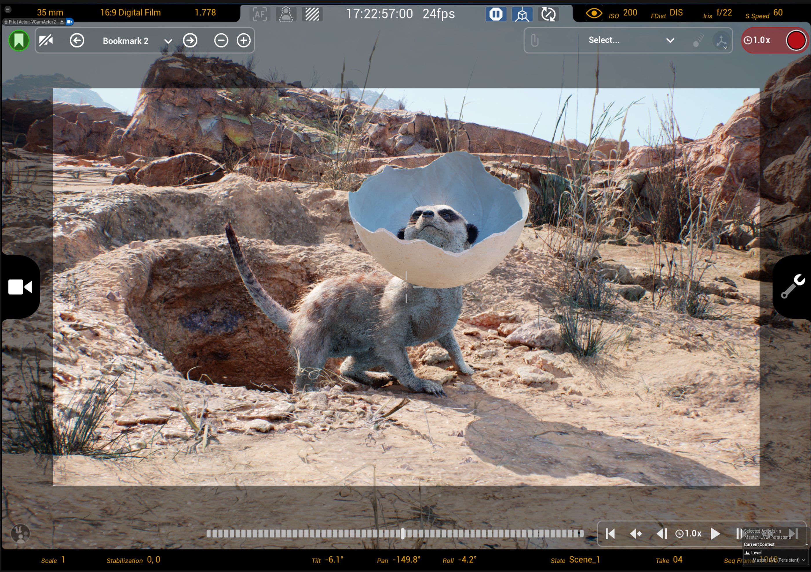
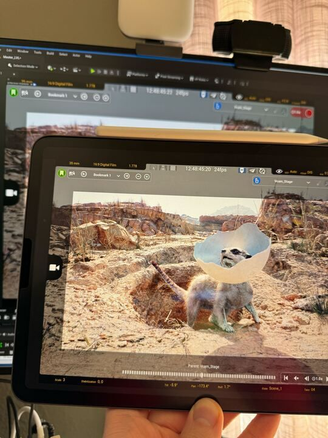
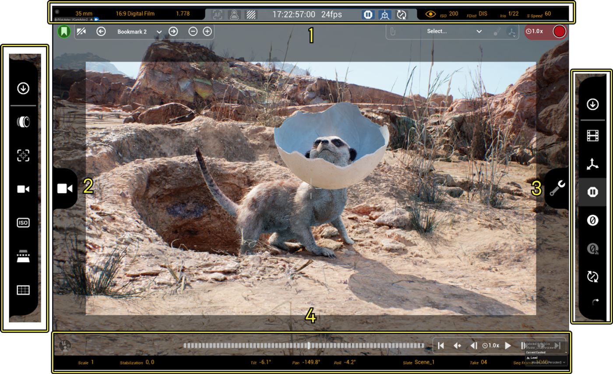
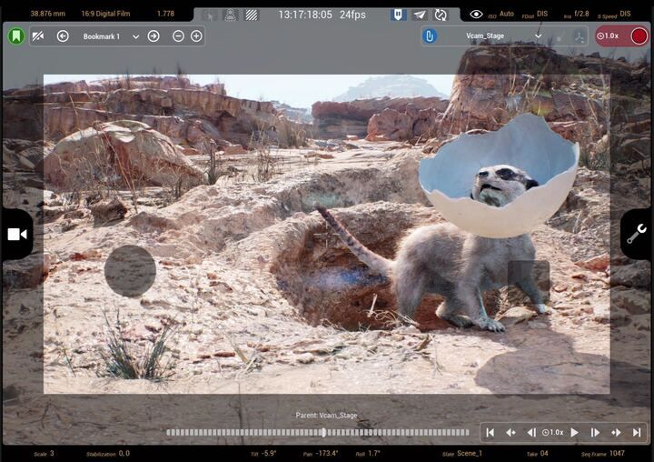
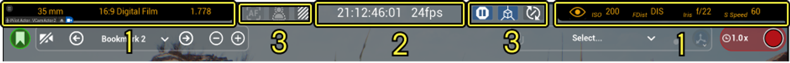
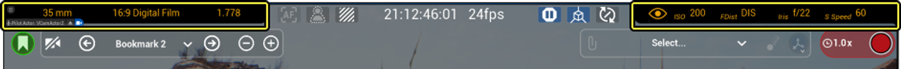
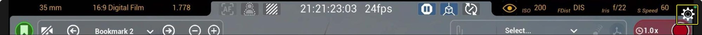
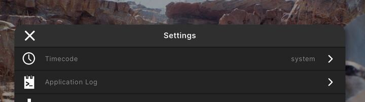

# 使用Live Link控制虚拟摄像机Actor

> 路径：虚幻引擎5.7文档 / 为角色和对象制作动画 / 过场动画和Sequencer / Sequencer中的摄像机 / Virtual Cameras / 使用Live Link控制虚拟摄像机Actor

> 原始页面：https://dev.epicgames.com/documentation/unreal-engine/controlling-a-virtual-camera-actor-using-live-link-in-unreal-engine

**虚拟摄像机**Actor是放置在虚幻引擎场景中的摄像机，你可以使用它来流式传输来自连接到Live Link的设备的数据。 连接到Live Link的设备可用于查看场景并四处移动场景，以及设置和录制镜头。 本用户指南将介绍如何在你的项目中使用虚拟摄像机以及Unreal VCam应用的不同部分。

## 必要设置

要使用虚拟摄像机，你需要在虚幻引擎项目中进行一些设置和配置，然后再设置并连接启用了Live Link的设备。

### 虚幻引擎设置

从位于**编辑（Edit）**菜单中的**插件（Plugins）**浏览器启用以下插件：

- **虚拟摄像机**

  - 此插件可以通过物理设备控制和查看摄像机。
- **Live Link**

  - 此插件可以将动画数据流送到虚幻引擎中。 如需更多信息，请参阅[Live Link](../../../../skeletal-mesh-animation-system/live-link/index.md)。
- **镜头试拍录制器（Take Recorder）**

  - 这是一套工具和界面，设计用于在虚拟制片环境中录制、审核和播放镜头。 更多信息请参阅[镜头试拍录制器](../../../unreal-engine-sequencer-movie-tool-overview/take-recorder/index.md)和[使用镜头试拍录制器](../../../cinematic-workflow-guides-and-examples/record-gameplay/index.md)。

> [!NOTE]
> Live Link和用于Sequencer的Take Recorder等功能不在本页面的讨论范围之内。 我们建议你花一些时间熟悉这些功能及其用例。 请参阅上面链接的文档。

### 设备设置

在开始之前，你必须有兼容的iOS或Android设备，并且你必须从[App Store](https://apps.apple.com/us/app/live-link-vcam/id1547309663)或[Google Play Store](https://play.google.com/store/apps/details?id=com.epicgames.live_link_vcam)下载**Unreal VCam**应用。

**iOS设备系统要求：**

- iOS 15.0及更高版本
- iPadOS 15.0及更高版本
- 支持ArKit

**Android设备系统要求：**

- Android 24 (Nougat)或更高版本
- ARCore支持

首次打开应用时，你必须接受许可协议才能使用应用。 此时不需要进一步的设置。

### 本指南的可选先决条件

**Meerkat演示（Meerkat Demo）**示例项目是由Weta Digital制作并完全在虚幻引擎中渲染的实时短片。 该项目非常适合用于测试在项目中使用虚拟摄像机的一些功能。 本指南使用示例项目来演示虚拟制片环境中的设置和用法。

你可以从[Fab](https://www.fab.com/listings/5ca1076f-c495-449a-b65a-1ae898ab9d37)下载该项目，也可以直接从Epic Games启动器的**示例（Samples）**选项卡中进行下载。

你可以访问[Meerkat演示文档](https://dev.epicgames.com/documentation/assets/samples-and-tutorials/engine-feature-examples/meerkat-example)，了解有关示例项目的更多详情。

## 为虚拟摄像机准备场景

为了准备你的项目以使用虚拟摄像机设置，你必须首先在虚幻引擎中准备你的场景，然后设置你的iOS或Android移动设备以与之交互。

**虚幻引擎场景设置：**

要设置你的虚幻引擎场景：

1. 找到**放置Actor（Place Actors）**面板并在搜索字段中输入**VCAM**，或选择**虚拟制片**图标。

   > [!TIP]
   > 对于新创建的项目，默认情况下，虚幻引擎中不显示**放置Actor（Place Actors）**面板。 如果没有显示，请找到**窗口（Windows）**菜单并点击**放置Actor（Place Actors）**打开一个面板。
2. 点击**VCam Actor**并将其拖入场景中。

将VCam Actor拖入场景中之后，视口会立即更改以自动导航虚拟摄像机。 你的视口应该类似于下图。

接下来，你要将移动设备连接到虚幻编辑器，驱动放置在场景中的虚拟摄像机。

**移动设备设置：**

要设置设备：

1. 将移动设备连接到运行你的项目的计算机所使用的网络。
2. 在**虚幻编辑器（Unreal Editor）**中，点击工具栏中的**像素流送（Pixel Streaming）**下拉菜单。 在菜单的**信令服务器URL（Signaling Server URLs）**分段下，你应该会看到至少两个IP地址。 在Unreal VCam应用中，输入与你的设备相同的网络IP地址（例如，192.x.x.x）。
3. 在你的设备上，打开**Unreal VCam**应用。 使用与你的共享网络匹配的IP地址，在应用中的文本字段中输入IP地址。
4. 点击**连接（Connect）**。

> [!WARNING]
> 你可能会看到两个像素流的下拉菜单，具体取决于你的当前配置。 虚拟摄像机目前不支持像素流2（Pixel Streaming 2）。 使用虚拟摄像机时，仅参考像素流（Pixel Streaming）下拉菜单，而不参考Pixel Streaming 2下拉菜单。

如果你的场景有单个虚拟摄像机，你的设备将自动连接到该VCam Actor。 但是，如果你在场景中有多个虚拟摄像机，就必须选择要连接到哪一个。 请参阅[使用多个虚拟摄像机](../using-multiple-virtual-cameras/index.md)，了解有关在项目中设置和使用多个摄像机的更多信息。

你的移动设备现在应该已连接到虚幻编辑器场景中放置的虚拟摄像机。 你还应该可以从移动设备控制虚拟摄像机，并能够四处移动以更改视图。 你还可以在移动设备上以及从虚幻编辑器视口访问Unreal VCam界面。 VCAM界面包含许多功能按钮，可用于管理场景中虚拟摄像机的外观和行为。

## 控制虚拟摄像机功能按钮的输入

使用虚幻引擎的增强输入功能，可以管理大量操作并动态进行更改。 输入可以根据其当前状态更改行为。 这意味着你可以分配比用户界面中的按钮数量更多的可映射按键。 在这种情况下，非常适合通过VCam应用程序将硬件设备的输入映射到虚幻引擎中的虚拟摄像机功能按钮。

你可以通过两种方法添加和配置映射输入：

- 在**项目设置（Project Settings）**的**VCam输入设置（VCam Input Settings）下**
- 通过VCam组件**细节面板**的**输入描述（Input Profile）**分段。

如需详细了解如何设置和使用增强输入，请参阅[控制虚拟摄像机功能按钮的输入](../controlling-inputs-to-virtual-camera-controls/index.md)。

## 虚拟摄像机界面

虚拟摄像机的 **控制器界面（Controller Interface）**包含一系列的控制和设置。 你可以使用这些设置通过外部设备在虚幻引擎中修改虚拟摄像机的外观和行为。 例如，你可以使用支持ARKit的iOS设备进行修改。 使用ARKit功能，就可以对设备进行物理定位和旋转，以便在项目中实时移动和控制虚拟摄像机的位置和旋转。

虚拟摄像机Actor包括以下内容：

1. 摄像机和设备信息
2. 虚拟摄像机设置
3. Unreal VCam应用设置
4. Sequencer和书签设置

## 调整设置调谐钮

Unreal VCam应用中的大部分可配置设置都使用径向调谐钮。 这些调谐钮可能位于界面的任意一侧。 它们有时会包括内调谐钮和外调谐钮。 要选择选项，你可以按任一方向沿调谐钮拖动手指，拨入你需要的值。 使用调谐钮做出的更改会实时反映在虚幻引擎中。

## 使用Unreal VCam应用导航虚拟场景

通过Unreal VCam应用，可以使用ARKit在物理空间中进行全系列的动作追踪。 为此，ARKit会使用Live Link通过网络将位置和旋转数据实时流送到虚幻引擎实例。 这样你可以在实时环境中驱动3D摄像机，并在支持的iOS设备上查看镜头。

此外，使用触摸屏摇杆，可通过手动控制使用Unreal VCam应用导览场景。 使用摇杆的移动会叠加在通过ARKit进行的追踪动作的移动之上。

### 使用启用了ARKit的设备四处移动

使用启用了ARKit的设备，你可以在空间中自由移动，该移动会转换到运行你的项目的虚幻引擎实例。 追踪的移动包括能够完全倾斜、平移和滚动设备，并在空间中朝任意方向四处移动。

通过Live Link追踪的动作会自动发生，并在虚幻引擎中与你的3D摄像机同步。 这意味着你可以使用该应用程序设置镜头，包括正式拍摄前的视效预览镜头，从而在主要摄影期间捕获真实的镜头试拍，并在后期制作中创建新的镜头。

Unreal VCam应用包括用于缩放移动如何通过动作追踪转换到3D场景的设置。 要了解如何调整这些设置，请参阅[虚幻引擎VCam虚拟摄像机设置](https://dev.epicgames.com/documentation/assets/animating-characters-and-objects/Sequencer/Cameras/VirtualCamera/controlling-virtual-camera-actors/unreal-vcam-virtual-camera-settings)。

### 使用触摸屏摇杆移动

你可以在连接到Live Link的设备上使用触摸屏摇杆手动移动场景中的虚拟摄像机Actor。 你还可以使用摇杆对摄像机进行定向移动、仅限垂直的移动和平移。

Unreal VCam应用包括用于在连接到Live Link的设备中调整移动的灵敏度和比例的设置。 要了解如何调整这些设置，请参阅[虚幻引擎VCam虚拟摄像机设置](https://dev.epicgames.com/documentation/assets/animating-characters-and-objects/Sequencer/Cameras/VirtualCamera/controlling-virtual-camera-actors/unreal-vcam-virtual-camera-settings)。

## 摄像机信息

虚拟摄像机Actor的最上端分段提供了配置的摄像机设置的快速参考信息。

在上图中，数字对应于以下内容：

1. 配置的摄像机设置的快速参考和操作。
2. 时间戳和每秒影片帧数。
3. 开关摄像机行为（Camera Behavior）的快捷按钮。

   - 手动对焦与跟踪对焦
   - 对焦峰值
   - 曝光斑马纹
   - 保持位置
   - 本地空间飞行模式
   - 禁止滚转

### 快速访问虚拟摄像机设置和参考

在虚拟摄像机Actor的任一侧都是已配置的摄像机设置。 直接点击其中的设置会在Unreal VCam应用中打开可调整的调谐钮。

可调整的设置包括：

- 镜头大小
- 感光区域大小
- 遮罩大小
- 切换摄像机UI
- ISO
- 聚焦距离
- 光圈F值
- 快门速度

### 访问和共享输出日志

你可以访问和共享输出日志，从查看关于VCam会话的详细信息，以确认并排除你遇到的任何潜在可以。

要访问输出日志：

1. 点击Unreal VCam应用右上角的**齿轮**图标打开设置。
2. 点击**应用日志（Application Log）**查看可用的日志。
3. 点击一个日志，打开**日志查看器（Log Viewer）。**带有（当前）标记的日志就是活动会话的日志。

> 图片已省略：image alt text

> 图片已省略：image alt text

要共享输出日志，请点击日志中的**共享**图标保存并发送日志。

> 图片已省略：image alt text
