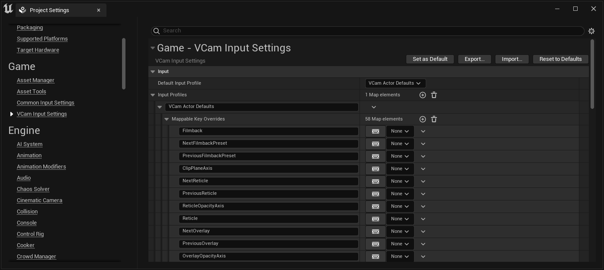
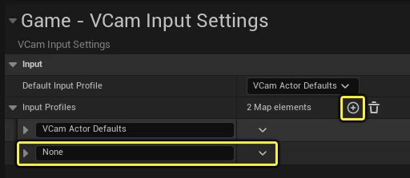
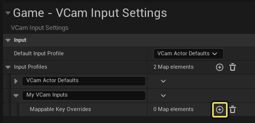
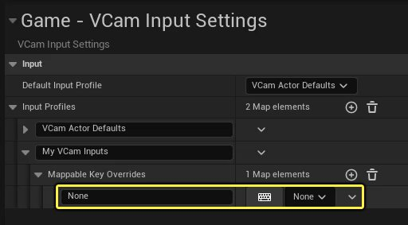
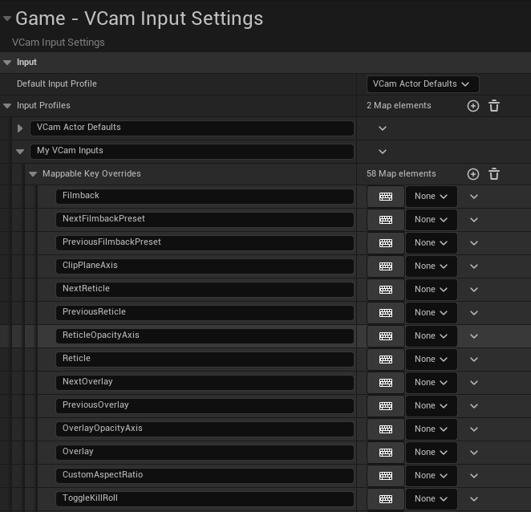
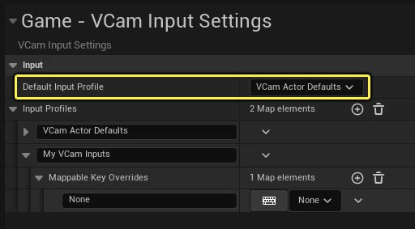
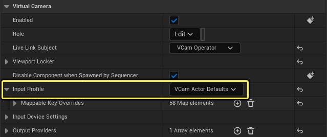
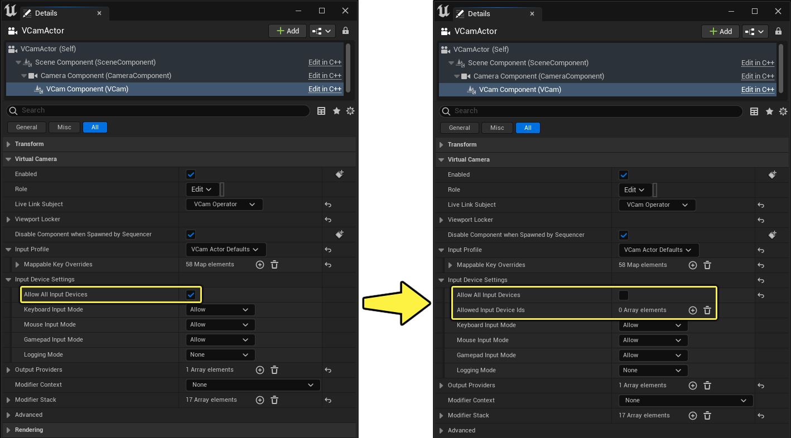

# 控制虚拟摄像机功能按钮的输入

> 路径：虚幻引擎5.7文档 / 为角色和对象制作动画 / 过场动画和Sequencer / Sequencer中的摄像机 / Virtual Cameras / 控制虚拟摄像机功能按钮的输入

> 原始页面：https://dev.epicgames.com/documentation/unreal-engine/controlling-inputs-to-virtual-camera-controls-in-unreal-engine

虚幻引擎的[增强输入](../../../../../gameplay-systems/input/enhanced-input/index.md)功能能够管理大量操作并动态进行更改。输入可以根据其当前状态更改行为。这意味着你可以分配比用户界面中的按钮数量更多的可映射按键。在此情况下，最好通过[Live Link VCAM](https://apps.apple.com/us/app/live-link-vcam/id1547309663)应用将硬件设备的输入映射到虚幻引擎中的虚拟摄像机功能按钮。

本页面介绍了如何：

- 将硬件输入映射到虚拟摄像机操作。
- 为自定义的工作流程和设备操作创建输入配置文件。
- 为所有虚拟摄像机Actor和单独的Actor设置输入配置文件。
- 为虚拟摄像机Actor指定输入类型。

## 将硬件输入映射到虚拟摄像机操作

你可以通过两种方式设置输入映射：通过项目设置实现全局设置，或设置单独的虚拟摄像机Actor。你可以从其中任一位置编辑、添加和配置它们。

从以下位置更改默认输入：

- 游戏（Game）> VCam输入设置（VCam Input Settings）

  下的

  项目设置（Project Settings）
- 选择虚拟摄像机Actor，然后在

  细节（Details）

  面板中找到

  虚拟摄像机（Virtual Camera）

  分段，展开其中的

  输入配置文件（Input Profile）

  分段。

### 添加输入

要将硬件输入添加到虚拟摄像机操作：

1. 在场景中选择

   虚拟摄像机

   Actor。
2. 在

   细节（Details）

   面板中的

   虚拟摄像机（Virtual Camera）

   下，展开

   输入配置文件（Input Profile）

   分段。
3. 展开

   可映射按键覆盖（Mappable Key Overrides）

   并查找要更改的预期输入操作。
4. 在指定的输入旁边，你可以执行以下操作之一：

   1. 点击

      键盘

      图标，然后按你想处理该输入的按键/按钮。
   2. 使用下拉菜单并搜索你想处理该输入的按键/按钮/操作。

> [!NOTE]
> 选择要映射的输入时，会列出预期按钮，前提是它提供了正确类型的输入来处理该操作。例如，输入"NextLens"需要布尔值（按钮）输入，无法映射到浮点（摇杆）。

### 创建输入配置文件

如需创建 **输入配置文件** ，请执行以下操作：

1. 打开

   项目设置（Project Settings）

   并找到

   游戏（Game）> VCam输入设置（VCam Input Settings）

   。
2. 将元素 **添加（Add）** (+)到 **输入配置文件（Input Profiles）** 数组并为其提供 **名称（Name）** 。

   
3. 将元素 **添加（Add）** (+)到 **可映射的覆盖（Mappable Overrides）** 数组。

   

   > [!NOTE]
   > 你添加的每个元素必须先命名，然后才能添加另外的元素。如果你打算使用默认VCam Actor配置文件的映射作为起始点，你可以右键点击列表，选择 **复制（Copy）** ，然后将其 **粘贴（Paste）** 到自定义输入配置文件。
4. 展开 **可映射的按键覆盖（Mappable Key Overrides）** 。添加新输入，如果你已从默认输入配置文件复制输入，则查找要编辑的输入。

   
5. 在指定的输入旁边，你可以执行以下操作之一：

   1. 点击

      键盘

      图标，然后按你想处理该输入的按键/按钮。
   2. 使用下拉菜单并搜索你想处理该输入的按键/按钮/操作。
6. 针对你想更改的每个输入重复

   步骤5

   。

无论你是手动添加了条目，还是从默认配置文件复制粘贴来构建自己的输入配置文件，你的列表都可能与下面的列表类似。

### 设置输入配置文件

输入配置文件可以按以下两种方式之一设置：通过项目设置为所有虚拟摄像机实现全局设置，或设置场景中的单独的虚拟摄像机Actor。

如需在项目设置中设置输入配置文件，请执行以下操作：

1. 打开

   项目设置（Project Settings）

   并找到

   游戏（Game）> VCam输入设置（VCam Input Settings）

   。
2. 在

   默认输入配置文件（Default Input Profile）

   旁边的

   输入（Input）

   分段中，从下拉列表选择你想使用的全局默认值。

要为单独的虚拟摄像机Actor设置输入配置文件：

1. 在场景中选择

   虚拟摄像机

   Actor。
2. 在

   细节（Details）

   面板中的

   虚拟摄像机（Virtual Camera）

   下，使用

   输入配置文件（Input Profile）

   旁边的下拉列表选择你想使用的配置文件。

## 指定来自设备的输入类型

对于使用多个虚拟摄像机Actor的设置，你可以将具体的输入设备分配到场景中的各个虚拟摄像机。这很适合有多个虚拟摄像机从单个工作站进行控制的情况，并且在使用游戏手柄时最有用。

每个输入设备都有一个ID，从0开始，并随着连接更多设备，按1递增。设备断开连接时，注册的ID会回收，然后可用于重新分配给连接的下一个设备。设备连接时，会重新分配可能的最低ID。例如，如果你的工作站连接了两个游戏手柄：游戏手柄A和游戏手柄B：游戏手柄A会收到ID 0，而游戏手柄B会收到ID1。如果游戏手柄A断开连接，游戏手柄B会维持其注册的ID 1。当另一个游戏手柄接入并注册时，该游戏手柄会获得可用的最低ID，在本例中就是游戏手柄A断开连接时注销的ID 0。

如需指定虚拟摄像机的输入，请执行以下操作：

1. 在场景中选择

   虚拟摄像机

   Actor。
2. 在

   细节（Details）

   面板中的

   虚拟摄像机（Virtual Camera）

   下，展开

   输入设备设置（Input Device Settings）

   。
3. 移除 **允许所有输入设备（Allow All Input Devices）** 中的复选标记。将显示名为 **允许输入设备ID（Allow Input Device Ids）** 的新属性。

   

   点击查看大图。
4. 点击 **加号 (+)）** 图标将设备添加到数组。

   > 图片已省略：将新输入设备元素添加到设备数组。
5. 如果物理游戏手柄尚未连接到工作站，则进行连接。
6. 点击

   游戏手柄

   图标。然后，按物理游戏手柄上的任意按钮注册其ID。

此虚拟摄像机Actor现在会响应来自注册游戏手柄以及列表中其他输入设备的输入。

### 将键盘和鼠标用于输入设备

- 键盘和鼠标无法分配给特定虚拟摄像机Actor。不支持涉及多个键盘和鼠标的工作流程。
- 键盘的设备ID总是等于0。第一个连接的游戏手柄也将使用ID 0。
- 鼠标的设备ID总是等于-1。
