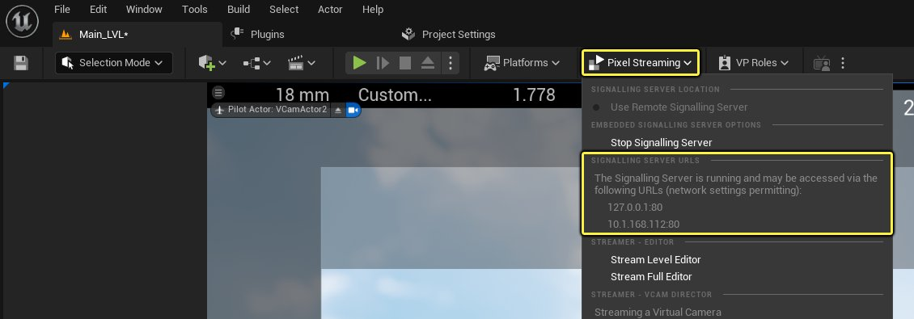
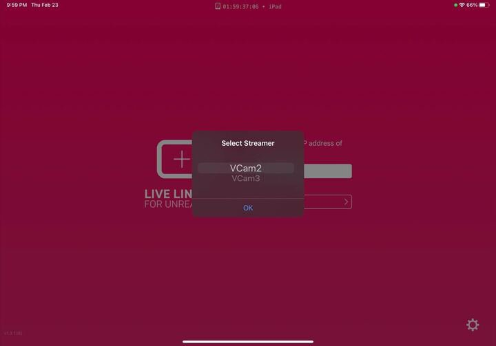
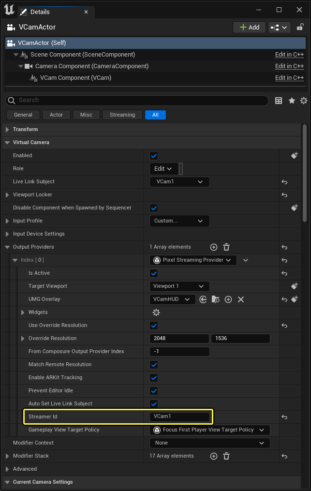
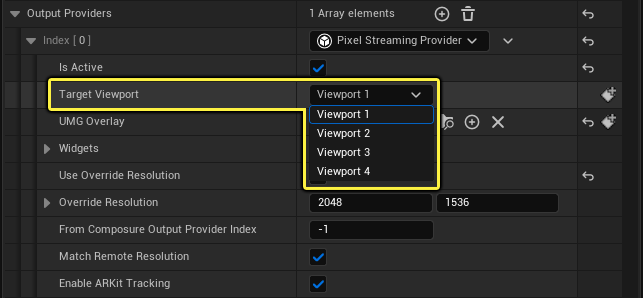
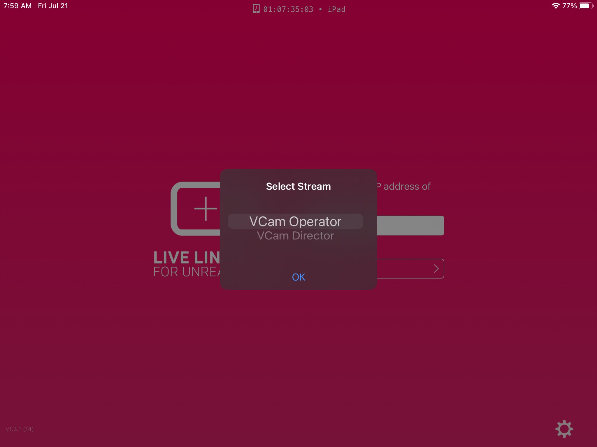

# 使用多个虚拟摄像机

> 路径：虚幻引擎5.7文档 / 为角色和对象制作动画 / 过场动画和Sequencer / Sequencer中的摄像机 / Virtual Cameras / 使用多个虚拟摄像机

> 原始页面：https://dev.epicgames.com/documentation/unreal-engine/using-multiple-virtual-cameras-in-unreal-engine

虚拟摄像机支持多个流使用Live Link VCAM应用程序同时连接到支持的iOS设备。你可以使用这些设备查看和控制单独的流，同时连接到运行你的虚幻引擎项目的单个IP地址。

## 先决条件

要在你的虚拟制片环境中使用多个虚拟摄像机，你必须首先执行以下操作：

- 按照

  使用Live Link控制虚拟摄像机Actor

  的"必需设置"小节操作。其中包括：

  - 为你的项目启用所有必要插件。
  - 使用支持的iOS设备。
  - 从iOS App Store下载并安装Live Link VCAM应用程序。
  - 你的虚幻引擎项目和运行Live Link VCAM应用程序的iOS设备的共享网络连接。
- 在你的虚幻引擎项目中，将两个或更多虚拟摄像机Actor放在你当前加载的场景中。

### 虚幻引擎硬件限制

- 最多可以同时连接四个流，虚幻编辑器中的每个视口各一个流。这些将硬件编码器用于连接到流的每个iOS设备。但是，如果你的硬件无法处理同时运行多个视口，这会限制实际上可以使用的流的数量。如果你有超过四个流，额外的流将回退到软件编码，并且性能可能会受到负面影响。有关我们的工作站推荐，请参阅

  硬件和软件规格

  页面。

## 连接到虚拟摄像机

要连接到虚拟摄像机，请执行以下操作：

1. 在你的iOS设备上，打开

   Live Link VCAM

   应用程序。
2. 在Live Link VCAM应用程序的文本字段中输入IP地址。

   > [!TIP]
   > 你可以从虚幻引擎项目的 **信令服务器URL（Signalling Server URLs）** 下的 **像素流送（Pixel Streaming）** 下拉菜单中检索IP地址。
   >
   > 
3. 按 **连接（Connect）** 并从 **选择流送器（Select Streamer）** 列表中选择你想连接到的虚拟摄像机。

   

   > [!NOTE]
   > 如果你要连接到的场景不足两个虚拟摄像机，该应用程序会自动连接到场景中放置的唯一虚拟摄像机。
4. 点击

   确定（OK）

   。

屏幕现在应该会连接到所选VCam Actor。虽然此列表仅显示了两个虚拟摄像机供选择，但你可以从任意数量的虚拟摄像机中选择，每个都有其自己的设置。你最多可以使用四个同时连接到可用VCam Actor的iOS设备。

### 附加说明

- 默认情况下，放置在场景中的虚拟摄像机名为"

  VCam [number]

  "。例如，VCam1和VCam2。如需了解如何为每个虚拟摄像机提供唯一的名称（流送器ID），请参阅

  设置虚拟摄像机流送器ID

  。
- 多个iOS设备可以连接到相同的IP地址，以查看并控制单独的流。例如，所有iOS设备会连接到相同的IP，在选择连接时，你从可用VCam Actor列表中选择，以使用该设备连接。

## 设置虚拟摄像机流送器ID

你可以为每个虚拟摄像机提供唯一的名称，方便识别。当你的场景使用多个虚拟摄像机时，以及你的场景履行特定角色时，这些 **流送器ID** 很有用。

要为你的虚拟摄像机提供唯一的流送器ID：

1. 在场景中选择

   虚拟摄像机

   Actor。
2. 在

   细节（Details）

   面板中的

   虚拟摄像机（Virtual Camera）

   分段下，展开

   输出提供程序（Output Providers）

   并查找

   流送器ID（Streamer Id）

   。
3. 在文本字段中 **输入** 唯一的名称。

   

   点击查看大图。

   > [!WARNING]
   > 流送器ID名称必须唯一。如果多个摄像机同名，虚幻引擎可能无法连接到它们。
4. 仍在 **细节（Details）** 面板的相同分段中时，查找 **目标视口（Target Viewport）** 。使用下拉列表选择此虚拟摄像机要使用的视口。

   
5. 保存

   项目，使更改生效。

使用iOS设备上的Live Link VCAM应用程序并连接到虚幻引擎项目时，名称将反映你为其提供的唯一流送器ID，而不是其默认名称。

