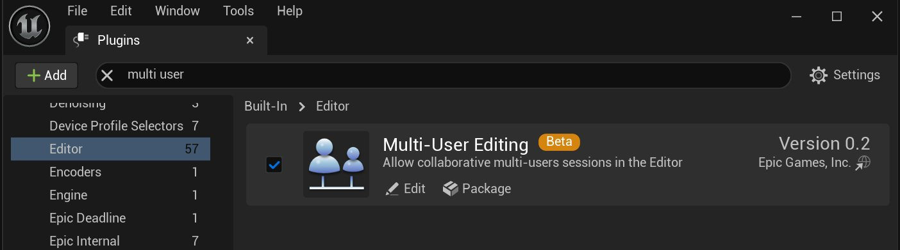
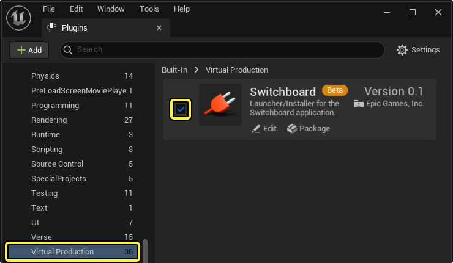
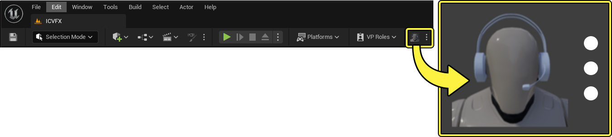
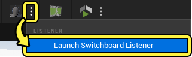
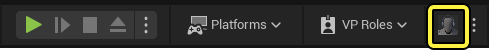
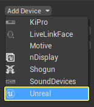
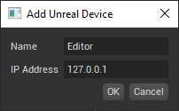
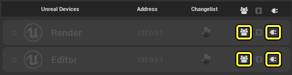

# 虚拟摄像机多用户快速入门指南

> 路径：虚幻引擎5.7文档 / 为角色和对象制作动画 / 过场动画和Sequencer / Sequencer中的摄像机 / Virtual Cameras / 虚拟摄像机多用户快速入门指南

> 原始页面：https://dev.epicgames.com/documentation/unreal-engine/virtual-camera-multiuser-quickstart-guide-in-unreal-engine

你可以使用多个工作站，使用 **多用户** **虚拟摄像机**（ **VCam** ）工作区控制和渲染同一个场景中的Vcams。这可以让多个用户同时在同一个场景中工作。**多用户Vcam** 多用户Actor复制功能目前还在测试阶段。

> [!NOTE]
> 多用户Vcam只能在虚拟制片项目中使用。

本文档提供了一个示例工作流程，你可以使用它建立一个互联的工作环境，让[多个用户](../../../../../production-pipeline/multi-user-editing/index.md)同时操作同一场景中的[VCams](https://dev.epicgames.com/documentation/404)。

#### 先决条件

- 启用

  多用户编辑

  插件

  。在

  菜单栏

  中，找到

  编辑（Edit）

  >

  插件（Plugins）

  ，然后在

  编辑器（Editor）

  分段下找到

  Multi-User Editing

  插件。你也可以使用

  搜索栏

  。启用插件后，重新启动编辑器。

- 你必须有一个运行正常的 **虚拟制片（Virtual Production）** 项目。如果没有，可以使用[模板](../../../../../understanding-the-basics/working-with-projects-and-templates/index.md)项目。
- 你必须有一个 **多用户编辑器服务器（Multi-User Editor Server）** 。请参阅[多用户快速入门指南](../../../../../production-pipeline/multi-user-editing/index.md)，了解更多信息。
- 你的项目必须具有[虚拟摄影机（VCam）Actor]](animating-characters-and-objects/Sequencer/Cameras/VirtualCamera)。

#### 启动MU会话

在虚幻引擎实例间复制虚拟摄像机需使用多用户编辑功能。所有客户端必须位于一个共享的多用户（MU）会话中。关于加入MU会话的更多详情，请参阅[虚幻引擎中的多用户编辑](../../../../../production-pipeline/multi-user-editing/index.md)

#### 复制VCam Actor

在将VCam Actor添加到位于MU会话中的场景后，该Actor会出现在每个客户端的编辑器里。这是因为还没有客户端声明它是VCam属性的所有者。

要声明自己对VCam的所有权，请点击VCam左下角的 **多用户（Multi User）** 按钮。这将在其他客户端上禁用输出提供者和修改器堆栈求值，隐藏HUD并确保将由此客户端来决定VCam所使用的值。再次点击该按钮将放弃所有权，在每个客户端上重启输出提供者、HUD和修改器，允许别的客户端声明所有权。

#### 远程录制

要在非托管计算机上录制虚拟摄像机，你必须将相应的录制摄像机（即命名的[VCamActorName]_Record）)，而非VCamActor本身添加[镜头试拍录制器](../../../cinematic-workflow-guides-and-examples/record-gameplay/index.md)。

## 旧版MU角色

> [!WARNING]
> 旧版虚拟摄像机多用户工作流程已被废弃，但在虚幻引擎5.4中仍然可用。
>
> 此工作流程不支持新的高频率复制。
>
> 本小节提供了一个使用旧版系统在多用户模式中进行受限制的、低频率虚拟摄像机操作的示例工作流程。

#### 先决条件

- 启用

  Switchboard

  插件

  。在

  菜单栏

  中，找到

  编辑（Edit）

  >

  插件（Plugins）

  ，然后在

  虚拟制片（Virtual Production）

  分段下找到

  Switchboard

  插件。你也可以使用

  搜索栏

  。启用插件后，重新启动编辑器。

成功安装插件后，你可以使用虚幻引擎工具栏中的图标访问Switchboard应用程序。

- 你必须有一个运行正常的 **虚拟制片（Virtual Production）** 项目。如果没有，可以使用[模板](../../../../../understanding-the-basics/working-with-projects-and-templates/index.md)项目。
- 你必须有一个 **多用户编辑器服务器（Multi-User Editor Server）**。请参阅[多用户快速入门指南](../../../../../production-pipeline/multi-user-editing/index.md)，了解更多信息。
- 你的项目必须具有[虚拟摄影机（VCam）Actor]](animating-characters-and-objects/Sequencer/Cameras/VirtualCamera)。

## 声明虚拟制片角色

**Switchboard** 应用程序要求每个用户都担任一个 **VP角色（VP Role）**（如 **编辑器** 或 **Render**），以区分和识别哪个用户与哪个[VCam Actor](https://dev.epicgames.com/documentation/404)相关联。

1. 在虚幻编辑器（Unreal Editor）中的主工作站上，找到工具栏并选择的 **VP角色（VP Roles）**，然后从下拉菜单中选择（ **+** ） **添加角色（Add Role）**。为新角色命名。在本示例工作流程中，主工作站被命名为Editor。
2. 使用相同的步骤添加第二个 **角色（Role）** ，由第二台设备担任。在本示例工作流程中，第二台工作站被命名为Render。
3. 在 **菜单栏（Menu Bar）** 中，找到 **编辑（Edit）** > **项目设置（Project Settings）** ，在 **多用户编辑（Multi-User Editing）** 分段下，使用下拉菜单将 **验证模式（Validation Mode）** 属性设置为 **软（Soft）** 。

> [!NOTE]
> 如果你的项目包含任何脏污（dirty）包体，则在加入多用户会话时，系统会弹出错误提示。然后，你可以取消连接或修复存在的问题。如果你选择继续，系统将删除所有脏污包体。

现在，你的项目可以使用Switchboard连接到其他设备，以便多个用户在同一场景中同时操作多台VCam了。

请参阅[Switchboard](../../../../../working-with-media/communicating-with-media-components-from/switchboard/index.md)和[Switchboard快速入门指南](../../../../../working-with-media/communicating-with-media-components-from/switchboard/switchboard-quick-start/index.md)文档，了解有关使用 **Switchboard** 插件连接多个用户的详细信息。

## 连接你的设备

在虚幻编辑器（Unreal Editor）中创建VP角色后，使用Switchboard应用程序将你的设备连接到多用户会话。

1. 使用工具栏中点击Switchboard按钮旁的选项菜单，并选择 **启动Switchboard Listener**。

   
2. 在工具栏中启动 **Switchboard应用程序** 。

   
3. 在 **添加设备（Add Device）** 下拉菜单中选择 **虚幻（Unreal）** ，创建一个代表主工作站的新Switchboard设备。

   
4. 在提供的字段中设置 **名称（Name）** ，以及主工作站的 **IP地址（IP Address）** 。名称设置应与虚幻引擎中主工作站角色设置中的名称相同。在本示例工作流程中，使用的是 **编辑器** 。

   
5. 重复1-3步，创建第二个Switchboard设备。对于第二个设备，使用与第二个工作站的角色相同的名称。现在，这两个设备都应出现在了Switchboard应用程序的 **虚幻设备（Unreal Devices）** 列表中。在本示例工作流程中，使用的是 **Render** 。

   
6. 要自动打开网络连接并将设备连接到多用户编辑器（Multi-User Editor）会话，请在 **虚幻设备（Unreal Devices）** 列表中为每个设备选择 **自动加入** 和 **网络连接** 图标。设备成功连接到网络后， **连接指示灯（Connection Indicator）** 将显示为蓝色。

   > 图片已省略：image alt text
7. 为连接的每个设备指定一个 **VP角色（VP Role）** 。在Switchboard面板的 **菜单栏** 中，找到 **设置（Settings）** > **设置（Settings）** 并向下滚动至连接的每个设备的分段。在 **角色（Roles）** 属性中，使用下拉菜单为每个设备选择一个虚幻引擎 **VP角色（VP Roles）** 。

   > 图片已省略：image alt text

> [!NOTE]
> 你可以打开一个 **网络连接（Network Connection）** ，并使用虚幻设备列表标题中的 **自动加入** 和 **网络连接** 图标为列表中的每个设备启用 **自动加入** 。
>
> > 图片已省略：image alt text

连接工作站并为其指定角色后，你现在可以启动每个设备，并开始在多用户环境中操作VCam了。

## 多用户虚拟摄像机操作

1. 要将你的主工作站连接到多用户会话，请打开Switchboard应用程序，找到

   虚幻设备（Unreal Devices）

   列表，找到主

   编辑器

   设备并点击

   启动（Launch）

   。

> 图片已省略：image alt text

项目启动后，你可以在 **多用户浏览器（Multi-User Browser）** 窗口中验证Editor是否连接到了多用户会话。你可以在菜单栏中找到 **窗口（Window）** > **多用户浏览器（Multi-User Browser）** ，打开多用户浏览器（Multi-User Browser）。

> 图片已省略：image alt text

1. 在 **世界大纲视图（World Outliner）** 中，选择 **VCamActor** 。
2. 在VCam Actor的 **细节（Details）** 面板中，选择 **VCam组件（VCam component）** 。
3. 在 **虚拟摄像机（Virtual Camera）** 属性分段，将 **角色（Role）** 属性设置为 **编辑（Edit）** ，并从下拉菜单中选择 **编辑器** VP角色。

> 图片已省略：image alt text

1. 通过打开 **已启用（Enabled）** 属性启用虚拟摄像机。
2. 在Switchboard应用程序中，点击 **启动** 图标启动 **Render** 设备。按照上述步骤，使用 **多用户浏览器（Multi-User Browser）** 窗口验证第二台 **Render** 设备是否也连接到了多用户会话。
3. 现在两个编辑器实例都已打开，在主 **编辑器** 设备上移动 **虚拟摄像机（Virtual Camera）** ，就能看到该改动已被实时复制到第二台 **Render** 设备上。在以下示例中， **编辑器** 设备（ **左** ）正在操作 **VCam Actor** ， **Render** 设备（ **右** ）正在接收更改并渲染场景。

> 动图已省略：image alt text
