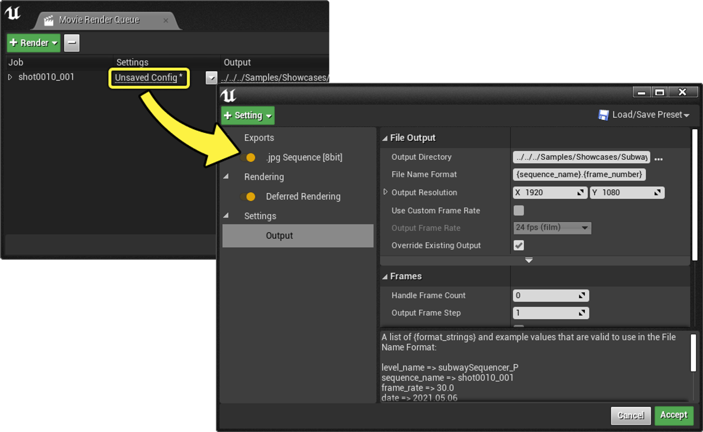
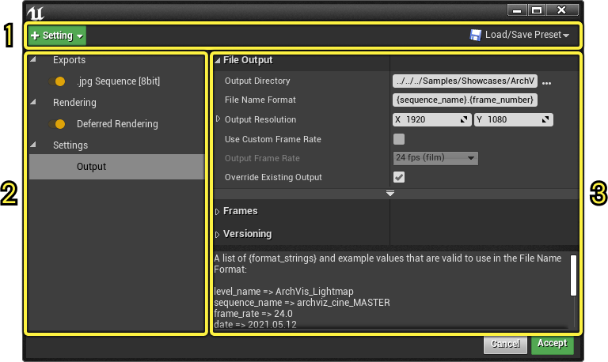
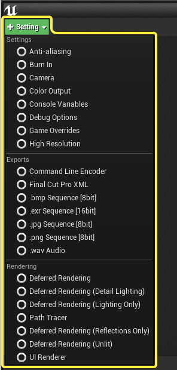
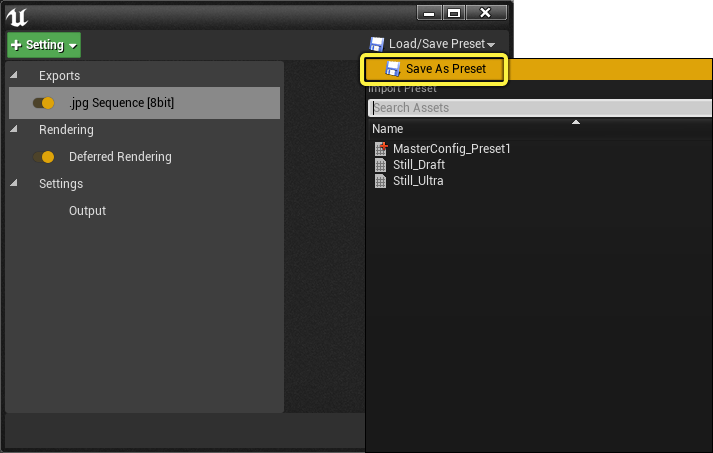
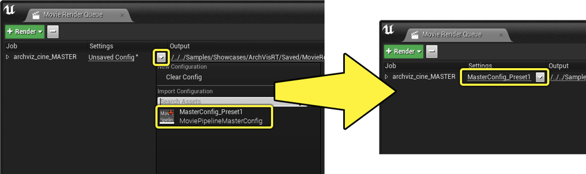
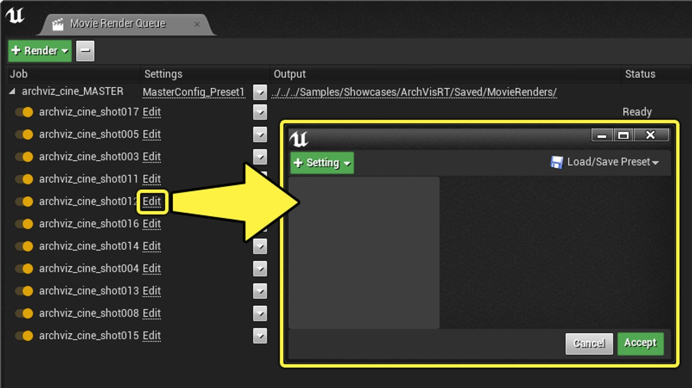
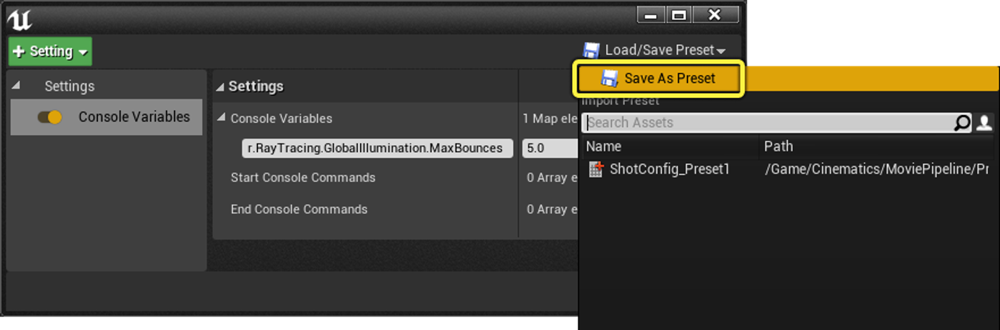
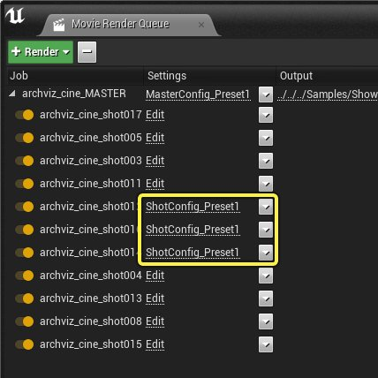

# 渲染设置与格式

> 路径：虚幻引擎5.7文档 / 为角色和对象制作动画 / 过场动画和Sequencer / 影片渲染管线 / 渲染设置与格式

> 原始页面：https://dev.epicgames.com/documentation/unreal-engine/cinematic-render-settings-and-formats-in-unreal-engine

影片渲染队列中的渲染设置用于自定义序列的渲染方式。 这些设置包含一些额外的渲染处理设定，例如抗锯齿、自定义控制台命令、输出格式、渲染模式等。

本指南将介绍设置界面、可添加的设置列表，以及将设置保存为预设的功能。

#### 先决条件

- 你已完成影片渲染管线页面中**[影片渲染队列](../index.md)**小节的先决条件步骤。

## 打开渲染设置

点击作业的**设置（Settings）**条目即可打开"渲染设置（Render Settings）"窗口。

## 界面概览

"渲染设置"窗口有三个主要区域：

1. **工具栏**：工具栏包含一个菜单，用于添加额外设置以及加载或保存当前设置列表到预设。
2. **设置列表**：设置列表显示了应用于作业的当前设置，包括启用或禁用这些设置的切换开关。 每个设置都被分类到了**导出（Exports）**、**渲染（Rendering）**或**设置（Settings）**类别下。
3. **设置细节**：显示**设置列表**中所选设置的属性。

## 设置列表

点击**+设置（+ Setting）**按钮即可显示可添加到作业中的不同设置列表。 这些设置被分为三组：**设置（Settings）**、**导出（Exports）**和**渲染（Rendering）**。

### 设置项

"设置"类别包含渲染质量选项、控制台变量和其他渲染选项的选项。

| Name | 说明 |
| --- | --- |
| [Output](cinematic-rendering-image-bb951eea/index.md) | The Output setting controls your output file's directory, file name, frame rate, and output resolution. Your file name and directory path can be customized using `{token}` format strings. Output is a required setting and cannot be deleted from the settings window. |
| [Anti-Aliasing](cinematic-rendering-image-bb951eea/index.md) | Anti-aliasing controls the number of samples used to produce the final render. There are two types of sampling that produce the render: **Spatial** and **Temporal**. |
| [Burn In](cinematic-rendering-image-bb951eea/index.md) | Burn In enables adding custom watermarks to your render, which contain information about the render and shot. You can choose whether the Burn In is added to the final image, or is rendered to a separate layer. |
| [Camera](cinematic-rendering-image-bb951eea/index.md) | The Camera setting contains settings for the shutter timing and you can specify an overscan percentage to render extra pixels around the edges of your images. |
| [Color Output](cinematic-rendering-image-bb951eea/index.md) | The Color Output setting overrides Unreal's default color space settings with a custom **[OpenColorIO (OCIO)](../../../../working-with-media/managing-color/color-management-with-opencolorio/index.md)** configuration. You can also use it to disable the **Tone Curve** portion of post-processing even if not using an OCIO-based workflow. |
| [Console Variables](cinematic-rendering-image-bb951eea/index.md) | Console Variables enables console commands to be designated when the render begins. This is useful when trying to apply quality settings that are too computationally expensive for real-time preview in the Editor. The variables will be reverted upon the render completing. |
| [Debug Options](cinematic-rendering-image-bb951eea/index.md) | Debug Options contain options for debugging certain render behaviors. Typically you do not need to use these options unless you're troubleshooting issues within your renders. |
| [Game Overrides](cinematic-rendering-image-bb951eea/index.md) | Game Overrides change several common game-related settings, such as Game Mode and Cinematic Quality settings. This is useful if the game's normal mode displays UI elements or loading screens that you do not want to capture. |
| [High Resolution](cinematic-rendering-image-bb951eea/index.md) | The High Resolution settings enable the use of tiled renders to produce larger images without being constrained by maximum texture sizes or memory limits on GPUs. |

如需详细了解这些选项，请参阅**[图像设置](cinematic-rendering-image-bb951eea/index.md)**。

- [导出格式](cinematic-rendering-export-formats/index.md) - 使用影片渲染队列中的各种格式输出你的渲染。
- [图像设置](cinematic-rendering-image-bb951eea/index.md) - 使用电影渲染队列的图像设置调整渲染的图片质量
- [MRG配置设置](mrg-configuration-settings/index.md) - 影片渲染图表的高级设置。
- [影片渲染图表节点](movie-render-graph-nodes/index.md) - 探索影片渲染图表可用的设置和节点。
- [MRG的重载和变量](mrg-overrides-and-variables/index.md) - 了解如何设置参数以及如何在不同级别上将其重载。

### 导出

"导出"类别的控制选项用于设置序列以何种格式输出成图像、音频和视频。

| Name | 说明 |
| --- | --- |
| [Command Line Encoder](cinematic-rendering-export-formats/index.md) | The Command Line Encoder can be used to create your own output format from third party software, such as FFmpeg. This setting requires an encoder executable and settings to be enabled in your Project Settings. |
| [Final Cut Pro XML](cinematic-rendering-export-formats/index.md) | The Final Cut Pro XML format will output an XML file that can be read by Final Cut Pro and other video editing software that support this format. This is not supported in shipping builds. |
| **.bmp Sequence [8bit]** | Outputs the movie as a sequence of .bmp images. Pixel values are clamped in the [0-1] range, meaning that no HDR values are preserved. This applies sRGB encoding curve. |
| [EXR Sequence](cinematic-rendering-export-formats/index.md) | Outputs the movie as a sequence of .exr images. HDR values are preserved but if the Tone Curve is enabled, linear values are scaled to approximately the [0-1] range with only the brightest highlights going above one. Disabling the Tone Curve writes linear values in the [0-100] range or more depending on the intensity of lights and other bright objects. No sRGB encoding curve is applied to .exr targets. |
| **.jpg Sequence [8bit]** | Outputs the movie as a sequence of .jpg images. Applies sRGB encoding curve. |
| **.png Sequence [8bit]** | Outputs the movie as a sequence of .png images. Applies sRGB encoding curve. Transparency is supported by enabling Enable Alpha Channel Support in Post Processing project setting. |
| [WAV Audio](cinematic-rendering-export-formats/index.md) | Outputs a .wav audio file alongside any other output formats you have selected. |
| [Apple ProRes Video Codecs](cinematic-rendering-export-formats/index.md) | Outputs a .mov file using Apple ProRes, which is Apple's high-quality, lossy video compression codec. This requires the Apple ProRes Media plugin to be enabled. |
| [Avid DNx Video Codecs](cinematic-rendering-export-formats/index.md) | Outputs a movie file using Avid DNx, which is a high-definition lossy video codec. This requires the Avid DNxHR/DNxMXF Media plugin to be enabled. |
| **Prestreaming Recorder** | The Prestreaming Recorder is used to create render caches for cinematics using **Virtual Textures** or **Nanite**. |

> [!NOTE]
> 可以为任何给定序列指定多个导出项。 例如，你可以选择将序列同时导出为**.jpg图像序列**和**.wav音频文件**，以便在视频编辑软件中合并。

如需详细了解这些选项，请参阅**[导出格式](cinematic-rendering-export-formats/index.md)**页面。

- [导出格式](cinematic-rendering-export-formats/index.md) - 使用影片渲染队列中的各种格式输出你的渲染。
- [图像设置](cinematic-rendering-image-bb951eea/index.md) - 使用电影渲染队列的图像设置调整渲染的图片质量
- [MRG配置设置](mrg-configuration-settings/index.md) - 影片渲染图表的高级设置。
- [影片渲染图表节点](movie-render-graph-nodes/index.md) - 探索影片渲染图表可用的设置和节点。
- [MRG的重载和变量](mrg-overrides-and-variables/index.md) - 了解如何设置参数以及如何在不同级别上将其重载。

### 渲染

"渲染"类别包含用于输出不同视图模式图像和渲染通道的选项。

| 名称 | 说明 |
| --- | --- |
| **延迟渲染（Deferred Rendering）** | 输出序列的最终图像，与你在视口中看到的图像相匹配。 |
| **延迟渲染（细节光照）（Deferred Rendering (Detail Lighting)）** | 使用特殊着色器变体输出，这仅显示与法线贴图结合的光照。 可以用于显示关卡的几何体。 |
| **延迟渲染（仅光照）（Deferred Rendering (Lighting Only)）** | 与细节光照类似，但没有影响光照的法线贴图。 |
| **路径追踪器（Path Tracer）** | 显示为每帧计算的路径跟踪数据。 当前，路径跟踪器并非支持所有渲染功能。 |
| **延迟渲染（仅反射）（Deferred Rendering (Reflections Only)）** | 使用特殊着色器变体输出，使世界中的一切内容都出现反射。 |
| **延迟渲染（无光照）（Deferred Rendering (Unlit)）** | 使用特殊着色器变体的输出，仅显示基础颜色，无光照信息。 |
| **UI渲染器（UI Renderer）** | 包括添加到输出渲染中的视口的任何UMG小部件。 这是一个实验性功能。 |
| **对象ID（有限）（Object Ids (Limited)）** | Object ID渲染输出一幅图像，其中场景中的组件被指定了ID。 ID可以单独分组，也可以基于其他因素（如材质、文件夹或Actor名称）分组。 需要Movie Render Queue Additional Passes插件才能启用此功能。 发行版本不支持Object ID。 |

如需详细了解这些选项，请参阅**[渲染通道](../cinematic-render-passes/index.md)**页面。

- [渲染通道](../cinematic-render-passes/index.md) - 了解电影渲染队列中的不同渲染通道层。

## 预设

默认情况下，编辑器会话中的渲染设置只会临时保存，会话关闭后将丢失。 你可以将设置保存为**预设**，以便在项目范围内共享，或为不同序列使用不同设置。

可以保存和重复使用的预设有两种类型：**主（Master）预设**和**镜头（Shot）预设**。

### 主预设

主预一般用作基础，其设置会传播给下一级的的镜头切换（camera cut）。

要将当前设置保存为主配置，请点击**加载/保存预设（Load/Save Preset）**，然后选择**另存为预设（Save As Preset）**。 之后系统将提示你保存**影片管线主配置资产**。

然后，你可以点击设置字段中的下拉菜单并选择保存的**影片管线主配置资产**，为队列中的作业应用此预设。

### 镜头预设

镜头预设允许重载渲染中每个摄像机的渲染设置。 如果过场动画序列中某些镜头所需的设置与主预设应用的有所不同，则镜头预设将十分实用。

要保存和使用镜头预设，展开渲染队列中的工作以查看其子摄像机。 每个摄像机都有可以覆盖的设置域。 点击任一**编辑（Edit）**字段，即可打开对应摄像机的设置窗口。

点击**+设置（+ Setting）**按钮并从列表中选择一项设置，即可添加该设置。

> [!NOTE]
> 你无法添加**导出（Export）**类别的设置或更改镜头设置的输出目录，因为此级别的设置不得与主预设中的所需设置冲突。

要将当前设置保存为镜头预设，请点击**加载/保存预设（Load/Save Preset）**，然后选择**另存为预设（Save As Preset）**。 之后系统将提示你保存**影片管线镜头配置资产**。

与应用主预设类似，你可以点击设置字段中的下拉菜单并选择保存的**影片管线镜头配置资产**，将此预设应用于队列中的特定镜头。

> [!NOTE]
> 主和镜头配置资产是不同的资产类型，不能互换使用。

### 编辑预设

在"设置"列中指定预设后，它将更改以匹配该预设的名称。 如果点击预设，将会进入配置编辑器，你可以在其中编辑配置。 **这些编辑行为并不会更改预设资产**，只会修改该预设的临时副本。

如果要直接修改预设，有两个选择：

- 通过影片渲染队列UI打开编辑器，然后选择**另存为预设（Save as Preset）**并覆盖已存在的预设。
- 在内容浏览器中双击预设直接打开并进行编辑。 此操作将打开一个编辑器，供你添加设置、编辑其值并使用资产的**保存（Save）**按钮来保存更改。
