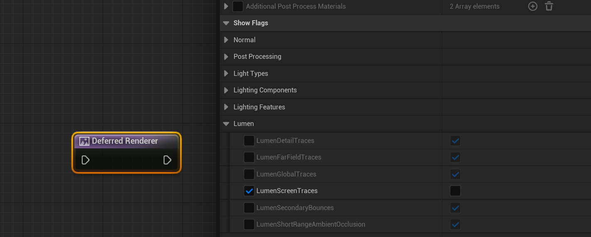
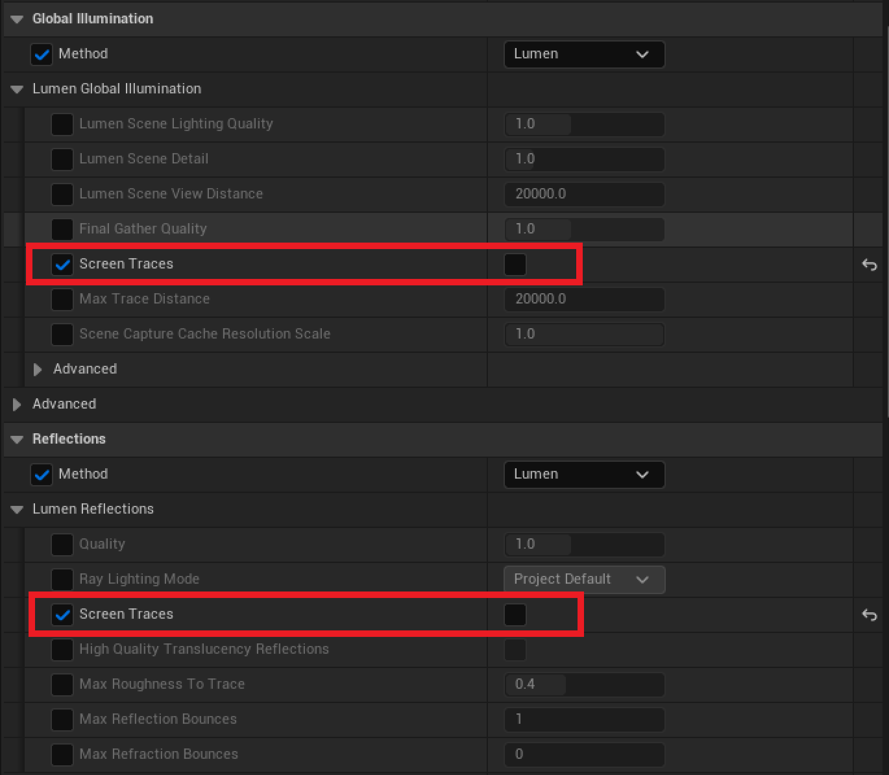
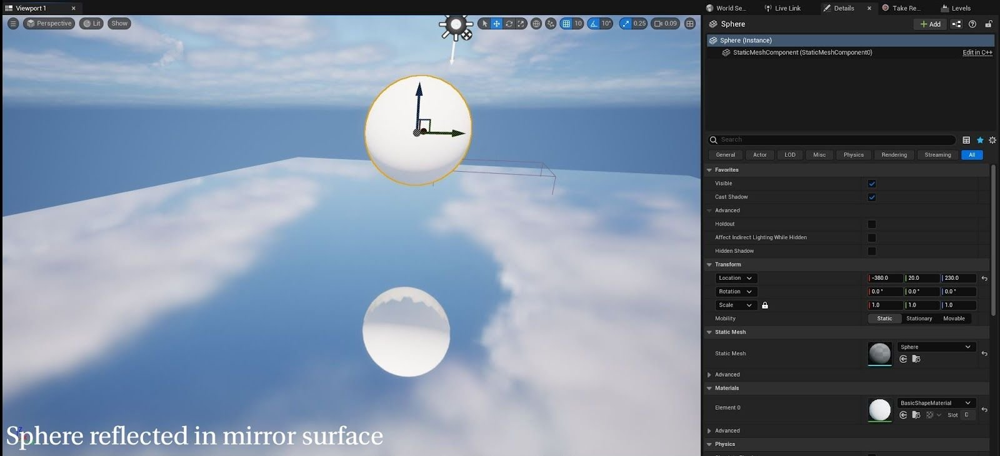
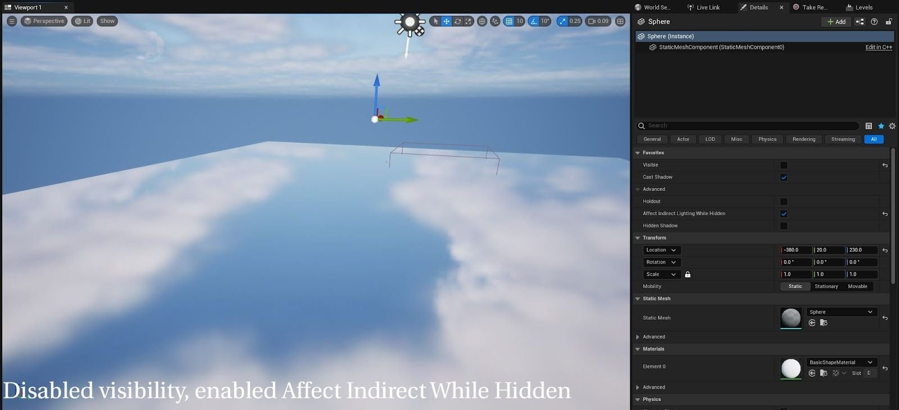
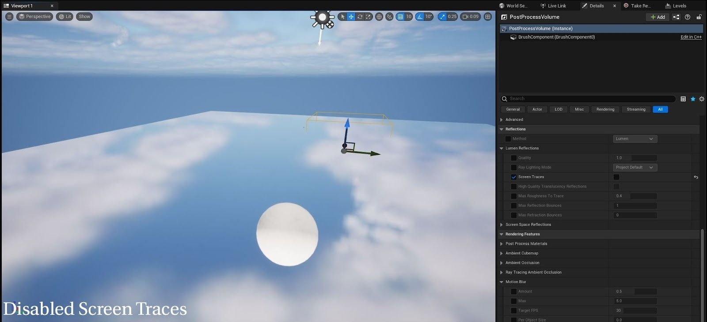
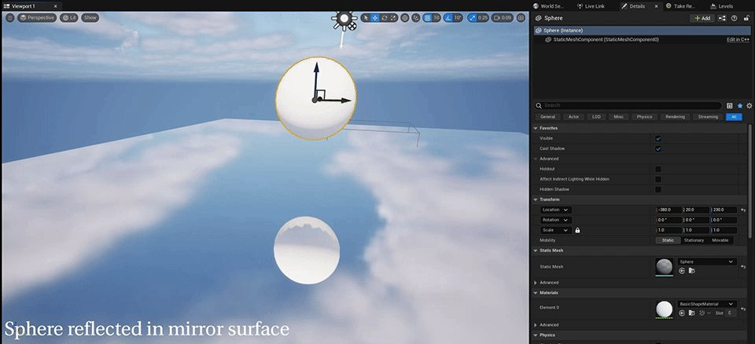

# MRG配置设置

> 路径：虚幻引擎5.7文档 / 为角色和对象制作动画 / 过场动画和Sequencer / 影片渲染管线 / 渲染设置与格式 / MRG配置设置

> 原始页面：https://dev.epicgames.com/documentation/unreal-engine/mrg-configuration-settings-in-unreal-engine

## 屏幕追踪

Lumen默认启用了一些屏幕追踪元素。这可能会干扰图表所调用的部分图层可见性设置。 例如，如果你希望角色对反射和全局光照可见，但在给定图层上对主像素隐藏，那么启用屏幕追踪将导致角色按需在Lumen场景中显示，因此建议禁用这些元素。

禁用Lumen屏幕追踪的方法有多种。

- 你可以调用控制台变量：

  - `r.Lumen.Reflections.ScreenTraces 0`
  - `r.Lumen.ScreenProbeGather.ScreenTraces 0`
- 使用下列控制台命令在显示标记（Show Flags）中禁用两者

  - ShowFlag.LumenScreenTraces 0
- 在显示标记（Show Flags）分段下的MRG Deferred Rendering节点中，也可以将其提升为变量。

- 在虚幻引擎5.4版本中，后期处理体积（Post Process Volume）的Lumen全局光照分段和Lumen反射分段都添加了屏幕追踪布尔参数。

下方给出了直观的示例，展示了屏幕追踪对"隐藏时影响间接光照（Affect Indirect Lighting While Hidden）"的干扰。第一张图片展示了球体在下方镜面上的反射。

启用"隐藏时影响间接光照（Affect Indirect Lighting While Hidden）"并禁用"可见（Visible）"时，反射消失了，因为它是使用屏幕空间反射绘制的。

但如果在"后期处理体积（Post Process Volume）"中禁用屏幕追踪，反射就会重新出现。

对比：

> [!NOTE]
> 禁用Lumen屏幕追踪可能会改变场景的外观，因此建议在为关卡提供光照时设置这一功能，而不是纯粹在渲染时切换。

## 色调曲线

使用 **半透明Actor** 时，建议 **禁用色调曲线** ，因为引擎应用曲线/编码前会预先对alpha进行乘算。因此，如果你应用了色调曲线并尝试在其本身的图层上渲染部分半透明对象，那么合成后的结果会与你在引擎中看到的有所不同。在这种情况下，色调曲线会给出非线性颜色，这对此类合成而言并不理想。你可能必须禁用色调曲线才能使用自己的OCIO配置。

## 允许OCIO

**Allow OCIO on the Deferred** 和 **Path Traced Rendering** 节点为面向数据的渲染图层提供了退出选项（默认为开启），而这类渲染层是通过显示标记（Show Flags）和材质修改器（Material Modifiers）处理的，并不适合OCIO。

## Groom

- 有时，若在渲染Groom时有多个图层存在动态模糊，可能产生不正确的结果。建议尝试使用命令 `MoviePipeline.FlushLayersDebug 1` 进行改进。
- 要在使用holdout时改善Groom周围的光晕，推荐使用 `r.HairStrands.HoldoutMode 1` 命令。
