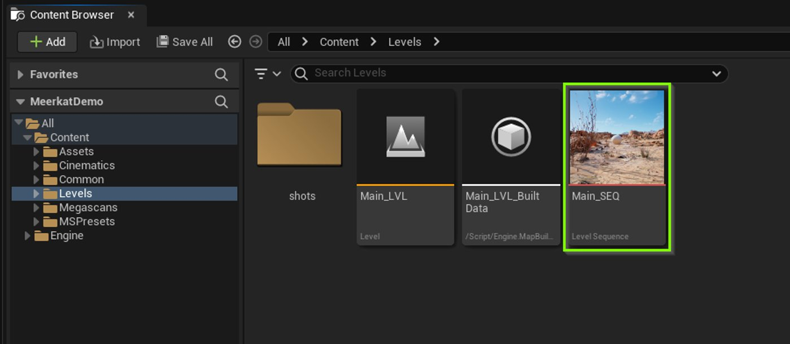
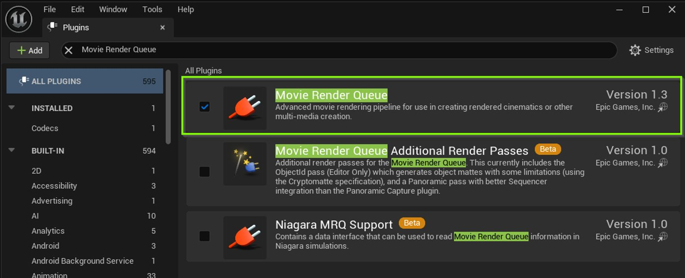
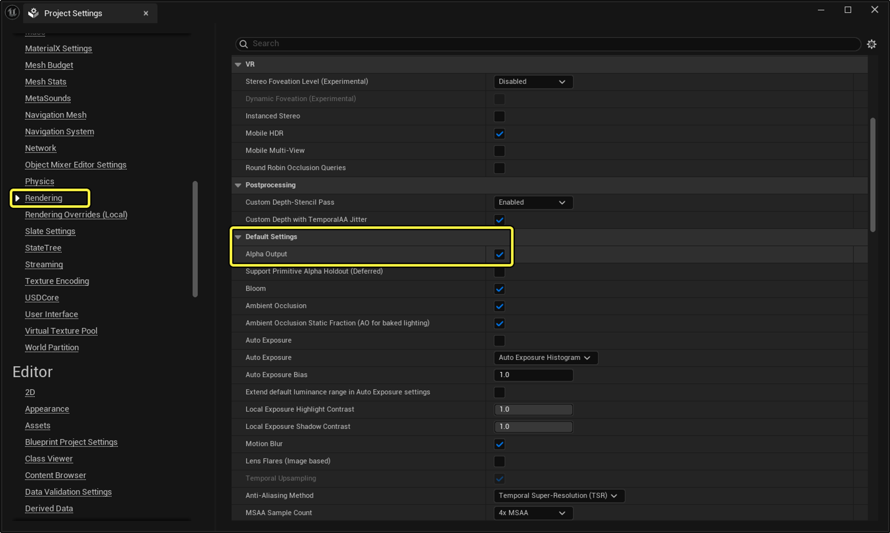
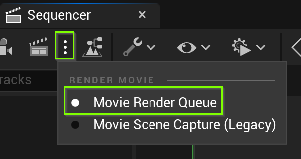
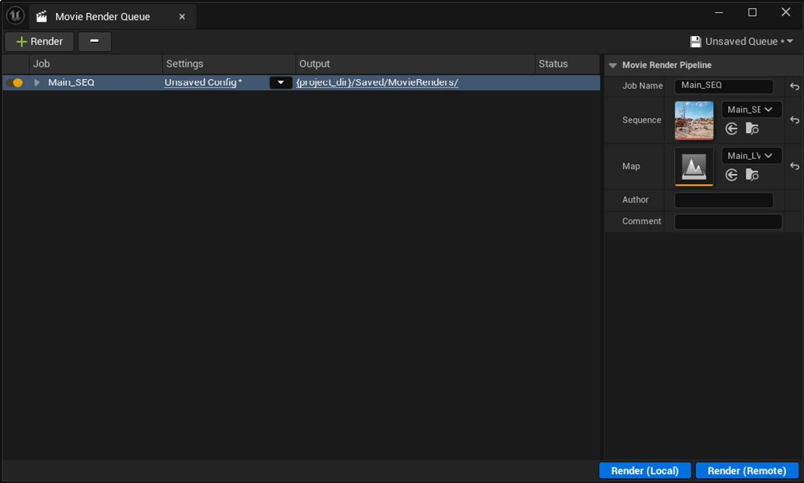
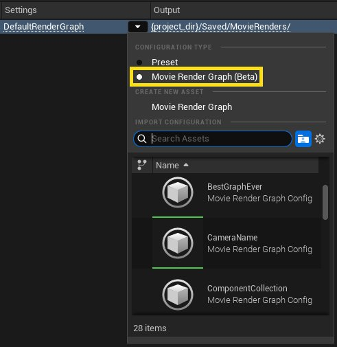
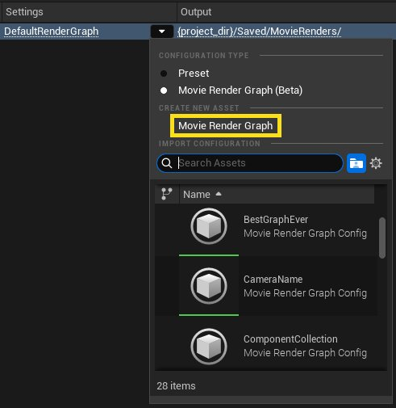
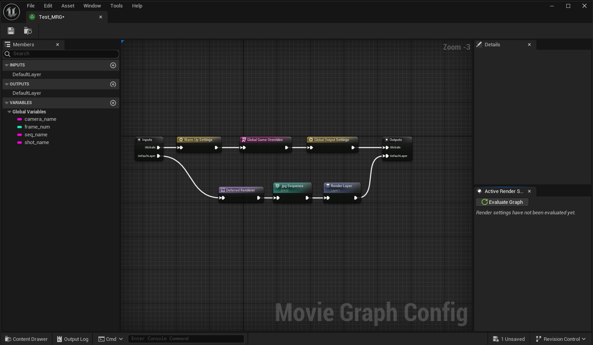

# 影片渲染管线

> 路径：虚幻引擎5.7文档 / 为角色和对象制作动画 / 过场动画和Sequencer / 影片渲染管线

> 原始页面：https://dev.epicgames.com/documentation/unreal-engine/movie-render-pipeline-in-unreal-engine

**影片渲染管线（Movie Render Pipeline）**是虚幻引擎的离线图像序列和影片渲染解决方案。 在你使用虚幻引擎的3D渲染和光照功能创建线性内容时，你可以使用影片渲染管线来获得比传统实时渲染质量更高的结果。 使用影片渲染管线进行离线渲染让你有机会使用一些设置项和命令，从而大幅提高光线追踪全局光照和光线追踪反射等功能的质量、精度和外观。 凭借离线渲染，你还可以获得更好的动态模糊效果，并消除不必要的抗锯齿瑕疵。

你可以使用三种工具与影片渲染管线交互，以此渲染你的项目。每种工具都有不同的功能，以满足项目需求。

- **[影片渲染图表](index.md#movie-render-graph)**（MRG）****：基于图形的界面，可用于编译渲染操作的执行逻辑。
- **[影片渲染队列](index.md#movie-render-queue)（MRQ）**：你可以使用该工具创建预设和脚本，从而安排渲染进程，并在随后导出高质量图像。
- [快速渲染](index.md#quick-render)：你可以使用该工具准备自定义设置并一键快速渲染项目。

## 影片渲染图表

**影片渲染图表**（**MRG**）是一种基于图形的工具，你可以用它来编译逻辑来与影片渲染管线交互，从而导出对内容的高质量渲染。 你可以用该图表指定待渲染帧、渲染设置以及导出文件的类型等。 你可以按需调整这些基于节点的图表的复杂程度，从而同时满足小型团队和大型团队的需求。

你也可以将图表设置为渲染单个镜头，或设计为在复杂的多镜头工作流程中扩展。 你还可以修改和保存这些图表，将其作为可重复使用的资产，从而强化制片管线的灵活性。

MRQ的旧版预设系统和新版MRG可以互换使用。 如需详细了解MRQ渲染设置，请参阅以下文档：

- [渲染设置与格式](cinematic-render-settings-and-formats/index.md) - 使用MRQ和MRG的渲染设置和格式来自定义输出格式和视觉效果

### 先决条件

- 在使用MRG之前，建议先熟悉[MRQ](index.md)以及[渲染设置与格式](cinematic-render-settings-and-formats/index.md)。
- 你需要准备一个内含可渲染关卡序列的项目。 如果你的项目内不含可渲染的关卡序列，可以使用[Meerkat演示](../../../samples-and-tutorials/engine-feature-examples/meerkat-sample-project/index.md)内含的**Main_Seq**关卡序列作为示例。

- 启用**影片渲染队列**[插件](../../../production-pipeline/plugins/index.md)。 在**菜单栏**中找到**编辑（Edit）** > **插件（Plugins）**并在**渲染（Rendering）**分段下找到**影片渲染队列（Movie Render Queue）**插件，或使用搜索栏。 **启用**该插件并重启编辑器。

### 在项目设置中启用Alpha通道支持

以前，要想启用"Alpha输出支持"，你需要在项目设置中为**在后期处理中启用Alpha通道支持（试验性）（Enable Alpha Channel Support in Post-Processing (Experimental)）**属性在三个值中任选其一。 虚幻引擎5.5简化了这一过程，如今只用一个"Alpha输出（Alpha Output）"复选框。 Alpha输出复选框默认**关闭（Off）**，但某些模板会将其自动打开（如电影/电视/虚拟制片的模板）。 如需禁用Alpha输出，请在项目设置中操作。 在菜单栏中点击**编辑（Edit） > 项目设置（Project Settings）**，然后选择**引擎（Engine）** > **渲染（Rendering）**。 在之前的版本中，Alpha设置位于**后期处理（Post-Processing）**分段中，现在则位于**默认设置（Default Settings）**分段中。 点击选框以禁用**Alpha输出**。

项目设置中还新增了一个名为**支持图元Alpha维持（延迟）（Support Primitive Alpha Holdout (Deferred)）**的选项，必须启用此选项才能在延迟渲染器中启用维持。 电影/电视模板和示例将默认将其设为**开启（On）**，但如果游戏项目未使用维持（Holdout），则可以将其禁用，以避免对性能造成影响。 如果该项目设置被禁用，那么修饰符中设置维持（Holdout）时，MRG将通知用户。

### 打开影片渲染图表

你可通过影片渲染队列访问影片渲染图表。 要打开影片渲染队列，请执行以下步骤。

1. 在菜单栏中，点击**窗口（Window） > 过场动画（Cinematics）> 影片渲染队列（Movie Render Queue）**。 这将打开影片渲染队列窗口。

   

   > [!TIP]
   > 你也可以在Sequencer选项卡中访问影片渲染队列。点击**渲染影片（Render Movie）**按钮旁的省略号，即可展开**渲染影片选项（Render Movie Options）**。 选择**影片渲染队列（Movie Render Queue）**选项，然后点击**渲染影片（Render Movie）**按钮即可。
2. 点击**渲染（Render）**按钮并选择关卡序列。

   
3. 在**设置（Settings）**列中，点击**未保存配置（Unsaved Config）**旁的箭头，选择**影片渲染图表（测试版）（Movie Render Graph (Beta)）**。 这时设置列会显示**DefaultRenderGraph**。

   
4. 在**新建资产（Create New Asset）**下，点击**影片渲染****图表（Movie Render Graph）**。

   
5. 为图表命名并点击**保存（Save）**。 这时，你新建的影片渲染图表配置资产将出现在影片渲染队列设置（Movie Render Queue Settings）栏中，并被列为预设资产。
6. 点击设置（Settings）列中的MRG配置（MRG Config）资产，将其开以供编辑。

   

## 影片渲染队列

**影片渲染队列**（**MRQ**）是一款工具，你可以在虚幻引擎中用该工具在影片渲染管线中批量排队和处理内容。 它专为高质量渲染图像、简化的生产管线集成以及用户可扩展性而构建。 通过设置、预设和脚本的组合，你可以使用MRQ手动导出内容的高质量图像和视频文件，或者自动执行渲染流程。

电影渲染队列支持多种用于生成高质量渲染的功能，例如它的时间子采样功能，使你能够生成高质量的径向动态模糊。 你还可以导出包含半透明像素值的图像（使用适当的项目/场景设置），生成具有线性数据的16位HDR图像，并将渲染配置保存到你可以重复使用和共享的资产中。 你可以使用渲染队列同时管理多个作业及其设置，同时渲染队列还支持批量运行渲染作业。

### 先决条件

- 影片渲染队列是一款**插件**，启用后才能使用。 转到虚幻引擎主菜单，前往**编辑（Edit） > 插件（Plugins）**，在**渲染（Rendering）**分段中找到**影片渲染队列（Movie Render Queue）**，并将其启用。 之后你将需要重启编辑器。

  > 图片已省略：movie render queue plugin
- 你已经创建一个带有关卡序列的项目供你渲染。 如果你尚未创建项目，还可以使用**[Meerkat演示](../../../samples-and-tutorials/engine-feature-examples/meerkat-sample-project/index.md)**。该演示是一个预制的内容示例。

### 打开影片渲染队列

你可以用两种不同的方式打开电影渲染队列（Movie Render Queue）窗口

1. 从虚幻引擎的主菜单栏前往**窗口（Window） > 过场动画（Cinematics）> 影片渲染队列（Movie Render Queue）**。
2. 在**Sequencer**中，点击工具栏中**渲染影片（Render Movie）**按钮旁的垂直省略号，然后从下拉菜单中选择**影片渲染队列（Movie Render Queue）**，再点击**渲染影片（Render Movie）**按钮。

   > 图片已省略：打开影片渲染队列

按上述两种方式之一操作后，电影渲染队列（Movie Render Queue）窗口将打开。

> 图片已省略：影片渲染队列窗口

点击图像查看大图。

### 界面概览

电影渲染队列界面由四个主要区域组成：

> 图片已省略：影片渲染队列界面

1. [工具栏](index.md#toolbar)：包含用于添加或删除渲染作业以及加载或保存当前作业列表的菜单。
2. [作业](index.md#jobs)：按排队顺序显示要渲染的序列。 列表中的每个顶层项目都被视为作业。 这些项目还包含每个作业的配置设置。
3. [作业细节](index.md)：所选作业的细节。 列出名称、关卡序列资产、作业期间要运行的关卡以及此作业的作者。
4. [开始渲染](index.md#start-render)：在你的机器上本地启动渲染，或在你机器上的单独进程中启动渲染。

#### 工具栏

工具栏包含用于添加和删除作业的菜单。 要将新序列添加到渲染队列，请点击**+ 渲染（+ Render）**按钮并选择一项**关卡序列（Level Sequence）资产**。 将序列从内容浏览器拖到作业区域，也可以将序列添加到你的作业列表中。

> 图片已省略：添加渲染作业

要从作业列表中删除序列，请选择一项作业并点击工具栏上的 **-** 按钮，或按键盘上的Delete键

你还可以在工具栏中将当前作业列表保存为**队列预设（Queue Preset）**资产。 点击**未保存队列（Unsaved Queue）**按钮，然后选择**将队列另存为（Save Queue As）**。 然后，系统将提示你为**影片管线队列（Movie Pipeline Queue）**资产命名，并将其保存在项目中的某处。

> 图片已省略：保存渲染队列预设

此时，**未保存队列**按钮的文本将更变为你的影片管线队列资产的名称。

你所创建的所有影片管线队列资产都会列在此菜单下。 选择队列资产即可让作业列表匹配已保存的预设。 这会将队列的副本导入作业区。 对作业列表所做的更改不会影响资产，除非你在此菜单中选择**保存队列（Save Queue）**对其进行保存。

> 图片已省略：保存渲染队列重载项

#### 作业

作业区域包含将渲染的关卡序列列表，以及它们的渲染设置和输出目录。

点击作业的**设置（Settings）**条目即可打开设置窗口，你可以在其中指定渲染设置、输出目录以及导出格式。

> 图片已省略：影片渲染设置

在该窗口的主工具栏中，点击**+设置（+ Setting）**按钮即可打开设置列表。 点击某个设置即可打开或关闭该渲染配置。 然后你就可以进一步配置该设置。

点击**未保存配置（Unsaved Config）**按钮并选择一项预设，即可为你的作业应用已保存的预设。

作业的**输出（Output）**条目是一个链接，指向你的图像或视频将要渲染到的文件夹，即输出设置所规定的位置。 点击此处即可打开一个以该文件夹为目标的**文件资源管理器（File Explorer）**窗口。

> 图片已省略：渲染目录浏览器

如需了解如何定制渲染，请访问**[渲染设置与格式](cinematic-render-settings-and-formats/index.md)**页面。

#### 作业细节

选择作业后，你可以在作业细节区域查看其细节。

> 图片已省略：渲染作业细节

此区域列出了所选作业的以下字段：

| 名称 | 说明 |
| --- | --- |
| **作业名称（Job Name）** | 作业的名称。 默认设置为关卡序列资产的名称，但可以修改。 默认的**烧入（Burn In）**覆层中也会显示**作业名称**字段。 |
| **序列（Sequence）** | 序列资产引用。 如果要为作业指定不同的序列，你可以在此处更改引用序列的顺序。 |
| **地图（Map）** | 渲染时要运行的关卡。 如果你的序列使用了**[可生成对象](../unreal-engine-sequencer-movie-tool-overview/spawn-temporary-actors-in-unreal-engine-cinematics/index.md)**，那么你将可以在不同的关卡中渲染同一个场景。 |
| **作者（Author）** | 作业作者。 此字段会使用你的操作系统用户名自动填充。 |
| **注释（Comment）** | 可选的注释字段。 此字段会使用你的操作系统用户名自动填充。 |

#### 开始渲染

你可以点击两个按钮开始渲染：

- 点击**渲染（本地）（Render (Local)）**，使用与虚幻引擎相同的进程渲染，并启动[在编辑器中运行](../../../building-virtual-worlds/level-editor/ineditor-testing-play-and-simulate/index.md)会话进行渲染。 执行本地渲染时，你无需保存更改。
- 点击**渲染（远程）（Render (Remote)）**，启动一个单独的进程来渲染你的作业。 你必须将更改保存在项目中，外部进程才可以从磁盘读取保存的文件。

**远程（Remote）**选项可用于实现远程渲染农场。 渲染选项的默认行为由**[项目设置](../../../understanding-the-basics/project-settings/index.md)**决定，并且可以调整以运行你自己的代码，而这对你使用第三方渲染农场管理软件能有所帮助。 此外，用于启动远程渲染过程的命令将写入输出日志，在构建你自己的自动渲染农场时，这可以用作参考。

> [!NOTE]
> 因为你在**作业细节**中指定了要渲染的**关卡**资产，所以渲染时不需要打开同一个关卡。 运行渲染作业时，影片渲染队列将自动打开指定的关卡。

### 渲染预览

当渲染作业运行时，电影渲染队列将显示渲染预览窗口，向你展示渲染的当前视觉效果状态以及相关信息。 渲染完成后预览窗口将自动关闭。

> 图片已省略：渲染预览

1. **渲染预览（Render Preview）**：此视图将显示渲染的当前视觉效果状态。 由于每一帧都显示在此处，它们也将保存到你的输出目录中。 此处的预览基于你的GPU的最新示例数据，并且可能以低于最终渲染的质量显示。 如果你为渲染启用了平铺（Tiling），则预览将仅显示右下角平铺。
2. **整体渲染进度（Overall Render Progress）**：这些细节将显示被渲染的当前序列、整体进度、耗时和预估剩余时间。
3. **当前镜头切换进度（Current Camera Cut Progress）**：这些细节将显示当前被渲染的摄像机，以及当前镜头切换的进度。

### 创建基本渲染

你可以按照以下步骤创建电影序列的基本渲染。

#### 作业设置

1. 打开影片渲染队列工具。 从主菜单栏前往**窗口（Window）> 过场动画（Cinematics）> 影片渲染队列（Movie Render Queue）**。
2. 点击**+渲染（+ Render）**按钮并选择你的序列，将你的序列资产添加到作业列表中。

   > 图片已省略：添加渲染作业
3. 请确保在**地图（Map）**属性中设置了正确的关卡。

   > 图片已省略：地图设置渲染

#### 输出设置

添加序列后，你可能需要调整一些输出设置，例如目标文件夹、分辨率和文件类型。

在**设置（Settings）**列中，点击**未保存配置（Unsaved Config）**，打开该作业的**渲染设置（Render Settings）**窗口。

> 图片已省略：打开影片渲染队列设置

默认情况下，电影渲染队列将渲染为一系列.jpg图像。 如需更改此设置，请删除**jpg Sequence [8bit]**条目，然后点击**+设置（+ Setting）**按钮，选择不同的输出格式。

选择**.jpg Sequence 8bit]**条目并按**删除（Delete）**，然后点击**+设置（+ Setting）**按钮并选择**.png Sequence [8bit]**。

> 图片已省略：影片渲染队列PNG序列

**延迟渲染（Deferred Rendering）**条目会让输出渲染你在视口中看到的确切图像。 对这样的基本渲染，你可以按原样保留设置，但它**必须**在此处存在，这样你的图像才能被渲染。

> 图片已省略：延迟渲染

点击**输出（Output）**即可显示典型的输出相关设置，例如文件名、目录和分辨率等。

要更改输出目录（Output Directory）字段，请点击条目旁边的**…**按钮，找到新文件夹，然后按**选择文件夹（Select Folder）**。 你的图像序列现在将在此处输出。

> 图片已省略：渲染输出设置

完成更改后，关闭**渲染设置（Render Settings）**窗口。

#### 渲染

现在你可以渲染你的序列。

点击**渲染（本地）（Render (Local)）**开始序列的渲染作业。 **[渲染预览](index.md#render-preview)**窗口将显示当前渲染进度。

> 图片已省略：本地移动渲染

渲染完成后，预览窗口将关闭。 现在点击作业的链接输出文本，你可以找到输出文件夹并查看输出图像序列。

### 蓝图中的应用

你可以使用**影片渲染队列（Movie Render Queue）**在运行时构建中渲染影片，并使用**蓝图（Blueprints）**将文件输出到用户的计算机。 访问**[运行时构建中的电影渲染队列](movie-render-queue-in-runtime/index.md)**以了解详情。

## 快速渲染

**快速渲染**工具可快速导出项目的实时渲染，以便直观地查看和审查你的工作。 快速渲染适用于不需要对渲染设置进行大量调整的工作流程，例如动画和建筑可视化等。

要激活快速渲染工具，请执行以下步骤：

1. 在主工具栏中，点击**快速渲染**按钮旁边的三点号（⋮）。
2. 选择**快速渲**染模式。

> 图片已省略：下拉菜单中的快速渲染选项

这时只要你点击**快速渲染**按钮，快速渲染将生成项目的渲染。 更改渲染类型，只需点击**三点号（⋮）**按钮并选择以下渲染选项之一：

- **当前序列（Current Sequence）：**渲染当前关卡序列。此选项要求打开Sequencer并加载一项关卡序列。
- **当前视口（Current Viewport）**：渲染一张编辑器视口中当前视图的静态图像。
- **所选摄像机（Selected Camera(s)）**：渲染一个或多个所选摄像机的静态图像。此选项要求你在大纲视图中选择一个或多个摄像机。
- **在序列中使用视口摄像机（Use Viewport Camera in Sequence）**：使用编辑器视口中的视图作为摄像机，渲染在Sequencer中打开的关卡序列。 此选项要求打开Sequencer并加载一项关卡序列。

### 快速渲染设置

你可以更改快速渲染的设置，同时每个渲染选项都可以使用单独的设置。

要打开快速渲染的设置项，请执行以下步骤：

1. 在主工具栏中，点击**快速渲染**按钮旁边的**三点号（⋮）**按钮。
2. 点击**快速渲染设置（Quick Render Settings）**。

> 图片已省略：菜单中的快速渲染设置选项

快速渲染设置窗口顶部有一个下拉菜单，可让你选择要配置的渲染选项。点击蓝色的**快速渲染（Quick Render）**按钮即可开始渲染，并将所选的渲染选项记为**主工具栏**中的选定选项。

> 图片已省略：快速渲染设置窗口

你可以在影片管线的项目设置中更改影片渲染图表的默认配置。 你在快速渲染设置中选择的选项将优先于图形配置所设的选项。 如果图形配置公开了变量，那么这些变量会出现在设置列表的**主要图表变量（Primary Graph Variables）**类别中。 你还可以在使用快速渲染时重载这些变量。

**渲染后（After Render）**设置项给出了三个选项：

- **播放渲染输出（Play Render Output）：**请参阅"播放渲染输出"小节。
- **打开输出目录（Open Output Directory）**：自动打开输出目录，让用户可以轻松访问磁盘上的渲染输出。
- **无操作（Do Nothing）**：什么也不做，停留在虚幻引擎编辑器中。

启用**应用视口外观（Apply Viewport Look）**后，你可以在快速渲染中看到以下编辑器设置项：

- **OCIO（OpenColorIO）：**在编辑器视口中设置后，OCIO将以与编辑器视口相同的设置被添加到图表配置中的所有输出类型节点中。
- **显示标记（Show Flags）**：任何已启用的显示标记都将在最终的快速渲染输出中启用。
- **视图模式（View Mode）**：任何已启用的视图模式都将在最终的快速渲染输出中启用。
- **可视性（Visibility）**：编辑器中可见的内容将始终出现在最终的快速渲染输出中，具体包括以下内容：

  - 即使启用了"在游戏中隐藏Actor（Actor Hidden in Game）"，编辑器中可见的Actor也会在渲染中出现。
  - 不论流送方式是什么，在编辑器中可见的关卡都会被加载到渲染中。
  - 只要Sequencer处于打开状态，在编辑器中可见的可生成对象Actor就会出现。 这主要适用于不需要使用序列的**当前视口（Current Viewport）**和**选定摄像机（Selected Camera(s)）**选项。
  - 只要动画模式中未启用**隐藏控制形状（Hide Control Shapes）**，在编辑器中可见的**控制绑定**小工具就会出现。

    > 图片已省略：隐藏控制形状选项
- **显示纯编辑器Actor（Show Editor-Only Actors）**：为动画审查进行渲染时，有时也需要显示通常而言仅限在编辑器中查看的内容。 启用后，将显示以下内容：

  - 公告板
  - 摄像机
  - 摄像机摇臂
  - 摄像机绑定导轨
  - 摄像机视锥体（要求启用**摄像机视锥体的显示标记（Show Flag for Camera Frustums）**）

    > 图片已省略：编辑器视口中显示的摄像机视锥体

快速渲染还提供三个选项，用于在使用关卡序列（而不是静态图像）时决定要渲染的帧范围：

- **播放范围（Playback Range）**：Sequencer中关卡序列的整体播放范围。
- **选择范围（Selection Range）**：Sequencer中的当前选择范围。 如果已在子序列中设置，那么快速渲染会将其映射到父序列。
- **自定义（Custom）**：使用影片渲染图表配置中定义的**帧范围变量**，用自定义值重载开始帧和结束帧。

#### 播放渲染输出

**播放渲染输出（Play Render Output）**设置会在你所选的查看程序中自动播放渲染后的媒体。 具体选择位置见**编辑器偏好设置（Editor Preferences）** > **插件：影片渲染图表（Plugin: Movie Render Graph）**，可以按用户设置。

要打开影片渲染图表插件的设置项，请点击**快速渲染设置（Quick Render Settings）**窗口中**渲染后（After Render）**下拉菜单旁的按钮。

> 图片已省略：快速渲染设置中可打开编辑器偏好设置的按钮

播放渲染输出（Play Render Output）的设置项包括了一个**输出类型优先顺序（Output Type Priority Order）**的数组。 当存在多个渲染输出类型时，你可以定义输出类型的播放层级，从而防止相同的内容出现多次。 你可以使用拖放功能重新排列输出类型，还可以添加其他格式，比如命令行编码器生成的格式。

> 图片已省略：播放渲染输出设置项

默认情况下，**输出类型播放（Output Type Playback）**将被设为**使用优先顺序（Use Priority Order）**，但如果你需要播放所有渲染输出，你也可以将其切换为**播放所有输出类型（Play All Output Types）**。

由于虚幻引擎没有原生的图像查看工具，因此你必须使用外部的查看程序。**播放方法（Playback Method）**使用**操作系统（Operating System）**作为默认设置，并执行相当于从磁盘打开文件的操作。 你可以提供播放器可执行文件的路径（无论具体安装位置在哪里），将**播放方法**设置为**自定义查看器（Custom Viewer）**。 用户可以根据自己所选的自定义查看器设置**额外的命令行参数**。 不同的查看程序可能会使用不同的帧号语法，而系统对此进行了相应的处理，即通过**帧号标注（Frame Number Notation）**属性提供了以下选项：

- **有开始帧/结束帧的编号（# with Start/End Frame）**：针对RV和xStudio使用此项。
- **无开始帧/结束帧的编号（# without Start/End Frame）**：针对DJV和HieroPlayer使用此项。
- **$F**：针对mPlay使用此项。
- **开始帧（Start Frame）**：针对mrViewer和Cinesync使用此项。

由于操作系统的图像序列播放能力有限，因此我们还提供了三个额外的设置，供你更改操作系统或自定义查看器可以播放的内容：

- **播放范围（Playback Range）**：若设为**操作系统（Operating System）**，则系统将只能使用**第一帧**，但**自定义查看器**也可以播放图像序列的**全部范围**。
- **作业播放（Job Playback）**：当渲染中存在多个作业时，操作系统只能播放**第一个作业**的内容，但**自定义查看器**可以播放**所有作业**。
- **渲染层播放（Render Layer Playback）**：当渲染中存在多个渲染层时，操作系统只能播放**第一个渲染层**的内容，但**自定义查看器**可以播放**所有渲染层**。

为处理编码解码器支持和命令行参数自定义选项方面的差异，"播放渲染输出（Play Render Output）设置项"允许你为图像序列和影片分别配置不同的查看程序。
