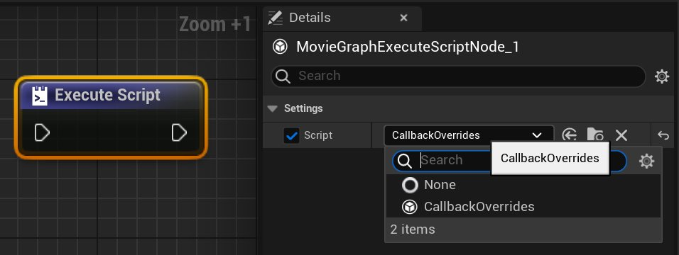

# 回调脚本

> 路径：虚幻引擎5.7文档 / 为角色和对象制作动画 / 过场动画和Sequencer / 影片渲染管线 / 回调脚本

> 原始页面：https://dev.epicgames.com/documentation/unreal-engine/movie-render-graph-callback-scripts-in-unreal-engine

## 回调简介

回调是向渲染作业添加前期/后期逻辑的好方法。影片渲染图表有一个回调系统，用于处理在作业/镜头运行之前和之后运行的脚本，从而为渲染添加额外的逻辑。

新版渲染图表带来了名为"Execute Script Node"的节点，该节点使回调创建变得更容易、更直观，因为在它之前，渲染图表仅支持将回调作为项目设置中执行器的一部分，而现在回调则在图表配置内受到支持。

可通过为MovieGraphScriptBase设置子类并重载专用回调的函数来创建回调。

下方示例代码片段展示了如何使用虚幻引擎特定的装饰器 `@unreal.uclass()` 来标记UObject处理系统的类，从而让它能感知并准备好从Execute Script Node进行引用。

```
@unreal.uclass() class CallbackOverrides(unreal.MovieGraphScriptBase):     def _post_init(self):         print("回调重载类") 
```

代码片段开始运行后，Execute Script Node的项目菜单中即可选择"CallbackOverrides" UClass。



使用装饰器 `@unreal.ufunction(override=True)` 重载个体函数，表明我们有兴趣重载底层函数。

## On Job Start回调：

单个作业启动后，此回调在流程早期调用。它提供对即将运行的作业的引用。通过对该作业的引用可获得影片图表配置。回调中提供的作业和影片图表配置都是队列中最初指定配置的副本。这意味着你不必担心将修改泄漏到原始资产中（而原始资产可能由多个作业共享）。

```
@unreal.uclass() class CallbackOverrides(unreal.MovieGraphScriptBase): 	@unreal.ufunction(override=True)     def on_job_start(self, in_job_copy):         super().on_job_start(in_job_copy)         print("在渲染开始前运行") 
```

## On Job Finished回调：

此回调在影片图表管线关闭前的最后时刻调用，此时所有的图像数据都应写入磁盘。无论作业成功或取消都会调用此函数。第二个参数有"success"属性，可用于检查作业是成功，还是由于配置错误或用户输入而被取消。

```
@unreal.ufunction(override=True) def on_job_finished(self, in_job_copy, in_output_data):     super().on_job_start(in_job_copy, in_output_data)     print("在渲染作业全部完成后运行")          #展示如何访问镜头渲染图层数据的示例代码     for shot in in_output_data.graph_data:         for layerIdentifier in shot.render_layer_data:                 unreal.log("render layer: " + layerIdentifier.layer_name)                 for file in shot.render_layer_data[layerIdentifier].file_paths:                     unreal.log("file: " + file)	 
```

## On Shot Start回调:

```
@unreal.ufunction(override=True) def on_shot_start(self, in_job_copy, in_shot_copy):     super().on_shot_start(in_job_copy, in_shot_copy)     print("在所有镜头被渲染前运行") 
```

此回调与On Job Start回调类似，但它在设置镜头之前调用。如果需要在单个镜头开始时进行交互，则此回调很有用。

## On Shot Finished回调：

```
@unreal.ufunction(override=True) def on_shot_finished(self, in_job_copy, in_shot_copy, in_output_data): 	super().on_shot_finished(in_job_copy, in_shot_copy, in_output_data) 	print("在所有镜头完成渲染后调用") 
```

此回调与On Job Finished回调类似，但它在每个镜头结束后调用。输出数据将仅包含此回调所针对的镜头的数据。

## 逐镜头启用的回调：

> [!NOTE]
> 对 `on_shot_start` 和 `on_shot_finished` 回调而言，由于渲染将在每个镜头结束时暂停，以等待所有文件都写入磁盘后再调用回调，这两种回调可能会增加渲染时间，因此只有在我们明确启用它们时，才会进行调用。

有两种方法可以启用逐镜头写入。

1. 在Global Output Settings节点上，勾选"逐镜头刷新磁盘写入（Flush Disk Writes Per Shot）"。
2. 定义回调时，用与重载函数 `is_per_shot_callback_needed` 的相同方式启用逐镜头写入。

   ```
        @unreal.ufunction(override=True)		     def is_per_shot_callback_needed():		         return True 
   ```

## 永久定义Python UClass：

注册的回调类仅能在当前会话中持续存在，为确保自定义的UClass被永久注册，需要挑一个 `/Content/Python/init_unreal.py` 文件，并在其中添加导入语句。将类导入到这个python文件中，即可确保它在每次启动时运行，因此将永久可用。

## 执行器回调：

不止图表中的脚本节点可以覆盖逐作业/镜头的前期/后期回调，执行器本身也可以重载回调。其中最好用的回调是 `on_executor_finished_delegate` ，它是所有作业完成后的最后一步，用于向其他应用程序通知作业已完成。尽管其他回调的工作原理与Execute Script Node中描述的回调类似，但我们建议保留作业/镜头的前期/后期回调，作为影片渲染图表中Execute Script Node的一部分。

```
def on_queue_finished_callback(executor: unreal.MoviePipelineExecutorBase, success: bool):     print("在渲染作业开始前运行： ") subsystem_executor.on_individual_job_started_delegate.add_callable_unique(on_individual_job_started_callback) 
```

完整示例见 `MovieGraphScriptNodeExample.py`文件，位置为 `/Engine/Plugins/MovieScene/MovieRenderPipeline/ Content/Python/` ，现暂时附在本文档中。

```
# Epic Games, Inc. 保留所有权利。 import unreal # 本示例展示了如何创建可重载前期/后期镜头作业回调的UClass， # 这种回调是Execute Script Node所必需的回调。运行  # register_callback_class() 将在图表的Execute Script Node细节中  # 显示名为"CallbackOverrides"的对象。此对象用基本语句替换了可用的作业/镜头  # 回调 # 用法： # #   导入MovieGraphScriptNodeExample #   MovieGraphScriptNodeExample.register_callback_class() # #   运行此函数后，可在影片图表配置的Execute Script Node中 #   选择此UObject。 # #   可将上述代码片段添加到任何/Content/Python/__init__ py文件中，  #  以使此UObject在引擎启动时永久可用。 def register_callback_class():     """此辅助函数将创建名为CallbackOverrides的示例UClass，     它将重载MovieGraphsScriptBase函数，演示     影片图表Execute Script Node中各个回调如何在作业和镜头之前/之后      运行。     调用此函数来注册CallbackOverrides类，      从而让它可以在Execute Script Node中被选择。     """     @unreal.uclass()     class CallbackOverrides(unreal.MovieGraphScriptBase):         @unreal.ufunction(override=True)         def on_job_start(self, in_job_copy):             super().on_job_start(in_job_copy)             unreal.log("在渲染开始前运行")         @unreal.ufunction(override=True)         def on_job_finished(self, in_job_copy:unreal.MoviePipelineExecutorJob,                              in_output_data:unreal.MoviePipelineOutputData):             super().on_job_finished(in_job_copy, in_output_data)             unreal.log("在渲染作业全部完成后运行")             for shot in in_output_data.graph_data:                 for layerIdentifier in shot.render_layer_data:                         unreal.log("render layer: " + layerIdentifier.layer_name)                         for file in shot.render_layer_data[layerIdentifier].file_paths:                             unreal.log("file: " + file)         @unreal.ufunction(override=True)         def on_shot_start(self, in_job_copy:unreal.MoviePipelineExecutorJob,                            in_shot_copy: unreal.MoviePipelineExecutorShot):             super().on_shot_start(in_job_copy, in_shot_copy)             unreal.log("在所有镜头被渲染前运行")         @unreal.ufunction(override=True)         def on_shot_finished(self, in_job_copy:unreal.MoviePipelineExecutorJob,                               in_shot_copy:unreal.MoviePipelineExecutorShot,                               in_output_data:unreal.MoviePipelineOutputData):             super().on_shot_finished(in_job_copy, in_shot_copy, in_output_data)             unreal.log("在所有镜头完成渲染后调用")         @unreal.ufunction(override=True)         def is_per_shot_callback_needed(self):             """             重载此函数并返回true即可启用逐镜头的磁盘              刷新，这与在Global Output Settings节点上              开启逐镜头的刷新磁盘写入效果相同。             """             return True     
```
