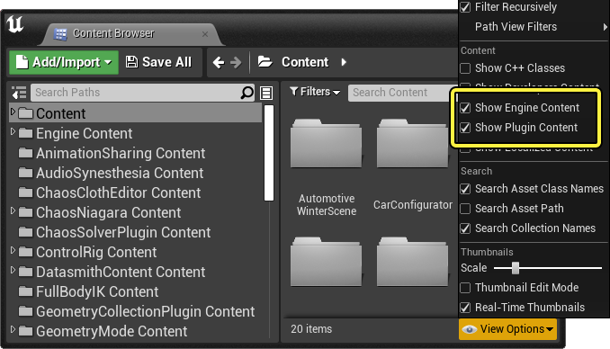
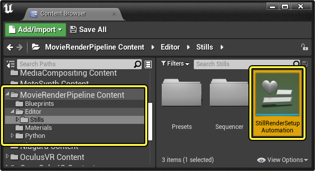
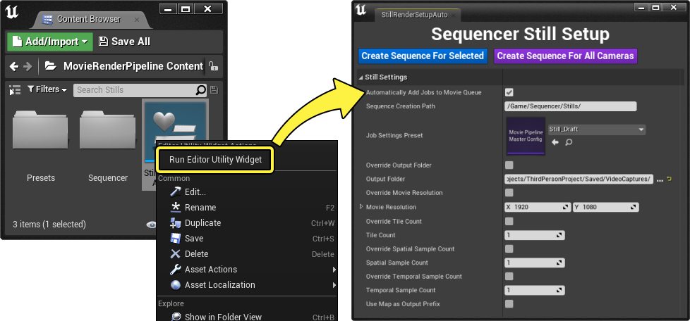
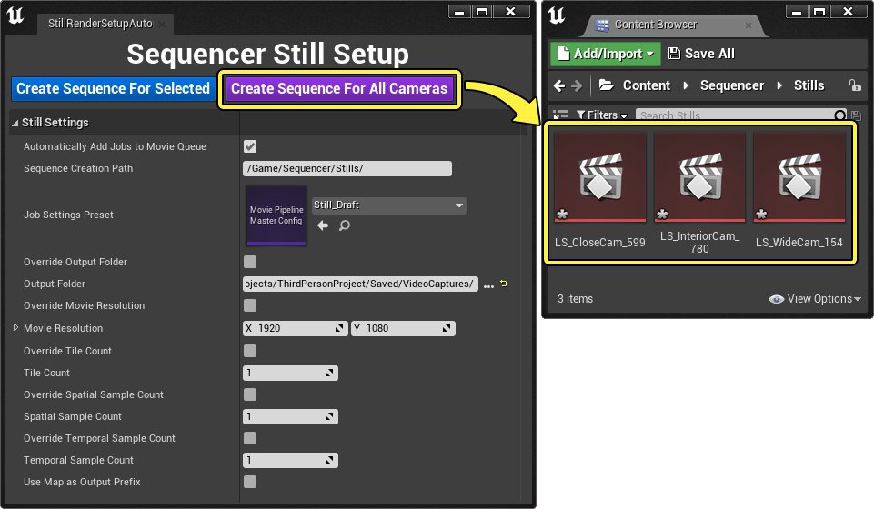
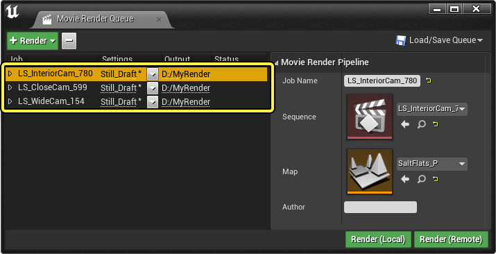
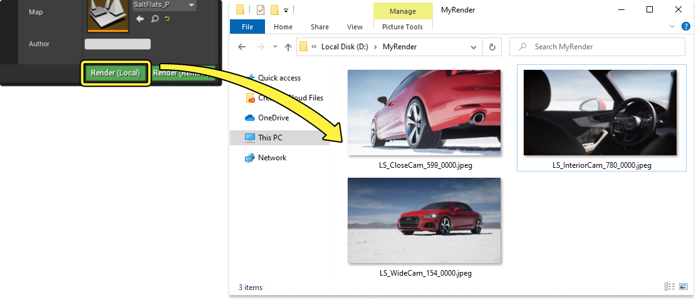

# 静止图像渲染

> 路径：虚幻引擎5.7文档 / 为角色和对象制作动画 / 过场动画和Sequencer / 影片渲染管线 / 静止图像渲染

> 原始页面：https://dev.epicgames.com/documentation/unreal-engine/render-multiple-camera-angle-stills-in-unreal-engine

通过影片渲染队列（Movie Render Queue），可以采用批处理的方式来渲染多个摄像机中的静止图像，而不必在Sequencer中执行复杂的步骤。在处理变体或迭代时，利用这种方式可以简化来自不同视点的大量静止图像的创建过程。这种方式非常适合构建建筑、汽车或产品设计领域的交付件。

本文档将概述静止图像设置工具，以及如何将此工具与影片渲染队列搭配使用。

#### 先决条件

- 你已经完成了

  影片渲染队列

  页面中的先决条件和准备工作步骤。
- 你已经在关卡中放置了多个用于捕获所选角度的

  过场动画摄像机

  。

## 打开静止图像设置工具

静止图像设置工具位于影片渲染队列的 **插件内容（Plugin Content）** 文件夹中。要在 **[内容浏览器](../../../../understanding-the-basics/content-browser/index.md)** 中访问此文件夹，请选择 ***查看选项（View Options）**，然后启用 **显示引擎内容（Show Engine Content）** 和 **显示插件内容（Show Plugin Content）**。

现在，你应该可以在内容浏览器侧边栏中看到多个文件夹。找到 **MovieRenderPipeline内容（MovieRenderPipeline Content）**，前往 **编辑器（Editor） > 静止图像（Stills）** 子文件夹。你应该可以看到其中包含的 **StillRenderSetupAutomation**，这是一种 **[编辑器工具控件](../../../../production-pipeline/scripting-and-automating-the-unreal-editor/scripting-the-unreal-editor-using-blueprints/editor-utility-widgets/index.md)**。

右键点击 **StillRenderSetupAutomation**，然后选择 **运行编辑器工具控件（Run Editor Utility Widget）** 来打开工具。

## 工具的使用

要使用关卡中放置的摄像机来创建静止图像序列，请点击 **为所有摄像机创建序列（Create Sequence For All Cameras）**。这将为此关卡中放置的每个 **[电影摄像机Actor](../../movie-and-cinematic-cameras/cinematic-cameras/index.md)** 创建一个 **[关卡序列资产](../../unreal-engine-sequencer-movie-tool-overview/index.md)**。

系统将会在 **序列创建路径（Sequence Creation Path）** 属性所决定的文件夹路径中创建序列，并根据分配给序列的摄像机来命名序列。

> [!NOTE]
> 你也可以点击 **为选定的摄像机创建序列（Create Sequence For Selected）**，此选项仅会为你选择的摄像机创建序列。

启用了 **自动将作业添加到电影队列（Automatically Add Jobs to Movie Queue）** 后，打开MRQ窗口时，你应该可以看到序列已经添加到队列。

点击 **渲染（本地）（Render (Local)）**，根据不同的摄像机创建单个图像渲染。

> [!NOTE]
> 在渲染时，建议提供一些预热时间，以便于你的资产和纹理能够以最高质量完全加载。将 **引擎预热（Engine Warm Up）** 属性设置为最低为 **60** 的值，即可实现此目的。此属性位于 **[抗锯齿](../cinematic-render-settings-and-formats/cinematic-rendering-image-bb951eea/index.md#%E6%8A%97%E9%94%AF%E9%BD%BF)** 图像设置中。

## 静止图像设置

以下按钮和属性位于 **Sequencer静止图像设置（Sequencer Still Setup）** 窗口中。

| 名称 | 说明 |
| --- | --- |
| **为选定的摄像机创建序列（Create Sequence For Selected）** | 为关卡中所有选定的摄像机创建单帧关卡序列，并将其存储在由 **序列创建路径（Sequence Creation Path）** 属性指定的文件夹路径中。 |
| **为所有摄像机创建序列（Create Sequence For All Cameras）** | 为关卡中所有摄像机创建单帧关卡序列，并将其存储在由 **序列创建路径（Sequence Creation Path）** 属性指定的文件夹路径中。 |
| **自动将作业添加到电影队列（Automatically Add Jobs to Movie Queue）** | 启用此选项之后，新创建的序列将自动添加到 **影片渲染队列（Movie Render Queue）** 中。 |
| **序列创建路径（Sequence Creation Path）** | 在点击 **为选定的摄像机创建序列（Create Sequence For Selected）** 或 **为所有摄像机创建序列（Create Sequence For All Cameras）** 时用于创建新序列的路径。 |
| **作业设置预设（Job Settings Preset）** | 要为所有序列应用的 **[渲染设置](../cinematic-render-settings-and-formats/index.md)**。 |
| **覆盖输出文件夹（Override Output Folder）** | 启用此选项之后，将使用 **输出文件夹（Output Folder）** 属性中指定的目录来覆盖 **作业设置预设（Job Settings Preset）** 的 **[输出目录](../cinematic-render-settings-and-formats/cinematic-rendering-image-bb951eea/index.md#%E8%BE%93%E5%87%BA)**。 |
| **输出文件夹（Output Folder）** | 如果启用了 **覆盖输出文件夹（Override Output Folder）**，则此输出目录是要为添加到队列的新创建的序列进行覆盖的目录。 |
| **覆盖电影分辨率（Override Movie Resolution）** | 启用此选项之后，将使用 **电影分辨率（Movie Resolution）** 属性中指定的分辨率来覆盖 **作业设置预设（Job Settings Preset）** 的输出分辨率](animating-characters-and-objects/Sequencer/movie-render-pipeline/RenderSettings/Reference##输出)**。 |
| **电影分辨率（Movie Resolution）** | 如果启用了 **覆盖电影分辨率（Override Movie Resolution）**，则此输出分辨率是要为添加到队列的新创建的序列进行覆盖的分辨率。 |
| **覆盖图块计数（Override Tile Count）** | 启用此选项之后，将使用 **图块计数（Tile Count）** 属性中指定的新数量来覆盖 **作业设置预设（Job Settings Preset）** 的 **图块计数（Tile Count）(animating-characters-and-objects/Sequencer/movie-render-pipeline/RenderSettings/Reference#高分辨率)** 数量。 |
| **图块计数（Tile Count）** | 如果启用了 **覆盖图块计数（Override Tile Count）**，则图像图块数量是要为添加到队列的新创建的序列进行覆盖的数量。 |
| **覆盖空间样本计数（Override Spatial Sample Count）** | 启用此选项之后，将使用 **空间样本计数（Spatial Sample Count）** 属性中指定的数量来覆盖 **作业设置预设（Job Settings Preset）** 的 **[空间样本计数](../cinematic-render-settings-and-formats/cinematic-rendering-image-bb951eea/index.md#%E6%8A%97%E9%94%AF%E9%BD%BF)**。 |
| **空间样本计数（Spatial Sample Count）** | 如果启用了 **覆盖空间样本计数（Override Spatial Sample Count）**，则此空间样本计数是要为添加到队列的新创建的序列进行覆盖的计数。 |
| **覆盖时间样本计数（Override Temporal Sample Count）** | 启用此选项之后，将使用 **时间样本计数（Temporal Sample Count）** 属性中指定的新数量来覆盖 **作业设置预设（Job Settings Preset）** 的 **[时间样本计数](../cinematic-render-settings-and-formats/cinematic-rendering-image-bb951eea/index.md#%E6%8A%97%E9%94%AF%E9%BD%BF)**。 |
| **时间样本计数（Temporal Sample Count）** | 如果启用了 **覆盖时间样本计数（Override Temporal Sample Count）**，则时间样本计数是要为添加到队列的新创建的序列进行覆盖的计数。 |
| **使用地图作为输出前缀（Use Map as Output Prefix）** | 启用此选项将会添加关卡名称来作为输出图像文件的前缀。 |
