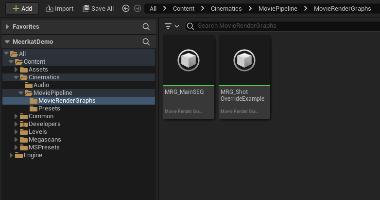
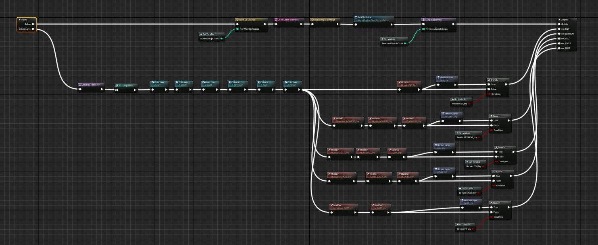
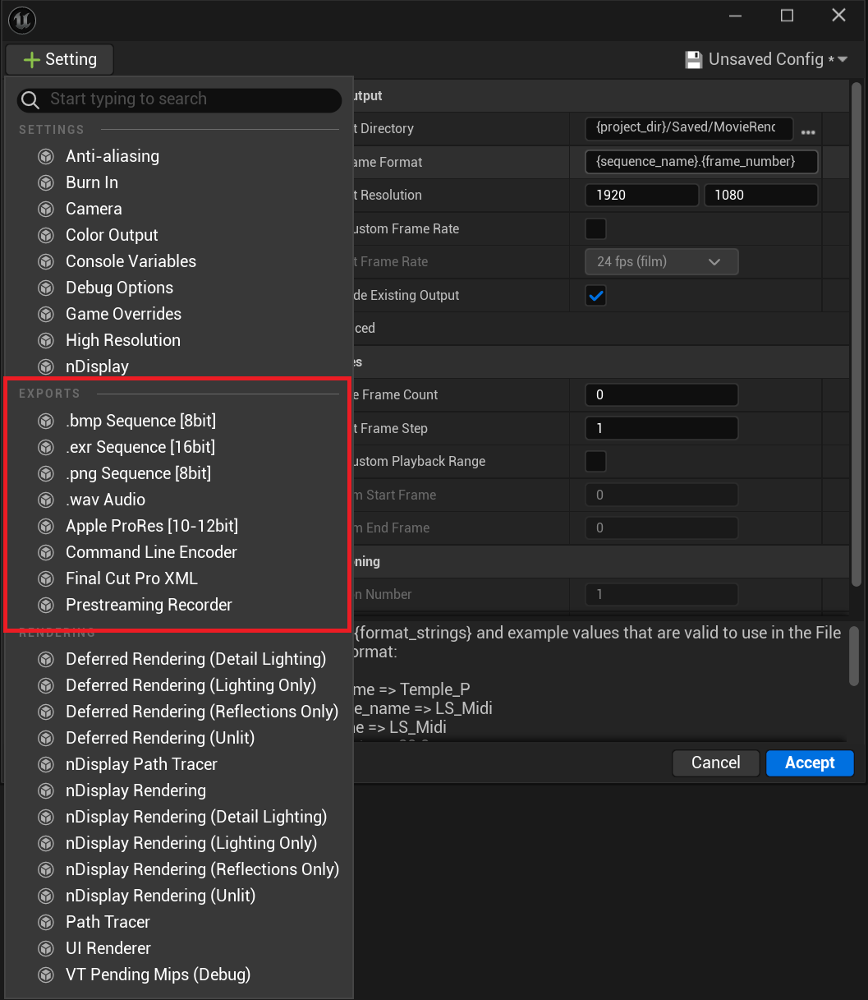
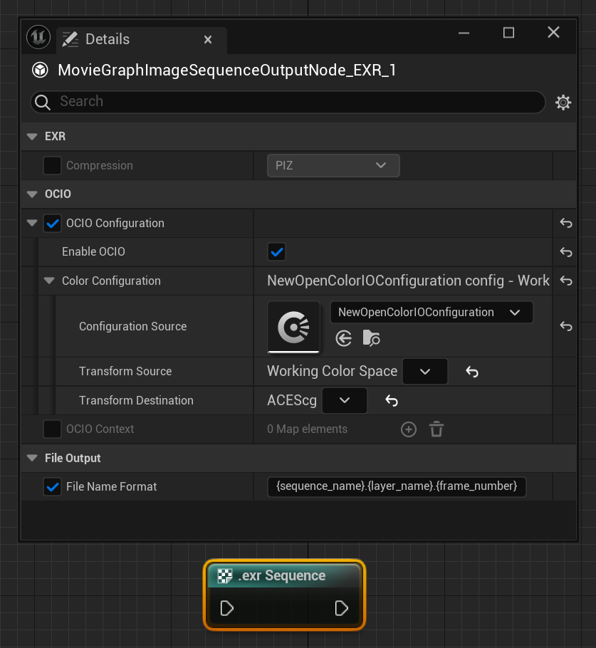
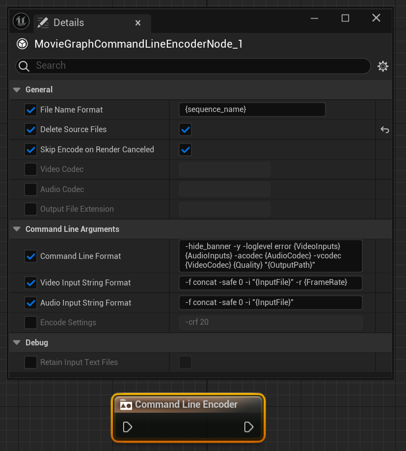
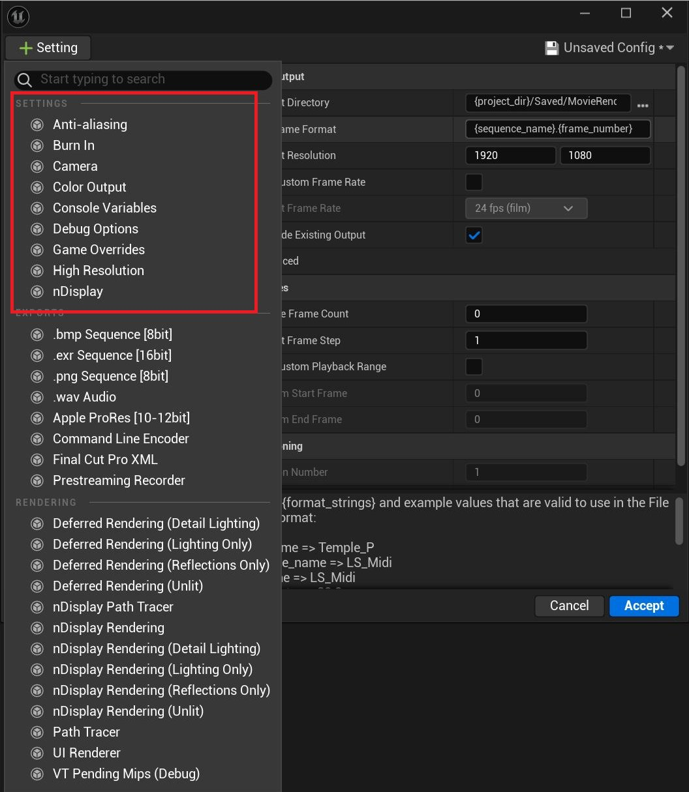
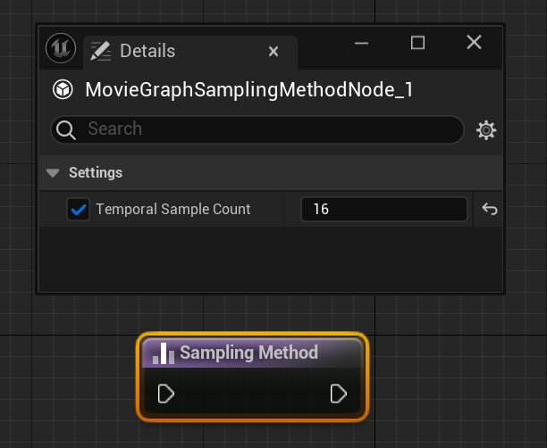
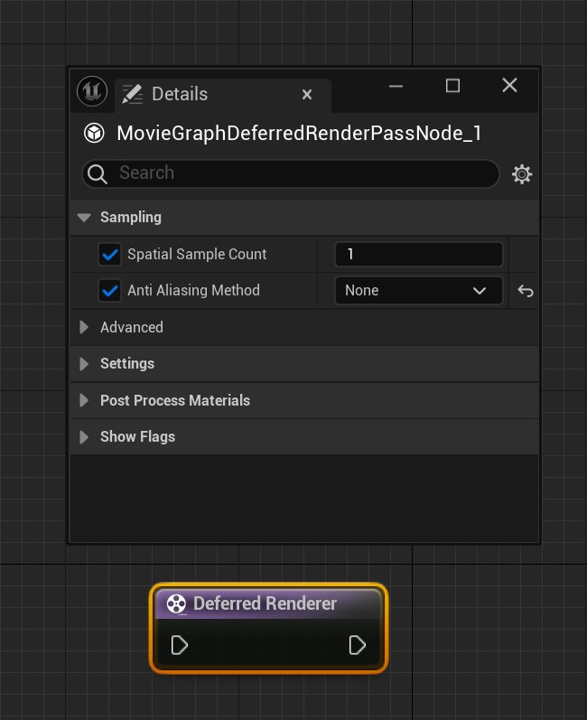

# 从影片渲染队列过渡到影片渲染图表

> 路径：虚幻引擎5.7文档 / 为角色和对象制作动画 / 过场动画和Sequencer / 影片渲染管线 / 从影片渲染队列过渡到影片渲染图表

> 原始页面：https://dev.epicgames.com/documentation/unreal-engine/transitioning-to-the-movie-render-graph-from-movie-render-queue-in-unreal-engine

## 简介

虚幻引擎的影片渲染图表是一种基于节点的工具，可以创建高品质的渲染输出。相比影片渲染队列，它更加强大、灵活和易用。本指南将概述如何在已熟悉了MRQ的前提下过渡到使用MRG。

## 示例内容

[Meerkat示例项目](../../../../samples-and-tutorials/engine-feature-examples/meerkat-sample-project/index.md)提供了简单的影片渲染图表示例。

## MRQ配置到图表的过渡

默认的影片渲染图表与默认的MRQ配置几乎一致。主要区别在于，图表内置的设置节点更有助于按图层渲染。

### 导出

#### 文件名格式

文件名格式被移动到了File Type Output节点。这让用户能够逐渲染图层控制文件的命名设置。

#### 命令行编码

### 设置

#### 抗锯齿

由于时间取样需要在全局层面进行设置，而空间取样可以逐渲染图层进行设置，因此图表将时间和空间取样设置分离了。

时间取样在Sampling Method节点中设置。

而空间取样则在Renderer节点中设置。抗锯齿方法可以逐渲染图层进行设置，且也位于Renderer节点。

#### 预热设置

预热设置得到了简化，且拥有了自己的节点：

> 图片已省略：ImageAltText

#### 烧入

> 图片已省略：ImageAltText

#### 摄像机设置

> 图片已省略：ImageAltText

#### 颜色输出

**OCIO** 也被移到了 **File Type Output** 节点，从而实现了渲染图层级别的控制，而非作业级别。

> 图片已省略：ImageAltText

色调曲线（Tone Curve）现通过Renderer节点控制。

> 图片已省略：ImageAltText

#### 控制台变量

> 图片已省略：ImageAltText

#### 调试选项

写入所有样本（Write All Samples）已被移至Renderer节点

> 图片已省略：ImageAltText

Render Dock的Insights追踪或捕捉帧功能现位于Debug Settings节点

> 图片已省略：ImageAltText

#### 游戏重载项

Game Overrides节点默认位于图表内，删除或断开连接后将失去对渲染的控制，这点与配置文件的行为相反。

> 图片已省略：ImageAltText

### 渲染

> 图片已省略：ImageAltText

#### 渲染路径

用户可以将对应的节点连接到渲染链，从而在路径追踪器和延迟渲染路径之间进行选择。这可以逐渲染图层进行选择。

> 图片已省略：ImageAltText

#### 视图模式索引

视图模式渲染现在位于Renderer节点。

> 图片已省略：ImageAltText

#### 额外后期处理材质

额外后期处理材质位于Renderer节点，可逐渲染图层进行设置。

> 图片已省略：ImageAltText

#### 用户界面渲染器

> 图片已省略：ImageAltText

### 影片渲染图表暂不支持的功能

MRQ现在支持，但使用MRG时尚不支持的功能如下：

- **nDisplay渲染**
- **高分辨率渲染**
- **Apple Pro Res插件**
- **Final Cut Pro XML**
- **预流送录制器**
- **32位后期处理材质渲染**
