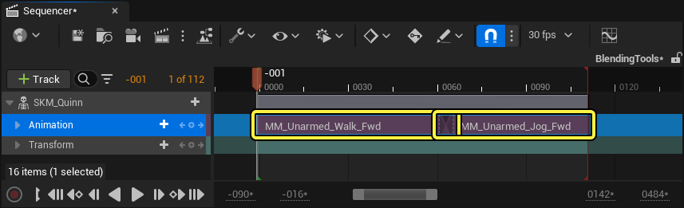
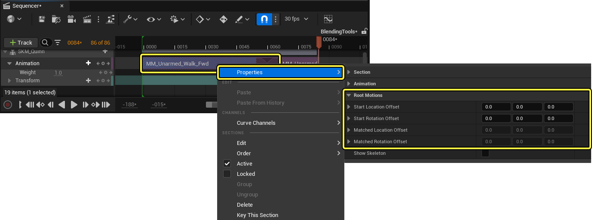
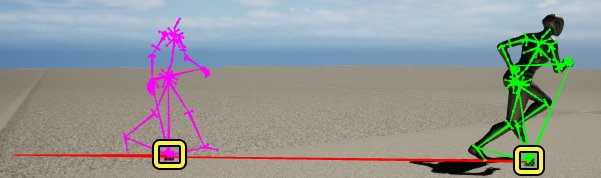
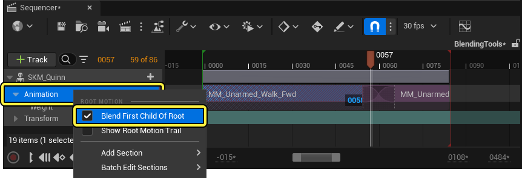

# 运动混合

> 路径：虚幻引擎5.7文档 / 为角色和对象制作动画 / 过场动画和Sequencer / Sequencer概述 / 轨道 / 动画轨道 / 运动混合

> 原始页面：https://dev.epicgames.com/documentation/unreal-engine/motion-blending-tools-in-unreal-engine

当你在 **Sequencer** [动画轨道](../../../../unreal-engine-sequencer-movie-tool-overview/sequencer-track-list/cinematic-animation-track/index.md)中对角色动画片段之间进行转换时，你可以使用 **运动混合（Motion Blending）** 工具来进一步提高混合质量。使用运动混合工具，你可以在动画片段之间动态地过其运动和世界位置。这在处理包含世界位移数据的动画时特别有用。

此处，一个角色从步行动画过渡到了跑步动画。在没有任何混合的情况下，过渡过程是一个僵硬的切换。使用简单的混合但不使用运动混合,动画仍然将角色的位置重置到动画的原点，但角色的网格体过渡十分平滑。通过用运动混合的方式来混合动画，世界的位置被保留了下来，动画的过渡也很流畅。

| 说明 | 示例 |
| --- | --- |
| **无混合（No Blending)** | no blending demo |
| **无匹配的运动混合（Motion Blending with No Matching）** | motion blending with no matching |
| **有匹配的运动混合（Motion Blending with Matching）** | (convert:false) |

片段匹配（Clip Matching）会引用角色骨架中的一个骨骼，并将该骨骼的位置和运动与相邻片段中包含位移数据的骨骼（如根部或骨盆骨骼）相匹配。通过将选定的骨骼与相邻片段的位移相匹配，它会自动计算并设置一个偏移量以过渡到下一个动画，同时保留角色的位置。随后，偏移数据将被存储在Sequencer资产的动画部分。

## 使用运动混合

本节包含关于如何使用Sequencer中的运动混合工具混合动画的信息。

#### 先决条件

- 你的项目至少包含两个动画序列，这些动画序列包含一个带有世界位移数据的骨骼，如根骨骼或非根骨骼。

### 运动混合设置

要在Sequencer中使用运动混合来混合动画，首先在Sequencer编辑器中把你的动画添加到一个动画轨道上，确保它们按顺序播放或重叠播放。

将你的播放头放到到第二个动画部分的开头，以设置计算动画偏移的时间。然后，右击第二个动画片段，找到 **在上个剪辑片段中匹配此骨骼**，在角色的骨架中选择一个与你要过渡的动画相关的骨骼，从而将第一个动画的最后位置与第二个动画混合。在这个工作流程的示例中，`l_foot` 骨骼被用于混合行走和运行动画。

> 动图已省略：set up motion bleeding demo

当你回放时，你的动画片断现在会将动画动作和世界位移位置融合在一起。

> 动图已省略：motion blending demo

## 运动混合属性

运动混合具有以下属性：

| 属性 | 说明 |
| --- | --- |
| **在上个剪辑片段中匹配此骨骼（Match With This Bone In Previous Clip）** | 选择一块骨骼，在播放头的时间位置上，将所选动画片段的动作和位置与 **上个** 片段相匹配。 使用这个属性得到的结果是，动画的运动从上一个片段的位置继续。 motion blending demo |
| **在下个剪辑片段中匹配此骨骼（Match With This Bone In Next Clip）** | 选择一块骨骼，在播放头的时间位置上，将所选动画片段的动作和位置与 **下个** 片段相匹配。 使用这个属性会使动画的运动以原点为中心播放。 match next clip demo |
| **匹配X和Y轴平移（Match X and Y Translation）** | 当启用时，所选骨骼将与 **X** 和 **Y** 轴的平移匹配。这对地面运动很有帮助，可以方便保留角色的运动方向。 motion blending x and y translation demo |
| **匹配Z轴高度（Match Z Height）** | 当启用时，所选骨骼将与动画的 **Z** 轴高度一致。这对影响角色在世界空间中的高度的动画很有帮助。 motion blending height translation demo |
| **匹配偏转旋转度（Match Yaw Rotation）** | 当启用时，所选骨骼将与 **偏转**（**Z**）旋转度相匹配。 motion blending yaw rotation demo |
| **匹配俯仰旋转度（Match Pitch Rotation）** | 当启用时，所选骨骼将与 **俯仰**（**Y**）旋转度相匹配。 motion blending pitch rotation demo |
| **匹配翻滚旋转度（Match Roll Rotation）** | 当启用时，所选骨骼将与 **翻滚**（**X**）旋转度相匹配。 motion blending roll rotation demo |
| **显示根运动足迹（Show Root Motion Trail）** | 要查看整个动画轨道的根运动轨迹的调试渲染，请右击动画轨道并启用 **显示根运动足迹** 属性。根运动足迹将被渲染成一条黑白相间的条纹线，追踪每个动画片段的根部骨骼平移。 show root motion trail property |

### 根运动偏移设置

你可以在你的关卡序列中的每个动画片段上手动分配根运动偏移，如平移和旋转，以改变混合的结果。添加根运动足迹只能影响片段，而不是动画本身，并且只能应用与片段的任何运动混合之外。位置和旋转偏移也以动画片段的开始时间为重点，可以完美添加到剪辑的片断中。

要为一个动画片断设置根运动偏移，在Sequencer编辑器中右键单击该片断，并选择 **属性（Properties）** >**根运动（Root Motions）**。

根运动偏移具有以下属性：

| 属性 | 说明 |
| --- | --- |
| **起始位置偏移（Start Location Offset）** | 设置 **X**、**Y** 和 **Z** 值，以设置在应用匹配偏移之前应用于根骨骼的位置（平移）偏移。 |
| **起始旋转偏移（Start Rotation Offset）** | 设置 **翻滚**（**X**）、**俯仰**（**Y**）和 **旋转**（**Z**）值，以设置在应用匹配偏移之前应用于根骨骼的旋转偏移。 |
| **匹配的位置偏移（Matched Location Offset）** | 参考 **X**、**Y** 和 **Z** 值，这些值设置了由匹配的偏移量作为基础值添加到根骨骼的位置（平移）偏移。 |
| **匹配的旋转偏移（Matched Rotation Offset）** | 参考 **翻滚**（**X**）、**俯仰**（**Y**）和 **旋转**（**Z**）的值，这些值设置了由匹配的偏移量作为基础值添加到根骨骼上的旋转偏移。 |

你也可以在视口中通过在角色的根骨骼位置选择角色的一个变换小工具（Transform Gizmo）来编辑开始位置偏移和开始旋转偏移属性。

选择小工具后，你可以使用变换工具编辑偏移的位置和旋转。

> 动图已省略：transform tool for root motion offsets in viewport

### 调试设置

使用这些调试工具观察并调试在Sequencer编辑器中创建电影片时的运动混合行为：

| 属性 | 说明 |
| --- | --- |
| **显示骨架（Show Skeleton）** | 要查看一个动画片断的骨架和根运动位移的调试图，请右击该动画片断并从上下文菜单中启用 **显示骨架** 属性。每个动画片段都会将角色的骨架渲染成不同的颜色，以区分动画。此外，每个动画的世界位移将被渲染成动画原点和包含世界位移数据的骨骼之间的一条红线。 show skeleton property |
| **颜色着色（Color Tint）** | 你可以通过在Sequencer编辑器中右击该片段，然后选择属性，使用颜色着色属性设置一个颜色值，来手动设置每个动画片段的颜色。 set section color property 颜色着色后的动画片断将在Sequencer编辑器中和视口中的骨架渲染上进行颜色编码。 section colors sync with skeleton drawing |

## 使用无根骨骼混合动作

如果你的动画不在 "根 "骨骼中存储角色位移，或者你的根骨骼是静止的的，例如使用运动捕捉数据创建的动画，你仍然可以使用根的首个子骨骼（通常标记为 "骨盆"），来混合动画的世界位移位置。在你的动画片断上启用运动混合后，右击动画轨道，启用 **混合根的首个子项（Blend First Child of Root）** 属性。

**混合根的首个子项** 属性不使用根骨骼，而使用角色骨架中的第一个动画子骨骼来混合动画的运动。

| 不应用混合根的首个子项 | 应用混合根的首个子项 |
| --- | --- |
| without first child of root property | with first child of root property |

> [!WARNING]
> 将有根运动的动画和无根运动的动画混合可能无法产生最佳效果。

## Control Rig集成

要进一步编辑Sequencer中动画之间的混合，例如对角色的四肢、脚部放置或位置进行微小的编辑和调整，你可以使用[Additive FK Control Rig](../../../../../control-rig/animating-with-control-rig/fk-control-rig/index.md#additivefk)来手动键入角色的动画，而不覆盖运动混合的效果。

关于在虚幻引擎中动画制作的更多信息，请参阅以下文档：

- [使用控制绑定实现动画效果](../../../../../control-rig/animating-with-control-rig/index.md)
