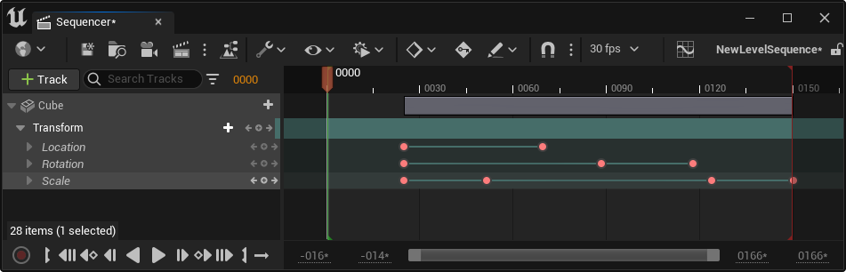
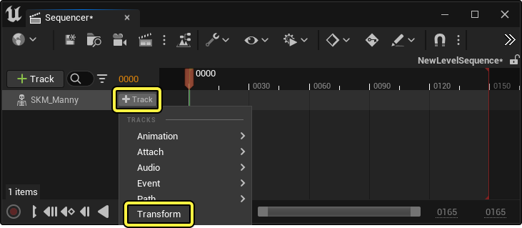
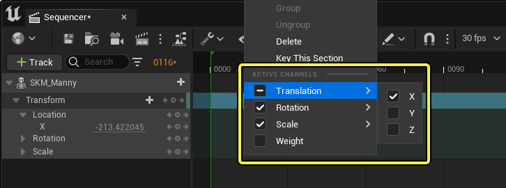
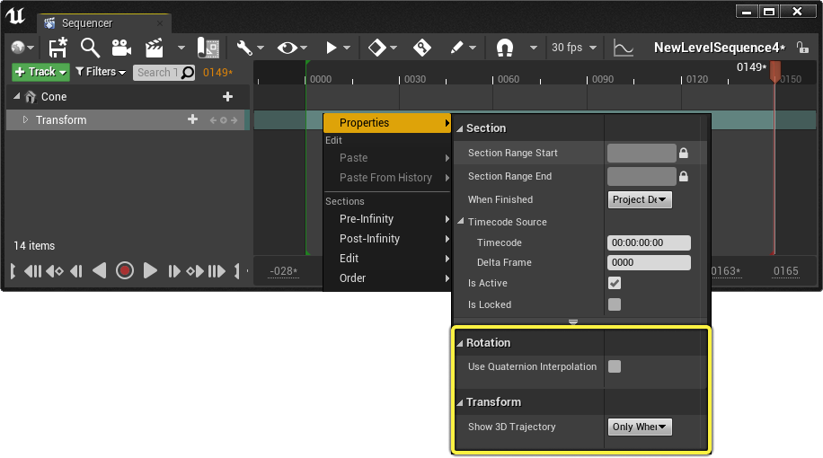
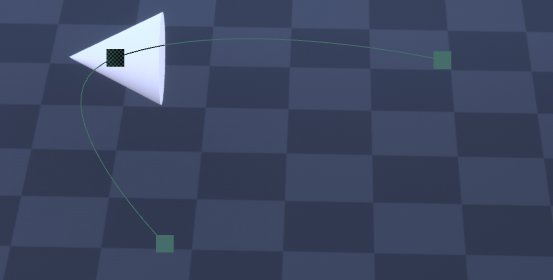
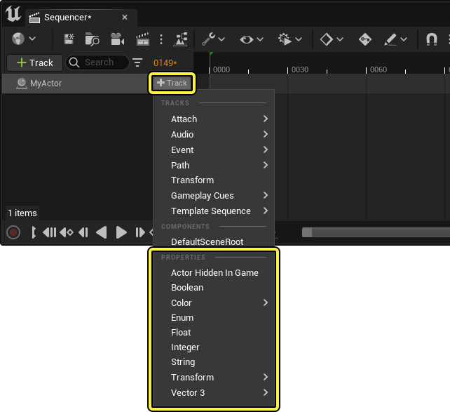
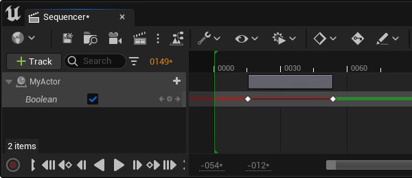
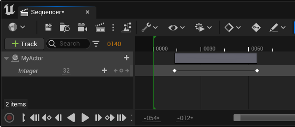

# 变换和属性轨道

> 路径：虚幻引擎5.7文档 / 为角色和对象制作动画 / 过场动画和Sequencer / Sequencer概述 / 轨道 / 变换和属性轨道

> 原始页面：https://dev.epicgames.com/documentation/unreal-engine/cinematic-transform-and-property-tracks-in-unreal-engine

Sequencer包含各种 **属性轨道**，可以用来为Actor的常见属性类型制作动画。你可以使用这些轨道为变换、颜色或布尔值等属性制作动画。本指南概述了Sequencer中存在的各种属性轨道类型。

#### 先决条件

- 你已了解

  Sequencer

  及其

  界面

  。

## 变换轨道

Sequencer中最常用的轨道之一是 **变换轨道**。你可以使用此轨道为场景中的对象、摄像机和角色的运动制作动画。

### 创建

默认情况下，每当[静态网格体](../../../../../working-with-content/static-meshes/index.md)、[骨骼网格体](../../../../../working-with-content/skeletal-mesh-assets/index.md)或[摄像机](../../../movie-and-cinematic-cameras/cinematic-cameras/index.md)添加到Sequencer时，它们下面就会自动添加一个变换轨道。

要手动添加变换轨道，请点击[Actor轨道](../../../unreal-engine-sequencer-movie-tool-overview/sequencer-track-list/cinematic-actor-tracks/index.md)**上的**添加轨道（+）**，然后选择**变换（Transform）**。

> [!NOTE]
> 要想自动添加某些轨道下的变换轨道，需要从 **项目设置（Project Settings）** 启用，并且可以在[轨道设置项目设置](../../../unreal-engine-sequencer-movie-tool-overview/cinematic-editor-and-project-settings/index.md#%E9%A1%B9%E7%9B%AE%E8%AE%BE%E7%BD%AE)下自定义为对其他Actor类型生效。

### 用途

变换轨道可以展开，用于查看单个通道或轴。选中这些通道或轴轨道后按 **Enter**，可以在这些特定轨道上放置关键帧。

> 动图已省略：展开变换轨道通道

如果不需要通道和轴，也可以禁用它们，将其从视图中删除。右键点击变换分段并启用或禁用 **活动通道（Active Channels）** 类别下的通道即可。移除任何通道或轴将导致这些轨道不被Sequencer求值并且不响应[自动键入](../../../unreal-engine-sequencer-movie-tool-overview/sequencer-editor/sequencer-cinematic-toolbar/index.md#autokey)。

### 属性

变换轨道分段包含了一些属性，可以用来加强你对变换的控制。右键点击变换轨道（Transform track）分段，选择属性（Properties）以查看。

**使用四元数插值（Use Quaternion Interpolation）** 选项可以启用变换关键帧之间的四元数线性插值。四元数插值有助于减少 **环架锁定** 和其他基于欧拉的旋转问题。

|  |  |
| --- | --- |
| 禁用"用四元数插值" | 启用"用四元数插值" |

**显示 3D 轨迹（Show 3D Trajectory）** 包含为变换轨道绘制轨迹路径的选项。

这些选项包括：

- 仅选择时（Only When Selected）

  ，表示仅在选择对象或轨道时绘制轨迹。
- 始终（Always）

  ，表示无论选择如何，将始终绘制轨迹。
- 从不（Never）

  ，表示从不绘制轨迹。

> [!NOTE]
> 无论选择何种轨迹设置，当启用 [**游戏视图**](https://dev.epicgames.com/documentation/unreal-engine/using-editor-viewports-in-unreal-engine#gameview) 时，轨迹将始终隐藏。

## 属性轨道

Sequencer支持各种属性的动画制作。点击Actor上的 **添加轨道（+）** 并从 **属性（Properties）** 类别中选择一个，可以将属性添加到Sequencer中的[Actor轨道](../../../unreal-engine-sequencer-movie-tool-overview/sequencer-track-list/cinematic-actor-tracks/index.md)。

### 布尔

布尔轨道用于为布尔属性制作动画。布尔轨道只能设置为启用或禁用，并且不插值。设置为禁用时，时间轴将显示为 **红色**，启用时为 **绿色**。

布尔值也在曲线编辑器中用 **0**（禁用）和 **1**（启用）表示。

### 整型

整型轨道用于为整型属性制作动画并且不插值。

### 浮点

浮点轨道用于为标量浮点属性制作动画。浮点关键帧可以插值并可以使用自定义切线和曲线。

> 图片已省略：Sequencer浮点轨道

为了显示浮点值的变化，你可以在一个浮点值轨道内显示浮点曲线。

> 图片已省略：float track curve display

要启用浮点轨道曲线，请在浮点轨道部分上单击鼠标右键，选择 **显示 > 显示曲线（Display > Show Curve）**。

> 图片已省略：float track curve display

### 向量

Sequencer支持使用各自的轨道为向量2、3、4属性制作动画。所有向量轨道都可以插值，并且可以有自定义切线和曲线。

> 图片已省略：Sequencer向量轨道

### 颜色

颜色轨道用于为Sequencer中的特定颜色属性制作动画，例如光源或材质。颜色轨道支持插值，并且还会沿时间轴显示每个关键帧处设置的颜色，因此你可以一目了然地预览颜色。

> 图片已省略：Sequencer颜色轨道

为方便选择颜色，你可以双击颜色轨道关键帧，以便显示 **颜色拾取器**。选择颜色后，点击 **确定（OK）** 按钮，关键帧现在将设置为该颜色。

> 动图已省略：Sequencer取色器

> [!NOTE]
> 颜色轨道支持 **颜色（Color）** 和 **线性颜色（Linear Color）** 空间的动画制作。

### 字符串

字符串轨道用于为不同的字符串值制作动画。字符串值不会在关键帧之间插值。

> 图片已省略：Sequencer字符串轨道

### 枚举

枚举轨道用于为不同的枚举值制作动画。枚举值不会在关键帧之间插值。

> 图片已省略：Sequencer枚举轨道

### 对象

对象轨道用于为不同的对象和资产值制作动画。对象值不会在关键帧之间插值。

> 图片已省略：Sequencer对象轨道

### UMG属性

Sequencer支持[创建用户界面](../../../../../user-interfaces/index.md)中UI元素属性的动画制作。用于UMG的两个主要轨道是 **边界（Margin）** 和 **控件变换轨道（Widget Transform Tracks）**。

> 图片已省略：Sequencer umg ui属性轨道

## 重载轨道

有些属性可以被重载，从而输出与普通关键帧或曲线不同的动画数据。例如，你可以重载变换轴上的浮点通道或单独的X/Y/Z通道，输出随机的Perlin早点。这对于创建基于噪点的程序性动画非常有用，无需手动制作噪点动画。

> 动图已省略：sequencer animate noise

> [!NOTE]
> 目前只有浮点/双浮点和变换轨道支持重载通道。

要重载通道，你可以找到[浮点轨道](#%E6%B5%AE%E7%82%B9) 或[变换轨道](#%E5%8F%98%E6%8D%A2%E8%BD%A8%E9%81%93)的单个轴通道，右键点进轨道并选择 **使用双Perlin噪点重载（Override with Double Perlin Noise）**。

> 图片已省略：override with double perlin noise

如需修改噪点参数，你可以右键点击轨道，找到 **双Perlin噪点参数（Double Perlin Noise Parameters）**，其中的 **频率（Frequency）** 和 **振幅（Amplitude）** 都可以编辑。

> 图片已省略：double perlin noise parameters

> [!NOTE]
> 噪点通道的动画与值 **0** 相关。如果你希望噪点在特定的值范围内运动，例如 **100 - 200**，可以创建额外的叠加[分段](../../../unreal-engine-sequencer-movie-tool-overview/creating-animation-keyframes/index.md#sections)，再将这些通道转换为噪点。这样，你就能获得一个使用特定值的基础分段，再将噪点叠加到该基础上。
>
> > 图片已省略：layer additive noise

如果你的分段中有重载过的通道，可以右键点击该分段并在 **Perlin噪点通道（Perlin Noise Channels）** 菜单下同时编辑所有噪点参数。

> 图片已省略：change multiple noise properties
