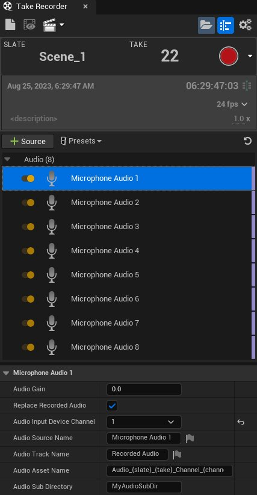

# Take Recorder中的多轨道音频捕捉

> 路径：虚幻引擎5.7文档 / 为角色和对象制作动画 / 过场动画和Sequencer / Sequencer概述 / Take Recorder / Take Recorder中的多轨道音频捕捉

> 原始页面：https://dev.epicgames.com/documentation/unreal-engine/multi-track-audio-capture-for-take-recorder-in-unreal-engine

Take Recorder的多轨道音频捕捉功能 **Take Recorder** 为音频录制提供了多种选项。你可以在Take Recorder中创建多个（最多8个）**麦克风音频** 源，以录制来自多通道音频设备的音频。

每个 **麦克风音频** 源都有一个相关的 **音频输入设备通道**，指定所选音频设备上的输入通道。通过 **Windows音频会话API**，最多可支持8个通道。注意，音频设备必须有 **Windows WDM多通道支持**，才能应用8个通道。有一些第三方音频设备制造商提供Windows WDM多通道支持。

请参阅[麦克风音频录制器](../../../unreal-engine-sequencer-movie-tool-overview/take-recorder/index.md#microphoneaudiorecorder)和[音频输入设备](../../../unreal-engine-sequencer-movie-tool-overview/take-recorder/index.md#audioinputdevice)章节了解有关这些音频设置的更多信息。
