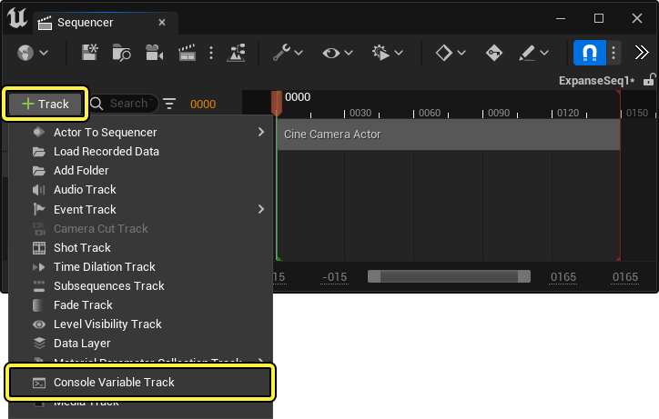
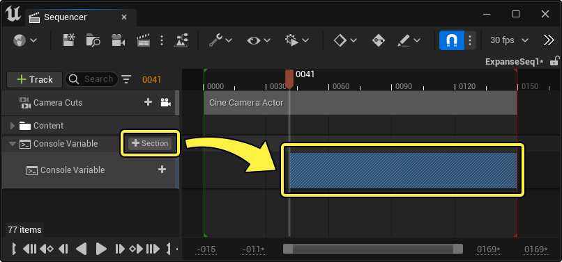
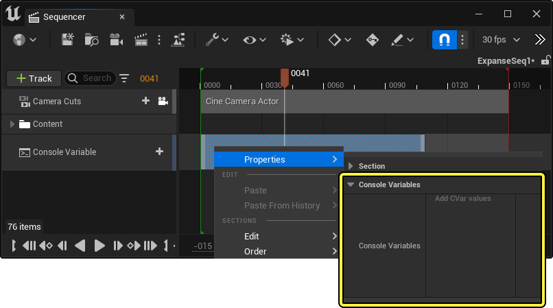
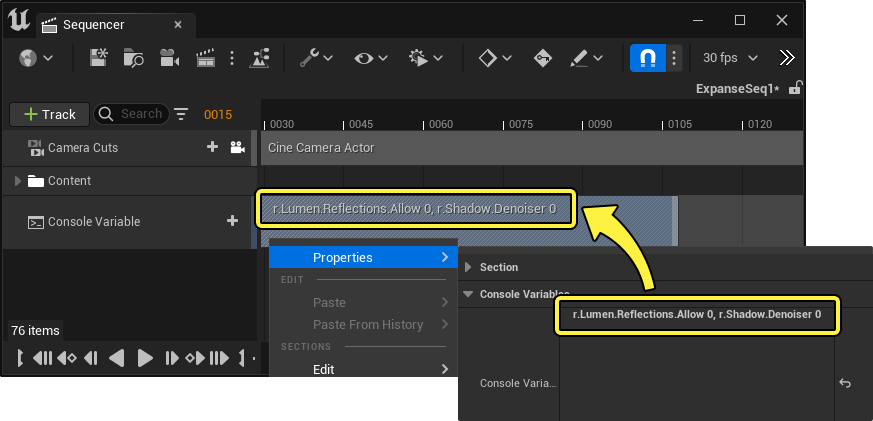

# 控制台变量轨道

> 路径：虚幻引擎5.7文档 / 为角色和对象制作动画 / 过场动画和Sequencer / Sequencer概述 / 轨道 / 控制台变量轨道

> 原始页面：https://dev.epicgames.com/documentation/unreal-engine/cinematic-console-variable-track-in-unreal-engine

在一些过场动画序列中，你可能需要通过控制台变量来调节渲染设置（或者其它设置）。你可以使用 **控制台变量轨道（Console Variable Track）** 来实现该目的。以轨道的形式编辑控制台变量对于实时的项目或者需要在序列中途进行修改的项目非常有用. 如果你要渲染序列，那么你可能应该使用[影片渲染队列](https://dev.epicgames.com/documentation/404)的全局或者每个镜头的[控制台变量渲染设置](../../../movie-render-pipeline/cinematic-render-settings-and-formats/cinematic-rendering-image-bb951eea/index.md#%E6%8E%A7%E5%88%B6%E5%8F%B0%E5%8F%98%E9%87%8F).

#### 先决条件

- 你对于

  Sequencer

  及其

  界面

  有一定了解。

## 创建

要向序列中添加控制台变量轨道，点击 **轨道 (+)** 下拉菜单并选择 **控制台变量轨道（Console Variable Track）**。

控制台变量轨道将控制台变量使用[分段](../../../unreal-engine-sequencer-movie-tool-overview/creating-animation-keyframes/index.md#sections)应用到一个时间范围上。要创建控制台变量分段，点击轨道上的 **分段（Section） (+)**。与大部分分段类似，控制台变量分段可以在时间轴区域内裁剪、编辑以及移动。

## 使用

要让控制台变量在分段中生效，右键点击分段然后找到 **属性（Properties） > 控制台变量（Console Variables）** 属性。

向控制台变量属性添加控制台变量时可以直接在其旁边的区域输入。要在一个区域中添加多个变量的话，将输入框中的变量用 **逗号 (,)** 隔开。

向分段中添加完变量后，可以拉动进度条或者直接播放来预览效果。就像其它默认分段一样，原来的控制台变量值会在分段结束的时候恢复。

> 动图已省略：控制台变量结果
