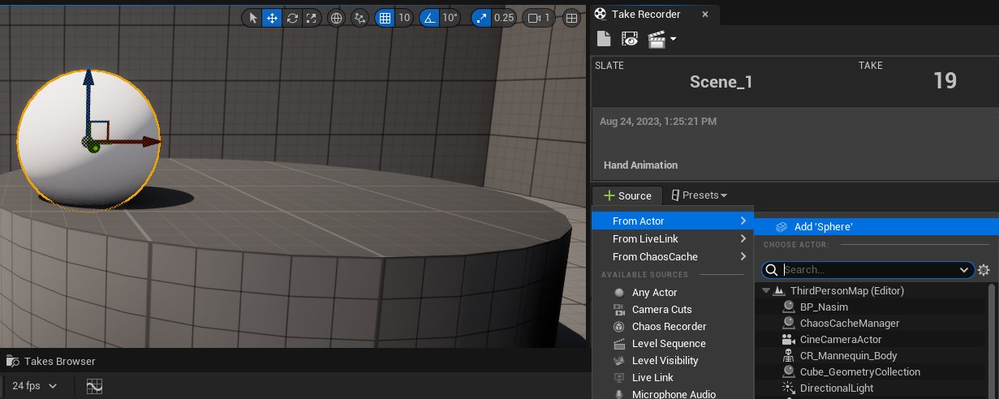

# 使用Take Recorder录制动画

> 路径：虚幻引擎5.7文档 / 为角色和对象制作动画 / 过场动画和Sequencer / Sequencer概述 / Take Recorder / 使用Take Recorder录制动画

> 原始页面：https://dev.epicgames.com/documentation/unreal-engine/recording-animation-using-take-recorder-in-unreal-engine

**[Take Recorder](../../../unreal-engine-sequencer-movie-tool-overview/take-recorder/index.md)** 可以利用编辑器和Gameplay上下文中的各种源进行录制。下面的教程演示了如何在Take Recorder中录制你的操作。

## 录制视口中的Actor操控

你可以使用 **Take Recorder** 录制 **[视口（Viewport）](https://dev.epicgames.com/documentation/unreal-engine/using-editor-viewports-in-unreal-engine)** 中的Actor操控。

1. 将你想录制的对象添加到 **[源（Sources）](../../../unreal-engine-sequencer-movie-tool-overview/take-recorder/index.md#%E6%BA%90)** 列表。 1.在 **视口（Viewport）** 中选择Actor。 1.点击 **添加源（Add Source (+)）> 从Actor（From Actor）> 添加"球体"（Add 'Sphere'）** 。

   

   获得Actor的源之后，你就可以开始录制动画了。
2. 点击 **[录制（Record）](../../../unreal-engine-sequencer-movie-tool-overview/take-recorder/index.md#slate)** 。将显示倒计时和通知。倒计时到达0时，序列会开始录制。在视口中选择你的Actor，并将其四处移动，捕获其编辑器动作。完成后，点击 **停止（Stop）** 按钮或按 **Esc** 键。

   > 动图已省略：手绘动画球体的录制
3. 点击

   审核上次录制（Review Last Recording）

   ，查看录制文件。
4. 在[Sequencer](../../../unreal-engine-sequencer-movie-tool-overview/index.md)中点击 **播放（Play）** ，观察你录制的Actor数据。

   > 动图已省略：序列播放

> [!NOTE]
> 你可能会看到一个复制的Actor在执行操作，而不是编辑器对象在执行操作。这是因为，Actor的录制类型已设置成录制为 **[可生成对象Actor（Spawnable Actor）](https://dev.epicgames.com/documentation/404)** 。你可以在Take Recorder细节中更改 **[录制到可持有对象（Record to Possessable）](../../../unreal-engine-sequencer-movie-tool-overview/take-recorder/index.md#%E7%94%A8%E6%88%B7%E9%A1%B9%E7%9B%AE%E8%AE%BE%E7%BD%AE)** 属性，以在源对象上或在项目全局更改此项。如果录制到可持有对象Actor，则只会看到原始Actor动画。

## 物理

你可以使用 **镜头试拍（Take Record）** 将物理模拟作为动画数据捕获。

1. 将球体添加到场景。
2. 要打破球体，你需要使球体离开地面，使其获得动量。将球体上移，离开地面。
3. 在细节面板中，启用

   模拟物理

   。
4. 现在，要确定将物理录制到序列的时机，这有点难度。你需要在点击播放的同时开始

   Take Recorder

   ，以捕获你打算捕获的动作。为了实现这一点，你需要删除Take Recorder的倒计时定时器。在Take Recorder面板中打开

   显示/隐藏

   用户/项目设置

   （齿轮图标）。
5. 在

   用户设置（User Settings）

   下，将

   倒计时（Countdown）

   设置为

   0.0秒（0.0s）

   。
6. 将鼠标悬停在

   Take Recorder

   中的

   录制（Record）

   上。
7. 使用热键

   Alt-P

   开始播放，并立即在

   Take Recorder

   中点击

   录制（Record）

   。
8. 让模拟一直播放，在你对录制文件感到满意时停止录制文件（点击 **停止录制（Stop Recording）** 或按 **ESC** ）。

   > 动图已省略：录制物理模拟

现在你录制了物理模拟，可以进行查看。

1. 要打开镜头试拍，请点击

   审核上次录制（Review Last Recording）

   。
2. 在

   Sequencer

   中，点击

   播放（Play）

   并从任意角度观察你的录制。

## Gameplay

你可以使用 **Take Recorder** 录制Gameplay操作，例如关卡中玩家的移动和动画。

1. 从

   Take Recorder

   ，选择

   添加源（Add Source (+)）> 玩家（Player）

   ，将

   玩家Actor（Player Actor）

   添加到

   源（Sources）

   列表
2. 点击虚幻引擎工具栏中的

   播放（Play）

   ，开始一个

   在编辑器中播放

   （PIE）会话。
3. 会话开始后，点击 **录制（Record）** 。倒计时到达0时，序列会开始录制。在关卡中四处移动角色，捕获其动画。完成后，点击 **停止（Stop）** 或按 **Esc** 。

   > 动图已省略：录制Gameplay
4. 点击

   审核上次录制（Review Last Recording）

   ，查看录制文件。
5. 点击Sequencer中的 **播放（Play）** ，预览所录玩家的动画。

   > 动图已省略：播放Gameplay录制文件
