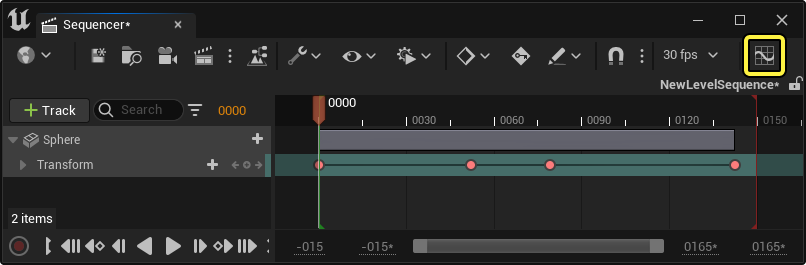
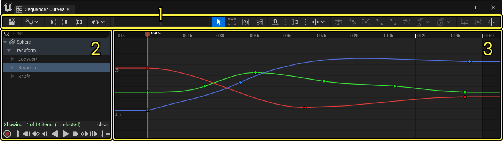
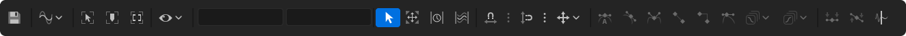
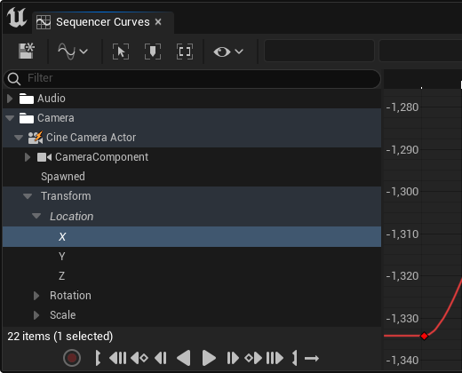
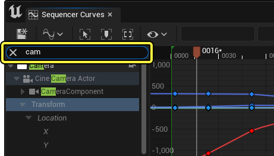
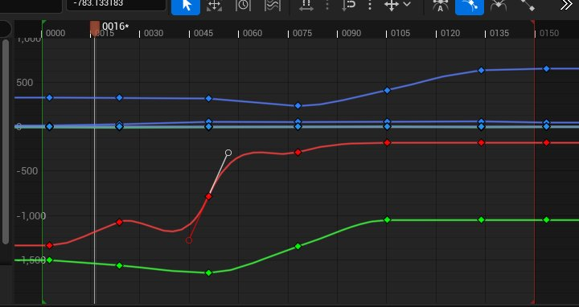
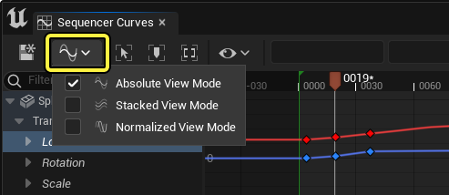
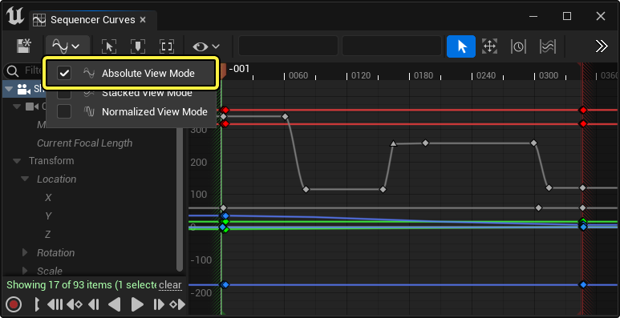

# 曲线编辑器

> 路径：虚幻引擎5.7文档 / 为角色和对象制作动画 / 过场动画和Sequencer / Sequencer概述 / 曲线编辑器

> 原始页面：https://dev.epicgames.com/documentation/unreal-engine/animation-curve-editor-in-unreal-engine

若想更多地控制对象的动画制作方式，你可以使用曲线编辑器修改和微调关键帧。你可以使用曲线编辑器的图表创建新的关键帧、编辑切线，并使用各种内置工具调整动画曲线。

曲线编辑器用于整个虚幻编辑器中的其他工具，例如[Niagara](../../../../visual-effects/index.md)、曲线资产和[动画曲线](../../../skeletal-mesh-animation-system/animation-assets-and-features/animation-sequences/animation-curves/index.md)。本指南将概述如何在Sequencer中使用曲线编辑器，但是，许多显示的功能和函数仍与编辑器的其他区域兼容。

#### 先决条件

- 你了解

  Sequencer

  及其

  接口

  。
- 你了解

  Sequencer中的关键帧设置

  。

## 曲线编辑器概述

曲线编辑器可以从Sequencer打开，方法是点击[Sequencer工具栏](../sequencer-editor/sequencer-cinematic-toolbar/index.md)中的 **曲线编辑器（Curve Editor）** 按钮。

打开曲线编辑器之后，你将看到以下视图：

1. 工具栏
2. 大纲视图
3. 图表

### 工具栏

曲线编辑器工具栏包含各种命令、工具和选项。这些都在下表中列出。

| 名称 | 图标 | 说明 |
| --- | --- | --- |
| **保存（Save）** | 保存 | 保存当前序列以及全部子场景或镜头。 |
| **视图模式（View Modes）** | 视图模式 | 打开曲线编辑器[视图模式](#%E8%A7%86%E5%9B%BE%E6%A8%A1%E5%BC%8F)的下拉菜单。 |
| **缩放以适配（Zoom to Fit）** | 缩放以适配 | 对所选关键帧取景并放大。如果没有选择关键帧，则将对图表视图中的所有可查看关键帧取景。你还可以将 **F** 热键用于此命令。 |
| **聚焦播放头（Focus Playhead）** | 聚焦播放头 | 聚焦[播放头](https://dev.epicgames.com/documentation/404)上的图表视图，而不更改缩放级别。你还可以将 **A** 热键用于此命令。 |
| **缩放到播放范围（Zoom to Playback Range）** | 缩放到播放范围 | 聚焦图表视图，使所有关键帧可见，包括序列的开始帧和结束帧。 |
| **曲线选项（Curve Options）** | 曲线选项 | 打开菜单，其中你可以设置以下命令： **切线可视性（Tangent Visibility）** ，它控制[切线](#%E7%BC%96%E8%BE%91%E5%88%87%E7%BA%BF)如何在图表中绘制。你可以从以下选项中选择： **所有切线（All Tangents）** ，它导致所有关键帧显示其切线，无论它们是否被选中。 **所选关键帧（Selected Keys）** ，它仅显示所选关键帧上的切线。 **无切线（No Tangents）** ，它禁止所有切线绘制。 **对曲线自动取景（Auto Frame Curves）** ，它导致在从[大纲视图](#%E5%A4%A7%E7%BA%B2%E8%A7%86%E5%9B%BE)选择曲线时对该曲线上的所有可见关键帧自动取景和缩放。 **将时间对齐到选择内容（Snap Time to Selection）** ，这会将播放头移至所选关键帧的时间。如果选择了多个关键帧，播放头会移至最左侧的关键帧。 **缓冲曲线（Buffered Curves）** ，它允许或禁止在图表中绘制[缓冲曲线](#%E7%BC%93%E5%86%B2%E6%9B%B2%E7%BA%BF)。 **曲线提示文本（Curve Tooltips）** ，当光标悬停在图表中的曲线上时，将显示曲线的名称、时间和值的提示文本。 曲线提示文本 |
| **时间和值字段（Time and Value Fields）** | 时间和值 | 这些属性字段显示所选关键帧的 **时间（Time）** 和 **值（Value）** 。你可以直接输入新值来编辑这些属性。 |
| **选择模式（Selection Mode）** | 选择 | 启用法线关键帧和切线选择及编辑。你还可以将 **Q** 热键用于此命令。 |
| **变换模式（Transform Mode）** | 变换 | 启用[变换工具](#%E5%8F%98%E6%8D%A2%E5%B7%A5%E5%85%B7)来编辑关键帧。你还可以将 **Ctrl + T** 热键用于此命令。 |
| **重新定时模式（Retime Mode）** | 重新定时 | 启用[重新定时工具](#%E9%87%8D%E6%96%B0%E5%AE%9A%E6%97%B6%E5%B7%A5%E5%85%B7)，它激活格栅操控模式来调整关键帧时间。你还可以使用 **Ctrl + E** 热键启用此命令。 |
| **多选模式（Multi Select Mode）** | 多选 | 启用[多选工具](#%E5%A4%9A%E9%80%89%E5%B7%A5%E5%85%B7)，它基于可调整的枢轴点为所选关键帧组激活缩放模式。你还可以使用 **Ctrl + M** 热键启用此命令。 |
| **时间对齐（Time Snapping）** | 时间对齐 | 在图表中的水平（时间）增量上启用关键帧[对齐](../sequencer-editor/sequencer-cinematic-toolbar/index.md#%E5%AF%B9%E9%BD%90)。 如果你使用的是Sequencer中的曲线编辑器，对齐增量将基于Sequencer的[每秒帧数](../sequencer-editor/sequencer-cinematic-toolbar/index.md#%E6%AF%8F%E7%A7%92%E5%B8%A7%E6%95%B0)。否则，你可以点击附近的下拉菜单，选择基于时间的自定义对齐增量。 曲线编辑器时间对齐 |
| **值对齐（Value Snapping）** | 值对齐 | 在图表中的垂直（值）增量上启用关键帧[对齐](../sequencer-editor/sequencer-cinematic-toolbar/index.md#%E5%AF%B9%E9%BD%90)。你可以选择附近的下拉菜单，选择基于值的自定义对齐增量，以及调整图表线的显示。 曲线编辑器值对齐 |
| **锁定轴（Lock Axis）** | 锁定轴 | 打开下拉菜单以选择要将关键帧移动锁定到的轴。 **两者（Both）** 是默认值，允许关键帧向图表中所有方向移动。 **仅X（X Only）** 将关键帧移动仅限于沿水平（时间）轴的移动。 **仅Y（Y Only）** 将关键帧移动仅限于沿垂直（值）轴的移动。 |
| **立方体（自动）切线（Cubic (Auto) Tangent）** | 自动切线 | 将所选关键帧设置为自动插值，从而导致曲线的切线根据图表中相邻关键帧的位置进行调整。 曲线编辑器立方体自动切线 |
| **立方体（用户）切线（Cubic (User) Tangent）** | 自定义切线 | 将所选关键帧设置为使用用户定义的切线角度。每当你调整切线角度时，关键帧都将自动切换为此模式。 曲线编辑器立方体用户切线 |
| **立方体（中断）切线（Cubic (Break) Tangent）** | 中断的切线 | 将所选关键帧切线设置为使用中断的切线角度，允许关键帧有不同的传入和传出切线角度。 曲线编辑器中断的切线 |
| **线性切线（Linear Tangent）** | 线性切线 | 将所选关键帧设置为使用线性切线角度。这导致传入和传出切线总是面向其各自的相邻切线，在到达每个关键帧时产生剧烈变化。 曲线编辑线性切线 |
| **常量切线（Constant Tangent）** | 阶梯式切线 | 将所选关键帧设置为使用阶梯式切线角度，导致关键帧在到达下一个关键帧之前维持其值。 曲线编辑器常量切线 |
| **加权切线（Weighted Tangents）** | 加权切线 | 将所选关键帧设置为使用加权切线角度，导致切线使用用户定义的长度，从而确定该切线角度对其相邻关键帧切线施加的影响。 曲线编辑器加权切线 |
| **前无限设置（Pre Infinity Settings）** | 前无限 | 打开下拉菜单以选择所选关键帧或曲线的[前无限](#%E5%89%8D%E6%97%A0%E9%99%90%E5%92%8C%E5%90%8E%E6%97%A0%E9%99%90)行为。 |
| **后无限设置（Post Infinity Settings）** | 后无限 | 打开下拉菜单以选择所选关键帧或曲线的[后无限](#%E5%89%8D%E6%97%A0%E9%99%90%E5%92%8C%E5%90%8E%E6%97%A0%E9%99%90)行为。 |
| **展平切线（Flatten Tangent）** | 展平切线 | 水平展平所选关键帧的切线。 曲线编辑器展平切线 |
| **拉直切线（Straighten Tangent）** | 拉直切线 | 在关键帧上使用 **中断的切线（Broken Tangents）** 时，选择此项将拉直切线角度，但不会使其变为连续。角度将沿两条中断的切线之间的平均角度拉直。 |
| **滤波器工具（Filter Tool）** | 滤波器 | 将打开[滤波器工具](#%E6%BB%A4%E6%B3%A2%E5%99%A8%E5%B7%A5%E5%85%B7)窗口，其中你可以 **烘焙** 、 **简化** 和执行其他曲线功能。 |

### 大纲视图

曲线编辑器大纲视图包含添加到序列的所有可制作动画的轨道的标题信息，以及轨道滤波器和播放功能按钮。

选择列表中的条目会对[图表视图](#%E5%9B%BE%E8%A1%A8)自动滤波并取景，以仅显示该选择内容及所有子项中的曲线。你可以禁用 **曲线选项（Curve Options）** 工具栏菜单中的 **自动对曲线取景（Auto Frame Curves）** ，从而禁用自动取景行为。

> 动图已省略：大纲视图滤波器选择

你还可以使用搜索栏搜索条目，缩小列表范围。返回的所有结果都还将包含子轨道。

大纲视图中显示的内容由你从Sequencer选择的轨道确定。在Sequencer窗口中选择轨道将导致仅所选轨道显示在曲线编辑器大纲视图中。取消选择Sequencer中的所有轨道将导致所有内容显示在曲线编辑器中。

> 动图已省略：大纲视图sequencer选择滤波器

> [!NOTE]
> 你可以禁用此选择内容匹配和滤波行为，方法是在[Sequencer编辑器偏好设置](../cinematic-editor-and-project-settings/index.md)窗口中禁用 **同步曲线编辑器选择内容（Synchronize Curve Editor Selection）** 和 **将曲线编辑器隔离到选择内容（Isolate Curve Editor to Selection）** 。

### 图表

曲线编辑器图表包含关键帧的二维显示，以及生成的插值曲线。该图表分别在 **水平** 和 **垂直** 轴上绘制 **时间（Time）** 和 **值（Value）** ，并且关键帧根据这些属性放置在图表中。

## 图表导览

有多种方法可在图表中导览，你还可以使用不同的[视图模式](#%E8%A7%86%E5%9B%BE%E6%A8%A1%E5%BC%8F)来表示曲线数据。

### 平移

使用 **RMB** 自由平移图表视图。

> 动图已省略：图表平移

按住 **Shift + RMB** 将沿水平或垂直轴平移，具体取决于你的光标的初始方向。

> 动图已省略：图表平移单轴

按住 **Alt + MMB** 将仅沿水平轴平移。

> 动图已省略：图表平移水平

### 缩放

滚动鼠标滚轮将相对于[播放头](https://dev.epicgames.com/documentation/404)缩放图表。

> 动图已省略：图表缩放滚动

按住 **Alt + RMB** 将根据你的光标移动平滑地缩放图表。缩放枢轴点相对于按下 **RMB** 时的光标位置。

> 动图已省略：图表缩放光标平滑

按住 **Alt + Shift + RMB** 将根据你的光标移动自由地缩放图表，这将单独启用缩放时间轴和值轴。上移和下移光标将缩放值轴，左移和右移将缩放时间轴。

> 动图已省略：图表自由缩放

### 视图模式

**查看模式（View Modes）** 菜单包含不同的选项，可用于直观地查看曲线。

**绝对视图模式（Absolute View Mode）** 是默认视图模式，其中所有曲线和关键帧按其确切值显示在图表中。此模式的运作方式类似于大部分动画曲线编辑器。

**堆叠视图模式（Stacked View Mode）** 将每个曲线分隔为自成一组，并将其堆叠在图表中。每个组的值范围规格化为 **-1** 到 **1** 之间。

> 动图已省略：堆叠视图模式

**规格化查看模式（Normalized View Mode）** 将所有曲线和关键帧值显示为沿 **-1** 到 **1** 的规格化值范围重叠。如果你想统一成比例缩放曲线数量，此视图很有用。

> 图片已省略：规格化视图模式

## 曲线编辑

曲线编辑器主要用于编辑 **关键帧** 和 **切线** 。你可以添加、删除或更改关键帧位置，这会影响曲线。你还可以编辑关键帧的切线，并控制关键帧的传入和传出向量，这也会影响曲线。还有各种各样的功能和行为可帮助你进行编辑。

### 编辑关键帧

若要移动关键帧，可以使用 **LMB** 并在图表内拖动。根据你的 **对齐（Snap）** 设置，应该可以沿时间轴和值轴将关键帧移动到任意位置。你还可以使用 **MMB** 相对于光标位置移动所选关键帧。这样就可以更轻松地操控关键帧，无需精确地选择。

> 动图已省略：曲线编辑器移动关键帧

按住 **Shift** 键的同时拖动关键帧将导致它在移动时锁定到水平轴或垂直轴，具体取决于你的光标的初始方向。

> 动图已省略：移动关键帧轴

点击曲线片段将为该曲线选择所有关键帧。选择之后，你可以移动整个曲线，方法是拖动关键帧，或者使用 **MMB** 相对于光标移动曲线。

> 动图已省略：曲线编辑器移动整个曲线

### 创建新关键帧

当光标悬停在曲线片段上时，点击 **MMB** ，可以沿曲线添加关键帧。

> 动图已省略：将关键帧添加到曲线

你还可以按住 **Ctrl** 并在任意曲线片段上点击 **MMB** ，创建关键帧而不干扰曲线结构。

> 动图已省略：将关键帧添加到曲线而不造成干扰

### 复制和粘贴

你可以在相同曲线上以及不同曲线之间 **剪切** （Ctrl + X）、 **复制** （Ctrl + C）和 **粘贴** （Ctrl + V）关键帧。此外还有一些特定规则和上下文可确定粘贴行为。

复制和粘贴关键帧时，它们会在原始值处以及相对于[播放头](https://dev.epicgames.com/documentation/404)粘贴。粘贴多个关键帧会导致起始（最左侧）关键帧放置在 **播放头** 处，而其他所有关键帧相对于该点放置。

> 动图已省略：复制粘贴曲线关键帧

根据你在[大纲视图](#%E5%A4%A7%E7%BA%B2%E8%A7%86%E5%9B%BE)中选择并滤波的曲线，粘贴操作将在当前视图中的所有曲线上发生。

> 动图已省略：复制粘贴所有曲线

如果当前视图中有多个曲线，而你只想在其中一个曲线上粘贴，你可以点击曲线片段，这将选择该曲线的所有关键帧，然后按 **Ctrl + V** 。

> 动图已省略：复制粘贴单个曲线

### 编辑切线

选择关键帧时，它们会显示其 **切线** 信息。切线是用于控制曲线在进入关键帧时的传入和传出方向的线条。你可以选择切线控点的任一端，可以编辑以控制从该关键帧开始的曲线轨迹。

> 图片已省略：切线

> [!NOTE]
> 根据 **曲线选项（Curve Options）** 菜单中的 **切线可视性（Tangent Visibility）** 设置，你的切线可能显示得不同。确保将其设置为 **所选关键帧（Selected Keys）** ，表示默认行为。
>
> > 图片已省略：切线可视性

要编辑切线，请首先选择关键帧，然后选择切线控点并在图表内拖动。你还可以像移动关键帧那样使用 **MMB** 相对于光标位置移动切线。

> 动图已省略：编辑切线曲线编辑器

多个切线可以同时调整，方法是将其多选，然后使用 **MMB** 进行编辑。

> 动图已省略：编辑多个切线

如果选择了多个关键帧，点击单个切线将选择同侧的所有切线控点。

> 动图已省略：选择所有切线控点

按住 **Shift** 键的同时移动切线会将其对齐到最接近的45度增量。

> 动图已省略：对齐切线角度

各种切线模式位于 **工具栏** 中，可用于更改所选关键帧的切线角度。请参阅本文档中的[工具栏](#%E5%B7%A5%E5%85%B7%E6%A0%8F)小节，查看其行为。

> 图片已省略：切线模式

### 加权切线

选择关键帧之后，点击 **加权切线（Weighted Tangents）** 工具栏按钮将启用加权切线角度。这将导致切线使用用户定义的长度，从而确定该切线角度对其相邻关键帧切线施加的影响。

启用 **加权切线（Weighted Tangents）** 后，拉伸切线可提高对曲线的影响，收缩切线可降低影响。

> 动图已省略：加权切线

### 缓冲曲线

曲线可以临时保存和存储（称为缓冲），这在对曲线进行试验性更改时很有用，因为这些曲线可以恢复为存储的状态。缓冲曲线之后，它将在图表上显示后像，供你参考。

要存储曲线，请右键点击曲线片段的一部分，然后选择 **缓冲曲线（Store Curves）** 。

> 图片已省略：存储曲线

存储曲线后，你可以对曲线进行所需的编辑。你可以添加、编辑或删除关键帧和切线。要将曲线恢复为原始存储的版本，请右键点击曲线片段，然后选择 **应用1个缓冲的曲线（Apply 1 Stored Curves）** 。缓冲的曲线数据将锁定到所存储到的曲线，所以不能缓冲一个曲线，然后将这些缓冲的数据应用到不同的曲线。

> 动图已省略：应用存储的曲线

你还可以 **交换（Swap）** 曲线，这将恢复曲线，但也会存储你刚才做出的更改。要执行此操作，请右键点击曲线，并选择 **将缓冲的曲线交换到所选曲线上（Swap Buffered Curves onto Selected Curves）** 。

> 动图已省略：交换缓冲的曲线

> [!NOTE]
> 每当你关闭Sequencer窗口时，存储的曲线将丢失。

### 前无限和后无限

曲线还包含一些规则，规定了它们在其关键帧片段之前和之后的时间段应如何表现。这称为 **前无限（Pre Infinity）** 和 **后无限（Post Infinity）** ，有助于在曲线上延长动画，而无需创建额外的关键帧。**前无限（Pre-Infinity）** 会影响第一个关键帧之前的曲线区域，而 **后无限（Post-Infinity）** 会影响最后一个关键帧之后的曲线区域。

> 图片已省略：前后无限

要访问曲线的前后无限设置，你可以点击[**工具栏（Toolbar）**](#%E5%B7%A5%E5%85%B7%E6%A0%8F)中的 **前无限（Pre Infinity）** 或 **后无限（Post Infinity）** 按钮，或右键点击曲线片段，并选择 **前无限（Pre-Infinity）** 和 **后无限（Post-Infinity）** 。两种方法都要求你从要调整的曲线选择关键帧。

> 图片已省略：前后无限菜单

你可以从以下无限类型中选择：

| 名称 | 说明 |
| --- | --- |
| **常量（Constant）** | 这是所有新曲线的默认值，并将导致曲线在第一个关键帧之前以及最后一个关键帧之后保留其值。 常量无限 |
| **周期（Cycle）** | 曲线将重复，对每个循环片段使用关键帧的绝对值。 周期无限 |
| **带有偏移的周期（Cycle with Offset）** | 曲线将像 **周期（Cycle）** 那样重复，但每个循环片段的值将相对于之前的片段进行设置，导致曲线针对每个循环进行复合。 带偏移的周期无限 |
| **线性（Linear）** | 曲线将第一个和最后一个关键帧的切线角度向外投射。 线性无限 |
| **振荡（乒乓）（Oscillate (Ping Pong)）** | 曲线将像 **周期（Cycle）** 那样重复，但每个循环片段将镜像之前的片段，针对每个循环来回往复。 振荡乒乓无限 |

对于基于循环的无限模式（如周期和振荡），循环长度由使用的关键帧数量定义。因此，它会随着你添加或调整关键帧片段的长度而调整。

> 动图已省略：周期长度无限

### 自定义曲线颜色

如果你想改变曲线的显示颜色，以便从视觉上区分属性曲线，你可以使用 **曲线选项（Curve Options）** 工具栏菜单中的以下命令：

- **设置随机曲线颜色（Set Random Curve Colors）** ，这会将随机颜色应用于所有可见的曲线。

  > 动图已省略：e7fdfbcc4d352d83f2296609d39959da0aaf67271b10facbe66dd86abe5f31c9
- **设置所选项的曲线颜色（Set Curve Color For Selected）** ，这会打开取色器，其中你可以将特定颜色应用于曲线。选择颜色，并点击 **确定（OK）** ，将该颜色应用于曲线。

  > 动图已省略：12909a84d3f7edf8f3125cfe731173360d26e83a06a85b2e28573f64d2cd6592

自定义曲线颜色将保存在特定属性或通道曲线上，使其可在整个项目中复用。查看或更改曲线颜色数据，请点击虚幻引擎主菜单中的 **编辑（Edit）> 偏好设置（Preferences）** ，打开 **编辑器偏好设置（Editor Preferences）** 。找到 **内容编辑器（Content Editors）> 曲线编辑器（Curve Editor）** 分段，然后找到 **自定义颜色（Custom Colors）** 属性数组。此处你可以添加、编辑或删除自定义颜色数据。删除条目将恢复该曲线的默认颜色。

## 曲线工具

编辑曲线时， **选择模式（Selection Mode）** 是与关键帧交互的默认行为。你还可以启用各种各样的其他工具来辅助缩放、变换和扭曲关键帧。

> 图片已省略：曲线编辑器选择模式

### 变换工具

当你选择关键帧时，变换工具会启用格栅界面。你可以使用此格栅上的各种功能按钮来调整关键帧的时间和值。

要激活变换工具，请点击工具栏中的 **变换工具（Transform Tool）** 按钮，然后选择多个关键帧。

> 图片已省略：曲线编辑器变换工具

你可以操控格栅上的各个点，这会相对于中心点缩放整个选择内容。你可以拖动 **边角（Corners）** 、 **边缘（Edges）** 和 **中心（Central）** 区域以调整曲线。

> 动图已省略：变换工具功能按钮

你还可以拖动和更改变换的枢轴点。它将在靠近这些点时对齐到格栅的边、边角和中心。

> 动图已省略：变换工具枢轴点

变换工具处于活动状态时，你还可以使用 **工具选项（Tool Options）** 属性为格栅设置显式值。这些属性会影响格栅的特定区域，并以绝对 **秒数（Seconds）** 显示。

| 名称 | 说明 |
| --- | --- |
| **上/下边界（Upper / Lower Bound）** | 这些属性将控制格栅的上下边界的位置。 上下边界 |
| **左/右边界（Left / Right Bound）** | 这些属性将控制格栅的左右边界的位置。 左右边界 |
| **缩放中心X/Y（Scale Center X / Y）** | 这些属性将控制缩放枢轴点的位置。 变换工具枢轴点 |

### 重新定时工具

重新定时工具会启用一个一维格栅工具，可以用于沿时间图表指定任意锚点，以便相对于这些点为关键帧重新定时。

要启用重新定时工具，请点击工具栏中的 **重新定时工具（Retime Tool）** 按钮。这将导致出现两条垂直绿线，即 **重新定时锚（Retime Anchors）** 。

> 图片已省略：重新定时工具

拖动任一重新定时锚，对关键帧重新定时。当你选择一个锚时，它将显示它在相邻锚之间的影响，这将是线性衰减。

> 动图已省略：重新定时工具编辑

双击图表可添加新锚点，点击锚线下面的 **删除(X)（Delete (X)）** 按钮可删除锚。

> 动图已省略：重新定时工具添加删除

### 多选工具

多选工具会启用基于枢轴点的缩放工具，你可以用于沿值轴或时间轴相对于设定枢轴点缩放你的曲线。

要启用多选工具，请点击工具栏中的 **多选工具（Multi Select Tool）** 按钮，然后选择多个关键帧。

> 图片已省略：多选工具

拖动垂直或水平控点将沿时间轴或值轴拉伸所选关键帧。水平控点对应于 **XScale** 属性，垂直控点对应于 **YScale** 。

> 动图已省略：多选工具编辑

**枢轴点类型（Pivot Type）** 属性将控制缩放枢轴点的位置，这由图表上的十字准星覆层表示。你可以从中选择以下选项：

- 平均（Average）

  ，这会将枢轴点放在所有选定关键帧点和值之间的平均位置。
- 边界中心（Bound Center）

  ，这会将枢轴点放在所有选定关键帧的边界框的中心点。
- 第一个关键帧（First Key）

  ，这会将枢轴点放在最左侧所选关键帧的位置。
- 最后一个关键帧（Last Key）

  ，这会将枢轴点放在最右侧所选关键帧的位置。

> 动图已省略：多选工具枢轴点类型

### 滤波器工具

滤波器工具包含各种滤波器和命令，可以用于 **烘焙（Bake）** 、 **平滑（Smooth）** 你的曲线以及对其执行其他操作。要打开"滤波器工具"窗口，请点击工具栏中的 **滤波器工具（Filter Tool）** 按钮。

> 图片已省略：曲线编辑器滤波器工具

> [!NOTE]
> 执行滤波器命令时，这些命令仅应用于你在图表中选择的关键帧和曲线。

#### 烘焙

烘焙会导致在点击 **应用（Apply）** 时按指定时间间隔沿曲线选择内容创建新的线性关键帧。

> 动图已省略：曲线编辑器烘焙关键帧

> [!NOTE]
> 烘焙曲线片段时，仅会烘焙你的关键帧选择之间的片段。在上述示例中，你可以看到选择之外的曲线片段未烘焙。

烘焙包含以下属性：

| 名称 | 说明 |
| --- | --- |
| **使用帧烘焙（Use Frame Bake）** | 启用此项后，将根据序列的[每秒帧数](../sequencer-editor/sequencer-cinematic-toolbar/index.md#%E6%AF%8F%E7%A7%92%E5%B8%A7%E6%95%B0)值烘焙关键帧。 |
| **烘焙间隔帧数（Bake Interval in Frames）** | 相对于序列的帧率烘焙关键帧的间隔。值为 **1** 时将烘焙每个帧，使用更高的数字值将跳过该数量的帧。 |
| **烘焙间隔秒数（Bake Interval in Seconds）** | 禁用 **使用帧烘焙（Use Frame Bake）** 后，这将是烘焙关键帧的基于秒数的间隔。 |

#### 欧拉

欧拉滤波器用于更正旋转式帧跳转。通常，这些情况可能会在处理导入的原始动作捕获数据时发生。

> 图片已省略：曲线编辑器修复旋转360 180欧拉滤波器

#### 傅里叶变换（FFT）

傅里叶变换滤波器用于平滑带有大量偏离或噪点的关键帧。平滑效果在不删除关键帧的情况下实现，并且基于带有频率参数的智能低通或高通平滑。通常，你会使用它来清理导入的动作捕获动画，或平滑带有许多关键帧的有噪点的曲线。

> 图片已省略：曲线编辑器傅里叶变换fft滤波器

选择滤波器窗口中的 **傅里叶变换（Fourier Transform (FFT)）** ，查看其属性。

> 图片已省略：傅里叶滤波器属性

| 名称 | 说明 |
| --- | --- |
| **截止频率（Cutoff Frequency）** | 此属性控制滤波效果的强度。如果 **类型（Type）** 设置为 **低通（Lowpass）** ，就需要将该值设置得更低，以便生成更平滑的结果。如果 **类型（Type）** 设置为 **高通（Highpass）** ，就需要将该值设置得更高。 |
| **类型（Type）** | 要允许哪些类型的频率通过。如果指定 **低通（Lowpass）** ，将忽略低频率噪点，并且滤波仅在高频率噪点上发生。 |
| **响应（Response）** | 要使用的傅里叶滤波器类型。 **巴特沃斯（Butterworth）** 过滤器会删除数据中的噪点，而不影响曲线的最小值或最大值。 **切比雪夫（Chebyshev）** 滤波器会删除数据中的噪点，并可能影响曲线的最小值或最大值，但在指定频率的截止值更锐利，并将提高一些情况下的准确度。 |
| **顺序（Order）** | 在时间域中滤波时要使用的取样数量，这会影响滤波器的衰减陡峭程度。 |

在此示例中， **巴特沃斯（Butterworth）** 滤波器类型用于在点击 **应用（Apply）** 时沿曲线删除高频率噪点。

> 动图已省略：傅里叶巴特沃斯滤波器

#### 简化

简化滤波器会基于容差数量删除冗余的关键帧，同时仍保持总体曲线。你还可以设置以下属性，自定义简化操作：

| 名称 | 说明 |
| --- | --- |
| **容差（Tolerance）** | **容差（Tolerance）** 值越高，允许滤波曲线偏离原始值的程度就越高，这会导致更多关键帧被删除。 |
| **尝试删除用户设置的切线关键帧（Try Remove User Set Tangent Keys）** | 启用 **取样率（Sample Rate）** 作为在求值的关键帧之间取样的方法，这包括在简化期间可能删除了用户切线的关键帧。 |
| **取样率（Sample Rate）** | 对曲线取样以与 **容差（Tolerance）** 进行比较时应该采用的帧率。 |

点击 **应用（Apply）** 以在所有所选关键帧上执行简化命令。

> 动图已省略：曲线编辑器简化曲线滤波器
