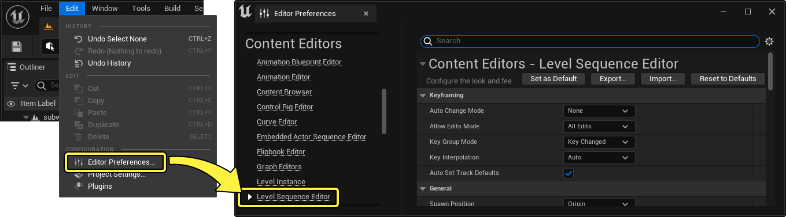
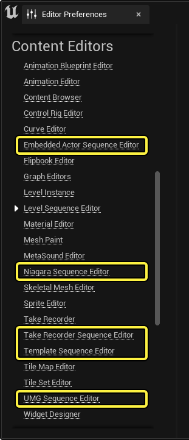
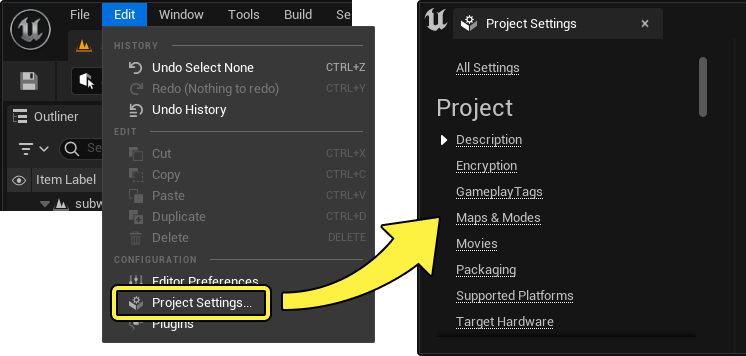
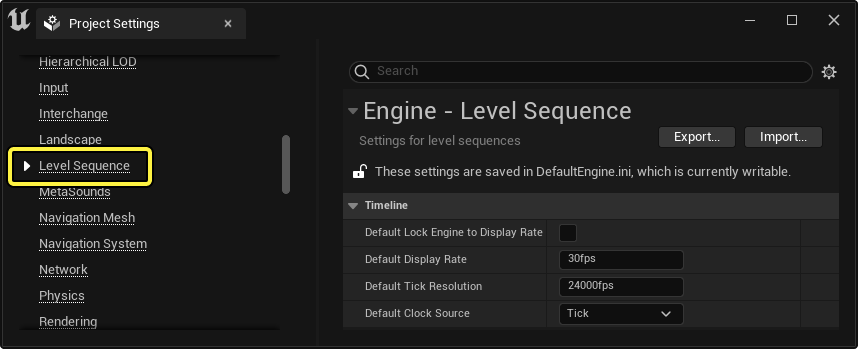
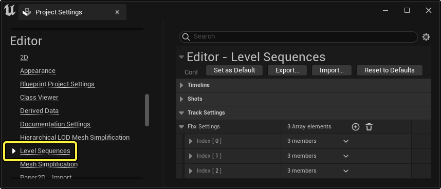

# 编辑器偏好设置和项目设置

> 路径：虚幻引擎5.7文档 / 为角色和对象制作动画 / 过场动画和Sequencer / Sequencer概述 / 编辑器偏好设置和项目设置

> 原始页面：https://dev.epicgames.com/documentation/unreal-engine/cinematic-editor-and-project-settings-in-unreal-engine

Sequencer的编辑器偏好设置和项目设置可以对使用和运行编辑器时Sequencer在整个项目范围内的默认行为和本地用户偏好进行控制。本文档将简要介绍可用于在本地和项目级别修改Sequencer行为的选项。

## 编辑器偏好设置

编辑器偏好设置用于在本地级别配置Sequencer的工具和功能行为。在此处所做的修改仅适用于你的机器，不适用于其他机器。

要查看Sequencer的编辑器偏好设置，在虚幻引擎的顶部菜单栏中找到 **编辑（Edit）> 编辑器偏好设置…（Editor Preferences…）**。接下来，选择 **内容编辑器（Content Editor）** 类别侧边栏中的 **关卡序列编辑器（Level Sequence Editor）**。

除了 **关卡序列编辑器（Level Sequence Editor）**，你还可以对其他序列编辑器的偏好进行自定义设置。在 **内容编辑器（Content Editor）** 下，你可以找到下列编辑器，还可修改偏好：

- 嵌入式Actor序列编辑器（Embedded Actor Sequence Editor）

  ，使用

  时。
- Niagara序列编辑器（Niagara Sequence Editor）

  ，在

  Niagara

  中使用Sequencer时。
- 镜头试拍录制器序列编辑器（Take Recorder Sequence Editor）

  ，从

  Take Recorder

  使用Sequencer时。
- 模板序列编辑器（Template Sequence Editor）

  ，使用

  使用模板序列

  时。
- UMG序列编辑器（UMG Sequence Editor）

  ，从

  创建用户界面

  使用Sequencer时。

| 名称 | 说明 |
| --- | --- |
| 关键帧 |  |
| **自动修改模式（Auto Change Mode）** | 自动修改模式描述了创建轨道或Actor发生关键帧变化时的行为。 **自动关键帧（Auto Key）** 将启用[自动关键帧](../sequencer-editor/sequencer-cinematic-toolbar/index.md#%E8%87%AA%E5%8A%A8%E5%85%B3%E9%94%AE%E5%B8%A7)模式。 **自动轨道（Auto Track）** 将在Actor或其属性发生变化时添加轨道和Actor。 **全部（All）** 将合并 **自动关键帧（Auto Key）** 和 **自动轨道（Auto Track）** 模式的效果。 **无（None）** 将使用默认行为，并不会发生自动修改或键入。 |
| **允许编辑模式（Allow Edits Mode）** | 允许编辑模式包含操作Sequencer绑定和关卡绑定Actor时的自动行为选项。[Sequencer工具栏](../sequencer-editor/sequencer-cinematic-toolbar/index.md#%E7%BC%96%E8%BE%91%E9%80%89%E9%A1%B9)页面对这些选项进行了说明。 |
| **关键帧组模式（Key Group Mode）** | 关键帧组模式可以对使用 **自动关键帧** 时设置的关键帧范围进行控制。[Sequencer工具栏](../sequencer-editor/sequencer-cinematic-toolbar/index.md#%E5%85%B3%E9%94%AE%E5%B8%A7%E9%80%89%E9%A1%B9)页面对这些选项进行了说明。 |
| **关键帧插值（Key Interpolation）** | 新建关键帧的插值类型。 |
| **自动设置轨道默认值（Auto Set Track Defaults）** | 启用后，此功能将允许[变换和属性轨道](../../unreal-engine-sequencer-fa6b165a/sequencer-track-list/cinematic-transform-and-property-tracks/index.md)在无需设置关键帧的情况下获得自定义默认值。禁用后，设置值会导致按照选定的值为该轨道创建一个关键帧。 |
| 通用 |  |
| **生成位置（Spawn Position）** | 将其添加至Sequencer时[可生成对象](https://dev.epicgames.com/documentation/404)的默认创建位置。 **原点（Origin）** 是默认行为，并可以将可生成对象置于世界原点(0,0,0)。 **放在摄像机前（Place in Front of Camera）** 会将可生成对象放在当前活动的视角视口的摄像机前。 |
| **创建可生成的摄像机（Create Spawnable Cameras）** | 启用后，点击[Sequencer的工具栏摄像机（Toolbar Camera）按钮](../sequencer-editor/sequencer-cinematic-toolbar/index.md#%E5%88%9B%E5%BB%BA%E6%91%84%E5%83%8F%E6%9C%BA)会将摄像机作为一个[可生成对象](https://dev.epicgames.com/documentation/404)创建。 |
| **仅显示选定的节点（Show Selected Nodes Only）** | 启用后将自动筛选轨道，仅列出与选定的Actor匹配的轨道或子轨道。 |
| **鼠标左键拖动进行框选（Left Mouse Drag Does Marquee）** | 启用后，将改变在视口中拖动鼠标左键的行为，它将进行框选，而不是左右移动视口摄像机。 |
| **录制时倒回（Rewind on Record）** | 启用后，序列将在录制开始时倒回到开头。仅用于。 |
| **清洁播放模式（Clean Playback Mode）** | 开始播放Sequencer时即自动启用[**游戏视图**](https://dev.epicgames.com/documentation/unreal-engine/using-editor-viewports-in-unreal-engine#%E6%B8%B8%E6%88%8F%E8%A7%86%E5%9B%BE)。 |
| **激活实时视口（Activate Realtime Viewports）** | 打开Sequencer时即从 **视口选项** 菜单自动启用 **实时**。 |
| **显示调试可视化（Show Debug Visualization）** | 如果启用，Sequencer 的底部将出现一个调试显示区。调试分段按关键帧分组。系统会根据求值的复杂程度为这些分段分配一个颜色。**蓝色** 表示复杂程度较低，而 **红色** 则表示复杂程度较高。 Sequencer显示调试可视化 |
| **滚动前后进行查看（Visualize Pre and Post Roll）** | 如果你正在使用滚动前后帧查看器，可以在你的轨道上启用它们的绘图。 Sequencer前后滚动 |
| **求值时对导演进行编译（Compile Director on Evaluate）** | 启用后，若播放或擦除时由于修改受到污染，[Sequencer导演](../sequencer-track-list/cinematic-event-track/index.md)蓝图将自动编译。 |
| **轨迹路径上限（Trajectory Path Cap）** | 指定在视口中渲染变换轨迹时要绘制的关键帧片段的最大数量。 |
| **帧号显示格式（Frame Number Display Format）** | 指定按帧、秒或时间码顺序显示的时间单位。这会影响序列中的所有时间显示。 show time as |
| **影片渲染器名称（Movie Renderer Name）** | 描述要使用哪个渲染器。默认情况下，此选项设置为 "**MovieSceneCapture**"，即使用[旧版渲染工具](https://dev.epicgames.com/documentation/404)。如果已启用[渲染电影设置](../old-render-movie/index.md)，则此字段将被设置为"**影片渲染队列（Movie Render Queue）**"。 |
| **自动展开选中的节点（Auto Expand Nodes on Selection）** | 启用后，将自动展开[Sequencer大纲视图](https://dev.epicgames.com/documentation/404) 到选中的轨道。 |
| **树状视图宽度（Tree View Width）** | Sequencer大纲视图的默认宽度，为与Sequencer编辑器全宽度相关的规格化百分比。 |
| 时间轴 |  |
| **显示范围滑块（Show Range Slider）** | 在Maya样式范围滑块和第二时间轴栏之间切换底部时间轴区域的显示。 sequencer range slider |
| **将关键帧和分段与播放范围对齐（Snap Keys and Sections to Play Range）** | 将关键帧和分段放置限制在播放范围内。 clamp keys |
| **变焦位置（Zoom Position）** | 在Sequencer UI中进行[**变焦**](https://dev.epicgames.com/documentation/404)操作时，焦点是什么。你可以选择相对于 **当前时间** 播放头或你的 **鼠标位置** 进行变焦。 |
| **启用自动滚动（Auto Scroll Enabled）** | 在"时间轴"视图中启用自动平移，以在播放时保持播放头在视图中。 sequencer auto scroll |
| **擦除时将播放头保持在播放范围内（Keep Playhead in Play Range While Scrubbing）** | 拖动时，将播放头限制在序列的开始和结束区域内。 sequencer clamp scrub |
| **将播放范围保持在分段边界内（Keep Play Range in Section Bounds）** | 启用此选项将导致序列的播放范围将其开始和结束时间限制到第一个和最后一个关键帧或分段。 sequencer将播放范围保持在分段边界内 |
| **零点填充帧数（Zero Pad Frames）** | 将选定的数字填充量应用于显示的时间。仅适用于将时间显示为 **帧** 时。 |
| **跳帧增量（Jump Frame Increment）** | 设置按 **Shift + 左/右箭头键** 在时间轴上前后跳跃时要跳跃的帧数。 |
| **显示层条（Show Layer Bars）** | 启用[层条](../creating-animation-keyframes/index.md#%E5%B1%82%E6%9D%A1)。 |
| **显示关键帧条（Show Key Bars）** | 启用[关键帧条](../creating-animation-keyframes/index.md#%E5%85%B3%E9%94%AE%E5%B8%A7%E6%9D%A1)。 |
| **无限关键帧区域（Infinite Key Areas）** | 如果启用，创建的第一个变换轨道将包括一个无限的长度分段。如果禁用，将创建一个长度为0的非无限分段。 |
| **显示通道颜色（Show Channel Colors）** | 如启用 **显示关键帧条（Show Key Bars）**，则在相应的变换关键帧条上绘制红色、绿色和蓝色的线。 显示通道颜色 |
| **显示状态条（Show Status Bar）** | 在Sequencer大纲视图中显示状态指示器。 |
| **显示更新线（Show Tick Lines）** | 启用或禁用时间轴上的竖条纹。 |
| **显示Sequencer工具栏（Show Sequencer Toolbar）** | 显示或隐藏[Sequencer工具栏](../sequencer-editor/sequencer-cinematic-toolbar/index.md)。 |
| **关键帧区域曲线范围（Key Area Curve Extents）** | 关键帧区域曲线范围，按通道名称排序。 |
| **带曲线的关键帧区域高度（Key Area Height with Curves）** | 在启用了[显示曲线](../creating-animation-keyframes/index.md#showcurves)时，轨道的高度。更新此项后必须重启Sequencer。 |
| **减少关键帧公差（Reduce Keys Tolerance）** | 在 **编辑（Edit）> 减少关键帧（Reduce Keys）** 菜单中减少关键帧时使用的公差。如果这些数字包含的值差大于公差值，那么数值越大，要删除的关键帧就越多。 |
| **修剪时删除关键帧（Delete Keys when Trimming）** | 删除从 **编辑（Edit）> 修剪左/右（Trim Left/Right）** 菜单进行修剪时超出选择范围的关键帧。 |
| **烘烤后禁用分段（Disable Sections After Baking）** | 从Sequencer的[操作（Actions）菜单](../sequencer-editor/sequencer-cinematic-toolbar/index.md#actions)中选择 **烘焙变换（Bake transform）** 时，启用此选项将使之前的变换分段失效。禁用此选项将会删除之前的所有分段。 |
| 对齐 |  |
| **启用对齐（Is Snap Enabled）** | 启用[对齐](../sequencer-editor/sequencer-cinematic-toolbar/index.md#%E5%AF%B9%E9%BD%90)。 |
| **将关键帧时间与间隔对齐（Snap Key Times to Interval）** | 沿时间轴移动时，对齐关键帧到时间间隔。 snap keys time |
| **将关键帧时间与关键帧对齐（Snap Key Times to Keys）** | 沿时间轴移动时，对齐关键帧到其他关键帧，或对齐到分段的开始和结束。 snap keys |
| **将分段时间与间隔对齐（Snap Section Times to Interval）** | 在时间轴中缩放或移动节时，对齐分段到时间间隔。 snap sections time |
| **将分段时间与分段对齐（Snap Section Times to Sections）** | 沿时间轴移动时，对齐分段到其他关键帧，或对齐到分段的开始和结束。 snap sections keys |
| **将播放头与关键帧对齐（Snap Play Time to Keys）** | 拖动时，将播放头标识对齐到其他关键帧，或分段的开始和结束。 snap playhead keys |
| **将播放头与间隔对齐（Snap Play Time to Interval）** | 拖动时，将播放头标识对齐到时间间隔。 snap playhead time |
| **将播放头与按下的关键帧对齐（Snap Play Time to Pressed Key）** | 点击后，弹出播放头标识到关键帧。如果禁用此选项，也可以按住Shift键并点击关键帧来执行此操作。 pop playhead key |
| **将播放头与拖动的关键帧对齐（Snap Play Time to Dragged Key）** | 沿时间轴拖动关键帧时，保持播放头标记与关键帧同步。 snap playhead dragging |
| **将曲线值与间隔对齐（Snap Curve Value to Interval）** | 在"曲线编辑器"中切换值对齐。 snap curve key |
| 曲线编辑器 |  |
| **关联曲线编辑器时间范围（Link Curve Editor Time Range）** | 将曲线编辑器的视图与Sequencer的时间轴同步。 sequencer sync view |
| **同步曲线编辑器选择（Synchronize Curve Editor Selection）** | 启用此项会将[曲线编辑器](../animation-curve-editor/index.md)的选择项与Sequencer中所选的轨道同步。 |
| **将曲线编辑器隔离至选择（Isolate Curve Editor to Selection）** | 启用此项会移除曲线编辑器大纲视图中的其他所有轨道，只显示当前选择的轨道及其在Sequencer中层级。 |
| 播放 |  |
| **对子序列单独求值（Evaluate Sub Sequences in Isolation）** | 查看来自主序列的子序列或镜头时对其进行隔离。这将禁用从主序列传播的所有轨道或内容，还将禁用镜头范围预览。 |
| **返回构造脚本（Rerun Construction Scripts）** | 每次更新函数时启用来自蓝图Actor的构造脚本。要使用此选项，必须在蓝图的类设置（Class Settings）中启用 **在Sequencer中运行构造脚本（Run Construction Script in Sequencer）** 属性。 |

## 项目设置

Sequencer还有各种项目设置，可以对整个项目的Sequencer产生影响。在此处所做的修改将影响所有用户，并需要修改某些文件。

要查看Sequencer的项目设置，在虚幻引擎的顶部菜单栏中找到 **编辑（Edit）> 项目设置…（Project Settings…）**。

有三个包含Sequencer项目设置的主要类别：[引擎](#%E5%BC%95%E6%93%8E)、[编辑器](#%E7%BC%96%E8%BE%91%E5%99%A8)和[插件](#%E6%8F%92%E4%BB%B6)。

### 引擎

在侧边栏中，找到 **引擎（Engine）** 类别并选择 **关卡序列（Level Sequence）**。这将显示 **DefaultEngine.ini** 文件的Sequencer项目设置，该文件位于项目根目录的 **Config** 文件夹中。

| 名称 | 说明 |
| --- | --- |
| **默认将引擎锁定至显示速度（Default Lock Engine to Display Rate）** | 将所有新创建序列的播放锁定至指定的 **默认显示速率**。 |
| **默认显示速度（Default Display Rate）** | 新创建序列的默认播放速度。此选项还可以用来定义帧锁定帧率。一些有效的格式包括： **30fps**。 **120/1**，代表120 fps。 **30000/1001**，代表29.97 fps。 **0.01s**，代表10 ms。 |
| **默认更新函数分辨率（Default Tick Resolution）** | 为新创建的序列指定更新函数分辨率。 |
| **默认时钟源（Default Clock Source）** | 新创建序列将要使用的默认[时钟源](../sequencer-editor/sequencer-cinematic-toolbar/index.md#%E6%AF%8F%E7%A7%92%E5%B8%A7%E6%95%B0)。 |

### 编辑器

找到 **引擎（Engine）** 类别并选择 **关卡序列（Level Sequence）**。该操作将显示Sequencer的引擎项目设置。在此处所做的修改将为你的项目创建一个名为 **DefaultEditorPerProjectUserSettings.ini** 的新文件。此文件将位于项目根目录的 **Config** 文件夹中。

| 名称 | 说明 |
| --- | --- |
| **默认开始时间（Default Start Time）** | 新创建序列的默认开始时间值。 |
| **默认时长（Default Duration）** | 新创建序列的默认时长。 |
| **镜头目录（Shot Directory）** | 从 **镜头轨道（Shot Track）** 创建镜头时的默认文件夹名。该文件夹将与主序列资产的位置有关。 |
| **镜头前缀（Shot Prefix）** | 创建镜头时的文件名前缀。 |
| **第一个镜头编号（First Shot Number）** | 要添加到 **镜头前缀** 之后的文件名的镜头编号。 |
| **镜头增量（Shot Increment）** | 在创建新镜头时增加镜头编号的数量。 |
| **镜头编号位数（Shot Num Digits）** | 要在镜头编号字段中使用的填充数字的位数。 |
| **镜头试拍编号位数（Take Num Digits）** | 要在镜头试拍编号字段中使用的填充数字的位数。 |
| **首次镜头试拍编号（First Take Number）** | 创建镜头试拍时添加到文件名末尾的镜头编号。 |
| **镜头试拍分隔符（Take Separator）** | 镜头编号和镜头试拍编号之间的单字符分隔符。 |
| **子序列分隔符（Sub Sequence Separator）** | 镜头试拍编号和子序列名称之间的单字符分隔符。 |
| **Fbx设置（Fbx Settings）** | 此数组可列出用于 **[在Sequencer中导入FBX](../import-and-export-cinematic-fbx-animations/index.md)** 时将属性及其关键帧映射到相关轨道**的FBX属性读取器。默认情况下，该数组包括常用FBX摄像机属性的属性映射，如**FieldOfView**、**FocalLength**和**FocusDistance**。 |

### 插件

找到 **插件（Plugins）** 类别并选择 **关卡Sequencer（Level Sequencer）**。该操作将显示Sequencer的插件项目设置。在此处所做的修改将为你的项目创建一个名为 **DefaultEditorPerProjectUserSettings.ini** 的新文件，此文件将位于项目根目录的 **Config** 文件夹中。

| 名称 | 说明 |
| --- | --- |
| **轨道设置（Track Settings）** | 轨道设置是一个数组，用于在将某些Actor类绑定到Sequencer时指定将会自动创建的属性或组件轨道。详情请参阅[Object绑定轨道](../sequencer-track-list/cinematic-actor-tracks/index.md)一文。 |
| **自动绑定到PIE（Auto Bind to PIE）** | 指定新创建的序列是否自动绑定到[**在编辑器中播放**](../../../../building-virtual-worlds/level-editor/ineditor-testing-play-and-simulate/index.md#%E5%9C%A8%E7%BC%96%E8%BE%91%E5%99%A8%E4%B8%AD%E6%92%AD%E6%94%BE)会话。 |
| **自动绑定到模拟（Auto Bind to Simulate）** | 指定新创建的序列是否自动绑定到[**模拟**](../../../../building-virtual-worlds/level-editor/ineditor-testing-play-and-simulate/index.md#%E5%9C%A8%E7%BC%96%E8%BE%91%E5%99%A8%E4%B8%AD%E6%A8%A1%E6%8B%9F)会话。 |

## 保存和重置

通过所有编辑器偏好设置和一些项目设置，你可以使用顶部标题下方的菜单对其进行 **保存（Save）**、**导出（Export）**、**导入（Import）** 或 **重置（Reset）** 操作。

- **设置为默认值（Set as Default）** 可以将当前设置保存为新的默认设置。然后，点击 **重置为默认值（Reset to Defaults）**，设置就会被重置为这些值。
- **导出（Export）** 可以将当前的设置保存为一个.ini文件。之后，你就可以使用此文件与他人共享你的设置。
- **导入（Import）** 可以从指定的.ini文件导入设置。
- **重置为默认值（Reset to Defaults）** 会将所有设置和偏好设置设为项目或你的 **设置为默认值** 设置定义的默认值。
