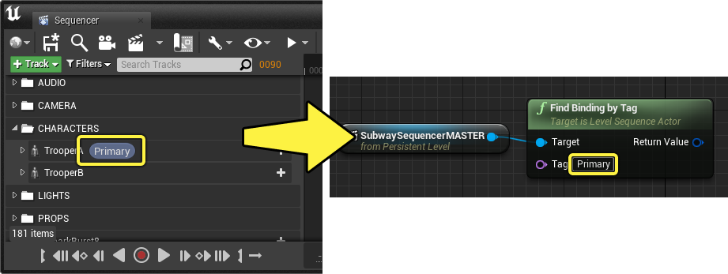
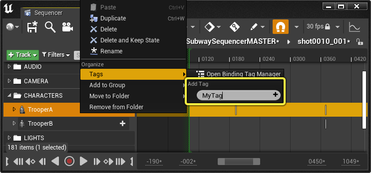
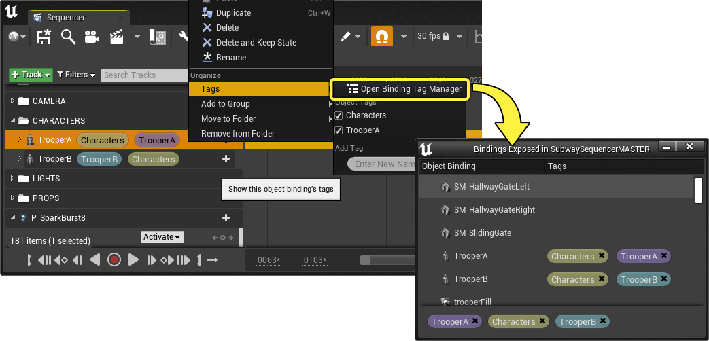
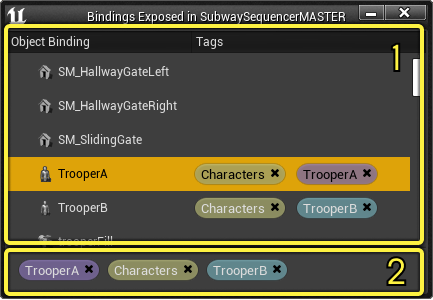
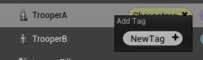
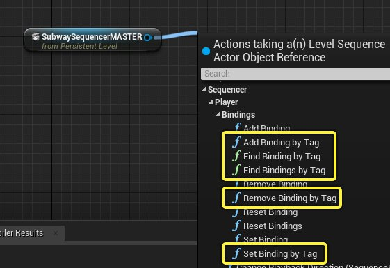
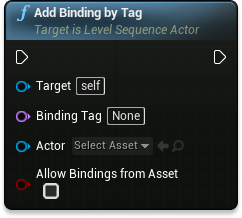
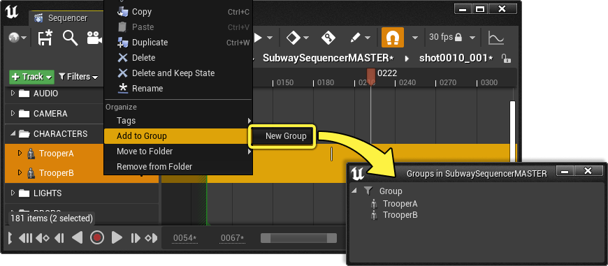

# Sequencer标签和分组

> 路径：虚幻引擎5.7文档 / 为角色和对象制作动画 / 过场动画和Sequencer / Sequencer概述 / Sequencer标签和分组

> 原始页面：https://dev.epicgames.com/documentation/unreal-engine/cinematic-tags-and-groups-in-unreal-engine

使用Sequencer可以以元数据来标记轨道，从而支持其他功能和行为。可以对Actor指定 **标签**，这些标签可以在蓝图中引用，从而更广泛引用Actor和轨道。还可将轨道放入 **分组**，以管理其显示和选择。

本页概述Sequencer中的标签和分组功能。

#### 先决条件

- 确保你已了解

  Sequencer

  ，其

  界面

  和如何添加

  轨道

  。
- 确保你已了解

  蓝图可视化脚本

  。

## 标签

标签（Tag）是一种元数据标识，可以指定给Sequencer中的 **[Object绑定轨道](../sequencer-track-list/cinematic-actor-tracks/index.md)**，并且可以被基于标签的蓝图节点引用。

将标签添加到轨道的最快方法是，右键点击它，导航到 **标签** 菜单，然后在 **添加标签** 域中输入名称。完成后，你可以按 **Enter** 或 **添加 (+)** 按钮创建标签。

> [!NOTE]
> 可以将多个标签指定给一个Actor。 multiple tags

指定标签后，**标签** 上下文菜单现在将显示已添加到轨道的标签列表，可以点击它们来打开和关闭。

> 动图已省略：enable disable tag menu

### 绑定标签管理器

要在Sequencer中查看和管理标签，可以通过点击标签上下文菜单中的 **打开绑定标签管理器** 打开绑定标签管理器。你也可以从工具栏的[**操作**](#%E6%93%8D%E4%BD%9C)菜单打开它。

绑定标签管理器有两个主要区域：

1. 第一个区域包含序列中所有对象绑定的列表，包括所有子序列。指定给Actor的标签将显示在其旁边，可以点击标签上的 **删除 (X)** 来取消指定。 右键点击绑定，输入名称，然后按 **Enter** 即可添加新标签。

   
2. 第二个区域列出此序列的所有现有标签。点击

   删除 (X)

   将从所有绑定中取消指定它。

### 在蓝图中引用

从 **关卡序列Actor** 调用其中一个by Tag **绑定** 函数，即可在蓝图中访问绑定标签。你可以使用这些函数获取当前绑定或带标签的Actor绑定、重新绑定这些Actor或重设绑定。

可以右键点击蓝图图表来找到By Tag绑定函数，或从关卡序列Actor引用中连出引线并在 **Sequencer > 播放器 > 绑定** 中查找。

多数"by Tag"蓝图函数拥有以下输入引脚：

- 目标

  ：对关卡序列Actor的引用。
- 绑定标签

  ：要查找的标签名称。
- Actor

  ：要绑定、重新绑定或添加绑定的Actor。
- 允许从资产进行绑定

  ：禁用此选项将锁定序列，使其无法执行进一步的绑定操作。

## 分组

可将Sequencer中的轨道添加到分组（Group）中，这有助于快速选择和显示过滤。

要创建新分组并向其中添加轨道，右键点击单个或多个轨道，然后选择 **添加到分组 > 新建分组**。此操作将打开 **Sequencer分组管理器**，创建新分组，并将轨道添加到其中。

创建新分组后，还可以从 **添加到分组** 上下文菜单向该分组添加新轨道。

> 图片已省略：add to group

你还可以将轨道从Sequencer的大纲视图拖动到Sequencer分组管理器中，以将轨道添加到分组中。

> 动图已省略：add group drag and drop

### 分组管理器

Sequencer分组管理器用于管理指定给它们的分组和轨道。如果没有创建新分组，可以点击工具栏[**操作**](#actions) 菜单中的 **打开Sequencer分组管理器** 来打开该组。

> 图片已省略：open sequencer group manager

#### 管理

在"分组管理器"窗口中右键点击将显示上下文菜单，你可以在其中创建新分组、重命名分组、删除分组或[**过滤分组**](#filtering)。

> 图片已省略：group manager context menu

#### 选择

点击分组标题或单独点击每个分组项目，即可快速选择分组的内容。

> 动图已省略：sequencer group selecting

#### 筛选

点击 **筛选器** 图标将筛选出Sequencer大纲视图中的所有轨道，轨道（及其子轨道）除外。

> 图片已省略：sequencer group track filter

点击Sequencer大纲视图中的 **筛选器** 菜单也将显示启用 **分组筛选器** 控件。

> 图片已省略：sequencer group track filter
