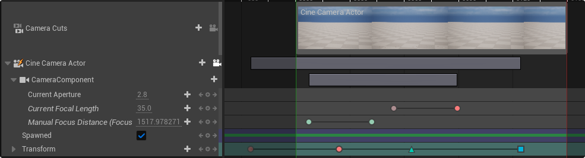
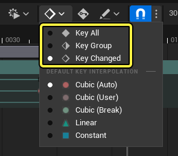
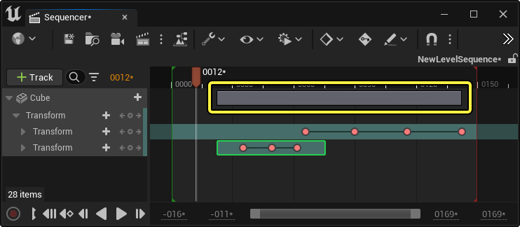
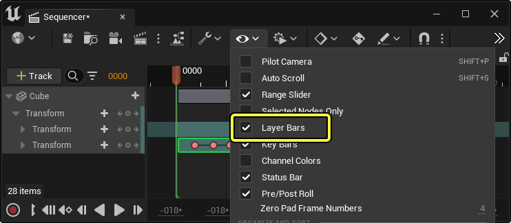
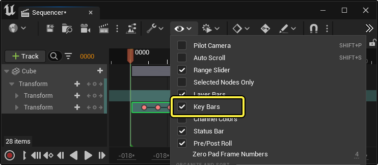
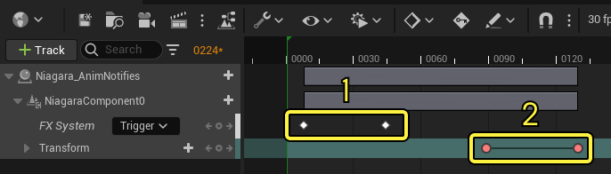
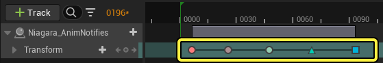
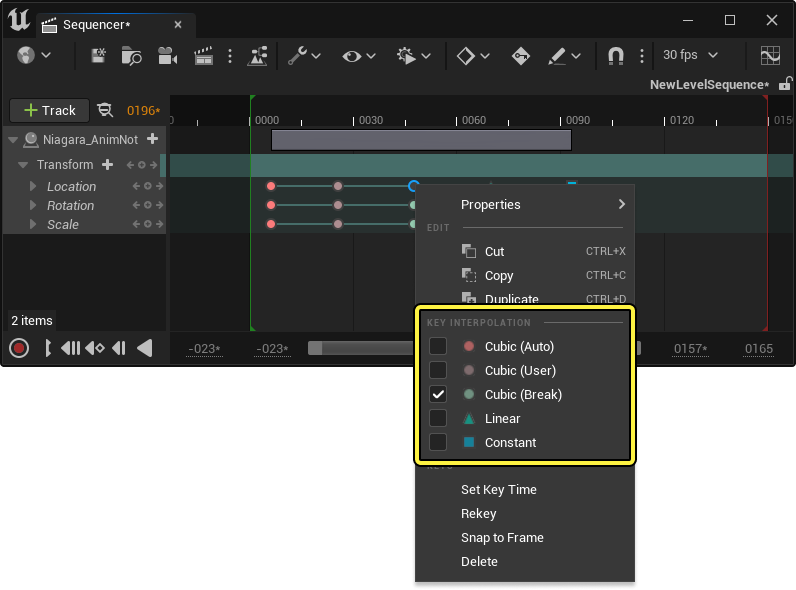

# 关键帧

> 路径：虚幻引擎5.7文档 / 为角色和对象制作动画 / 过场动画和Sequencer / Sequencer概述 / 关键帧

> 原始页面：https://dev.epicgames.com/documentation/unreal-engine/creating-animation-keyframes-in-unreal-engine

你可以通过创建 **关键帧（也称作Keyframe或Key）** ，在时间轴特定位置上添加定义属性，以此为Sequencer中的轨道和内容添加动画。当播放头到达时间轴上的某个关键帧时，属性将更新为这些点上定义的值。属性可能会在关键帧之间逐渐改变（插值），也可能在到达关键帧后立即变为指定值（无插值）。

关键帧和轨道状态位于被称为 **分段（Section）** 的分组容器内。分段是指其中轨道将由Sequencer进行计算的时间范围。它们可能拥有无限或有限长度，也可能被移动、修剪或混合。

本指南提供了在Sequencer中设置动画关键帧，以及分段如何增强动画功能集的概述。

#### 先决条件

- 确保你对

  Sequencer

  及其

  界面

  已有所了解。

## 关键帧

与大多数动画软件类似，你可以在时间轴内创建关键帧，以此在Sequencer中为Object添加动画。关键帧可以为Object的位置、颜色和其他属性赋予动画。在Sequencer中，Actor的大部分属性都可以通过关键帧来实现动画效果。

### 创建

在Sequencer中创建关键帧的方式有很多种。大多数情况下，关键帧会创建在[播放头](https://dev.epicgames.com/documentation/404)的位置。放置新关键帧时，如果播放头位置处已有关键帧，则其将被新关键帧覆写。

| 关键帧创建方法 | 图像 |
| --- | --- |
| 点击轨道上的 **添加关键帧** 按钮。 | 添加关键帧 |
| 点击所选Actor的细节面板中属性旁边的 **添加关键帧** 按钮。 无需将Actor或轨道添加至Sequencer即可使其工作。如果不添加，它将被自动添加至Sequencer并设置关键帧。 | 添加关键帧细节 |
| 按下键盘上的 **Enter** 即可将关键帧放置在选定轨道中。 如果已选择Actor轨道，按下 **回车键** 即可在所有可设置关键帧的子轨道上创建关键帧。 | 添加关键帧Enter |
| 如果轨道已包含关键帧，调整沿属性轨道显示的属性值即可添加新关键帧。你可以左右拖动属性调整其值，也可以点击属性手动输入新值。 | 添加关键帧值更改 |
| 沿轨道时间轴点击 **鼠标中键** 即可在播放头位置创建一个关键帧。关键帧的值与播放头位置的值匹配。 | 添加关键帧MMB鼠标中键 |
| 选中一个Actor并按下 **S** 即可创建一条 **[变换轨道](../../unreal-engine-sequencer-fa6b165a/sequencer-track-list/cinematic-transform-and-property-tracks/index.md)** （如果还不存在此类轨道），同时创建一个拥有 **位置** 、 **旋转** 和 **缩放** 属性的关键帧。 如果你的窗口聚焦在视口上，该方法也能奏效（这里借鉴了Maya的关键帧快捷键）。假如序列中目前没有引用Actor，这样做会自动在序列中添加关联的Actor。 | 添加关键帧 |
| 选中Actor并按下 **Shift + W** 即可创建变换轨道（如果还不存在此类轨道），同时仅对 **位置** 属性设置关键帧。 | 仅关键帧位置 |
| 选中Actor并按下 **Shift + E** 即可创建变换轨道（如果还不存在此类轨道），同时仅对 **旋转** 属性设置关键帧。 | 仅关键帧旋转 |
| 选中Actor并按下 **Shift + R** 即可创建变换轨道（如果还不存在此类轨道），同时仅对为 **缩放** 属性设置关键帧。 | 仅关键帧缩放 |

#### 自动添加关键帧

关键帧也可以设置为每次更改 Actor 的属性时自动创建，此功能被称为 **自动设置关键帧** 。要使用自动关键帧，必须启用[Sequencer工具栏](../sequencer-editor/sequencer-cinematic-toolbar/index.md)中的[自动添加关键帧](../sequencer-editor/sequencer-cinematic-toolbar/index.md#%E8%87%AA%E5%8A%A8%E5%85%B3%E9%94%AE%E5%B8%A7) 按钮。

启用后，修改Actor属性即可新建关键帧。

> 动图已省略：Sequencer自动选项

> [!NOTE]
> 自动设置关键帧的轨道必须已拥有关键帧才能自动新建关键帧。空白轨道无法自动设置关键帧。

也可以打开[关键帧选项菜单](../sequencer-editor/sequencer-cinematic-toolbar/index.md#%E5%85%B3%E9%94%AE%E5%B8%A7%E9%80%89%E9%A1%B9)来变更启用自动设置通道关键帧后自动创建的关键帧数量。通道关键帧属性类型由多种属性组成，如[向量](../../unreal-engine-sequencer-fa6b165a/sequencer-track-list/cinematic-transform-and-property-tracks/index.md#vectors) 或 [变换](../../unreal-engine-sequencer-fa6b165a/sequencer-track-list/cinematic-transform-and-property-tracks/index.md#%E5%8F%98%E6%8D%A2%E8%BD%A8%E9%81%93)。

| 自动关键帧选项 | 描述 |
| --- | --- |
| **全部设置关键帧** | 一个值改变后，所有通道和组都将设置关键帧。举例而言，在变换轨道中，如果仅编辑Actor的X轴位置属性，将在整个XYZ **位置** 通道及所有 **缩放** 和 **旋转** 通道上设置关键帧。 |
| **按组设置关键帧** | 一个值改变后，对应通道内的所有轴都将设置关键帧。举例而言，在变换轨道中，如果仅编辑Actor的X轴位置属性，将在整个XYZ **位置** 通道上设置关键帧。 |
| **变化轴设置关键帧** | 只有发生变化的轴才会设置关键帧。举例而言，如果仅编辑Actor 的X轴位置属性，将只为X轴位置通道设置关键帧。 |

#### 复制和拷贝粘贴

关键帧可以通过复制和拷贝/粘贴方法创建。复制时可以右键点击关键帧并选择 **复制（Duplicate）** 或按下 **Ctrl+D** 。此操作将在原始关键帧的相同位置创建一个关键帧副本。

也可以按住 **Alt** 并沿着时间轴拖动关键帧或选定关键帧组，以此复制关键帧。

> 动图已省略：关键帧Alt复制副本

关键帧可以通过标准 **剪切** / **拷贝** / **粘贴** 命令进行复制粘贴。你可以右键点击关键帧，然后选择其中一种命令，也可以在选择关键帧或关键帧组后使用 **Ctrl + X** 、 **Ctrl + C** 、 **Ctrl + V** 快捷键。粘贴关键帧时，最左侧的关键帧将粘贴在播放头位置，关键帧组（如果复制了多个关键帧）将相对于该位置进行放置。

> 动图已省略：关键帧复制粘贴

### 选择和移动

关键帧可以逐一点击选择，也可以围绕一组关键帧拖动选取框选择。使用选取框时，可以将其他轨道上的关键帧纳入你的选择范围内，包含在选取框内时，关键帧将高亮显示。

> 动图已省略：关键帧选择

你可以左右拖动关键帧变更其所处时间。被框选的多个关键帧可以同时移动。

> 动图已省略：移动关键帧

> [!NOTE]
> 默认情况下，时间轴的 [**播放头**](https://dev.epicgames.com/documentation/404) 会自动对齐选定的关键帧，而且会在沿着时间轴拖动时持续对齐关键帧。你可以禁用 [**对齐**](../sequencer-editor/sequencer-cinematic-toolbar/index.md#%E5%AF%B9%E9%BD%90) 工具栏菜单中的 **与按下的关键帧对齐** 和 **与拖动的关键帧对齐** ，以更改此行为。

使用 **Ctrl + ]** 和 **Ctrl + [** 来选中播放头左侧或右侧的所有关键帧。

> 动图已省略：选择关键帧向前向后

### 层条

要辅助多个关键帧的同时移动和缩放，你可以利用 **层条（Layer Bars）** 操控你的关键帧。你的Actor或组件上存在多个关键帧或分段时，此条将显示在对象的标题轨道上，你可以进行移动和修剪。

拖动条的中心部分可成组移动所有子关键帧和分段。拖动边缘将相对于该边缘缩放关键帧和分段。

> 动图已省略：操控层条

> [!NOTE]
> 层条是分层的，将显示在较低组件轨道以及[文件夹轨道](../sequencer-track-list/organize-cinematic-tracks/index.md)上。若在其中任意点操控它们，将相应操控其中所有Actor的关键帧、分段和其他层条。这样就可以更轻松地操控Actor上的关键帧，而无需展开到轨道来操控。
>
> > 动图已省略：层条层级

你可以找到Sequencer中的 **查看选项（View Options）** 菜单并选择 **层条（Layer Bars）** ，启用或禁用该功能。

### 关键帧条

如果你想对相邻关键帧对重新定时，你可以选择并拖动两个关键帧之间绘制的线条。这将相对于彼此移动两个关键帧。这种操控关键帧的方法很有用，可节省单独对每个关键帧进行多选的时间，并保留这些关键帧之间的自定义曲线。

> 动图已省略：操控关键帧条

你可以找到Sequencer中的 **查看选项（View Options）** 菜单并选择 **关键帧条（Key Bars）** ，启用或禁用该功能。

### 插值

关键帧可以 **插值** ，也可以 **不插值** 。插值关键帧将随时间逐渐更改他们添加动画的属性的值，非插值关键帧将一直保留它们的值，直至到达下一个关键帧。例如，在[事件轨道](../sequencer-track-list/cinematic-event-track/index.md)、[布尔轨道](../../unreal-engine-sequencer-fa6b165a/sequencer-track-list/cinematic-transform-and-property-tracks/index.md#%E5%B8%83%E5%B0%94) 或 [枚举轨道](../../unreal-engine-sequencer-fa6b165a/sequencer-track-list/cinematic-transform-and-property-tracks/index.md#%E6%9E%9A%E4%B8%BE)上创建的关键帧为非插值关键帧。

1. 非插值关键帧

   ：这些关键帧显示为

   白色菱形

   。
2. 插值关键帧

   ：这些关键帧显示为

   红色圆圈

   ，如果使用不同的切线，将显示为其他颜色。

插值关键帧可以调整 **切线** 。切线是关键帧的属性，可用于控制关键帧之间的插值速度和缓角。根据所选的切线类型，将显示不同的关键帧图标，以指示其切线属性

你有五种主要切线类型可以选择：

| 切线名称 | 关键帧图标 | 描述 |
| --- | --- | --- |
| **Cubic（自动）** | Cubic自动 | Cubic（自动）切线类型是默认切线类型。该切线会尝试在关键帧之间保持平滑的曲线，并淡入淡出开始和结束关键帧。该切线将在每次添加或移动关键帧时自动调整。 |
| **Cubic（用户）** | Cubic用户 | Cubic（用户）与Cubic（自动）类似，但它会在添加或移动关键帧时阻止切线进行进一步的自动编辑。在[曲线编辑器](../animation-curve-editor/index.md)内发生手动切线编辑时，Cubic（自动）关键帧将转换为Cubic（用户）。 |
| **Cubic（断开）** | Cubic断开 | Cubic（用户）与Cubic（自动）类似，但其切线是 **断开** 的，允许通过曲线编辑器指定不同的进入和离开角度。 |
| **线性** | 线性 | 线性切线导致关键帧之间不存在平滑或缓动曲线，因此会在到达每个关键帧时突然开始和停止。 |
| **常量** | constant | 常量切线的运行方式与非插值关键帧类似，可以保持当前值，直至到达下一个关键帧。 |

你可以右键点击现有关键帧的切线类型，然后从 **关键帧插值** 菜单类别中选择切线类型，以此进行转换。

> [!NOTE]
> 快捷键也可以用于更改选定关键帧的切线。按下键盘上的 **1** 、 **2** 、 **3** 、 **4** 或 **5** 即可分别将切线更改为 **Cubic（自动）** 、 **Cubic（用户）** 、 **Cubic（断开）** 、 **线性** 或 **常量** 类型。

点击Sequencer工具栏中的 [**关键帧选项**](../sequencer-editor/sequencer-cinematic-toolbar/index.md#keyframeoptions)，然后从 **默认关键帧插值** 菜单类别选择切线类型，即可更改新建关键帧的默认切线类型。

> 图片已省略：默认切线

### 属性

右键点击关键帧并导航至 **属性** 菜单，将显示关键帧当前的 **属性值** 和 **时间** 。根据要添加动画的 **[属性轨道](../../unreal-engine-sequencer-fa6b165a/sequencer-track-list/cinematic-transform-and-property-tracks/index.md)** ， **属性** 菜单显示内容将因属性而异。

> 图片已省略：关键帧属性

你也可以使用关键帧特定命令编辑关键帧时间。

| 名称 | 说明 |
| --- | --- |
| **设置关键帧时间** | 选择此选项将弹出新窗口，你可以在窗口中为关键帧指定新时间。 设置关键帧时间 |
| **重新设置关键帧** | 使关键帧对齐[播放头](https://dev.epicgames.com/documentation/404)。 重新设置关键帧 |
| **对齐到帧** | 按照[帧率](../sequencer-editor/sequencer-cinematic-toolbar/index.md#%E6%AF%8F%E7%A7%92%E5%B8%A7%E6%95%B0)工具栏菜单中的定义，使所有选定关键帧对齐离它们最近的帧。 对齐到帧 |
| **删除** | 删除选定的关键帧。 |

## 分段

在关键帧和设置关键帧Actor属性背景下，分段（Section）是指包含关键帧的组。它们的运行方式与其他动画工具中的动画层类似，但也有一些差异。动画层通常不考虑其关键帧的时间范围，但分段会考虑，这样有助于轻松启用相关功能，如整块关键帧数据偏移，且无需逐一选择和移动每个关键帧。所有关键帧均以无限或有限长度位于分段（Section）内。

> 图片已省略：分段示例

此外，关键帧仅占用时间轴内的单帧，分段则占用时间段。同样，能在时间段内生成内容的任何可添加动画轨道均使用分段。此类轨道包括[动画轨道](../sequencer-track-list/cinematic-animation-track/index.md)、[Subsequence轨道](../sequencer-track-list/cinematic-subscequences-track/index.md)或[音频轨道](../sequencer-track-list/cinematic-audio-track/index.md)。

> 图片已省略：分段示例

### 创建

每次创建可设置关键帧的轨道时，都会自动创建无限长的分段。右键点击分段的空白区，然后导航至 **属性** 菜单并解锁 **分段范围起始** 和 **分段范围结束** 属性，即可更清楚地查看此分段。这样可将分段转换为有限长度，以便查看和操作。

点击轨道上的 **分段(+)** 按钮即可额外添加分段。你可以选择用于这个新分段的 [混合类型](#%E6%B7%B7%E5%90%88%E7%B1%BB%E5%9E%8B)。初始分段之后创建的额外分段将设置为有限长度。

### 交互和显示

拖动有限分段或其边缘即可对它们进行移动并调整大小。你可以在轨道之间移动它们，也可以在时间轴中上下拖动。

使用 **Alt + ]** 和 **Alt +[** 将分段修剪或循环到当前的播放头时间。如果你事先选择主播放头轨道，所有子分段都将修剪或循环到播放头。

你也可以为分段设置时标，此操作将按比例把关键帧缩放到一定程度。按住 **Ctrl** 并拖动分段边缘，为分段设置时标。按住 **Ctrl** 并将光标悬停在分段左边缘或右边缘时，光标旁边将显示表示时标的 **时钟图标** 。

如果属性上存在多个分段，只有一个能接收关键帧（通过按下 **S** 或 **Enter** 设置关键帧时）。此分段的边界周围将显示 **绿色轮廓** ，表示此分段被指定接收新关键帧。通常是最新创建的分段接收关键帧。

右键点击分段并选择 **为此分段设置关键帧** 即可更改用于接收关键帧的分段。

你可以为分段应用自定义颜色，以区别于其默认颜色方案。要更改分段的颜色，请选择轨道标题边缘上的顶点颜色条（位于需要更改颜色的分段的旁边）。这将打开 **取色器（Color Picker）** ，其中你可以选择不同的颜色。点击 **确定（OK）** ，将新颜色应用于分段。

### 显示曲线

要辅助可视化动画数据，你还可以使曲线在分段上内联显示。为此，请右键点击分段并选择 **曲线通道（Curve Channels）> 显示（Display）** ，然后启用 **显示曲线（Show Curve）** 。

你可以使用 **显示（Display）** 菜单中的以下选项修改曲线显示：

| 名称 | 说明 |
| --- | --- |
| **显示曲线（Show Curve）** | 启用或禁用在此分段中显示曲线。 |
| **关键帧区域曲线规格化（Key Area Curve Normalized）** | 如果启用，这会调整曲线范围以显示为规格化，相对于 **关键帧区域高度（Key Area Height）** 定义的轨道高度。如果禁用，曲线将按绝对方式显示。 |
| **关键帧区域曲线范围（Key Area Curve Range）** | 如果禁用了 **关键帧区域曲线规格化（Key Area Curve Normalized）** ，则为曲线的范围。 |
| **关键帧区域高度（Key Area Height）** | 如果启用了 **显示曲线（Show Curve）** ，则为轨道的高度。你必须重启Sequencer，此项才能更新。 |

### 数据和计算范围

即使没有关键帧，Sequencer分段也可以对Actor的属性提供静态计算。如果你想在Actor上设置属性并利用Sequencer存储，此功能将非常实用，而且无需设置关键帧。确保播放头在该属性的分段范围内（如果是有限长度），然后更改属性，即可完成此操作。超出分段边界播放或拖动时，应该能够看到默认水平值与Sequencer分段之间的属性变化。

你也可以通过拖动分段上角边缘混合分段，此操作能够将任何属性的当前值与对应分段的值混合。

### 混合

你可以选择并移动分段上部的混合曲线柄，以调整分段的 **开始** 和 **结束** 混合曲线。光标上方将出现曲线标志，帮助你准确选择。

右键点击混合曲线即可显示更多上下文菜单命令。

| 名称 | 说明 |
| --- | --- |
| **缓动长度（Easing Length）** | 混合曲线的长度。启用 **自动（Auto）** 将导致混合曲线返回默认行为，并支持分段相交时自动计算长度。 |
| **方法（Method）** | **方法（Method）** 可控制应用于混合的曲线类型，可以基于函数启用自定义外部混合。 |
| **选项（Options）** | 选项（Options）菜单将显示你可以应用于混合曲线的曲线形状列表。选择其中一个，所选曲线将替代当前的曲线形状。 |

也可以将分段拖放到彼此上方，在其他分段之间混合分段。此操作将在重叠区域的持续时间内混合生成的关键帧值。

重叠分段仅显示一个单分段的关键帧。你可以利用 **顺序** 上下文菜单命令调整显示哪个分段的关键帧，以便将分段显示重新向前或向后排序。

### 混合类型

创建分段或查看 **混合类型** 菜单时，有不同的混合模式可以应用于分段。这些模式将影响分段彼此交互的方式，或为属性添加动画的结果的值。

以下是可供选择的混合类型：

| 名称 | 说明 |
| --- | --- |
| **绝对（Absolute）** | 将属性设置为分段或关键帧定义的绝对值。如果将多个绝对分段设置为按照相同的值添加动画，该值将在这些分段之间同等混合。 |
| **附加（Additive）** | 将分段或关键帧定义的数量添加至当前属性。这些值将与其他分段叠加。 |
| **相对（Relative）** | 将该值作为添加动画之前所有其他附加值与初始值的总和。 |
| **从基础附加（Additive from Base）** | 该分段的第一个关键帧与当时正在添加动画的属性的值相等。随后的关键帧将相对于初始点为属性添加动画。 |

> [!NOTE]
> 将光标悬停在非 **绝对（Absolute）** 混合类型的分段上方时，分段栏上将显示混合类型名称。

### 属性

右键点击分段并导航至 **属性** 菜单即可显示分段属性。

| 名称 | 说明 |
| --- | --- |
| **分段范围开始（Section Range Start）** | 分段的开始时间。如果该区域处于锁定状态，则开始时间是无限的，不显示任何值。 |
| **分段范围结束（Section Range End）** | 分段的结束时间。如果该区域处于锁定状态，则结束时间是无限的，不显示任何值。 |
| **完成时（When Finished）** | 确定属性应在分段完成时做什么。 **保持状态** 将按最后的动画值保持属性，不会回到之前的值。 **恢复状态** 将使属性返回为分段添加动画之前的状态。 **项目默认** 是指默认行为，将使用 **DefaultEngine.ini** 项目文件中定义的设置。将下行添加至.ini文件即可设置项目默认状态。默认情况下设置为恢复状态。 `[/Script/LevelSequence.LevelSequence]` `DefaultCompletionMode=KeepState` |
| **时间码来源（Timecode Source）** | 分段的时间码信息（如果正在使用时间码）。也可以在此处指定增量帧，以控制偏移信息。 |
| **已激活（Is Active）** | 激活选定分段。与 [禁用轨道](../sequencer-track-list/index.md#%E7%A6%81%E7%94%A8)类似，但它用于分段，而非轨道。 |
| **已锁定（Is Locked）** | 锁定选定分段。与 [锁定轨道](../sequencer-track-list/index.md#%E7%A6%81%E7%94%A8)类似，但它用于分段，而非轨道。 |

右键点击分段并导航至 **分段** 类别即可显示分段特定属性和命令。

| 名称 | 说明 |
| --- | --- |
| **Pre/Post-Infinity** | 如果分段包含关键帧，该菜单将显示用于选择第一个关键帧之前（前方无限）或最后一个关键帧之后（后方无限）的动画运行情况的选项。这些设置将影响动画分段的整体性。 **循环（Cycle）** 将重复关键帧动画。 **带偏移循环（Cycle with Offset）** 将重复关键帧动画，但会使每个重复开始关键帧与开始或结束关键帧值有关。 **振荡（Oscillate）** 将通过每次循环向后和向前映出动画重复关键帧动画。 **线性（Linear）** 将使初始或最终关键帧用于确定连续运动。这可能需要将关键帧切线类型设置为 **线性** ，或将自定义切线角设置为[曲线编辑器](../animation-curve-editor/index.md)。 **常量（Constant）** 是默认行为，会使分段保持初始或最终关键帧值。 |
| **顺序（Order）** | 当分段中存在关键帧重叠时，时间轴上将仅显示一个分段的关键帧。 **顺序** 菜单包含以下控制选项，用于对分段进行前后排序。 |
| **混合类型（Blend Type）** | 可为选定分段设置 [混合类型](#%E6%B7%B7%E5%90%88%E7%B1%BB%E5%9E%8B)。 |
| **激活（Active）** | 激活选定分段。与 [禁用轨道](../sequencer-track-list/index.md#%E7%A6%81%E7%94%A8)类似，但它用于分段，而非轨道。 |
| **锁定（Locked）** | 锁定选定分段。与 [锁定轨道（Locking Tracks）](../sequencer-track-list/index.md#%E7%A6%81%E7%94%A8)类似，但它用于分段，而非轨道。 |
| **分组（Group）** | 将两个或更多分段链接在一起，当其中一个分段移动时，所有分段将一起移动。 |
| **取消分组（Ungroup）** | 为选定分段取消分组。 |
| **删除（Delete）** | 删除选定分段。 |
| **为该分段设置关键帧（Key This Section）** | 指定该分段在设置关键帧时接收关键帧。 |
| **向左/向右修剪分段（Trim Section Left/Right）** | 将分段的开始或结束位置调整到播放头所在位置。也可以使用 **Ctrl + ,** 和 **Ctrl + .**快捷键。该命令仅修剪分段，不会像 **Alt + ]** 和 **[** 命令一样添加分段时间。 |
| **拆分分段（Split Section）** | 将分段分成两部分，分割点由播放头位置决定。如果该分段包含关键帧，则会在分割点位置新建关键帧，以便保持动画连续性。你也可以使用 **Ctrl + /** 快捷键。 |
| **删除关键帧（Delete Keys）** | 删除运行 **向左/向右修剪分段** 命令时落在分段范围以外的关键帧。 |
| **自动调整大小（Auto Size）** | 设置分段的开始和结束时间，使其与开始和结束关键帧匹配。如果分段范围是无限的，或分段内没有关键帧，该命令将不可点击。 |
| **利用源时间码同步（Synchronize using Source Timecode）** | 利用源时间码同步多个选定分段。 **第一个选定分段** 将用作源时间码，随后的选定分段将根据它们相对于第一个分段的源时间码进行调整。 |
| **关键帧插值（Key Interpolation）** | 将该分段内的所有关键帧设置为使用特定 [切线类型](#%E6%8F%92%E5%80%BC)。 |
| **减少关键帧（Reduce Keys）** | 根据 **容差** 值自动减少选定分段内的关键帧。 |
| **容差（Tolerance）** | 设置关键帧自动移除功能在减少关键帧时的积极程度。值越高，移除的关键帧越多。 |
