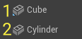
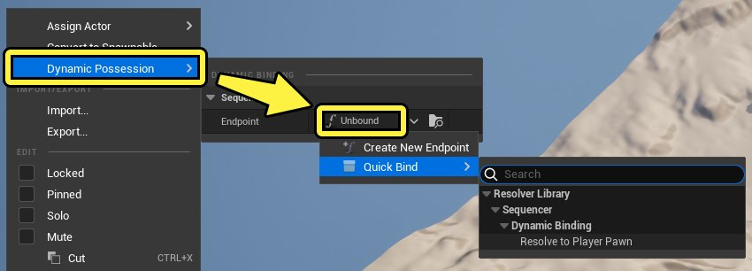
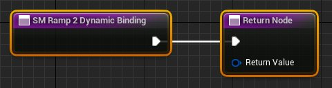
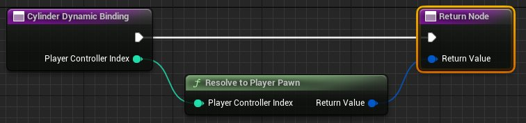
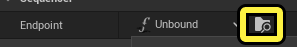
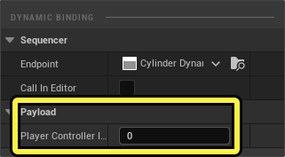
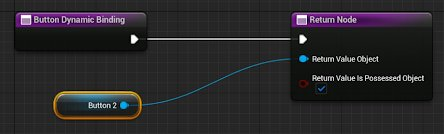
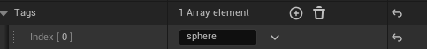

# 动态绑定

> 路径：虚幻引擎5.7文档 / 为角色和对象制作动画 / 过场动画和Sequencer / Sequencer概述 / 动态绑定

> 原始页面：https://dev.epicgames.com/documentation/unreal-engine/dynamic-binding-in-sequencer

## 动态绑定

在Gameplay事件或[UI动画](../../../../user-interfaces/umg-editor-reference/animating-umg-widgets/index.md)期间，你可以将玩家在过场动画体验中或与UI互动时看到的不同对象制作成动画。**动态持有** 提供自定义蓝图逻辑，用于选择在关卡中要持有的对象或要生成的对象。此功能还提供一个快速绑定选项，用于公共解析逻辑，例如动态绑定 **[玩家Pawn](../../../../gameplay-systems/gameplay-framework/index.md)** 。**轨迹（Tracks）** 和 **属性（Properties）** 可以绑定到新持有或生成的 **Actor** ，并具有与原始绑定对象相同的效果。

利用Sequencer中的动态绑定功能，你可以：

- 定义关卡中的对象，使其通过自定义

  蓝图

  逻辑被动态持有。此逻辑在

  关卡序列导演蓝图

  中实现。对于UMG，此逻辑在UMG蓝图图表中实现。
- 定义要与自定义蓝图逻辑绑定的动态生成对象。
- 快速定义与

  玩家控制器

  的绑定。
- 拥有

  轨迹

  和

  属性

  ，它们在动态绑定到新对象时兼容，可以影响相同的轨迹和属性。
- 在

  虚幻动态图形

  （

  UMG

  ）中定义控件，以动态持有自定义蓝图逻辑。

简而言之，你可以使用动态绑定覆盖可持有或已生成的Actor。

> 动图已省略：实际使用中的动态绑定

动态绑定示例。Manny的序列被覆盖，且序列动画绑定到"Goldie"。

## 用例

假设你有一个固定的玩家角色，它与准备好的过场动画相匹配。你想要让这个角色融合Gameplay和过场动画。创建过场动画时，你通常会创建一个可生成对象，但在运行时，你不想生成角色，因为你想要将控制权还给玩家。你通常会抓住玩家pawn，让绑定接管。例如，这种情况发生在有大量任务的RPG游戏中，其中有很多NPC可以根据你用角色所做的选择加入你的任务。在编辑时，你不知道谁会加入你的角色。这使得制作过场动画很难。

## 先决条件

- 你已了解

  Sequencer

  及其

  界面

  。
- 你知道如何创建和使用

  轨迹

  。
- 了解

  可持有对象和可生成对象

  。
- 了解

  蓝图

  。

## 创建动态绑定

在 **层级树** 中右键点击Actor，将弹出选项，让你可以动态将该Actor动态绑定到新端点，绑定到可解析为 **玩家Pawn** 的函数，或绑定到现有动态绑定。后两个选项在 **快速绑定（Quick Bind）** 下方，工作原理类似于[事件轨迹](../sequencer-track-list/cinematic-event-track/index.md)。

一旦动态绑定，Actor图标在左下方显示蓝色画中画覆层。

1. 立方体动态持有。
2. 圆柱体未持有。

**动态绑定（Dynamic Binding）** 菜单选项包含一种 **创建新端点（Create New Endpoint）** 的方法，或通过 **快速绑定（Quick Bind）** 将Actor绑定到解算器的方法。从 **动态持有（Dynamic Possession）> 端点（未绑定）（Endpoint (unbound)）** 菜单中，你可以选择创建 **新端点（New Endpoint）** 或使用 **快速绑定（Quick Bind）** 功能。这些选项的详细介绍见下文。

一旦Actor已动态绑定，UE会打开 **关卡序列导演蓝图（Level Sequence Director Blueprint）** 。

### 创建新端点

新建动态端点将创建一对自定义蓝图节点（ **Binding Node** 和 **Return Node** ），你可以在其中为绑定发生方式添加自己的逻辑。从这里，你可以提供一个返回对象，该对象通过可持有对象或可生成对象进行绑定。

**Return Node** 包含可以持有或可生成动态绑定Actor的功能，以及可以替换它的其他资产。右键点击 **返回值对象（Return Value Object）** 的 **蓝色输入引脚** 并选择 **分割结构体引脚（Split Struct Pin）** 。一旦分割，你可以选择从 **返回值对象（Return Value Object）** 下拉菜单中返回哪个资产，以及该资产是持有还是生成的。默认选中 **返回值是持有对象（Return Value Is Possessed Object）** 中的值，这意味着该资产是 **持有的** 。取消选中 **返回值是持有对象（Return Value Is Possessed Object）** 则会将该资产作为 **生成的Actor** 返回。

> 动图已省略：带分割结构体引脚的Return Node

### 快速绑定

利用 **快速绑定（Quick Bind）** 方法，你可以选择 **解析到玩家Pawn（Resolve to Player Pawn）** 。这将创建一个端点来将分配的绑定绑定到玩家pawn，并在 **关卡序列导演蓝图（Level Sequence Director Blueprint）** 中添加逻辑，供动态绑定的Actor调用。

## 现有动态绑定

如果你有现有的动态绑定，可以再次用它绑定其他Actor。

1. 右键点击你的Actor，并从

   快速绑定菜单（Quick Bind menu）

   中选择

   未绑定（Unbound）> 快速绑定（Quick Bind）

   。
2. 选择

   此序列（This Sequence）> 调用函数（Call Function）

   > 选择列示的绑定。

绑定将以创建它们的原型Actor命名，并在其名称末尾添加"Dynamic Binding"。例如，如果根据通用立方体创建动态绑定，则绑定名称将为"Cube Dynamic Binding"。

你可以使用浏览图标（**动态持有（Dynamic Possession）> 端点（Endpoint）> 浏览（Browse）**）找到关联的蓝图端点。

> [!NOTE]
> 在Sequencer中删除Actor不会删除之前由动态绑定创建的蓝图。如果你想要删除动态绑定之前用其他资产创建的未使用的蓝图，你需要从关联序列的 **DirectorBP** 中删除它们的函数。关联函数列示在 **我的蓝图（My Blueprint）** 面板的函数（Functions）分段。

> 动图已省略：删除DirectorBP函数

如果某个Actor已动态绑定到玩家Pawn，你可以选择该绑定要使用的玩家控制器。在 **动态持有（Dynamic Possession）** 下，选择 **解析到玩家Pawn（Resolve to Player Pawn）** 端点。当你再次查看该绑定时，你可以在 **有效负载（Payload）** 分段下的玩家控制器索引（Player Controller Index）中选择要使用的玩家Pawn。

### 在编辑器中调用

你可以使用 **在编辑器中调用（Call In Editor）** 以调试你的动态绑定。一旦Actor已动态绑定，你可以启用 **在编辑器中调用（Call In Editor）** 选项（在 **Sequencer > 动态持有（Dynamic Possession）> 在编辑器中调用（Call In Editor）** 中右键点击该Actor）。启用此功能后，分配的端点将在"在编辑器中运行（PIE）"外部的编辑器中触发。

> 动图已省略：在编辑器中调用示例

> [!WARNING]
> 因调用此端点所做的更改最终都可能保存在当前关卡或资产中。

### 清除动态绑定

要移除动态绑定，请按照以下步骤操作：

1. 右键点击动态绑定的Actor。
2. 选择

   动态持有（Dynamic Possession）

   。
3. 从

   端点（Endpoint）

   中的下拉菜单中，选择

   清除（Clear）

   。

这将删除动态绑定，却不会删除已关联的蓝图。

### 重新动态绑定

要将动态绑定的Actor重新绑定到另一个端点，请遵循以下步骤：

1. 右键点击Actor。
2. 选择

   动态的有（Dynamic Possession）

   。
3. 从

   端点（Endpoint）

   中的下拉菜单中，选择

   重新绑定到（Rebind To）

   并选择要使用的端点。

> 动图已省略：重新绑定到另一个端点

## UMG和动态绑定

> 动图已省略：UMG按钮动态绑定示例

为按钮创建动态绑定。注意：蓝图是提前创建的，你需要根据需要修改你的蓝图节点。

为 **[虚幻动态图形UI设计器](../../../../user-interfaces/basics-of-user-interface-development/building-your-ui/umg-ui-designer-quick-start-guide/index.md)** ( **UMG** )资产创建动态端点的流程与所有其他Actor绑定类似，区别只有一个：使用UMG资产创建动态绑定时不会打开 **关卡序列蓝图导演（Level Sequence Blueprint Director）** 。此流程会在UMG资产内创建一个函数，因为已经有一个 **[UI蓝图图表](../../../../blueprints-visual-scripting/user-interface-reference-for-the-blueprints-vis-53faed96/index.md)** 与你的资产相关联。你还应该注意到，与非UMG资产不同，创建动态绑定的过程不会自动打开关联的蓝图。

## 动态绑定演练

本教程将演示如何将一个Actor动态绑定到另一个Actor，以及使用 **在编辑器中调用（Call In Editor）** 来查看在 **视口（Viewport）** 中发生的动态绑定。

1. 新建空白关卡。
2. 从形状（Shapes）菜单创建一个

   立方体

   和一个

   球体

   ：

   快速添加到项目（Quickly add to the project）

   ：

   形状（Shapes）> 立方体（Cube）

   和

   形状（Shapes）> 球体（Sphere）

   。
3. 创建一个

   关卡序列（Level Sequence）

   并在其中添加立方体：

   1. 在

      Sequencer

      中的开放空间内点击右键。
   2. 选择

      Actor到Sequencer（Actor to Sequencer）
   3. 找到该

      立方体

      ，作为可用Actor添加到你的序列中。
4. 从

   大纲视图（Outliner）

   中选择

   球体（Sphere）

   ，并将一个

   Actor标签

   添加到

   球体（Sphere）

   。

   1. 在

      细节面板（Details panel）

      中，点击

      按Actor过滤（filter by Actor）

      选项。
   2. 在

      标签（Tags）

      分段（在高级（Advanced）下），点击

      添加（+）（Add (+)）

      按钮添加一个

      数组元素（Array element）

      。
   3. 输入标签名称 'sphere'。不要将此Actor标签与序列标签相混淆。此流程稍后会使用由蓝图节点挑选的Actor标签。

      
5. 向立方体添加一个短动画（例如，将立方体在位置X上移动30帧的过程动画化)。这可以是任何移动，以便稍后可以观察实际使用中的动态绑定。
6. 为立方体创建动态绑定：

   1. 在Sequencer中右键点击该立方体，并选择

      动态持有（Dynamic Possession）

      。
   2. 选择

      端点（Endpoint）> 新建端点（Create New Endpoint）

      。这将打开带两个蓝图节点的

      关卡序列导演蓝图（Level Sequence Director Blueprint）

      ：

      立方体动态绑定（Cube Dynamic Binding）

      和

      返回节点（Return Node）

      。
7. 修改新建的蓝图，让所有Actor获得一个选择标签('sphere')，这样球体就可以代替立方体。

   1. 添加

      Get All Actors with Tag

      节点和

      Get (a copy)

      节点。
   2. 将

      执行输出（Exec out）引脚

      从

      Cube Dynamic Binding节点

      连接到

      Get All Actors with Tag节点

      的

      执行输入（Exec in）引脚

      。
   3. 在

      Get All Actors with Tag节点

      的

      标签（Tag）字段

      中，键入'

      sphere

      '。
   4. 将

      Get All Actors with Tag节点

      的

      输出Actor引脚

      连接到

      Get (a copy)节点

      的

      数组引脚

      。这将返回actorTag为 'sphere' 的任何Actor的第一个索引(0)。
   5. 将

      Get All Actors with Tag节点

      的

      执行（Exec）引脚

      连接到

      Return Node节点

      的

      执行（Exec）引脚

      。
   6. 在

      Return Node

      中，你需要

      分割结构体（Split the Struct）

      。右键点击

      返回值（Return Value）引脚

      并选择

      拆分结构体引脚（Split Struct Pin）

      。这将公开

      返回值是持有对象（Return Value Is Possessed Object）

      ，提供球体的持有权。
   7. 最后，将 **Get (a copy)节点** 的 **输出（Output）引脚** 连接到 **Return Node节点** 的 **返回值对象（Return Value Object）引脚** 。

      > 图片已省略：修改的动态绑定蓝图
8. 编译并保存（Compile and Save）

   你的自定义蓝图。
9. 返回

   Sequencer

   中，右键点击该立方体，转到

   动态持有（Dynamic Possession）

   ，并启用

   在编辑器中调用（Call In Editor）

   。
10. 在Sequencer中推移播放头，可以观察到立方体已经被球体替代，并获得了其动画。

> 动图已省略：在编辑器中调用示例
